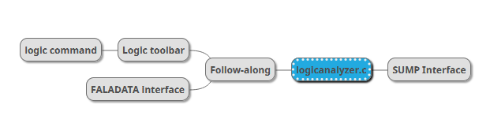

import DiscourseComments from '@site/src/components/DiscourseComments';
import BrowserWindow from '@site/src/components/BrowserWindow';

# Follow Along Logic Analyzer


import OldSiteWarning from '/old-site-warning.md'

<OldSiteWarning/>


An asynchronous logic analyzer that triggers each time bus syntax is run from the terminal. It eliminates the need setup triggers and arm a second tool for debugging.  We like to call it FALA for short.

The Bus Pirate can be [used as a logic analyzer in multiple ways](/logic-analyzer/logicanalyzer). This is the documentation for the "follow along logic analyzer" interface.

:::warning
All Bus Pirate hardware supports follow along logic analyzer, however only Bus Pirate 6 has a second buffer to capture pins directly. In earlier hardware **all output pins are measured behind the IO buffer**. This means the logic capture may not match the actual output of the IO buffer. **This is not a problem when the Bus Pirate is used as a logic analyzer only and all pins are inputs**.
:::

## Capabilities

- 62.5MSPS (or more if overclocked)
- 131K samples
- 8 channels
- Trigger: single pin, high or low
- Follow along logic analyzer mode
- Base pin can be set to an internal pin for debugging the Bus Pirate itself

## Enable FALA Interface

<BrowserWindow>
<span className="bp-prompt">HiZ></span> binmode<br/>
<br/>
<span className="bp-info">Select binary mode</span><br/>
 1. SUMP logic analyzer<br/>
 2. Binmode test framework<br/>
 3. Arduino CH32V003 SWIO<br/>
 4. Follow along logic analyzer<br/>
 x. <span className="bp-info">Exit</span><br/>
<span className="bp-prompt"> ></span> 4<br/>
<span className="bp-info">Binmode selected:</span> Follow along logic analyzer<br/>
<br/>
<span className="bp-prompt">HiZ></span> <br/>
</BrowserWindow>

Enable the FALA binary interface with the ```binmode``` command. This will configure the logic analyzer and send capture notifications to the Bus Pirate's second serial port.

### Auto Capture Speed
<BrowserWindow>
<span className="bp-info">Actual speed:</span> 10kHz<br/>
<span className="bp-info">Logic analyzer speed:</span> 80000Hz (8x oversampling)<br/>
<span className="bp-info">Use the 'logic' command to change capture settings</span><br/>
<br/>
<span className="bp-info">Mode:</span> SPI<br/>
<span className="bp-prompt">SPI></span> <br/>
</BrowserWindow>

When changing protocol modes with the ```m``` command, FALA will automatically set the capture speed to oversample the bus speed by a factor of 8. 

### Change Capture Speed
<BrowserWindow>
<span className="bp-prompt">SPI></span> logic -o 16<br/>
Oversample rate set to: 16<br/>
<br/>
Logic Analyzer settings<br/>
 Oversample rate: 16<br/>
 Sample frequency: 10000Hz<br/>
<br/>
Note: oversample rate is not 1<br/>
Actual sample frequency: 160000Hz (16 * 10000Hz)<br/>
<br/>
<span className="bp-prompt">SPI></span> <br/>
</BrowserWindow>

The base capture speed or the oversample rate can can be changed with the ```logic``` command. Changing the oversample rate with the ```-o``` flag is probably easiest as the Bus Pirate will calculate the new sample frequency for you.

### Capture Samples

<BrowserWindow>
<span className="bp-prompt">SPI></span> [ 0xaa 0x55]<br/>
<br/>
CS Enabled<br/>
<span className="bp-info">TX:</span> 0x<span className="bp-float">AA</span> 0x<span className="bp-float">55</span> <br/>
CS Disabled<br/>
<br/>
<span className="bp-info">Logic analyzer:</span> 144 samples captured<br/>
<span className="bp-prompt">SPI></span> <br/>
</BrowserWindow>

Every time you send data to the bus, the logic analyzer will capture samples. The capture notification will be sent to the second serial port.

## Protocol


### Asynchronous Capture Notification

```$FALADATA,8,0,0,N,40000,168,0\n```

Data arrives asynchronously, like GPS NMEA packets, so we structured notifications in a similar way. The notification is a string of comma separated values with the following fields:

- $FALADATA - Notification header
- capture pins (ex: 8)
- trigger pin mask (ex: 10100000)
- trigger mask (ex: 10000000)
- edge trigger (Y/N)
- capture speed in hz
- samples captured
- number of samples captured before the trigger (for pre-capture)
- terminated with a new line (\n)

Most languages can easily parse CSV. 

### **+** - Dump Samples

- ```+``` - Dump samples

In response to a capture notification, the host can request the samples with the ```+``` command.

Data format is a binary blob. Sample order is "backwards" with the newest sample first, oldest sample last.

### **?** - Request Status

- ```?``` - Request status

Returns the most recent capture notification. Can be used to retrieve missed capture notifications, or to check if the interface is active.

## Logic Analyzer System



:::info
The ```logic``` command and the [follow along binmode interface](/logic-analyzer/pulseview-fala) can be run at the same time. However, the capture buffer is shared with [SUMP logic analyzer mode](/logic-analyzer/pulseview-sump). SUMP and follow along logic analyzer modes cannot be used at the same time and will result in a memory error warning.
:::


