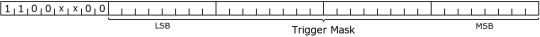
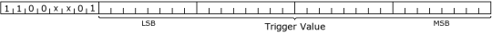
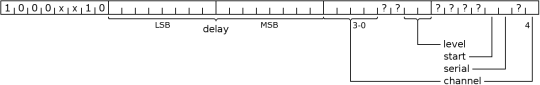
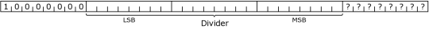
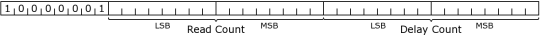
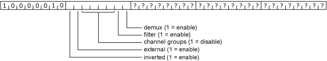

import DiscourseComments from '@site/src/components/DiscourseComments';
import BrowserWindow from '@site/src/components/BrowserWindow';

# SUMP Logic Analyzer Protocol


import OldSiteWarning from '/old-site-warning.md'

<OldSiteWarning/>


SUMP is a simple protocol for logic analyzers. It was originally developed for the [SUMP FPGA-based open source logic analyzer](http://web.archive.org/web/20240422042804/http://www.sump.org:80/projects/analyzer/protocol/), but has been adopted by many other projects. The Bus Pirate supports the SUMP protocol for use as a logic analyzer. There's several clients that support the SUMP protocol, the most up to date is Sigrok/PulseView.

- [Sigrok/PulseView](/logic-analyzer/pulseview-sump) (Windows, Linux, Mac)
- [Jawi OLS Client](https://github.com/jawi/ols) (Needs to be re-packaged for modern operating systems)

Other software also supports the SUMP protocol, but many haven't been updated in years and don't work on modern operating systems.

## Capabilities

- 62.5MSPS (or more if overclocked)
- 131K samples
- 8 channels
- Trigger: single pin, high or low
- Base pin can be set to an internal pin for debugging the Bus Pirate itself

## Bus Pirate Setup
Configure the Bus Pirate for SUMP logic analyzer mode.

### Change to HiZ mode

<BrowserWindow>
<span className="bp-prompt">SPI></span> m 1<br/>
<span className="bp-info">Mode:</span> HiZ<br/>
<span className="bp-prompt">HiZ></span> <br/>
</BrowserWindow>

For general purpose logic analyzer use, change to HiZ mode with the ```m 1``` command. This will make all the pins inputs and disable pull-up resistors.

:::warning
There is no restriction on using the logic analyzer while the Bus Pirate is not in HiZ mode. However, prior to Bus Pirate hardware 6, all pins are measured behind the IO buffer. This means the logic capture may not match the actual output of the IO buffer **on pins configured as outputs**. This is not a problem when the Bus Pirate is used as a logic analyzer in HiZ mode and all pins are inputs.
:::

### Enable SUMP Interface

<BrowserWindow>
<span className="bp-prompt">HiZ></span> binmode<br/>
<br/>
<span className="bp-info">Select binary mode</span><br/>
 1. SUMP logic analyzer<br/>
 2. Binmode test framework<br/>
 3. Arduino CH32V003 SWIO<br/>
 4. Follow along logic analyzer<br/>
 x. <span className="bp-info">Exit</span><br/>
<span className="bp-prompt"> ></span> 1<br/>
<span className="bp-info">Binmode selected:</span> SUMP logic analyzer<br/>
<br/>
<span className="bp-prompt">HiZ></span> <br/>
</BrowserWindow>

Enable the SUMP binary interface with the ```binmode``` command. A SUMP-compatible logic analyzer interface will now respond to the Bus Pirate's second serial port.
 
### Power Supply in SUMP mode

The IO buffers need a power supply, or we won't be able to see any signals. A 3.3volt power supply is automatically enabled when the SUMP serial port is opened in the following circumstances:
- If the Bus Pirate terminal **is not open**
- If the Bus Pirate terminal **is open** and in HiZ mode
The power supply is disabled when the SUMP serial port is closed.

## Logic Analyzer System


:::info
The ```logic``` command and the [follow along binmode interface](/logic-analyzer/pulseview-fala) can be run at the same time. However, the capture buffer is shared with [SUMP logic analyzer mode](/logic-analyzer/pulseview-sump). SUMP and follow along logic analyzer modes cannot be used at the same time and will result in a memory error warning.
:::

## SUMP protocol

- [Original SUMP protocol documentation](http://web.archive.org/web/20240422042804/http://www.sump.org:80/projects/analyzer/protocol/)
- [Extended SUMP protocol documentation](http://dangerousprototypes.com/docs/The_Logic_Sniffer%27s_extended_SUMP_protocol)

## Base Protocol v1

:::danger
As of October 2024, the SUMP.org website is no longer available. The base protocol below is reproduced from sump.org and is copyright Michael Poppitz (2000-2019).
:::

All communication is done using a standard RS232 connection with 8 data bits, 1 stop bit and no parity. The transfer rate can be set to 115200, 57600, 38400 or 19200 bps. XON/XOFF software flow control is available.

When sending captured data the analyzer will send blocks of four bytes, the first containing the lowest channels. No start or end sequence exists. The host can assume an end of transmission if no data has been received for the duration of one byte.

The following list provides a short overview of commands understood by the analyzer.

### Short Commands

These commands are exactly one byte long.

#### Reset (00h)

Resets the device. Should be sent 5 times when the receiver status is unknown. (It could be waiting for up to four bytes of pending long command data.)

#### Run (01h)

Arms the trigger.

#### ID (02h)

Asks for device identification. The device will respond with four bytes. The first three ("SLA") identify the device. The last one identifies the protocol version which is currently either "0" or "1"

#### XON (11h)

Put transmitter out of pause mode. It will continue to transmit captured data if any is pending. This command is being used for xon/xoff flow control.

#### XOFF (13h)

Put transmitter in pause mode. It will stop transmitting captured data. This command is being used for xon/xoff flow control.

### Long Commands

Are five bytes long. The first byte contains the opcode. The bytes are displayed in the order in which they are sent to the serial port starting left. The bits within one byte are displayed most significant first.

#### Set Trigger Mask (C0h, C4h, C8h, CCh)

Defines which trigger values must match. In parallel mode each bit represents one channel, in serial mode each bit represents one of the last 32 samples of the selected channel. The opcodes refer to stage 0-3 in the order given above. (Protocol version 0 only supports stage 0.)



#### Set Trigger Values (C1h, C5h, C9h, CDh)

Defines which values individual bits must have. In parallel mode each bit represents one channel, in serial mode each bit represents one of the last 32 samples of the selected channel. The opcodes refer to stage 0-3 in the order given above. (Protocol version 0 only supports stage 0.)



#### Set Trigger Configuration (C2h, C6h, CAh, CEh)

Configures the selected trigger stage. The opcodes refer to stage 0-3 in the order given above. The following parameters will be set:

- **delay** If a match occures, the action of the stage is delayed by the given number of samples.
- **level** Trigger level at which the stage becomes active.
- **channel** Channel to be used in serial mode. (0-31 in normal operation; 0-15 when demux flag is set)
- **serial** When set to 1 the stage operates as serial trigger, otherwise it used as parallel trigger.
- **start** When set to 1 a match will start the capturing process. The trigger level will rise on match regardless of this flag.



#### Set Divider (80h)

When x is written, the sampling frequency is set to f = clock / (x + 1)



#### Set Read & Delay Count (81h)

Read Count is the number of samples (divided by four) to read back from memory and sent to the host computer. Delay Count is the number of samples (divided by four) to capture after the trigger fired. A Read Count bigger than the Delay Count means that data from before the trigger match will be read back. This data will only be valid if the device was running long enough before the trigger matched.



#### Set Flags (82h)

Sets the following flags:

- **demux** Enables the demux input module. (Filter must be off.)
- **filter** Enables the filter input module. (Demux must be off.)
- **channel groups** Disable channel group. Disabled groups are excluded from data transmissions. This can be used to speed up transfers. There are four groups, each represented by one bit. Starting with the least significant bit of the channel group field channels are assigned as follows: 0-7, 8-15, 16-23, 24-31
- **external** Selects the clock to be used for sampling. If set to 0, the internal clock divided by the configured divider is used, and if set to 1, the external clock will be used. (filter and demux are only available with internal clock)
- **inverted** When set to 1, the external clock will be inverted before being used. The inversion causes a delay that may cause problems at very high clock rates. This option only has an effect with external set to 1.



## Extended Protocol

The extended protocol adds a few more commands to the base protocol to provide more information about the device.

A extended command byte is added to the SUMP protocol: **0x04 - get metadata**. In response, the device sends a series of 1-byte keys, followed by data pertaining to that key. The series ends with the key 0x00. The system can be extended with new keys as more data needs to be reported.

### Metadata Format

The keys are split up into two fields: the **upper** 3 bits denote the **type**, and the **lower** 5 bits denote the **token**. The token is unique within the type. Thus a 0x01 null-terminated string token is not the same as a 0x01 integer token.

This way a client need only know about the keys it can deal with, while still having a way to skip over the ones it doesn't know -- since the type field denotes a length (or null-terminated field). If more metadata keys get added in the future, clients will just ignore them until support for those keys is added to the application.

This means a client parsing metadata **MUST** always ignore keys it doesn't know, never give an error message for them.

| Type | Token | Key | Description |
|------|-------|-----|-------------|
| 0 | | | null-terminated string, UTF-8 encoded |
| | 0 | 0x00 | not used, key means end of metadata |
| | 1 | 0x01 | device name (e.g. "Openbench Logic Sniffer v1.0", "Bus Pirate v3b") |
| | 2 | 0x02 | Version of the FPGA firmware |
| | 3 | 0x03 | Ancillary version (PIC firmware) |
| 1 |  | |32-bit unsigned integer |
| | 0 | 0x20 | Number of usable probes |
| | 1 | 0x21 | Amount of sample memory available (bytes) |
| | 2 | 0x22 | Amount of dynamic memory available (bytes) |
| | 3 | 0x23 | Maximum sample rate (hz) |
| | 4 | 0x24 | Protocol version (see below) |
| 2 |  | |8-bit unsigned integer |
| | 0 | 0x40 | Number of usable probes (short) |
| | 1 | 0x41 | Protocol version (short) |
| 3-7 |  | | unused|

The protocol version key holds a 4-stage version, one per byte, where the MSB holds the major version number. As of the first release to support this metadata command, the protocol version should be 2. This would be encoded as 0x00000002.

### Short commands

The 8-bit short commands are an alternative to the 32-bit commands for the number of probes and version. This saves space on small systems. Most systems are unlikely to sport more than 256 probes, so there's no reason to store 3 null bytes. A client should support both.
