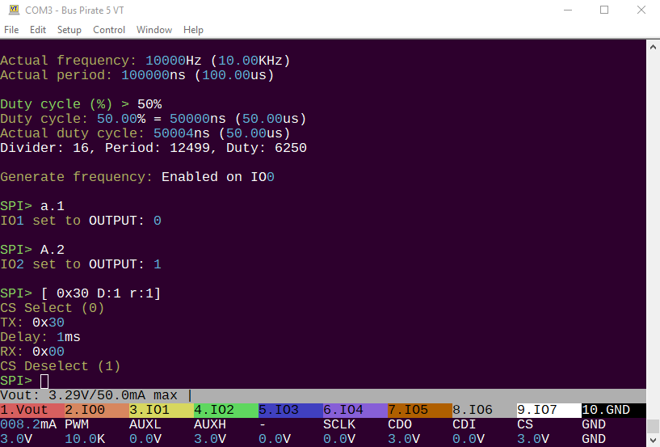
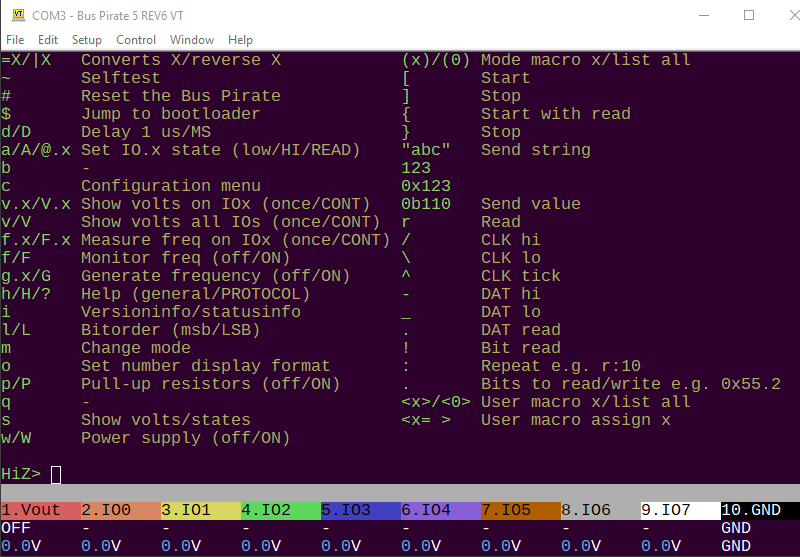
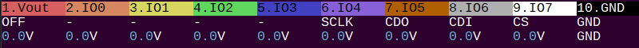
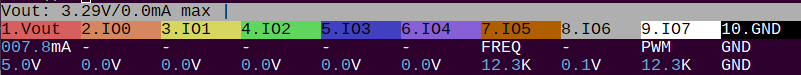

import DiscourseComments from '@site/src/components/DiscourseComments';
import BrowserWindow from '@site/src/components/BrowserWindow';

# Command Reference

<BrowserWindow>
<span className="bp-prompt">HiZ></span> i<br/>
<span className="bp-info"><br/>
Bus Pirate 5 REV6<br/>
Firmware <span className="bp-float">v0.1</span></span> (<span className="bp-float">unknown</span>), Bootloader <span className="bp-float">N/A</span><br/>
<span className="bp-float">RP2040</span> with <span className="bp-float">264KB</span> RAM, <span className="bp-float">16MB</span> FLASH<br/>
S/N: <span className="bp-float">2509449B952069E4</span><br/>
https://DangerousPrototypes.com/<br/>
SD Card: <span className="bp-float"> 64.06GB</span> (EXFAT File System)<br/>
<br/>
<span className="bp-info">Configuration file:</span> Loaded<br/>
<span className="bp-info">Available modes:</span> HiZ UART I2C SPI LED DUMMY1<br/>
<span className="bp-info">Active mode:</span> HiZ ()=()<br/>
<span className="bp-info">Display format:</span> Auto<br/>
<br/>
<span className="bp-prompt">HiZ></span> 
</BrowserWindow>

This guide is updated with to reflect feature changes with each firmware release. To check your firmware version type ```i``` followed by ```enter``` in the Bus Pirate terminal window. Here, the Bus Pirate is running firmware v0.1. The drop down at the top right of this page selects the documentation matching your firmware version. 

:::tip
It's always best to use the latest firmware, especially in these early days of a new design. There will be continuous improvements and new features. See the upgrade guide for the simple drag and drop bootload process.
:::

## User terminal



The Bus Pirate is accessed from a command line in a serial terminal. Use your terminal of choice. On Windows we like the latest version of [Tera Term](https://ttssh2.osdn.jp/index.html.en).

:::tip
Talk to the Bus Pirate from a serial terminal of your choice set to 115200bps, 8/N/1. The serial port is emulated over USB, so higher bitrate (bps) settings will also work with no extra configuration. If the user interface feels slow, check that the speed is at least 115200bps.
:::

### VT100 terminal emulation
<BrowserWindow>
VT100 compatible color mode? (Y/n)><br/>
</BrowserWindow>

Press ```enter``` to show the command prompt if your terminal is blank. 

If the Bus Pirate has just restarted you will be prompted to choose the terminal emulation mode.
- VT100 mode - Supports color and a live view toolbar at the bottom of the terminal. This should be your first choice unless you specifically need the legacy ASCII mode.
- ASCII mode - Legacy monochrome text only mode.

:::info
If you choose VT100 mode and see lots of garbage characters in the terminal, check that your terminal emulator has VT100 support and that VT100 support is enabled.
:::

If an SD Card is inserted your terminal mode choice will be saved and automatically loaded the next time the Bus Pirate is connected. Just press ```enter``` to start the command prompt.

The terminal mode can be changed from the configuration menu. Open the configuration menu with the ```c``` command followed by ```enter```. 

:::tip
If you're stuck in a terminal mode that's not working, remove the SD card and restart the Bus Pirate. You can also navigate to the Bus Pirate USB disk, delete the bpconfig.bp file and restart the Bus Pirate. You will be prompted to choose VT100 or ASCII mode after restarting. 
:::

### Command line
<BrowserWindow>
<span className="bp-prompt">HiZ></span> <br/>
</BrowserWindow>

The Bus Pirate always starts in high impedance mode (HiZ), a safe mode with all outputs disabled. HiZ mode intends to protect any connected devices from conditions beyond their specifications. From the HiZ prompt, a bus mode can be selected to use the Bus Pirate with a specific protocol.

### Terminal control

| Keyboard Key  | Ctrl-Key | Action                                                                                             |
|---------------|----------|----------------------------------------------------------------------------------------------------|
| ```left arrow```  | ^B       | Moves the cursor left one character                                                                |
| ```right arrow``` | ^F       | Moves the cursor right one character                                                               |
| ```up arrow```    | ^P       | Copies the previous command in the command history buffer to the command line                      |
| ```down arrow```  | ^N       | Copies the next command in the command history buffer to the command line                          |
| ```home```        | ^A       | Moves the cursor to the beginning of the line                                                      |
| ```end```         | ^E       | Moves the cursor to the end of the line                                                            |
| ```backspace```   | ^H       | Erases the character to the left of the cursor and moves the cursor left one character             |
| ```delete```      | ^D       | Erases the character under (or to the right of) the cursor and moves the cursor left one character |

Bus Pirate 5 understands some common command keys.

### Default options

<BrowserWindow>
<span className="bp-prompt">Mode ></span> 3<br/>
<br/>
<span className="bp-info">I2C speed</span><br/>
 1KHz to 1000KHz<br/>
 x. <span className="bp-info">Exit</span><br/>
<span className="bp-prompt">KHz (</span>400KHz*<span className="bp-prompt">) ></span> <br/>
<br/>
<span className="bp-info">Data bits</span><br/>
 1. <span className="bp-info">8*</span><br/>
 2. <span className="bp-info">10</span><br/>
 x. <span className="bp-info">Exit</span><br/>
<span className="bp-prompt">Bits (</span>1<span className="bp-prompt">) ></span> <br/>
<br/>
<span className="bp-info">Mode:</span> I2C<br/>
<br/>
<span className="bp-prompt">I2C></span> <br/>
</BrowserWindow>

Most configuration and option prompts have a default value shown in ( ) and the option to exit without changes.
- Press ```enter``` to select the default option. 
- Press ```x``` followed by ```enter``` to exit a menu without changes.

### Saved options

<BrowserWindow>
<span className="bp-prompt">Mode ></span> 3<br/>
<br/>
<span className="bp-info">Use previous settings?</span><br/>
 I2C speed: 400KHz<br/>
 Data bits: 8<br/>
y/n> y<br/>
<br/>
<span className="bp-info">Mode:</span> I2C<br/>
<br/>
<span className="bp-prompt">I2C></span> <br/>
</BrowserWindow>

If an SD card is inserted many options will be saved and can be reloaded later.


### Bus interaction syntax

A simple syntax is used to interact with chips. Syntax characters have
the same general function in each bus mode, such as ```r``` to read a byte
of data.

<BrowserWindow>
<span className="bp-prompt">SPI></span> [0x31 r:5]<br/>
<span className="bp-info">CS Select (0)</span><br/>
<span className="bp-info"><span className="bp-info">TX:</span></span> 0x<span className="bp-float">31</span><br/>
<span className="bp-info"><span className="bp-info">RX:</span></span> 0x<span className="bp-float">00</span> 0x<span className="bp-float">00</span> 0x<span className="bp-float">00</span> 0x<span className="bp-float">00</span> 0x<span className="bp-float">00</span><br/>
<span className="bp-info">CS Deselect (1)</span><br/>
<span className="bp-prompt">SPI></span> <br/>
</BrowserWindow>

This example syntax sends a bus start, the value 0x31, and then reads 5
bytes, followed by bus stop. Up to 255 characters of syntax may be
entered into the Bus Pirate terminal at once, press ```enter``` to execute the
syntax.

### Macros

<BrowserWindow>
<span className="bp-prompt">I2C></span> (0)<br/>
<span className="bp-info"> 1. I2C Address search<br/>
</span><br/>
<span className="bp-prompt">I2C></span> (1)
<span className="bp-info"><br/>
I2C Bus Scan<br/>
   0  1  2  3  4  5  6  7  8  9  A  B  C  D  E  F<br/>
00 .  .  .  .  .  .  .  .  .  .  .  .  .  .  .  .<br/>
10 .  .  .  .  .  .  .  .  .  .  .  .  .  .  .  .<br/>
20 .  .  .  .  .  .  .  .  .  .  .  .  .  .  .  .<br/>
30 .  .  .  .  .  .  .  .  .  .  .  .  .  .  .  .<br/>
40 .  .  .  .  .  .  .  .  .  .  .  .  .  .  .  .<br/>
50 .  .  .  .  .  .  .  .  .  .  .  .  .  .  .  .<br/>
60 .  .  .  .  .  .  .  .  .  .  .  .  .  .  .  .<br/>
70 .  .  .  .  .  .  .  .  .  .  .  .  .  .  .  .<br/>
Done.<br/>
</span><br/>
<span className="bp-prompt">I2C></span><br/>
</BrowserWindow>

Macros perform complex actions, like
scanning for I2C addresses, interrogating a smart card, or probing a
JTAG chain. Macros are numbers entered inside ( ). Macro ```(0)``` always
displays a list of macros available in the current bus mode.


## Configuration

### **?/h/H** Help menu with latest options



Type ```?``` followed by ```enter``` to display a help screen with all available menu and syntax options in the current firmware.

### **i** Version information
<BrowserWindow>
<span className="bp-prompt">HiZ></span> i<br/>
<span className="bp-info"><br/>
Bus Pirate 5 REV6<br/>
Firmware <span className="bp-float">v8</span></span> (<span className="bp-float">unknown</span>), Bootloader <span className="bp-float">N/A</span><br/>
<span className="bp-float">RP2040</span> with <span className="bp-float">264KB</span> RAM, <span className="bp-float">16MB</span> FLASH<br/>
S/N: <span className="bp-float">2509449B952069E4</span><br/>
https://DangerousPrototypes.com/<br/>
SD Card: <span className="bp-float"> 64.06GB</span> (EXFAT File System)<br/>
<br/>
<span className="bp-info">Configuration file:</span> Loaded<br/>
<span className="bp-info">Available modes:</span> HiZ UART I2C SPI LED DUMMY1<br/>
<span className="bp-info">Active mode:</span> HiZ ()=()<br/>
<span className="bp-info">Display format:</span> Auto<br/>
<br/>
<span className="bp-prompt">HiZ></span> 
</BrowserWindow>

Type ```i``` followed by ```enter``` to see the hardware, firmware, and microcontroller version.

<BrowserWindow>
<span className="bp-info">Active mode:</span> HWI2C (speed)=(0)<br/>
<span className="bp-info">Display format:</span> Auto<br/>
<span className="bp-info">Data format:</span> 8 bits, MSB bitorder<br/>
<span className="bp-info">Pull-up resistors:</span> ON<br/>
<span className="bp-info">Power supply:</span> ON (3.3V/3.3V)<br/>
<span className="bp-info">Current limit:</span> OK (8.0mA/50.0mA)<br/>
<span className="bp-info">Frequency generators:</span> OFF<br/>
</BrowserWindow>

If a bus mode is configured additional
 information about the configuration is printed.

### **c** Configuration options menu

<BrowserWindow>
<span className="bp-prompt">I2C></span> c<br/>
<span className="bp-info"><br/>
<span className="bp-info">Configuration options</span></span><br/>
 1. <span className="bp-info">Language</span><br/>
 2. <span className="bp-info">ANSI color mode</span><br/>
 3. <span className="bp-info">ANSI toolbar mode</span><br/>
 4. <span className="bp-info">LCD screensaver</span><br/>
 5. <span className="bp-info">LED effect</span><br/>
 6. <span className="bp-info">LED color</span><br/>
 7. <span className="bp-info">LED brightness</span><br/>
 x. <span className="bp-info">Exit</span><br/>
<span className="bp-prompt"> ></span> 1<br/>
<br/>
<span className="bp-info">Language</span><br/>
 1. <span className="bp-info">English</span><br/>
 2. <span className="bp-info">Chinese (simplified)</span><br/>
 x. <span className="bp-info">Exit</span><br/>
<span className="bp-prompt"> ></span> 1<br/>
Language <span className="bp-info">set to</span> English<br/>
<br/>
<span className="bp-info">Configuration options</span><br/>
 1. <span className="bp-info">Language</span><br/>
 2. <span className="bp-info">ANSI color mode</span><br/>
 3. <span className="bp-info">ANSI toolbar mode</span><br/>
 4. <span className="bp-info">LCD screensaver</span><br/>
 5. <span className="bp-info">LED effect</span><br/>
 6. <span className="bp-info">LED color</span><br/>
 7. <span className="bp-info">LED brightness</span><br/>
 x. <span className="bp-info">Exit</span><br/>
<span className="bp-prompt"> ></span> x<br/>
<br/>
<span className="bp-info">Configuration file:</span> Saved<br/>
<br/>
<span className="bp-prompt">I2C></span><br/>
</BrowserWindow>

Type ```c``` followed by ```enter``` to show the configuration menu. If an SD card is inserted settings will be saved and loaded automatically when the Bus Pirate restarts.

### **m** Set bus mode

<BrowserWindow>
<span className="bp-prompt">SPI></span> m<br/>
<span className="bp-info"><br/>
<span className="bp-info">Mode selection</span></span><br/>
 1. <span className="bp-info">HiZ</span><br/>
 2. <span className="bp-info">UART</span><br/>
 3. <span className="bp-info">I2C</span><br/>
 4. <span className="bp-info">SPI</span><br/>
 5. <span className="bp-info">LED</span><br/>
 6. <span className="bp-info">DUMMY1</span><br/>
 x. <span className="bp-info">Exit</span><br/>
<span className="bp-prompt">Mode ></span> 1<br/>
<span className="bp-info">Mode:</span> HiZ<br/>
<span className="bp-prompt">HiZ></span> 
</BrowserWindow>

Type ```m``` followed by ```enter``` to select a bus mode. HiZ is a safe mode with all pins set to high-impedance and all peripherals disabled.

### **l/L** Set MSB/LSB first
<BrowserWindow>
<span className="bp-prompt">HiZ></span> l<br/>
<span className="bp-info"><span className="bp-info">Bitorder:</span></span> MSB 0b<span className="bp-info">1</span>0000000<br/>
<span className="bp-prompt">HiZ></span> L<br/>
<span className="bp-info"><span className="bp-info">Bitorder:</span></span> LSB 0b0000000<span className="bp-info">1</span><br/>
<span className="bp-prompt">HiZ></span> <br/>
</BrowserWindow>

The l/L commands determines the [bit order](http://en.wikipedia.org/wiki/Most_significant_bit) for reading and writing bytes. 

The current bit order configuration is displayed on the extended information screen using the ```i``` command while in a mode other than HiZ.

### **o** Data output display format
<BrowserWindow>
<span className="bp-prompt">HiZ></span> o<br/>
<span className="bp-info"><br/>
<span className="bp-info">Number display format</span></span><br/>
 <span className="bp-info">Current setting: Auto</span><br/>
 1. <span className="bp-info">Auto</span><br/>
 2. <span className="bp-info">HEX</span><br/>
 3. <span className="bp-info">DEC</span><br/>
 4. <span className="bp-info">BIN</span><br/>
 5. <span className="bp-info">ASCII</span><br/>
 x. <span className="bp-info">Exit</span><br/>
<span className="bp-prompt">Mode ></span> 1<br/>
<span className="bp-info">Mode:</span> Auto<br/>
<span className="bp-prompt">HiZ></span> <br/>
</BrowserWindow>

The Bus Pirate can display values as [hexadecimal](http://en.wikipedia.org/wiki/Hexadecimal), [decimal](http://en.wikipedia.org/wiki/Decimal), [binary](http://en.wikipedia.org/wiki/Binary_numeral_system), and a raw
[ASCII](http://en.wikipedia.org/wiki/ASCII) byte. Change the setting in
the data display format menu (o). The default display format is Auto.

- Auto display mode attempts to mirror user input formatting. Each value is displayed in the HEX/DEC/BIN format entered.
- RAW display mode sends data to the terminal as raw bytes without any text conversion. This is useful for taking to ASCII serial interfaces that don't need further conversion.

### **~** Self-test 
<BrowserWindow>
<span className="bp-prompt">HiZ></span> ~<br/>
<span className="bp-info">SELF TEST STARTING<br/>
DISABLE IRQ: OK<br/>
ADC SUBSYSTEM: VUSB  5.08V OK<br/>
DAC READ/WRITE: OK<br/>
SD CARD: OK<br/>
PSU ENABLE: OK<br/>
BIO FLOAT TEST (SHOULD BE 0/0.2V)<br/>
BIO0 FLOAT: 0/0.04V OK<br/>
BIO1 FLOAT: 0/0.04V OK<br/>
BIO2 FLOAT: 0/0.04V OK<br/>
BIO3 FLOAT: 0/0.04V OK<br/>
BIO4 FLOAT: 0/0.04V OK<br/>
BIO5 FLOAT: 0/0.04V OK<br/>
BIO6 FLOAT: 0/0.04V OK<br/>
BIO7 FLOAT: 0/0.04V OK<br/>
BIO HIGH TEST (SHOULD BE >3.0V)<br/></span>
</BrowserWindow>

Perform a factory self-test. The Bus Pirate is capable of twiddling pins and checking for hardware faults. See the Bus Pirate self-test guide for a complete list of tests and the problems they detect.

### **#** Reset

<BrowserWindow>
<span className="bp-prompt">HiZ></span> #<br/>
<br/>
VT100 compatible color mode? (Y/n)><br/>
</BrowserWindow>

Reset the Bus Pirate. 

Depending on your serial terminal software you may need to reconnect to the Bus Pirate serial port. The latest versions of many terminal emulators, such as Tera Term, reconnect automatically.

### **$** Jump to bootloader 
<BrowserWindow>
<span className="bp-prompt">HiZ></span> $<br/>
</BrowserWindow>

Activate the Bus Pirate bootloader for firmware updates. The bootloader appears as a USB flash disk connected to your computer. Drag a **.uf2** firmware file into the disk. After an update the Bus Pirate resets.

:::tip
If the firmware update is interrupted and you find yourself locked out of the Bus Pirate terminal don't panic. Use the 2mm HEX key included with Bus Pirate 5 (or a paperclip) to press and hold the bootloader button on the bottom of the board. Plug in the USB cable while holding the button down. The bootloader with connect and you can try the update again. The bootloader is frozen in hardware and cannot be corrupted or overwritten.
:::

## Utilities

### **w/W** Power supply (off/ON) 
<BrowserWindow>
<span className="bp-prompt">I2C></span> W<br/>
<span className="bp-info"><span className="bp-info">Power supply<br/>
Volts (0.80V-5.00V)</span></span><br/>
<span className="bp-prompt">x to exit (3.30) ></span> 2.1<br/>
<span className="bp-float">2.10</span>V<span className="bp-info"> requested, closest value: <span className="bp-float">2.10</span></span>V<br/>
Set current limit?<br/>
y<br/>
<br/>
<span className="bp-info">Maximum current (0mA-500mA)</span><br/>
<span className="bp-prompt">x to exit (100.00) ></span> 50<br/>
<span className="bp-float">50.0</span>mA<span className="bp-info"> requested, closest value: <span className="bp-float">50.0</span></span>mA<br/>
<br/>
<span className="bp-info">Power supply:</span>Enabled<br/>
<span className="bp-info"><br/>
Vreg output: <span className="bp-float">2.1</span></span>V<span className="bp-info">, Vref/Vout pin: <span className="bp-float">2.1</span></span>V<span className="bp-info">, Current sense: <span className="bp-float">7.3</span></span>mA<span className="bp-info"><br/>
</span><br/>
<span className="bp-prompt">I2C></span> <br/>
</BrowserWindow>

Bus Pirate 5 has a single 'Programmable Power Supply Unit' (PPSU) with several handy features:
- 1-5volts adjustable output
- 0-500mA current sense 
- 0-500mA current limit with digital fuse
- One-way valve to protect the PPSU when an external voltage is applied to the VREF/VOUT pin

Capital ```W``` enables the supplies. You will be prompted for the output voltage and an optional current limit.

Check the voltage and current in the live view toolbar if active, or show the power supply voltage report using the ```v``` command.

:::warning
400mA is the rated maximum of the PPSU, but we added some headroom in the current limit to account for current spikes.

The PPSU is capable of 0.8 to 5volts output. However, the maximum working range is limited to 1-5volts because of the Vgs of the P-channel MOSFET used in the one-way valve. Many will be capable of the full range, but some may not. The Bus Pirate 5 IO buffers are only rated to 1.2volts, so in practice this isn't an issue over the specified working range.
:::

When the programmed current limit is exceeded the PPSU hardware fuse disables the power supply. The terminal colors invert repeatedly, an alarm bell will sound, an error message is shown and command execution is halted. Use the ```W``` command to restart the PPSU again.

<BrowserWindow>
<span className="bp-prompt">SPI></span>w<br/>
<span className="bp-info"><span className="bp-info">Power supply: </span></span>Disabled<br/>
<span className="bp-prompt">SPI></span> <br/>
</BrowserWindow>

Lowercase ```w``` disables the PPSU.

### **v/V** Power supply voltage report 



The voltage report shows the current state of all the Bus Pirate pins and peripherals. This is a duplicate of the information shown on the live monitor toolbar.

- The first line is the pin number and probe color. The colors also match the Bus Pirate LCD and the live monitor toolbar.
- The second line is the pin function.
- The third line shows the voltage measured
 on each pin. 

Lowercase ```v``` displays a one time voltage measurement. Uppercase ```V``` displays a continuously updated voltage measurement, press any key to exit.

### **p/P** Pull-up resistors 

<BrowserWindow>
<span className="bp-prompt">I2C></span> P<br/>
<span className="bp-info"><span className="bp-info">Pull-up resistors:</span></span> Enabled (10Kohms @ <span className="bp-float">3.3</span>V)<br/>
<br/>
<span className="bp-prompt">I2C></span> p<br/>
<span className="bp-info"><span className="bp-info">Pull-up resistors:</span></span> Disabled<br/>
<br/>
<span className="bp-prompt">I2C></span> 
</BrowserWindow>

```p``` and ```P``` toggle the pull-up resistors off and on. Pull-up resistors are generally used with open collector/open drain bus types such as 1-Wire and I2C.

The on-board pull-up resistors **are powered through the VREF/VOUT pin
of the IO header**, either by the on-board power supply or an external voltage applied to the VREF/VOUT pin. 

:::tip
A warning is displayed if there's no voltage on the VREF/VOUT pin. Check the voltage report ```v``` and verify that a voltage is present on VOUT/VREF.
:::

### **g/G** Frequency generator

<BrowserWindow>
<span className="bp-prompt">LED-()></span> G<br/>
<span className="bp-info"><span className="bp-info">Generate frequency</span></span><br/>
<span className="bp-info">Choose available pin:</span><br/>
 0. IO<span className="bp-float">0</span><br/>
 1. IO<span className="bp-float">1</span><br/>
 2. IO<span className="bp-float">2</span><br/>
 3. IO<span className="bp-float">3</span><br/>
 4. IO<span className="bp-float">4</span><br/>
 5. IO<span className="bp-float">5</span><br/>
 6. IO<span className="bp-float">6</span><br/>
 7. IO<span className="bp-float">7</span><br/>
 x. <span className="bp-info">Exit</span><br/>
<span className="bp-prompt"> ></span> 0<br/>
<span className="bp-prompt">Period or frequency (ns, us, ms, Hz, KHz or Mhz) ></span> 12.4KHz<br/>
<span className="bp-info">Frequency:</span> <span className="bp-float">12.400</span>KHz = <span className="bp-float">12400</span>Hz (<span className="bp-float">12.40</span>KHz)<br/>
<span className="bp-info">Period:</span> <span className="bp-float">80645</span>ns (<span className="bp-float">80.65</span>us)<br/>
<br/>
<span className="bp-info">Actual frequency:</span> <span className="bp-float">12401</span>Hz (<span className="bp-float">12.40</span>KHz)<br/>
<span className="bp-info">Actual period:</span> <span className="bp-float">80640</span>ns (<span className="bp-float">80.64</span>us)<br/>
<br/>
<span className="bp-prompt">Duty cycle (%) ></span> 35%<br/>
<span className="bp-info">Duty cycle:</span> <span className="bp-float">35.00</span>% = <span className="bp-float">28224</span>ns (<span className="bp-float">28.22</span>us)<br/>
<span className="bp-info">Actual duty cycle:</span> <span className="bp-float">28227</span>ns (<span className="bp-float">28.23</span>us)<br/>
Divider: 16, Period: 10079, Duty: 3528<br/>
<br/>
<span className="bp-info">Generate frequency:</span> Enabled on IO<span className="bp-float">0</span><br/>
<br/>
<span className="bp-prompt">LED-()></span>
</BrowserWindow>

Uppercase ```G``` displays the frequency generation menu. Choose an available pin and enter the period or frequency, including the units (ns, us, ms, Hz, KHz or Mhz). Enter a duty cycle as a percent, don't forget the ```%```. The Bus Pirate will find the closest match and generate a frequency on the pin. 



The frequency generator will be displayed in the live view toolbar and on the LCD with the label ***PWM***.

<BrowserWindow>
<span className="bp-prompt">LED-()></span> g.0<br/>
<span className="bp-info">Generate frequency:</span> Disabled on IO<span className="bp-float">0</span><br/>
<br/>
<span className="bp-prompt">LED-()></span> <br/>
</BrowserWindow>

To stop the frequency generator on a single pin, use the lowercase ```g.X``` command where X is the pin number.

<BrowserWindow>
<span className="bp-prompt">LED-()></span> g<br/>
<span className="bp-info">Generate frequency:</span> Disabled on IO<span className="bp-float">0</span><br/>
<br/>
<span className="bp-prompt">LED-()></span> <br/>
</BrowserWindow>

To stop frequency generation on all pins, use the lowercase ```g``` command without specifying a pin.

:::warning
Not all pins will be available due to the PWM structure of the RP2040, and adjacent pairs must share the same frequency. There is also an issue with the PPSU using a PWM slice. This should all be solvable with the PIO, but for now the Bus Pirate will warn you about the limitations.
:::

### **f/F** Measure frequency

<BrowserWindow>
<span className="bp-prompt">LED-()></span> F<br/>
<span className="bp-info"><span className="bp-info">Frequency measurement</span></span><br/>
<span className="bp-info">Choose available pin:</span><br/>
 1. IO<span className="bp-float">1</span><br/>
 3. IO<span className="bp-float">3</span><br/>
 5. IO<span className="bp-float">5</span><br/>
 7. IO<span className="bp-float">7</span><br/>
 x. <span className="bp-info">Exit</span><br/>
<span className="bp-prompt"> ></span> 7<br/>
<span className="bp-info">Frequency measurement:</span> Enabled on IO<span className="bp-float">7</span><br/>
<span className="bp-info">Frequency</span> IO<span className="bp-float">7</span>: <span className="bp-float">12.40</span>KHz <span className="bp-float">80.65</span>us (<span className="bp-float">12400</span>Hz), <span className="bp-info">Duty cycle:</span> <span className="bp-float">35.0</span>%<br/>
<br/>
<span className="bp-prompt">LED-()></span> 
</BrowserWindow>

```F``` displays the frequency measurement menu. Choose one of the available pins. 


The frequency will be measured continuously and displayed in the live view toolbar and LCD with the label **FREQ**.

<BrowserWindow>
<span className="bp-prompt">LED-()></span> f.7<br/>
<span className="bp-info"><span className="bp-info">Frequency</span></span> IO<span className="bp-float">7</span>: <span className="bp-float">12.40</span>KHz <span className="bp-float">80.65</span>us (<span className="bp-float">12400</span>Hz), <span className="bp-info">Duty cycle:</span> <span className="bp-float">35.0</span>%<br/>
<span className="bp-prompt">LED-()></span><br/>
</BrowserWindow>

Lowercase ```f.X``` measures the frequency and duty cycle on pin X once.

<BrowserWindow>
<span className="bp-prompt">LED-()></span> F.7<br/>
<span className="bp-info"><span className="bp-info">Press any key to exit</span></span><br/>
<span className="bp-info">Frequency</span> IO<span className="bp-float">7</span>: <span className="bp-float">12.40</span>KHz <span className="bp-float">80.65</span>us (<span className="bp-float">12400</span>Hz), <span className="bp-info">Duty cycle:</span> <span className="bp-float">35.0</span>%<br/>
</BrowserWindow>

Uppercase ```F.X``` continuously measures the frequency and duty cycle on pin X. Press any key to exit.


<BrowserWindow>
<span className="bp-prompt">LED-()></span> f.6<br/>
<span className="bp-info">IO6 has no frequency measurement hardware!<br/>
Freq. measure is currently only possible on odd pins (1,3,5,7).<br/>
In the future we will fix this using the RP2040 PIO.<br/>
</span><br/>
</BrowserWindow>

Only half of the RP2040 pins support frequency measurement. The Bus Pirate will warn you if hardware isn't available. To see which pins are currently available use the ```F``` command.

:::warning
Not all pins will be available due to the PWM structure of the RP2040, and adjacent pairs share the same PWM slice. There is also an issue with the PPSU using a PWM slice. This should all be solvable with the PIO, but for now the Bus Pirate will warn you about the limitations.
:::

### **=X** Convert X to HEX/DEC/BIN number format

<BrowserWindow>
<span className="bp-prompt">I2C></span> =0b110<br/>
<span className="bp-info"> </span>=0x<span className="bp-float">06</span> =6 =0b<span className="bp-float">0000</span>0110<br/>
<span className="bp-prompt">I2C></span> =0x6<br/>
<span className="bp-info"> </span>=0x<span className="bp-float">06</span> =6 =0b<span className="bp-float">0000</span>0110<br/>
<span className="bp-prompt">I2C></span> =6<br/>
<span className="bp-info"> </span>=0x<span className="bp-float">06</span> =6 =0b<span className="bp-float">0000</span>0110<br/>
<span className="bp-prompt">I2C></span> <br/>
</BrowserWindow>

Type ```=``` and enter a value to see the HEX/DEC/BIN equivalent. Base conversion command, available in all modes. 

:::tip
To change the Bus Pirate output display format see the ```o``` command.
:::

### **|X** Reverse bits in byte X 

<BrowserWindow>
<span className="bp-prompt">I2C></span> |0b11110000<br/>
<span className="bp-info">|0x0F000000.32|0001700000000.32|0b00001111000000000000000000000000.32</span><br/>
<span className="bp-prompt">I2C></span>
</BrowserWindow>

Reverse bit order in byte X. Displays the HEX/DEC/BIN value of the reversed byte.

:::tip
To change the Bus Pirate read/write bit order see the ```l```/```L``` command.
:::

### **a/A/@** Auxiliary pin control (low/HIGH/read)

<BrowserWindow>
<span className="bp-prompt">UART></span> a.1<br/>
<span className="bp-info">IO<span className="bp-float">1<span className="bp-info"> set to</span></span></span> OUTPUT: <span className="bp-float">0</span><br/>
<br/>
<span className="bp-prompt">UART></span> A.1<br/>
<span className="bp-info">IO<span className="bp-float">1<span className="bp-info"> set to</span></span></span> OUTPUT: <span className="bp-float">1</span><br/>
<br/>
<span className="bp-prompt">UART></span> @.1<br/>
<span className="bp-info">IO<span className="bp-float">1<span className="bp-info"> set to</span></span></span> INPUT: <span className="bp-float">0</span><br/>
<br/>
<span className="bp-prompt">UART></span>
</BrowserWindow>

Sometimes it's useful to control a pin directly from the user terminal.
 ```a.X```, ```A.X``` and ```@.X``` set pin X low, high and input (HiZ). The ```@``` command also reads and reports the pin state.

## Bus interaction commands 

These commands actually manipulate the bus and interact with chips.
These commands have the same general function in each bus mode, such as
```r``` to read a byte of data. See the individual bus mode guides for
each protocol.

### **{ or [** Bus start condition. 

<BrowserWindow>
<span className="bp-prompt">SPI></span> [<br/>
<span className="bp-info">CS Select (0)</span><br/>
<span className="bp-prompt">SPI></span><br/>
</BrowserWindow>

```[``` generally starts bus activity. In various modes it starts (I2C),
selects (SPI), resets (1-wire), or opens (UART).

### **] or }** Bus stop condition.

<BrowserWindow>
<span className="bp-prompt">SPI></span> ]<br/>
<span className="bp-info">CS Deselect (1)</span><br/>
<span className="bp-prompt">SPI></span> <br/>
</BrowserWindow>

```]``` generally stops bus activity. In various modes it stops (I2C), deselects
(SPI), or closes (UART).

### **r** Read byte 
<BrowserWindow>
<span className="bp-prompt">SPI></span> r<br/>
<span className="bp-info"><span className="bp-info">RX:</span></span> 0x<span className="bp-float">00</span><br/>
<span className="bp-prompt">SPI></span> <br/>
</BrowserWindow>


r reads a byte from the bus. Use with the
repeat command (r:1...255) for bulk reads.

### **0b01** Write this binary value 

<BrowserWindow>
<span className="bp-prompt">SPI></span> 0b01<br/>
<span className="bp-info"><span className="bp-info">TX:</span></span> 0b<span className="bp-float">0000</span>0001<br/>
<span className="bp-prompt">SPI></span> <br/>
</BrowserWindow>

Enter a binary value to write it to the bus.

[Binary](http://en.wikipedia.org/wiki/Binary_numeral_system) values are
commonly used in electronics because the 1's and 0's correspond to
register 'switches' that control various aspects of a device. Enter a
binary number as 0b and then the bits. Padding 0's are not required,
0b00000001=0b1. Can be used with the repeat command.

### **0x01** Write this HEX value 

<BrowserWindow>
<span className="bp-prompt">SPI></span> 0x01<br/>
<span className="bp-info"><span className="bp-info">TX:</span></span> 0x<span className="bp-float">01</span><br/>
<span className="bp-prompt">SPI></span> <br/>
</BrowserWindow>

Enter a HEX value to write it to the bus.

[Hexadecimal](http://en.wikipedia.org/wiki/Hexadecimal) values are base
16 numbers that use a-f for the numbers 10-15, this format is very
common in computers and electronics. Enter HEX values as shown above,
precede the value with 0x or 0h. Single digit numbers don't need 0
padding, 0x01 and 0x1 are interpreted the same. A-F can be lowercase or
uppercase letters.

### **0-255** Write this decimal value

<BrowserWindow>
<span className="bp-prompt">SPI></span> 1<br/>
<span className="bp-info"><span className="bp-info">TX:</span></span> 1<br/>
<span className="bp-prompt">SPI></span><br/>
</BrowserWindow>

Any number not preceded by 0x, 0h, or 0b is interpreted as a decimal value and sent to the bus.

[Decimal](http://en.wikipedia.org/wiki/Decimal) values are common base
10 numbers. Just enter the value, no special prefix is required.

### **"abc"** Write this ASCII string 

<BrowserWindow>
<span className="bp-prompt">SPI></span> "abc"<br/>
<span className="bp-info"><span className="bp-info">TX:</span></span> 'a' 0x<span className="bp-float">61</span> 'b' 0x<span className="bp-float">62</span> 'c' 0x<span className="bp-float">63</span> <br/>
</BrowserWindow>

Characters enclosed in ```" "``` are sent to the bus as their [ASCII equivalent codes](https://en.wikipedia.org/wiki/ASCII).

### **```space```** Value delimiter

<BrowserWindow>
<span className="bp-prompt">SPI></span> [1 2 3  rr]<br/>
<span className="bp-info">CS Select (0)</span><br/>
<span className="bp-info"><span className="bp-info">TX:</span></span> 1<br/>
<span className="bp-info"><span className="bp-info">TX:</span></span> 2<br/>
<span className="bp-info"><span className="bp-info">TX:</span></span> 3<br/>
<span className="bp-info"><span className="bp-info">RX:</span></span> 0x<span className="bp-float">00</span><br/>
<span className="bp-info"><span className="bp-info">RX:</span></span> 0x<span className="bp-float">00</span><br/>
<span className="bp-info">CS Deselect (1)</span><br/>
<span className="bp-prompt">SPI></span><br/>
</BrowserWindow>

Use a space to separate numbers. 

:::tip
No delimiter is required between non-number commands.
:::

### **d/D** Delay 1uS/MS 

<BrowserWindow>
<span className="bp-prompt">SPI></span> d<br/>
<span className="bp-info"><span className="bp-info">Delay:</span></span> <span className="bp-float">1</span>us<br/>
<span className="bp-prompt">SPI></span> d:10<br/>
<span className="bp-info"><span className="bp-info">Delay:</span></span> <span className="bp-float">10</span>us<br/>
<span className="bp-prompt">SPI></span> D<br/>
<span className="bp-info"><span className="bp-info">Delay:</span></span> <span className="bp-float">1</span>ms<br/>
<span className="bp-prompt">SPI></span> D:10<br/>
<span className="bp-info"><span className="bp-info">Delay:</span></span> <span className="bp-float">10</span>ms<br/>
<span className="bp-prompt">SPI></span> <br/>
</BrowserWindow>

```d``` delays 1us, ```D``` delays 1ms. 

:::tip
Use the repeat command for multiple delays.
:::

### **:** Repeat (e.g. r:10) 

<BrowserWindow>
<span className="bp-prompt">SPI></span> [ 0x55:2 D:3 r:3]<br/>
<span className="bp-info">CS Select (0)</span><br/>
<span className="bp-info"><span className="bp-info">TX:</span></span> 0x<span className="bp-float">55</span> 0x<span className="bp-float">55</span><br/>
<span className="bp-info"><span className="bp-info">Delay:</span></span> <span className="bp-float">2</span>ms<br/>
<span className="bp-info"><span className="bp-info">RX:</span></span> 0x<span className="bp-float">00</span> 0x<span className="bp-float">00</span> 0x<span className="bp-float">00</span><br/>
<span className="bp-info">CS Deselect (1)</span><br/>
<span className="bp-prompt">SPI></span> <br/>
</BrowserWindow>

Many commands can be repeated by adding ```:```, followed by the number of times to repeat. To read five bytes, enter ```r:5```, etc. 

:::tip
The repeat values can also be HEX/DEC/BIN formatted.
:::

### **.** Partial read/write

<BrowserWindow>
<span className="bp-prompt">SPI></span> 0x5a.4<br/>
<span className="bp-info"><span className="bp-info">TX:</span></span> 0x<span className="bp-float">0A</span>.4<br/>
<span className="bp-prompt">SPI></span><br/>
</BrowserWindow>

Write/read partial bytes (where enabled by hardware) using the ```.``` option. ```0x75.4``` will write 0x5 (4 bits) to the bus. 

<BrowserWindow>
<span className="bp-prompt">SPI></span> r.4<br/>
<span className="bp-info"><span className="bp-info">RX:</span></span> 0x<span className="bp-float">05</span>.4<br/>
<span className="bp-prompt">SPI></span><br/>
</BrowserWindow>

Read 4 bits from the bus.

<BrowserWindow>
<span className="bp-prompt">SPI></span> 0x5432.12<br/>
<span className="bp-info"><span className="bp-info">TX:</span></span> 0x<span className="bp-float">04</span>32.12<br/>
<span className="bp-prompt">SPI></span><br/>
</BrowserWindow>

Write 12 bits of 0x5432 to the bus.

<BrowserWindow>
<span className="bp-prompt">SPI></span> 0x5a.4:2<br/>
<span className="bp-info"><span className="bp-info">TX:</span></span> 0x<span className="bp-float">0a</span>.4 0x<span className="bp-float">0a</span>.4<br/>
<span className="bp-prompt">SPI></span> <br/>
</BrowserWindow>

Partial write/reads can be combined with the repeat command.

## Macros

Macros perform complex actions, like scanning for I2C addresses,
interrogating a smart card, or probing a JTAG chain. Macros are numbers
entered inside ```( )```. Macro ```(0)``` always displays a list of macros available in the current bus mode.

### **(0)** List mode macros 

<BrowserWindow>
<span className="bp-prompt">I2C></span> (0)<br/>
<span className="bp-info"> 1. I2C Address search<br/>
</span><br/>
<span className="bp-prompt">I2C></span>
</BrowserWindow>

Macro ```(0)``` always displays a list of macros available in the current bus mode.

### **(#)** Run macro 

<BrowserWindow>
<span className="bp-prompt">I2C></span> (1)
<span className="bp-info"><br/>
I2C Bus Scan<br/>
   0  1  2  3  4  5  6  7  8  9  A  B  C  D  E  F<br/>
00 .  .  .  .  .  .  .  .  .  .  .  .  .  .  .  .<br/>
10 .  .  .  .  .  .  .  .  .  .  .  .  .  .  .  .<br/>
20 .  .  .  .  .  .  .  .  .  .  .  .  .  .  .  .<br/>
30 .  .  .  .  .  .  .  .  .  .  .  .  .  .  .  .<br/>
40 .  .  .  .  .  .  .  .  .  .  .  .  .  .  .  .<br/>
50 .  .  .  .  .  .  .  .  .  .  .  .  .  .  .  .<br/>
60 .  .  .  .  .  .  .  .  .  .  .  .  .  .  .  .<br/>
70 .  .  .  .  .  .  .  .  .  .  .  .  .  .  .  .<br/>
Done.<br/>
</span><br/>
<span className="bp-prompt">I2C></span><br/>
</BrowserWindow>

Execute a macro by typing the macro number between ```( )```.

<DiscourseComments/>
