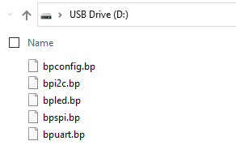

# JSON Configuration Files


import OldSiteWarning from '/old-site-warning.md'

<OldSiteWarning/>




Global and mode settings will be saved and reloaded from onboard NAND flash storage. The settings are saved in simple JSON files. Configuration files can be viewed and edited from the USB disk that appears when the Bus Pirate is connected to a computer.

## Global settings
```json
{
"terminal_language": 0,
"terminal_ansi_color": 1,
"terminal_ansi_statusbar": 0,
"display_format": 0,
"lcd_screensaver_active": 0,
"lcd_timeout": 0,
"led_effect": 1,
"led_color": 0,
"led_brightness": 10,
"terminal_usb_enable": 1,
"terminal_uart_enable": 0,
"terminal_uart_number": 1,
"debug_uart_enable": 0,
"debug_uart_number": 0
}
```
The variable names are self explanatory. The values correspond to the options in the configuration menu, minus one. 

## UART settings
```json
{
"baudrate": 115200,
"data_bits": 8,
"stop_bits": 1,
"parity": 0
}
```
## I2C settings
```json
{
"baudrate": 400,
"data_bits": 0
}
```
## SPI settings
```json
{
"baudrate": 100000,
"data_bits": 8,
"stop_bits": 0,
"parity": 0,
"cs_idle": 1
}
```
## LED settings
```json
{
"device": 2,
"num_leds": 16
}
```