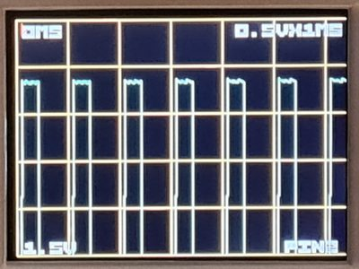

import DiscourseComments from '@site/src/components/DiscourseComments';
import BrowserWindow from '@site/src/components/BrowserWindow';

# Scope Mode


The Bus Pirate can support an oscilloscope display mode - it's limited by the underlying
RP2040 chip to 0.5Msps so it's suitable for analog audio, not for high speed digital signals greater than 500KHz. Analog signals can be captured on any IO pin.

## Start the scope

<BrowserWindow>
<span className="bp-prompt">HiZ></span> d<br/>
<span className="bp-info">Display selection<br/>
 1. Default<br/>
 2. Scope<br/>
 x. Exit<br/></span>
<span className="bp-prompt">Display ></span> 2<br/>
<span className="bp-info">Display:</span> Scope
</BrowserWindow>

The ```d``` command selects the LCD display mode. 
- Choose ```scope``` to load the oscilloscope on the Bus Pirate LCD
- You should see an oscilloscope show up on the Bus Pirate screen
- It's rotated 90 degrees from the normal orientation so we can show longer waveforms

## Display overview


The display is small, to make the scope more useful we have a much larger capture buffer than the actual display and software scales the captured data to fit. The actual resolution is 0.5M samples per second. In the 100uS/div range that's one sample per pixel, any faster (50uS/div and below and samples are interpolated on the screen). If possible we try and capture up to 10 samples per pixel at whatever the current resolution is so that you can zoom into captured data at least 10 times (3 steps) before we start interpolating.

* The text '1V x 100uS' in the top right is the scale (voltage X time), the size of 1 yellow square on the screen. The default scale is "1V x 100uS" - 1 volt by 100 microseconds
* The text '0mS' in the top left is the offset (in time) of the left hand vertical yellow line
* The text '0V' in the bottom left is the offset (in volts) of the bottom yellow line
* The text 'PIN0' in the bottom right tells you which input pin is being sampled
* If the trigger point for the current trace is visible on the display then a small red arrow will appear at the trigger point at the top of the display

By default the screen displays 0V-5V in the vertical direction and 0uS to 640uS horizontally.
The data on the screen is a window into a larger display buffer. After taking a trace you can move around 
inside the buffer to explore different sections of the data.

## Commands

Controls are done from the command line, just like other Bus Pirate functions. There are 5 commands that can be entered:

* **sr {pin} {mode}** - Scope Run, optional capture {pin} (0-7) and/or {mode} ("o n a" Once, Normal, Auto)
* **ss** - Scope Stop
* **x** - Edit timebase (x axis)
* **y** - Edit voltage (y access)
* **t** - Edit trigger

All of these commands enter a more interactive UI where you can type single characters to navigate the captured data. You can skip back out to the normal UI by typing ```ENTER```.


### Scope Run

<BrowserWindow>
<span className="bp-prompt">LED-()></span> sr 2n  <br/>
</BrowserWindow>

```sr {pin} {mode}``` ('scope run') starts the oscilloscope, you can specify additional parameters if you don't specify any it will use the previous settings. 

```{pin}``` is a single digit 0-7 to specify which Bus Pirate pin to capture.

```{mode}``` is 'o' 'n' or 'a' to specify which mode you want the display to work in:
- ```o``` ('once') will wait for a single trigger and stop
- ```n``` ('normal') will wait for a trigger, display the waveform and restart looking for the next trigger
- ```a``` ('auto') will wait for a trigger or a timeout (a second or so) whichever comes first and then restart, use this one to measure voltages

### Scope Stop

```ss``` ('scope stop') stops the scope 

### Scope Parameters
In addition there are 3 commands than can be used to alter parameters - these replace the knobs you'd find on a normal oscilloscope:

- ```x``` ('x axis' - timebase)
- ```y``` ('y axis' - voltage)
- ```t``` ('trigger' - trigger voltage and position)

These commands work a bit differently from normal Bus Pirate commands, you can use them two ways, either type the command along with some parameters and hit ```enter```, or just type the command and ```enter``` and you will pop into an interactive mode where you can type parameters to change things interactively on the display, typing ```enter``` again will return you to the main BusPirate prompt.

#### X/Y navigation
<BrowserWindow>
<span className="bp-prompt">LED-()></span> x<br/>
Timebase: +- ^vT ty rsona> +-<br/>
<span className="bp-prompt">LED-()></span> y<br/>
Voltage scale: +- ^vT tx rsona> +-<br/>
</BrowserWindow>

Interactive parameters in x and y modes are:

- ```+```/```-``` in x mode increases or decreases the timebase scale - it changes the displayed scale but not the underlying data until the next time data is collected.
- ```+```/```-``` in y mode increases or decreases the voltage sensitivity (change the displayed scale)
- ```^```/```v```/```<```/```>``` or the equivalent arrow keys in x or y modes moves the display around within the currently collected data

#### Triggers

<BrowserWindow>
<span className="bp-prompt">LED-()></span> t<br/>
Trigger: +-*b ^vT BME xy rsona> <br/>
</BrowserWindow>

In Trigger mode
- ```+```/```-```/```b```/```n``` changes which edge triggers a data capture (positive going, negative going, both edges or no edges respectively)
- ```^```/```v``` or the equivalent arrow keys changes the voltage at which the trigger occurs
- ```<```/```>``` or the equivalent arrow keys moves the next trigger point around (chooses where in the next set of collected data the trigger will be)
- ```B```/```M```/```E``` moves the trigger point to the beginning/middle/end of the sample buffer

In trigger mode you will see a red crosshair that shows the time and voltage that the trigger occurs at,
there's also red test that describes it. If the crosshair is off the screen you'll see a red arrow
pointing at where it's located.


In all 3 modes you can type:
- ```T``` moves the x display point to show the current trigger point
- ```r``` start run (like ```sr```)
- ```s``` stop the scope (like ```ss```)
- ```o``` start the scope in once mode (like ```sr o```)
- ```n``` start the scope in normal mode (like ```sr n```)
- ```a``` start the scope in auto mode (like ```sr a```)
- ```t``` switch to trigger mode
- ```x``` switch to x/timebase mode
- ```y``` switch to y/voltage mode
- ```enter``` leaves interactive mode

Note: commands that require a shift like + can also use their unshifted equivalents (= for +).

The general idea is that you switch into scope display mode with "d", start the scope running with something like "sr 2n" to sample from pin 2, use "t" to set up a trigger use "x" to get into interactive mode and +/- to set up timebase and the arrow keys to look at the result

## Quick Tutorial

Here's a quick start tutorial using only the Bus Pirate hardware. We're going to work on pin # 2, initially wagging it up and down and then setting up a clock.

### Setup

<BrowserWindow>
<span className="bp-prompt">HiZ></span> m<br/>
<br/>
<span className="bp-info">Mode selection</span><br/>
 1. <span className="bp-info">HiZ</span><br/>
 2. <span className="bp-info">1-WIRE</span><br/>
 3. <span className="bp-info">UART</span><br/>
 4. <span className="bp-info">I2C</span><br/>
 5. <span className="bp-info">SPI</span><br/>
 6. <span className="bp-info">LED</span><br/>
 x. <span className="bp-info">Exit</span><br/>
<span className="bp-prompt">Mode ></span> 6<br/>
<br/>
<span className="bp-info">LED type</span><br/>
 1. <span className="bp-info">WS2812/SK6812/'NeoPixel' (single wire interface)*</span><br/>
 2. <span className="bp-info">APA102/SK9822 (clock and data interface)</span><br/>
 3. <span className="bp-info">Onboard LEDs (16 SK6812s)</span><br/>
 x. <span className="bp-info">Exit</span><br/>
<span className="bp-prompt">Type (</span>1<span className="bp-prompt">) ></span> 3<br/>
<span className="bp-info">Mode:</span> LED<br/>
<span className="bp-prompt">LED-()></span> W<br/>
<span className="bp-info">Power supply<br/>
Volts (0.80V-5.00V)</span><br/>
<span className="bp-prompt">x to exit (3.30) ></span> <br/>
<span className="bp-float">3.30</span>V<span className="bp-info"> requested, closest value: <span className="bp-float">3.30</span></span>V<br/>
Set current limit?<br/>
n <br/>
<br/>
<span className="bp-info">Power supply:</span>Enabled<br/>
<span className="bp-info"><br/>
Vreg output: <span className="bp-float">3.3</span></span>V<span className="bp-info">, Vref/Vout pin: <span className="bp-float">3.3</span></span>V<span className="bp-info">, Current sense: <span className="bp-float">2.4</span></span>mA<span className="bp-info"><br/>
</span><br/>
<span className="bp-prompt">LED-()></span> <br/>
</BrowserWindow>

Enter LED mode and enable a 3.3volt power supply:
- Enter a mode with the ```m``` command, select LED mode with onboard LEDs
- Set the I/O power supply to 3.3volts using the 'w' command (w ```enter``` ```enter``` n ```enter```)

### Enable Scope

<BrowserWindow>
<span className="bp-prompt">LED></span> d<br/>
<span className="bp-info">Display selection<br/>
 1. Default<br/>
 2. Scope<br/>
 x. Exit<br/></span>
<span className="bp-prompt">Display ></span> 2<br/>
<span className="bp-info">Display:</span> Scope
</BrowserWindow>

The ```d``` command selects the LCD display mode. 
- Type ```d``` and ```enter``` to configure the display mode
- Choose ```scope``` to load the oscilloscope on the Bus Pirate LCD
- You should see an oscilloscope on the Bus Pirate screen


### Triggers

<BrowserWindow>
<span className="bp-prompt">LED-()></span> t<br/>
Trigger: +-*b ^vT BME xy rsona> b<br/>
<span className="bp-prompt">LED-()></span> sr 2n  <br/>
</BrowserWindow>

Set the trigger to 'both' edges and begin the scope capture on pin 2:
- Type ```t``` and ```enter``` to get into trigger mode. 
- Press ```b``` to set triggers on both the rising and falling edges, then ```enter``` to exit
- ```sr 2n``` then ```enter``` to start the scope on pin 2 in normal mode

The default trigger point is ~2.4volts.


### Capture

<BrowserWindow>
<span className="bp-prompt">LED-()></span> P<br/>
<span className="bp-info">Pull-up resistors:</span> Enabled (10K ohms @ <span className="bp-float">3.3</span>V)<br/>
<span className="bp-prompt">LED-()></span> p<br/>
<span className="bp-info">Pull-up resistors:</span> Disabled<br/>
<span className="bp-prompt">LED-()></span>
</BrowserWindow>

Now we'll use the pull-up resistors to trigger the scope:
- ```P``` and ```enter``` to turn **on** the pull-up resistors. You should see a trace with a rising edge
- ```p``` and ```enter``` to turn **off** the pull-up resistors. You should see a nice exponential decay curve on the scope as pin 2's capacitance discharges

 

### Edge triggers

<BrowserWindow>
<span className="bp-prompt">LED-()></span> P<br/>
<span className="bp-info">Pull-up resistors:</span> Enabled (10K ohms @ <span className="bp-float">3.3</span>V)<br/>
<span className="bp-prompt">LED-()></span> t<br/>
Trigger: +-*b ^vT BME xy rsona> +<br/>
<span className="bp-prompt">LED-()></span> p<br/>
<span className="bp-info">Pull-up resistors:</span> Disabled<br/>
<span className="bp-prompt">LED-()></span> P<br/>
<span className="bp-info">Pull-up resistors:</span> Enabled (10K ohms @ <span className="bp-float">3.3</span>V)<br/>
<span className="bp-prompt">LED-()></span> 
</BrowserWindow>

The scope can be triggered by the rising or falling edge of a signal, or both:
- ```P``` and ```enter``` to turn **on** the pull-up resistors again. 
- ```t``` and ```enter``` to configure the trigger. Type ```+``` to trigger only on rising edges, then ```enter``` to leave trigger mode
- ```p``` and ```enter``` to turn **off** the pull-up resistors. This time the scope doesn't capture because the signal is a falling edge
- ```P``` and ```enter``` to turn **on** the pull-up resistors again. The scope is triggered by the rising edge.

### Navigation

<BrowserWindow>
<span className="bp-prompt">LED-()></span> G 2<br/>
<span className="bp-info">Generate frequency</span><br/>
<span className="bp-info">Choose available pin:</span><br/>
 2. IO<span className="bp-float">2</span><br/>
 3. IO<span className="bp-float">3</span><br/>
 4. IO<span className="bp-float">4</span><br/>
 5. IO<span className="bp-float">5</span><br/>
 6. IO<span className="bp-float">6</span><br/>
 7. IO<span className="bp-float">7</span><br/>
 x. <span className="bp-info">Exit</span><br/>
<span className="bp-prompt"> ></span> 2<br/>
<span className="bp-prompt">Period or frequency (ns, us, ms, Hz, KHz or Mhz) ></span> 1ms<br/>
<span className="bp-info">Frequency:</span> <span className="bp-float">1.000</span>ms = <span className="bp-float">1000</span>Hz (<span className="bp-float">1000.00</span>Hz)<br/>
<span className="bp-info">Period:</span> <span className="bp-float">1000000</span>ns (<span className="bp-float">1.00</span>ms)<br/>
<br/>
<span className="bp-info">Actual frequency:</span> <span className="bp-float">1000</span>Hz (<span className="bp-float">1.00</span>KHz)<br/>
<span className="bp-info">Actual period:</span> <span className="bp-float">999998</span>ns (<span className="bp-float">1000.00</span>us)<br/>
<br/>
<span className="bp-prompt">Duty cycle (%) ></span> 33%<br/>
<span className="bp-info">Duty cycle:</span> <span className="bp-float">33.00</span>% = <span className="bp-float">329999</span>ns (<span className="bp-float">330.00</span>us)<br/>
<span className="bp-info">Actual duty cycle:</span> <span className="bp-float">330000</span>ns (<span className="bp-float">330.00</span>us)<br/>
Divider: 31, Period: 64515, Duty: 21290<br/>
<br/>
<span className="bp-info">Generate frequency:</span> Enabled on IO<span className="bp-float">2</span><br/>
<br/>
<span className="bp-prompt">LED-()></span> 
</BrowserWindow>

Next let's try something more involved, let's set up a square wave on pin 2.
- Generate a frequency on pin 2 (G 2 ```enter``` 1ms ```enter``` 33% ```enter```)

#### Time scale

<BrowserWindow>
<span className="bp-prompt">LED-()></span> x<br/>
Timebase: +- ^vT ty rsona> +-<br/>
</BrowserWindow>

You should see the display showing a square wave. The capture buffer is large. We can zoom and pan to navigate the data:
- ```x``` and ```enter``` to scale the X axis (time). 
- You should see a bunch of square waves, try ```+``` and ```-``` to change the scale, and the left and right arrows to move around. Freeze a trace with ```o```

 

Note you are now in interactive mode - try the ```-``` command a few times and see that you can zoom out from the current display and the ```+``` zooms in, ```<``` and ```>``` let you more right and left within the display.


#### Voltage scale

<BrowserWindow>
<span className="bp-prompt">LED-()></span> y<br/>
Voltage scale: +- ^vT tx rsona> +-<br/>
</BrowserWindow>


Type ```y``` on the command line **or** in the x or t interactive mode type. Now you are in 'voltage mode'. ```+``` will zoom in vertically and ```^```/```v``` will let you scroll up and down.
- ```y``` and ```enter``` to scale the Y axis (volts).
- Change the voltage scale with ```+``` and ```-```, and use the up down arrows to move the display



Scroll back to the beginning and use ```-``` zoom out to 1v/div. Now type ```t``` to go into trigger  mode - you'll see a red crosshair showing the trigger voltage and time, and their actual values in red at the top right, you can edit them using the arrow keys, you can also change the trigger type using +-bn - try typing ```-``` and seeing how the display changes. 

Let's move the trigger point to the middle of the capture buffer - type ```M``` and notice how the red vertical line is replaced by a small red arrow pointing right, you can type ```T``` to center the display on the new trigger point. ```BT``` will put it back.

## Limitations and bugs

We're very much limited by the hardware:

* 500k samples per second is the maximum speed of the RP2040 ADC
* 12 bits 
* Tiny display
* No way to make a dual scope (we might be able to have a digital trigger in the future)
