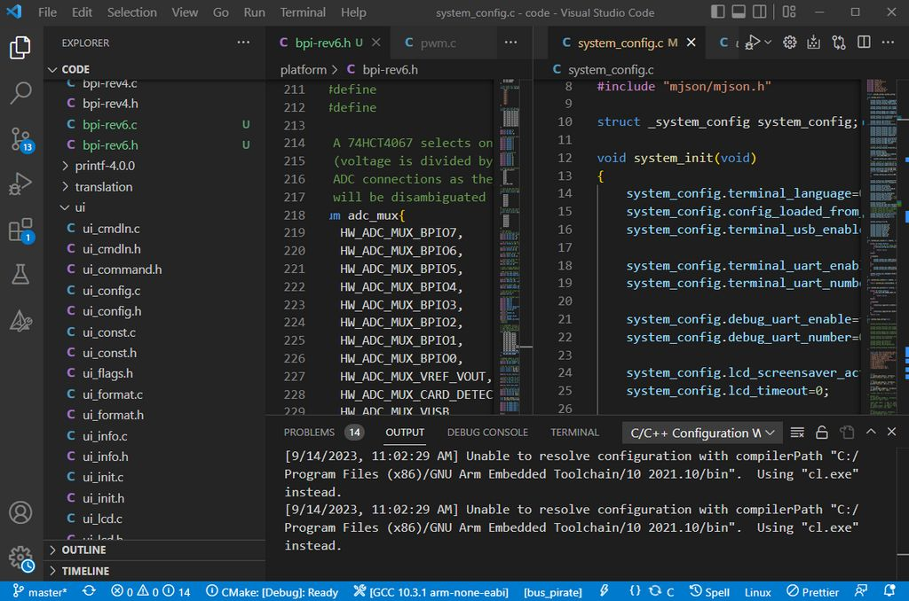
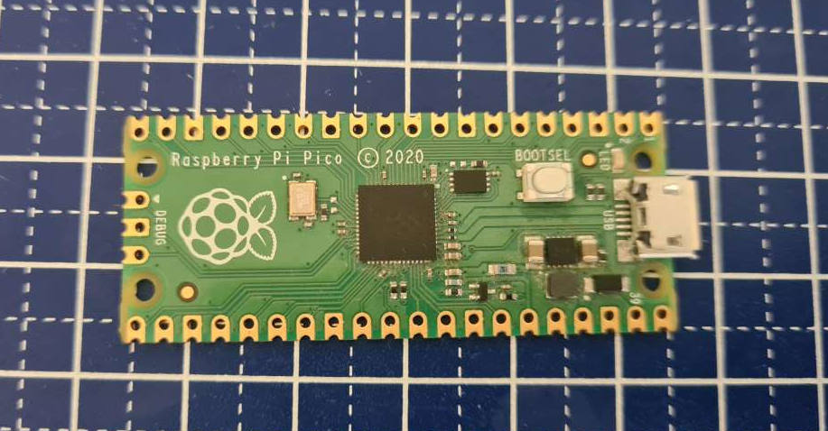
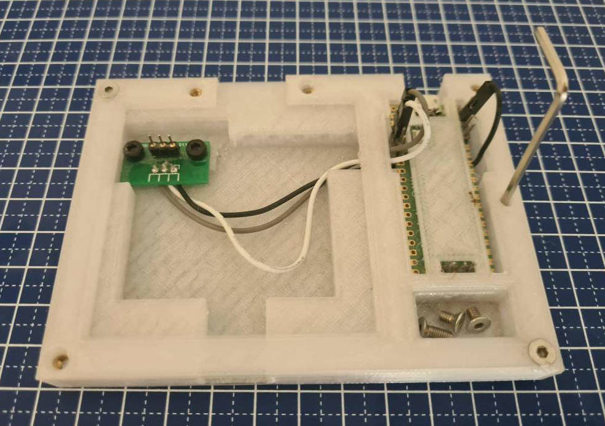

# Firmware Development

Bus Pirate 5 is based on the Raspberry Pi RP2040 and uses the Pico C language SDK. It's a really wonderful toolchain and usually 'just works' on most operating systems.

## Toolchain

The RP2040 toolchain includes the open source ARM GCC compiler, OpenOCD/GDB for debugging, VSCode for the IDE and the Pico C language SDK. Very nice, very professional and very open source.

- Raspberry Pi Foundation [Windows installer](https://github.com/raspberrypi/Pico-setup-windows/releases/latest/download/Pico-setup-windows-x64-standalone.exe)
- [Setup guide for Ubuntu Linux](https://lindevs.com/set-up-raspberry-pi-Pico-sdk-on-ubuntu)
- [Setup guide for Max OS](https://www.robertthasjohn.com/post/how-to-set-up-the-raspberry-pi-Pico-for-development-on-macos)

## Code

Bus Pirate 5 firmware is open source and [available on GitHub](https://github.com/DangerousPrototypes/BusPirate5-firmware). Get it three ways:
- [Download it directly as a .zip](https://github.com/DangerousPrototypes/BusPirate5-firmware) file at GitHub
- [Check out the repository](https://github.com/DangerousPrototypes/BusPirate5-firmware.git) with git from the command line
- Use a git GUI such as [GitHub thing](https://desktop.github.com/) or [Sourcetree](https://www.sourcetreeapp.com/)

## In Circuit Debugging

Debugging is supported through a two wire JTAG interface. It's a great way to see what your code is doing and track down bugs.

### Raspberry Pi Pico as debugger

A [RP2040 Pico board](https://www.raspberrypi.com/products/raspberry-pi-Pico/) can be used as a debugger.
- Download the [Pico Probe firmware](https://github.com/raspberrypi/Picoprobe/releases)
- Press and hold the boot select button on the Pico board, then plug in the USB cable. The Pico board should appear as a USB disk on your computer.
- Drag and drop the Pico Probe firmware into the USB disk. The Pico will reset and two USB connections will appear. One is the debug interface, the other is a USB to serial converter.

#### Windows driver install

**Windows Only** - We need to swap the driver for the debug interface.

- [Download and run Zadig](https://zadig.akeo.ie/)
- Locate Pico Probe **Interface 2**
- Select libusb-win32 as the driver
- Click **Install Driver**

:::tip
According to various sources a driver swap is no longer required, however we leave these instructions here for completeness and troubleshooting purposes
:::

### Bus Pirate 5 as debugger

The Pico Probe firmware is open and the early versions were rather simple. We should port it to the Bus Pirate 5 hardware so it can be used as a programmer and debugger. Either through a separate firmware, or as an additional mode in the existing Bus Pirate firmware.

### Debug Connections

|Connection|Pico Probe pin|Bus Pirate pin|
|-|-|-|
|SWCLK|GP2|SWCLK (Closest to PCB edge)|
|SWDIO|GP3|SWDIO (Center pin)|
|GND|GND|GND (Furthest from PCB edge)|
|UART TX|GP4|-|
|UART RX|GP5|-|

The Bus Pirate debug header is exposed on the bottom of the PCB/enclosure. Connect SWCLK, SWDIO and Ground between the Pico Probe and the Bus Pirate. The Pico Probe UART is a little bonus that's occasionally helpful when the USB terminal connection frustrates debugging, but it does not need to be connected.

### Debug Station

A 3D printable debug station is in the hardware repository.
- A cradle for the Bus Pirate with mating debug header
- An enclosure for the Pico Probe that exposes all pins
- A dish to keep screws and button caps from running away
- A tool holder to keep the 2mm hex wrench handy

We tried really hard to make it "drop and go" using pogo pins for the debug header but the connection was unreliable. Instead we use a 3P milled pin header on a PCB or perf board.

Hardware:
- M3x5mm DIN7991 bolts
- M3x3mmLx4.5mmOD heat set nuts
- 3P 2.54mm spacing milled header (stamped header probably won't fit)
- A bit of perf board for mounting the header

## Compile server

 Updates pushed to the main branch of the Bus Pirate git repo are automatically compiled, zipped, and posted with change notes in the forum. The RP2040 toolchain is installed on a simple Linux build server [following these instructions](https://lindevs.com/set-up-raspberry-pi-Pico-sdk-on-ubuntu).

