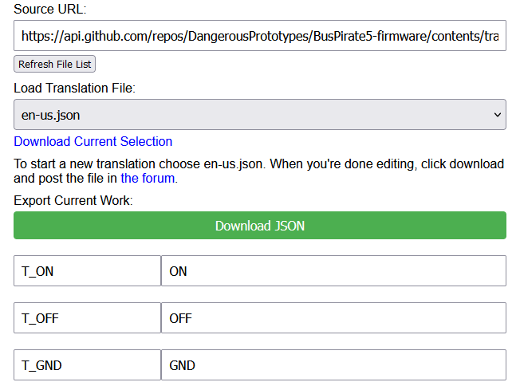
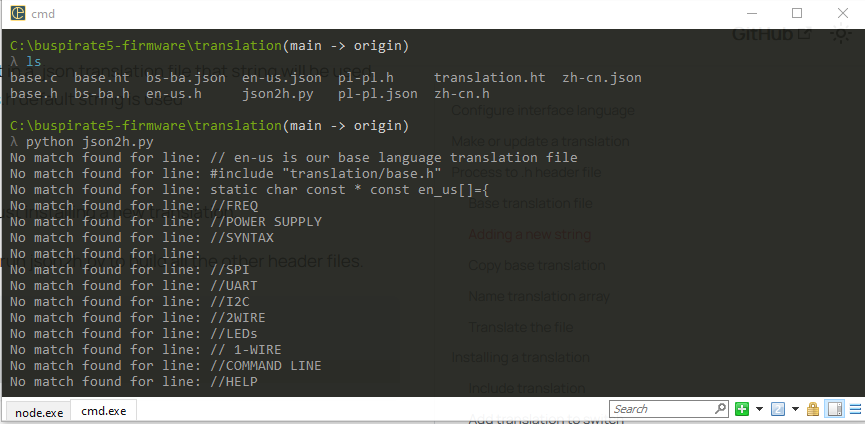

import BrowserWindow from '@site/src/components/BrowserWindow';

# Translation


Bus Pirate 5 supports live language switching via the configuration menu. The language setting will be saved to flash storage and loaded each time the Bus Pirate starts.


## Configure interface language

<BrowserWindow>
<span className="bp-prompt">HiZ></span> c<br/>
<span className="bp-info"></span><br/>
<span className="bp-info">Configuration options</span><br/>
 1. <span className="bp-info">Language</span><br/>
 2. <span className="bp-info">ANSI color mode</span><br/>
 3. <span className="bp-info">ANSI toolbar mode</span><br/>
 4. <span className="bp-info">LCD screensaver</span><br/>
 5. <span className="bp-info">LED effect</span><br/>
 6. <span className="bp-info">LED color</span><br/>
 7. <span className="bp-info">LED brightness</span><br/>
 x. <span className="bp-info"></span><br/>
<span className="bp-prompt"> ></span> 1<br/>
<br/>
<span className="bp-info">Language</span><br/>
 1. <span className="bp-info">English</span><br/>
 2. <span className="bp-info">Chinese (simplified)</span><br/>
 x. <span className="bp-info"></span><br/>
<span className="bp-prompt"> ></span> <br/>
</BrowserWindow>

Type ```c``` and press ```enter``` to display the configuration menu. Choose language (option 1), then select an available language.


## Make or update a translation




:::tip
Translations can be created and edited in your browser. Check out the [Bus Pirate 5 translation web app](pathname:///translate.html).
:::

- Open the [translation web page](pathname:///translate.html)
- To edit an existing translation choose it from the ```Load Translation File``` drop down menu
- To create a new translation, choose en-us.json (the base translation)
- Translate the text fields
- Click ```Download JSON``` to download your translation text as a .json file
- Name the .json file something logical like the [ISO 6391-1](https://en.wikipedia.org/wiki/List_of_ISO_639-1_codes) language code and a region code. For example nl-nl.h for Dutch-Netherlands.
- Post the .json file in [the forum](https://forum.buspirate.com), or submit a pull request on GitHub

## Process to .h header file

Translations are stored in .json files and processed to .h header files. The reason for this is because it was a huge pain to update a bunch of files for a single change. A simple Python script uses the en-us.h translation as a base and builds all the other header files from the .json source.

### Base translation file
en-us.h is the base translation file. It provides two important things:
1. The keys in en-us.h such as ```T_WARN_VOUT_VREF_LOW``` become the master list of translation keys. The enumeration in base.h will be built from these keys
2. The value strings in en-us.h become the default strings. If a key is present in a .json translation file that string will be used. However, if a key is not present in the .json translation file the en-us.h default string is used

### Adding a new string 
This section is for developers adding strings. You can skip this if you're just installing a new translation. 

```c {3}
	[T_HELP_SYS_HELP]="How to use the help system",
	[T_HELP_GCMD_SELFTEST]="run a complete system self-test",
    [T_ADDED_NEW_STRING]="We just added a new string!",
```
en-us.h is the base translation file. Add new entries in en-us.h and then run json2h.py to build all the other header files.
- Locate en-us.h in the ```/translation/``` folder of the firmware
- Add your new entries somewhere logical and give them a descriptive key, example: ```T_ADDED_NEW_STRING```

:::danger
Format entries exactly as the previous entries: **no spaces between the ]=" or between ",**. The regex used to process the file isn't very robust. If you get compile errors be sure to check this!
:::

### Run json2h.py


json2h.py first processes the en-us.h file, then builds the other headers files using the .json translation files as a source.
- Open a terminal
- Navigate to the firmware ```/translation/``` folder
- Run ```json2h.py```

You'll see a lot of unhelpful output, ignore it. All the .json translation files will now have a .h header file with the same name. 

## Installing a translation

### Include translation
```c {7}
#include <stdio.h>
#include "pico/stdlib.h"
#include "pirate.h"
#include "system_config.h"
#include "translation/en-us.h"
#include "translation/zh-cn.h"
#include "translation/nl-nl.h"

char **t;
```
- Locate ```/translation/base.c``` in the source code.
- Include your translation file at the end of the list.

### Add translation to switch
```c {3-5}
switch(language)
{
    case 2:
        t = (char **) &nl_nl;
        break;       
    case 1:
        t = (char **) &zn_ch;
        break;
    case 0:
    default:
        t = (char **) &en_us;
        break;
}
```
- Locate the switch statement in ```/translation/base.c```. This is the logic for switching the active language.
- Add a new case to the switch for your translation.  
- Be sure to use the next available case number so your translation is available from the configuration menu. For example our nl_nl translation becomes case 2.

### Add language string for configuration menu
```c {3}
[T_CONFIG_LANGUAGE_ENGLISH]="English",
[T_CONFIG_LANGUAGE_CHINESE]="Chinese (simplified)",
[T_CONFIG_LANGUAGE_DUTCH]="Dutch",
```
- Open ```translation/en-us.h```
- Add a key and value for the language menu option in the translation array
- Here, we added ```T_CONFIG_LANGUAGE_DUTCH```
- Run ```translation/json2h.py``` to rebuild all the headers with this new string 

:::warning
The firmware will not compile and throw an error if the entry isn't included in each translation file by running json2h.py.
:::

### Add translation to the language menu struct

```c {3}
static const struct prompt_item menu_items_language[]=
{
    {T_CONFIG_LANGUAGE_ENGLISH},{T_CONFIG_LANGUAGE_CHINESE},{T_CONFIG_LANGUAGE_DUTCH}
};
```
- Locate ```/ui/ui_config.c``` in the source code.
- Add your enumerated key to the menu_items_language struct. 
- Your translation is now included in the list of available languages in the configuration menu.

### Compile the firmware and test

<BrowserWindow>
<span className="bp-prompt">HiZ></span> c<br/>
<span className="bp-info"><br/>
<span className="bp-info">Configuration options</span></span><br/>
 1. <span className="bp-info">Language</span><br/>
 2. <span className="bp-info">ANSI color mode</span><br/>
 3. <span className="bp-info">ANSI toolbar mode</span><br/>
 4. <span className="bp-info">LCD screensaver</span><br/>
 5. <span className="bp-info">LED effect</span><br/>
 6. <span className="bp-info">LED color</span><br/>
 7. <span className="bp-info">LED brightness</span><br/>
 x. <span className="bp-info"></span><br/>
<span className="bp-prompt"> ></span> 1<br/>
<br/>
<span className="bp-info">Language</span><br/>
 1. <span className="bp-info">English</span><br/>
 2. <span className="bp-info">Chinese (simplified)</span><br/>
 3. <span className="bp-info">Dutch</span><br/>
 x. <span className="bp-info"></span><br/>
<span className="bp-prompt"> ></span> <br/>
</BrowserWindow>

- Compile the firmware and load it into the Bus Pirate.
- Your translation should appear in the configuration menu.

## Resources

### Files
import FooterFiles from '/_common/_footer/_footer-files.md'

<FooterFiles/>

### Community
import FooterCommunity from '/_common/_footer/_footer-community.md'

<FooterCommunity/>