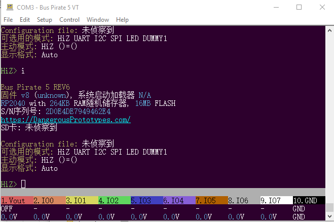

import BrowserWindow from '@site/src/components/BrowserWindow';

# Translation



Bus Pirate 5 supports live language switching via the configuration menu. If a TF flash card is present the setting will be saved and loaded each time the Bus Pirate starts.

## Configure interface language

<BrowserWindow>
<span className="bp-prompt">HiZ></span> c<br/>
<span className="bp-info"><br/>
<span className="bp-info">Configuration options</span></span><br/>
 1. <span className="bp-info">Language</span><br/>
 2. <span className="bp-info">ANSI color mode</span><br/>
 3. <span className="bp-info">ANSI toolbar mode</span><br/>
 4. <span className="bp-info">LCD screensaver</span><br/>
 5. <span className="bp-info">LED effect</span><br/>
 6. <span className="bp-info">LED color</span><br/>
 7. <span className="bp-info">LED brightness</span><br/>
 x. <span className="bp-info"></span><br/>
<span className="bp-prompt"> ></span> 1<br/>
<br/>
<span className="bp-info">Language</span><br/>
 1. <span className="bp-info">English</span><br/>
 2. <span className="bp-info">Chinese (simplified)</span><br/>
 x. <span className="bp-info"></span><br/>
<span className="bp-prompt"> ></span> <br/>
</BrowserWindow>

Type ```c``` and press ```enter``` to display the configuration menu. Choose language (option 1), then select an available language.

## Copy base translation
```c {3}
// en-us is our base language translation file
#include "translation/base.h"
static char const * const en_us[]={
	[T_ON]="ON",
	[T_OFF]="OFF",
	[T_GND]="GND",
	[T_INPUT]="INPUT",
	[T_OUTPUT]="OUTPUT",
	[T_EXIT]="Exit",
	[T_LOADED]="Loaded",
	[T_SAVED]="Saved",
```

- In the source code locate /translation/en-us.h. en-us.h is the base translation file.
- Make a copy of en-us.h. Name it something logical like the [ISO 6391-1](https://en.wikipedia.org/wiki/List_of_ISO_639-1_codes) language code and a region code. For example nl-nl.h for Dutch-Netherlands.

## Name translation array
```c {3}
// my Dutch translation file
#include "translation/base.h"
static char const * const nl_nl[]={
```
- Change **en_us** to match the name of your file. For example nl_nl for Dutch-Netherlands.
- Note that here we use an ```_``` underscore, while in the file name we use a ```-``` dash.

## Translate the file
```c
// en-us is our base language translation file
#include "translation/base.h"
static char const * const nl_nl[]={
	[T_ON]="aan",
	[T_OFF]="uit",
```
- You're ready to translate the file.
- Hand the translated file to very grateful developers in the forum, or continue below to install the translation yourself.


## Installing a translation

### Include translation
```c {7}
#include <stdio.h>
#include "pico/stdlib.h"
#include "pirate.h"
#include "system_config.h"
#include "translation/en-us.h"
#include "translation/zh-cn.h"
#include "translation/nl-nl.h"

char **t;
```
- Locate /translation/base.c in the source code.
- Include your translation file at the end of the list.

### Add translation to switch
```c {3-5}
switch(language)
{
    case 2:
        t = (char **) &nl_nl;
        break;       
    case 1:
        t = (char **) &zn_ch;
        break;
    case 0:
    default:
        t = (char **) &en_us;
        break;
}
```
- Locate the switch statement in /translation/base.c. This is the logic for switching the active language.
- Add a new case to the switch for your translation.  
- Be sure to use the next available case number so your translation is available from the configuration menu. For example our nl_nl translation becomes case 2.

### Enumerate the translation
```c {3}
	T_CONFIG_LANGUAGE_ENGLISH,
	T_CONFIG_LANGUAGE_CHINESE,
    T_CONFIG_LANGUAGE_DUTCH,
```
- Locate /translation/base.h in the source code.
- Add a key for the language menu option in the enumeration list.
- Here, we added **T_CONFIG_LANGUAGE_DUTCH**

### Add entry to all translation files
```c {3}
[T_CONFIG_LANGUAGE_ENGLISH]="English",
[T_CONFIG_LANGUAGE_CHINESE]="Chinese (simplified)",
[T_CONFIG_LANGUAGE_DUTCH]="Dutch",
```
- Add the enumerated key and a name for the language to **each translation file** in the /translation/ folder.

:::warning
The firmware will not compile and throw an error if the entry isn't included in each translation file.
:::

### Add translation to the language menu struct

```c {3}
static const struct prompt_item menu_items_language[]=
{
    {T_CONFIG_LANGUAGE_ENGLISH},{T_CONFIG_LANGUAGE_CHINESE},{T_CONFIG_LANGUAGE_DUTCH}
};
```
- Locate /ui/ui_config.c in the source code.
- Add your enumerated key to the menu_items_language struct. 
- Your translation is now included in the list of available languages in the configuration menu.

### Compile the firmware and test

<BrowserWindow>
<span className="bp-prompt">HiZ></span> c<br/>
<span className="bp-info"><br/>
<span className="bp-info">Configuration options</span></span><br/>
 1. <span className="bp-info">Language</span><br/>
 2. <span className="bp-info">ANSI color mode</span><br/>
 3. <span className="bp-info">ANSI toolbar mode</span><br/>
 4. <span className="bp-info">LCD screensaver</span><br/>
 5. <span className="bp-info">LED effect</span><br/>
 6. <span className="bp-info">LED color</span><br/>
 7. <span className="bp-info">LED brightness</span><br/>
 x. <span className="bp-info"></span><br/>
<span className="bp-prompt"> ></span> 1<br/>
<br/>
<span className="bp-info">Language</span><br/>
 1. <span className="bp-info">English</span><br/>
 2. <span className="bp-info">Chinese (simplified)</span><br/>
 3. <span className="bp-info">Dutch</span><br/>
 x. <span className="bp-info"></span><br/>
<span className="bp-prompt"> ></span> <br/>
</BrowserWindow>

- Compile the firmware and load it into the Bus Pirate.
- Your translation should appear in the configuration menu.
