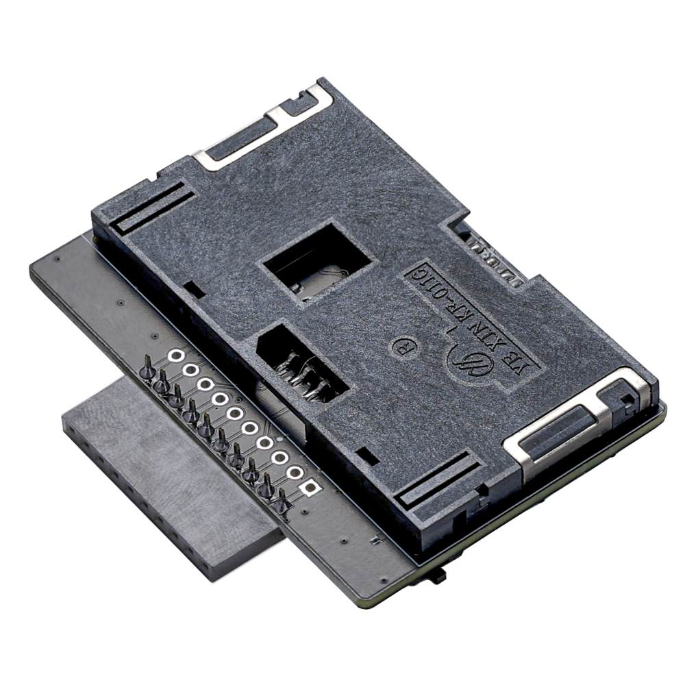

import BrowserWindow from '@site/src/components/BrowserWindow';

# 24C02 Smart IC Card

[sd card, pinout]

24C02 is a simple EEPROM IC card with 256 bytes of memory and an I2C interface. It functions the same as a 24C02 EEPROM chip, but in a smart card form factor. There is no read or write protection or other security, the entire memory can be accessed without a password.

:::tip
24C04, 24C08, and 24C16 IC cards are also available. These have 512, 1024, and 2048 bytes of memory respectively.
:::

import FooterCart from '/_common/_footer/_footer-cart.md'

<FooterCart/>

## Connections


Common IC cards usually follow the [ISO 7816-3 standard](https://en.wikipedia.org/wiki/ISO/IEC_7816) and have the same pinout and contact shape. [Source](https://commons.wikimedia.org/wiki/File:SmartCardPinout.svg).

|Bus Pirate|24C02|Description|
|-|-|-|
|IO0/SDA|C7 - I/O|I2C Data|
|IO1/SCL|C3 - CLK|I2C Clock|
|Vout|C1 - VCC|3.3volt power supply|
|GND|C5 - GND|Ground|

Connect the Bus Pirate to the smart card as shown in the table above. 

### Smart IC Card and SIM card adapter



It's possible to gently solder wires into each pad of the chip, but a KF-011C (or similar) smart card socket is useful if you don't want to destroy the card.

:::tip
A [smart IC card and SIM card adapter](/overview/sim-iccard-adapter) is available for Bus Pirate 5 with the correct connections already set. The adapter accepts most ISO 7816-3 smart cards and mini/micro/nano SIM cards. 
::: 

## Setup

<BrowserWindow>
<span className="bp-prompt">HiZ></span> m<br/>
<br/>
<span className="bp-info">Mode selection</span><br/>
 1. <span className="bp-info">HiZ</span><br/>
...
 5. <span className="bp-info">I2C</span><br/>
...
 x. <span className="bp-info">Exit</span><br/>
<span className="bp-prompt">Mode ></span> 5<br/>
<br/>
<span className="bp-info">I2C speed</span><br/>
 1kHz to 1000kHz<br/>
 x. <span className="bp-info">Exit</span><br/>
<span className="bp-prompt">kHz (</span>400kHz*<span className="bp-prompt">) ></span> 100<br/>
<span className="bp-info">Mode:</span> I2C<br/>
<span className="bp-prompt">I2C></span> <br/>
</BrowserWindow>

24C02 IC cards use the common [I2C interface](/command-reference/i2c-protocol). Speeds under 100kHz should work with most cards. 

- Use the ```m``` mode command and select **I2C**
- Configure I2C for **100kHz**

<BrowserWindow>
<span className="bp-prompt">I2C></span> W 5<br/>
<span className="bp-float">5.00</span>V<span className="bp-info"> requested, closest value: <span className="bp-float">5.00</span></span>V<br/>
<span className="bp-info">Current limit:</span>Disabled<br/>
<br/>
<span className="bp-info">Power supply:</span>Enabled<br/>
<span className="bp-info">Vreg output: <span className="bp-float">4.9</span></span>V<span className="bp-info">, Vref/Vout pin: <span className="bp-float">4.9</span></span>V<span className="bp-info">, Current: <span className="bp-float">3.4</span></span>mA<span className="bp-info"><br/>
</span><br/>
<span className="bp-prompt">I2C></span> <br/>
</BrowserWindow>

This is old tech - it needs a 5volt power supply.
- Enable the onboard power supply at 5volts with the ```W 5``` command

<BrowserWindow>
<span className="bp-prompt">I2C></span> P<br/>
<span className="bp-info">Pull-up resistors:</span> Enabled (10K ohms @ <span className="bp-float">4.9</span>V)<br/>
<span className="bp-prompt">I2C></span> <br/>
</BrowserWindow>

I2C is an open collector output bus, the Bus Pirate and the 24C02 can only pull the line low to 0/ground. A pull-up resistor is needed to pull the line high to 1/5volts. The Bus Pirate has built-in pull-up resistors that can be enabled with the ```P``` command.
- ```P``` - Enable the onboard pull-up resistors.

:::caution 
Be sure to enable the pull-up resistors. The data line will never go high without them and you'll read only 0s.
:::

## I2C address scan

<BrowserWindow>
<span className="bp-prompt">I2C></span> scan<br/>
I2C address search:<br/>
0x50 (0xA0 W) (0xA1 R)<br/>
<br/>
Found 2 addresses, 1 W/R pairs.<br/>
<br/>
<span className="bp-prompt">I2C></span> <br/>
</BrowserWindow>

Let's see if we can find the card I2C address. We could look in the datasheet, or we can be lazy and run an I2C address scan.
- ```scan``` - Scan the I2C bus for devices

The scanner found an I2C device at address 0x50 (0xA0 write, 0xA1 read). That's the 24C02 EEPROM.

## Write & Read Bytes

### Write Byte
<BrowserWindow>
<span className="bp-prompt">I2C></span> [0xa0 0x09 0x12]<br/>
<br/>
I2C START<br/>
<span className="bp-info">TX:</span> 0x<span className="bp-float">A0</span> ACK 0x<span className="bp-float">09</span> ACK 0x<span className="bp-float">12</span> ACK <br/>
I2C STOP<br/>
<span className="bp-prompt">I2C></span> 
</BrowserWindow>

### Read Byte

#### Set address pointer
<BrowserWindow>
<span className="bp-prompt">I2C></span> [0xa0 0x9]<br/>
<br/>
I2C START<br/>
<span className="bp-info">TX:</span> 0x<span className="bp-float">A0</span> ACK 0x<span className="bp-float">09</span> ACK <br/>
I2C STOP<br/>
<span className="bp-prompt">I2C></span>
</BrowserWindow>

#### Read Byte From EEPROM

<BrowserWindow>
<span className="bp-prompt">I2C></span> [0xa1 r:1]<br/>
<br/>
I2C START<br/>
<span className="bp-info">TX:</span> 0x<span className="bp-float">A1</span> ACK <br/>
<span className="bp-info">RX:</span> 0x<span className="bp-float">12</span> NACK <br/>
I2C STOP<br/>
<span className="bp-prompt">I2C></span> <br/>
</BrowserWindow>

## Write & Read Page

01,02 = 8 bytes per page, > 16hbytes. 
Page writes must be aligned to the page boundary. 0-7, 8-15, 16-23, etc. If writing in middle of page, it will roll over to the beginning. If too much data is sent it will roll over and overwrite.

### Write Page
<BrowserWindow>
<span className="bp-prompt">I2C></span> [0xa0 0x00 0x12 0x34 0x  0x56 0x78 0x9a 0xbc 0xde 0xf0]<br/>
<br/>
I2C START<br/>
<span className="bp-info">TX:</span> 0x<span className="bp-float">A0</span> ACK 0x<span className="bp-float">00</span> ACK 0x<span className="bp-float">12</span> ACK 0x<span className="bp-float">34</span> ACK 0x<span className="bp-float">56</span> ACK 0x<span className="bp-float">78</span> ACK 0x<span className="bp-float">9A</span> ACK 0x<span className="bp-float">BC</span> ACK <br/>
    0x<span className="bp-float">DE</span> ACK 0x<span className="bp-float">F0</span> ACK <br/>
I2C STOP<br/>
<span className="bp-prompt">I2C></span>
</BrowserWindow>

Single bit write, or page write, the 24C02 EEPROM can write 8 bytes at a time.
8 byte pages on 24C01/24C02 EEPROMs. 16 byte pages on 24C04/24C08/24C16 EEPROMs.

[0xa0 0 0x12 0x34 0x56 0x78 0x9a 0xbc 0xde 0xf0] 
- ```[``` - I2C START bit 
- ```0xa0``` - I2C address and write bit
- ```0``` - EEPROM address pointer, address 0, beginning of memory
- ```0x12 0x34 0x56 0x78 0x9a 0xbc 0xde 0xf0``` - Data to write
- ```]``` - I2C STOP bit

### Read Page

#### Set address pointer
<BrowserWindow>
<span className="bp-prompt">I2C></span> [0xa0 0x00]<br/>
<br/>
I2C START<br/>
<span className="bp-info">TX:</span> 0x<span className="bp-float">A0</span> ACK 0x<span className="bp-float">00</span> ACK <br/>
I2C STOP<br/>
<span className="bp-prompt">I2C></span>
</BrowserWindow>

#### Read Page From EEPROM
<BrowserWindow>
<span className="bp-prompt">I2C></span> [0xa1 r:8]<br/>
<br/>
I2C START<br/>
<span className="bp-info">TX:</span> 0x<span className="bp-float">A1</span> ACK <br/>
<span className="bp-info">RX:</span> 0x<span className="bp-float">12</span> ACK 0x<span className="bp-float">34</span> ACK 0x<span className="bp-float">56</span> ACK 0x<span className="bp-float">78</span> ACK 0x<span className="bp-float">9A</span> ACK 0x<span className="bp-float">BC</span> ACK 0x<span className="bp-float">DE</span> ACK 0x<span className="bp-float">F0</span> NACK <br/>
    <br/>
I2C STOP<br/>
<span className="bp-prompt">I2C></span> <br/>
</BrowserWindow>

## Continuous Read

The full EEPROM can be read in a single operation with a continuous read. After 256 bytes it will roll over and start reading from the beginning of the current address.

### Set address pointer
<BrowserWindow>
<span className="bp-prompt">I2C></span> [0xa0 0x00]<br/>
<br/>
I2C START<br/>
<span className="bp-info">TX:</span> 0x<span className="bp-float">A0</span> ACK 0x<span className="bp-float">00</span> ACK <br/>
I2C STOP<br/>
<span className="bp-prompt">I2C></span>
</BrowserWindow>

Set address pointer to the beginning, address 0x00.

### Read Complete EEPROM
<BrowserWindow>
<span className="bp-prompt">I2C></span> [0xa1 r:256]<br/>
<br/>
I2C START<br/>
<span className="bp-info">TX:</span> 0x<span className="bp-float">A1</span> ACK <br/>
<span className="bp-info">RX:</span> 0x<span className="bp-float">12</span> ACK 0x<span className="bp-float">34</span> ACK 0x<span className="bp-float">56</span> ACK 0x<span className="bp-float">78</span> ACK 0x<span className="bp-float">9A</span> ACK 0x<span className="bp-float">BC</span> ACK 0x<span className="bp-float">DE</span> ACK 0x<span className="bp-float">F0</span> ACK<br/>
...lines removed....<br/>
0x<span className="bp-float">FF</span> ACK 0x<span className="bp-float">FF</span> ACK 0x<span className="bp-float">FF</span> ACK 0x<span className="bp-float">FF</span> ACK 0x<span className="bp-float">FF</span> ACK 0x<span className="bp-float">FF</span> ACK 0x<span className="bp-float">FF</span> ACK 0x<span className="bp-float">FF</span> NACK <br/>
    <br/>
I2C STOP<br/>
<span className="bp-prompt">I2C></span> <br/>
</BrowserWindow>


## Other card sizes

|Card|Bytes per address|Write Page Size|Size|
|-|-|-|-|
|24C01|1 * 128 bytes|8 bytes|128 bytes|
|24C02|1 * 256 bytes|8 bytes|256 bytes|
|24C04|2 * 256 bytes|16 bytes|512 bytes|
|24C08|4 * 256 bytes|16 bytes|1024 bytes|
|24C16|8 * 256 bytes|16 bytes| 2048 bytes|

I2C EEPROM cards are available in several common sizes. 

<BrowserWindow>
<span className="bp-prompt">I2C></span> scan<br/>
I2C address search:<br/>
0x50 (0xA0 W) (0xA1 R)<br/>
0x51 (0xA2 W) (0xA3 R)<br/>
0x52 (0xA4 W) (0xA5 R)<br/>
0x53 (0xA6 W) (0xA7 R)<br/>
0x54 (0xA8 W) (0xA9 R)<br/>
0x55 (0xAA W) (0xAB R)<br/>
0x56 (0xAC W) (0xAD R)<br/>
0x57 (0xAE W) (0xAF R)<br/>
<br/>
Found 16 addresses, 8 W/R pairs.<br/>
<br/>
<span className="bp-prompt">I2C></span> <br/>
</BrowserWindow>

Commands are similar among 24Cxx cards. Larger cards have multiple I2C addresses that represent 256 byte memory sections. 24C16, shown here, has 256 bytes of memory at 8 different I2C address pairs.


## Get Bus Pirate 5
import FooterGet from '../../_common/_footer/_footer-get.md'

<FooterGet/>

### Community
import FooterCommunity from '../../_common/_footer/_footer-community.md'

<FooterCommunity/>
