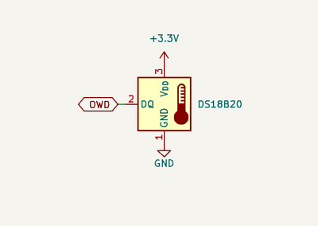
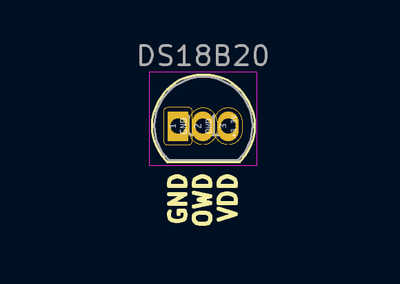

import BrowserWindow from '@site/src/components/BrowserWindow';

# DS18B20 1-Wire Temperature Sensor


import OldSiteWarning from '/old-site-warning.md'

<OldSiteWarning/>


  

An inexpensive and popular temperature sensor that uses the 1-Wire bus. Devices have a unique and many can share a single data wire. 

import FooterCart from '/_common/_footer/_footer-cart.md'

<FooterCart/>

## Connections

|Bus Pirate|DS18B20|Description|
|-|-|-|
|OWD|OWD/Q|1-Wire Data|
|Vout/Vref|VDD|3.3volt power supply|
|GND|GND|Ground|

## Setup

<BrowserWindow>
<span className="bp-prompt">HiZ></span> m<br/>
<br/>
<span className="bp-info">Mode selection</span><br/>
 1. <span className="bp-info">HiZ</span><br/>
 2. <span className="bp-info">1-WIRE</span><br/>
 3. <span className="bp-info">UART</span><br/>
 4. <span className="bp-info">I2C</span><br/>
 5. <span className="bp-info">SPI</span><br/>
 6. <span className="bp-info">LED</span><br/>
 x. <span className="bp-info">Exit</span><br/>
<span className="bp-prompt">Mode ></span> 2<br/>
<span className="bp-info">Mode:</span> 1-WIRE<br/>
<span className="bp-prompt">1-WIRE></span> W<br/>
<span className="bp-info">Power supply<br/>
Volts (0.80V-5.00V)</span><br/>
<span className="bp-prompt">x to exit (3.30) ></span> <br/>
<span className="bp-float">3.30</span>V<span className="bp-info"> requested, closest value: <span className="bp-float">3.30</span></span>V<br/>
Set current limit?
n<br/>
<span className="bp-info">Power supply:</span>Enabled<br/>
<span className="bp-info">
Vreg output: <span className="bp-float">3.3</span></span>V<span className="bp-info">, Vref/Vout pin: <span className="bp-float">3.3</span></span>V<span className="bp-info">, Current sense: <span className="bp-float">4.3</span></span>mA<span className="bp-info"><br/>
</span><br/>
<span className="bp-prompt">1-WIRE></span> P<br/>
<span className="bp-info">Pull-up resistors:</span> Enabled (10K ohms @ <span className="bp-float">3.2</span>V)<br/>
<span className="bp-prompt">1-WIRE></span>
</BrowserWindow>

- Use the ```m``` mode command and select **1-Wire**
- Enable the onboard power supply with the ```W``` command, and configure it for **3.3volts** output.
- Enable the onboard pull-up resistors with the ```P``` command.

## Search for 1-Wire devices

<BrowserWindow>
<span className="bp-prompt">1-WIRE></span> (1)<br/>
1-Wire ROM search:<br/>
1: 28 5c aa 13 0a 00 00 19 (DS18B20 digital thermometer)<br/>
<span className="bp-prompt">1-WIRE></span> <br/>
</BrowserWindow>

1-Wire devices have a unique 64bit ID that includes a family code for identifying the device. 1-Wire macro ```(1)``` searches for all 1-Wire devices currently connected.

## Configure

|BIT 7| BIT 6| BIT 5| BIT 4| BIT 3| BIT 2| BIT 1| BIT 0|
|-|-|-|-|-|-|-|-|
|0|R1|R0|1| 1| 1| 1| 1|

|R1|R0|RESOLUTION (bits)|CONVERSION TIME|
|---|---|---|---|
|0|0|9|93.75ms (tCONV/8)|
|0|1|10|187.5ms (tCONV/4)|
|1|0|11|375ms (tCONV/2)|
|1|1|12|750ms (tCONV)|

First, we need to configure the DS18B20. 
- Bits 5 and 6 of the configuration register set the temperature measurement resolution. 
- Higher resolution measurements take longer.
- The other bits are used internally and should be set to the default values shown.

<BrowserWindow>
<span className="bp-prompt">1-WIRE></span> [ 0xcc 0x4e 0x00 0x00 0b01111111<br/>
<br/>
1-Wire RESET<br/>
<span className="bp-info">TX:</span> 0x<span className="bp-float">CC</span> 0x<span className="bp-float">4E</span> 0x<span className="bp-float">00</span> 0x<span className="bp-float">00</span> 0b0111<span className="bp-float">1111</span> <br/>
<span className="bp-prompt">1-WIRE></span>
</BrowserWindow>

1-Wire devices can be addressed individually by their unique ID number. This is kind of tedious. The ```0xCC``` skip ROM command can be used to address all devices without entering the ID. This is useful for configuring multiple devices at once, or triggering temperature measurement  on multiple devices. 

**However**, using the skip ROM command to read (e.g. temperature) when multiple devices are connected will result in garbage data. This walk through uses the skip ROM command for all operations and assumes a single device is connected.

- 1-Wire transactions begin with a reset, during which connected devices pull low to indicate presence. ```[``` issues a 1-Wire reset and detects the device presence.
- ```0xcc``` is the 1-Wire skip ROM command. This accesses all connected devices without using the unique ID.
- ```0x4e``` is the DS18B20 write "scratchpad" command. Scratchpad is the annoying 1-Wire way of saying configuration registers.
- ```0x00 0x00``` the next two bytes program the high temperature alarm level. When a temperature measurement is triggered the DS18B20 will generate an alarm if the value is greater than this number. Useful in conjunction with the alarm search command on very large networks, but we just set it to 0 for this demo.
- ```0b01111111``` Bits 5 and 6 of the configuration register set the measurement resolution. We've set them to 1 for 12 bit measurements. The other bits are reserved and set according to the defaults in the table above.

:::tip
Skip ROM is useful for writing data to multiple devices, but will result in garbage data if used to read data and more than one device is connected.
:::

## Measure temperature

<BrowserWindow>
<span className="bp-prompt">1-WIRE></span> [ 0xcc 0x44 D:800<br/>
<br/>
1-Wire RESET<br/>
<span className="bp-info">TX:</span> 0x<span className="bp-float">CC</span> 0x<span className="bp-float">44</span> <br/>
<span className="bp-info">Delay:</span> <span className="bp-float">800</span>ms<br/>
<span className="bp-prompt">1-WIRE></span> [ 0xcc 0xbe r:9<br/>
</BrowserWindow>

Now it's time to trigger a temperature measurement.
- ```[``` 1-Wire transactions begin with a 1-Wire reset and device presence detection.
- ```0xcc``` is the 1-Wire skip ROM command, which addresses all devices without using their unique ID.
- ```0x44``` is the DS18B20 "convert T" command, which is the annoying 1-Wire way to say measure temperature.
- ```D:800``` temperature measurements take time, depending on the resolution up to 750ms. We'll delay 800ms to be safe. The delay probably isn't needed if you enter each line one by one, but if every step is done on a single line then the measurement won't be ready without the delay.

## Read temperature
<BrowserWindow>
<span className="bp-prompt">1-WIRE></span> [ 0xcc 0xbe r:9<br/>
<br/>
1-Wire RESET<br/>
<span className="bp-info">TX:</span> 0x<span className="bp-float">CC</span> 0x<span className="bp-float">BE</span> <br/>
<span className="bp-info">RX:</span> 0x<span className="bp-float">1D</span> 0x<span className="bp-float">01</span> 0x<span className="bp-float">00</span> 0x<span className="bp-float">00</span> 0x<span className="bp-float">7F</span> 0x<span className="bp-float">FF</span> 0x<span className="bp-float">03</span> 0x<span className="bp-float">10</span> <br/>
    0x<span className="bp-float">3D</span> <br/>
<span className="bp-prompt">1-WIRE></span> <br/>
</BrowserWindow>

Finally, we can read out the temperature measurement.
- ```[``` begin with a 1-Wire reset and device presence check.
- ```0xcc``` send the 1-Wire skip ROM command. This step reads data back from the device, so if more than a single device is connected the read will be corrupted.
- ```0xbe``` is the DS18B20 read data command.
- ```r:9``` read 9 bytes of data from the DS18B20. 

The first two bytes are the temperature value (0x1d 0x01). The next two bytes are the high temperature alarm we set during configuration (0x00 0x00). Next is the configuration register showing 12 bit measurements (0x7F). The next three bytes are reserved, and the final byte is a CRC for error detection.

### Calculate temperature

<BrowserWindow>
<span className="bp-prompt">1-WIRE></span>= 0x011d<br/>
 =0x011D.16 =285.16 =0b0000000100011101.16<br/>
<span className="bp-prompt">1-WIRE></span>
</BrowserWindow>

The two bytes of temperature data are the low (0x1d) and high (0x01) bits of the 12bit temperature measurement.
- Combine the temperature bytes into a single number (0x011d).
- Use the ```=``` convert format command to find the decimal equivalent of this hex value (285).
- Divide the value by 16 to find the temperature (17.8125 degrees).

## All in one line

<BrowserWindow>
<span className="bp-prompt">1-WIRE></span> [ 0xcc 0x43 e 0x00 0x00 0x7f [ 0xcc 0x44 D:800 [0xcc 0xbe r:9<br/>
<br/>
1-Wire RESET<br/>
<span className="bp-info">TX:</span> 0x<span className="bp-float">CC</span> 0x<span className="bp-float">4E</span> 0x<span className="bp-float">00</span> 0x<span className="bp-float">00</span> 0x<span className="bp-float">7F</span> <br/>
1-Wire RESET<br/>
<span className="bp-info">TX:</span> 0x<span className="bp-float">CC</span> 0x<span className="bp-float">44</span> <br/>
<span className="bp-info">Delay:</span> <span className="bp-float">800</span>ms<br/>
1-Wire RESET<br/>
<span className="bp-info">TX:</span> 0x<span className="bp-float">CC</span> 0x<span className="bp-float">BE</span> <br/>
<span className="bp-info">RX:</span> 0x<span className="bp-float">1D</span> 0x<span className="bp-float">01</span> 0x<span className="bp-float">00</span> 0x<span className="bp-float">00</span> 0x<span className="bp-float">7F</span> 0x<span className="bp-float">FF</span> 0x<span className="bp-float">03</span> 0x<span className="bp-float">10</span> <br/>
    0x<span className="bp-float">3D</span> <br/>
<span className="bp-prompt">1-WIRE></span> <br/>
</BrowserWindow>

All three steps can be done with a single line. The delay is key here. Without a delay, the temperature measurement will still be in progress when we try to read from the device.

## Macro

<BrowserWindow>
<span className="bp-prompt">1-WIRE></span> (2)<br/>
RX: 1d 01 00 00 7f ff 03 10 3d<br/>
Temperature: 17.812<br/>
<span className="bp-prompt">1-WIRE></span> 
</BrowserWindow>

Macro ```(2)``` in 1-Wire mode configures a DS18B20 and performs a temperature measurement.

## Get Bus Pirate 5
import FooterGet from '../../_common/_footer/_footer-get.md'

<FooterGet/>

### Community
import FooterCommunity from '../../_common/_footer/_footer-community.md'

<FooterCommunity/>