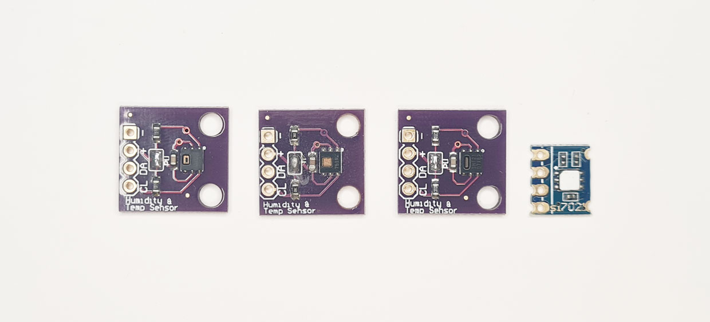
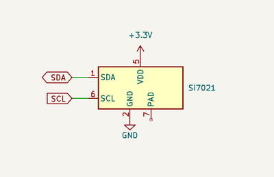
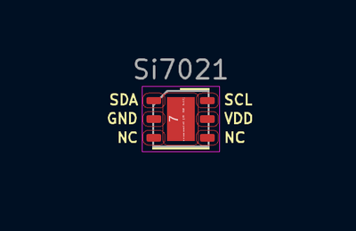

import BrowserWindow from '@site/src/components/BrowserWindow';

# SI7021, HTU21, SHT21, HDC1080 Temperature and Humidity Sensor



SI7021, HTU21, SHT21 and HDC1080 are nearly identical I2C temperature (-10 to 85C) and humidity (0-80%) sensors.

import FooterCart from '/_common/_footer/_footer-cart.md'

<FooterCart/>

## Connections

 

|Bus Pirate|SHT21|Description|
|-|-|-|
|SDA|SDA|I2C Data|
|SCL|SCL|I2C Clock|
|Vout/Vref|VDD|3.3volt power supply|
|GND|GND|Ground|

## Setup

<BrowserWindow>
<span className="bp-prompt">HiZ></span> m<br/>
<br/>
<span className="bp-info">Mode selection</span><br/>
 1. <span className="bp-info">HiZ</span><br/>
 2. <span className="bp-info">1-WIRE</span><br/>
 3. <span className="bp-info">UART</span><br/>
 4. <span className="bp-info">I2C</span><br/>
 5. <span className="bp-info">SPI</span><br/>
 6. <span className="bp-info">LED</span><br/>
 x. <span className="bp-info">Exit</span><br/>
<span className="bp-prompt">Mode ></span> 4<br/>
<br/>
<span className="bp-info">I2C speed</span><br/>
 1KHz to 1000KHz<br/>
 x. <span className="bp-info">Exit</span><br/>
<span className="bp-prompt">KHz (</span>400KHz*<span className="bp-prompt">) ></span> <br/>
<span className="bp-info">Data bits</span><br/>
 1. <span className="bp-info">8*</span><br/>
 2. <span className="bp-info">10</span><br/>
 x. <span className="bp-info">Exit</span><br/>
<span className="bp-prompt">Bits (</span>1<span className="bp-prompt">) ></span> <br/>
<span className="bp-info">Mode:</span> I2C<br/><br/>
<span className="bp-prompt">I2C></span> W<br/>
<span className="bp-info">Power supply<br/>
Volts (0.80V-5.00V)</span><br/>
<span className="bp-prompt">x to exit (3.30) ></span> <br/>
<span className="bp-float">3.30</span>V<span className="bp-info"> requested, closest value: <span className="bp-float">3.30</span></span>V<br/>
Set current limit?<br/>
n<br/>
<br/>
<span className="bp-info">Power supply:</span>Enabled<br/>
<span className="bp-info"><br/>
Vreg output: <span className="bp-float">3.3</span></span>V<span className="bp-info">, Vref/Vout pin: <span className="bp-float">3.3</span></span>V<span className="bp-info">, Current sense: <span className="bp-float">4.3</span></span>mA<span className="bp-info"><br/>
</span><br/>
<span className="bp-prompt">I2C></span> P<br/>
<span className="bp-info">Pull-up resistors:</span> Enabled (10K ohms @ <span className="bp-float">3.3</span>V)<br/>
<span className="bp-prompt">I2C></span> <br/>
</BrowserWindow>

- Use the ```m``` mode command and select **I2C**
- Configure I2C for **400kHz** and **8bits** of data
- Enable the onboard power supply with the ```W``` command, and configure it for **3.3volts** output. Optionally select a current limit of at least **50mA**.
- Enable the onboard pull-up resistors with the ```P``` command.

## Measure humidity

<BrowserWindow>
<span className="bp-prompt">I2C></span> [0x80 0xf5] D:23 [0x81 r:2]<br/>
<br/>
I2C START<br/>
<span className="bp-info">TX:</span> 0x<span className="bp-float">80</span> ACK 0x<span className="bp-float">F5</span> ACK <br/>
I2C STOP<br/>
<span className="bp-info">Delay:</span> <span className="bp-float">23</span>ms<br/>
I2C START<br/>
<span className="bp-info">TX:</span> 0x<span className="bp-float">81</span> ACK <br/>
<span className="bp-info">RX:</span> 0x<span className="bp-float">AA</span> ACK 0x<span className="bp-float">02</span> NACK <br/>
I2C STOP<br/>
</BrowserWindow>

### Start a measurement

- The SI7021 I2C address is 0x80 (write) and 0x81 (read).
- Command 0xf5 triggers a humidity and temperature measurement
- The full I2C command begins with I2C START ```[```, the device write address ```0x80```, the begin measurement command ```0xf5``` and ends with I2C STOP ```]``` 

### Delay

- It takes up to 23ms to complete a humidity and temperature measurement. 
- The SI7021 will not acknowledge its read or write address while the measurement is in progress. In software we can use this feature to repeatedly poll the device until the measurement is complete.
- For this demo we'll just delay for 23ms ```D:23``` before attempting to read.

### Read measurement

- After a 23ms delay a measurement is ready to read. 
- Send an I2C START ```[```, the device read address ```0x81```, read two bytes ```r:2```, end with an I2C Stop ```]```.
- Our sensor returned 0xaa 0x02.

### Convert to humidity

<BrowserWindow>
<span className="bp-prompt">I2C></span> = 0xaa02<br/>
 =0x<span className="bp-float">AA</span>02.16 =43522.16 =0b<span className="bp-float">1010</span>1010<span className="bp-float">0000</span>0010.16<br/>
<span className="bp-prompt">I2C></span> <br/>
</BrowserWindow>

- The two bytes can now be converted into a humidity measurement. 
- Use the ```=``` convert number format command to find the decimal equivalent of 0xaa02 for easier calculation (43522).

> %RH= ((125 \* value)/65536)-6  
 %RH= ((125 \* 43522)/65536)-6  
 %RH= 77.01%

- Percent humidity is calculated using the formula above.

## Measure temperature

<BrowserWindow>
<span className="bp-prompt">I2C></span> [0x80 0xe0] [0x81 r:2]<br/>
<br/>
I2C START<br/>
<span className="bp-info">TX:</span> 0x<span className="bp-float">80</span> ACK 0x<span className="bp-float">E0</span> ACK <br/>
I2C STOP<br/>
I2C START<br/>
<span className="bp-info">TX:</span> 0x<span className="bp-float">81</span> ACK <br/>
<span className="bp-info">RX:</span> 0x<span className="bp-float">5E</span> ACK 0x<span className="bp-float">D4</span> NACK <br/>
I2C STOP<br/>
<span className="bp-prompt">I2C></span>
</BrowserWindow>

- A temperature measurement is also taken during the humidity measurement.
- To retrieve the temperature measurement send command ```0xe0``` to the write address: ```[0x80 0xe0]``` 
- Now grab two bytes from the read address: ```[0x81 r:2]```
- The temperature value is 0x53 0xd4.

### Convert to temperature

<BrowserWindow>
<span className="bp-prompt">I2C></span> = 0x5ed4<br/>
 =0x<span className="bp-float">5E</span>D4.16 =24276.16 =0b<span className="bp-float">0101</span>1110<span className="bp-float">1101</span>0100.16<br/>
<span className="bp-prompt">I2C></span> <br/>
</BrowserWindow>

- Use the ```=``` convert number format command to find the decimal equivalent of 0x5ed4 for easier calculation (24276).

> Temp C = ((175.72 \* value)/65536)-46.85  
Temp C = ((175.72 \* 24276)/65536)-46.85  
Temp C = 18.24 C

- Temperature is calculated using the formula above.

## Read serial number

<BrowserWindow>
<span className="bp-prompt">I2C></span> <br/>
<span className="bp-prompt">I2C></span> [0x80 0xfa 0xf0] [0x81 r:4]<br/>
<br/>
I2C START<br/>
<span className="bp-info">TX:</span> 0x<span className="bp-float">80</span> ACK 0x<span className="bp-float">FA</span> ACK 0x<span className="bp-float">F0</span> ACK <br/>
I2C STOP<br/>
I2C START<br/>
<span className="bp-info">TX:</span> 0x<span className="bp-float">81</span> ACK <br/>
<span className="bp-info">RX:</span> 0x<span className="bp-float">00</span> ACK 0x<span className="bp-float">00</span> ACK 0x<span className="bp-float">00</span> ACK 0x<span className="bp-float">00</span> NACK <br/>
I2C STOP<br/>
</BrowserWindow>

- Each chip has a unique 8 byte serial number.
- Write command ```0xfa 0xf0``` to retrieve the first four bytes: ```[0x80 0xfa 0xf0] [0x81 r:4]```
- 0x00 0x00 0x00 0x00 are the first four bytes of the serial number.

<BrowserWindow>

<span className="bp-prompt">I2C></span> [0x80 0xfc 0xc9] [0x81 r:4]<br/>
<br/>
I2C START<br/>
<span className="bp-info">TX:</span> 0x<span className="bp-float">80</span> ACK 0x<span className="bp-float">FC</span> ACK 0x<span className="bp-float">C9</span> ACK <br/>
I2C STOP<br/>
I2C START<br/>
<span className="bp-info">TX:</span> 0x<span className="bp-float">81</span> ACK <br/>
<span className="bp-info">RX:</span> 0x<span className="bp-float">15</span> ACK 0x<span className="bp-float">FF</span> ACK 0x<span className="bp-float">B5</span> ACK 0x<span className="bp-float">FF</span> NACK <br/>
I2C STOP<br/>
<span className="bp-prompt">I2C></span>
</BrowserWindow>

- Write command ```0xfc 0xc9``` to retrieve the second four bytes: ```[0x80 0xfc 0xc9] [0x81 r:4]```
- The complete serial number of this chip is 0x0000000015ffb5ff.

## Read firmware version

<BrowserWindow>
<span className="bp-prompt">I2C></span> [0x80 0x84 0xb8] [0x81 r]<br/>
<br/>
I2C START<br/>
<span className="bp-info">TX:</span> 0x<span className="bp-float">80</span> ACK 0x<span className="bp-float">84</span> ACK 0x<span className="bp-float">B8</span> ACK <br/>
I2C STOP<br/>
I2C START<br/>
<span className="bp-info">TX:</span> 0x<span className="bp-float">81</span> ACK <br/>
<span className="bp-info">RX:</span> 0x<span className="bp-float">20</span> NACK <br/>
I2C STOP<br/>
<span className="bp-prompt">I2C></span> <br/>
</BrowserWindow>

- A single byte indicates the sensor firmware version
- Write command ```0x84 0xb8``` and then read one byte: ```[0x80 0x84 0xb8] [0x81 r]```

|Value|Version|
|-|-|
|0xFF|1.0|
|0x20|2.0|

- This chip has firmware version 2.0

## Macro

<BrowserWindow>
<span className="bp-prompt">I2C></span> (2)<br/>
SI7021/HTU21/SHT21/HDC1080<br/>
Humidity:<br/>
&nbsp; [0x80 0xf5] D:23 [0x81 r:2]<br/>
&nbsp; 72.24% (0xa0 0x3a)<br/>
Temperature:<br/>
&nbsp; [0x80 0xe0] [0x81 r:2]<br/>
&nbsp; 21.46C (0x63 0x84)<br/>
Serial Number:<br/>
&nbsp; [0x80 0xfa 0xf0] [0x81 r:4] [0x80 0xfc 0xc9] [0x81 r:4]<br/>
&nbsp; 0x0000000015ffb5ff<br/>
Firmware Version:<br/>
&nbsp; [0x80 0x84 0xb8] [0x81 r]<br/>
&nbsp; 0x20<br/>
<span className="bp-prompt">I2C></span> <br/>
</BrowserWindow>

Macro ```(2)``` in I2C mode automates the commands on this page. 

## Get Bus Pirate 5
import FooterGet from '../../_common/_footer/_footer-get.md'

<FooterGet/>

### Community
import FooterCommunity from '../../_common/_footer/_footer-community.md'

<FooterCommunity/>