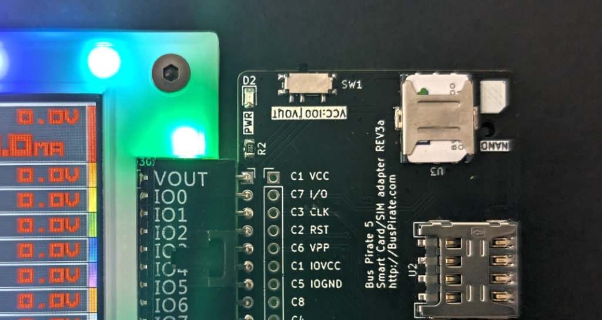
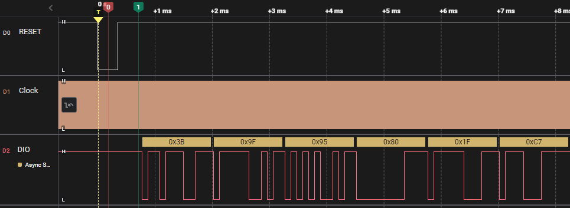
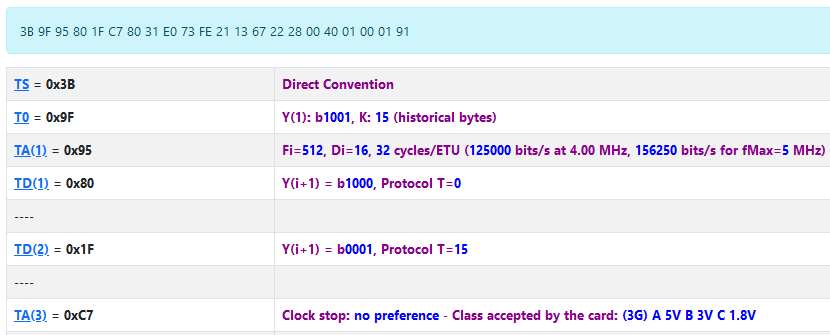
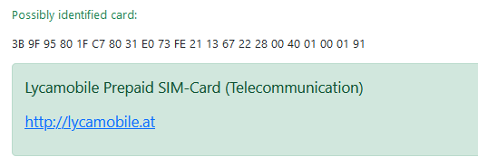
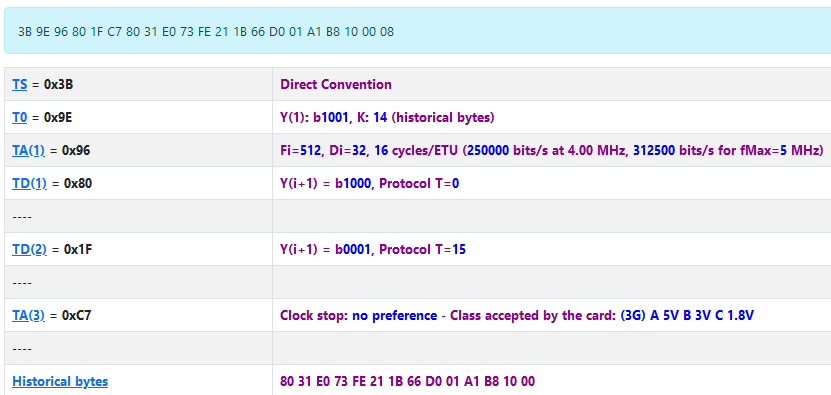
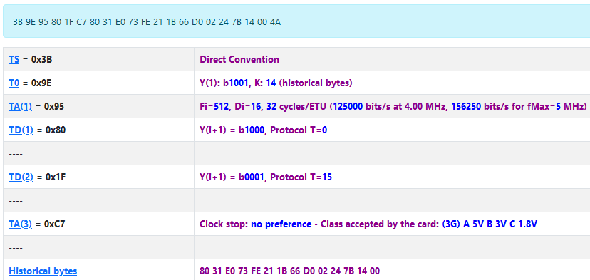
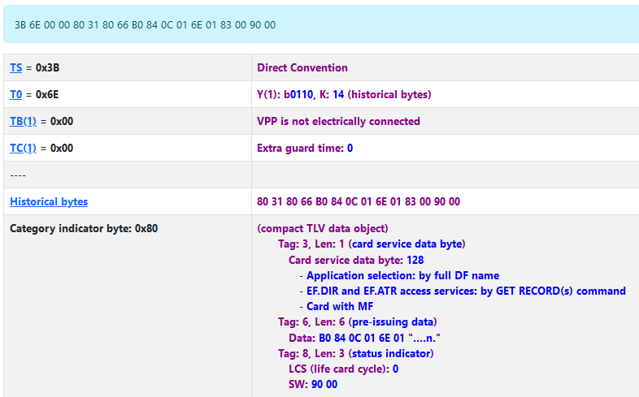
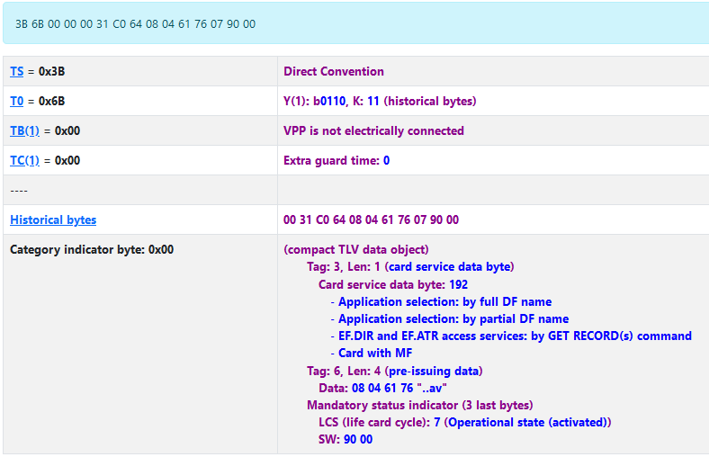

import BrowserWindow from '@site/src/components/BrowserWindow';

# Mobile SIMs & Bank IC Cards



Mobile phone SIM cards and most bank IC cards will output some useful information in response to an Answer To Reset command. The Bus Pirate can interact with these cards in [Half-Duplex UART mode](/command-reference/half-duplex-uart-protocol).

:::info
Mobile phone SIMs and bank IC cards are usually based on "Java Cards" that are specially programmed and have advanced cryptographic features to keep data secure. We're evaluating blank, programmable cards for future tutorials.
:::

import FooterCart from '/_common/_footer/_footer-cart.md'

<FooterCart/>

## Connections


Common IC cards usually follow the [ISO 7816-3 standard](https://en.wikipedia.org/wiki/ISO/IEC_7816) and have the same pinout and contact shape. [Image source](https://commons.wikimedia.org/wiki/File:SmartCardPinout.svg).

|Bus Pirate|24C02|Description|
|-|-|-|
|IO0/RXTX|C7 - I/O|Bidirectional half-duplex UART|
|IO1/PWM|C3 - CLK|Continuous clock signal from PWM|
|IO2|C2 - RST|Reset signal|
|Vout|C1 - VCC|3.3volt power supply|
|GND|C5 - GND|Ground|

Connect the Bus Pirate to the SIM as shown in the table above. 

### Smart IC Card and SIM card adapter


It's possible to gently solder wires on to each pad of the chip, but SIM and smart card sockets are useful if you don't want to destroy the card.

:::tip
A [smart IC card and SIM card adapter](/overview/sim-iccard-adapter) is available for Bus Pirate 5 with the correct connections already set. The adapter accepts most ISO 7816-3 smart cards and mini/micro/nano SIM cards. 
::: 

## Setup

<BrowserWindow>
<span className="bp-prompt">HiZ></span> m<br/>
<br/>
<span className="bp-info">Mode selection</span><br/>
 1. <span className="bp-info">HiZ</span><br/>
...<br/>
 4. <span className="bp-info">HDPLXUART</span><br/>
...<br/>
 x. <span className="bp-info">Exit</span><br/>
<span className="bp-prompt">Mode ></span> 4<br/>
<br/>
<span className="bp-info">UART speed</span><br/>
 1200, 2400, 4800, 9600, 19200, 38400, 57600, 115200 etc<br/>
 x. <span className="bp-info">Exit</span><br/>
<span className="bp-prompt">Baud (</span>115200*<span className="bp-prompt">) ></span> 9600<br/>
<span className="bp-info">Data bits</span><br/>
 5 to 8 bits<br/>
 x. <span className="bp-info">Exit</span><br/>
<span className="bp-prompt">Bits (</span>8*<span className="bp-prompt">) ></span> <br/>
<span className="bp-info">Parity</span><br/>
 1. <span className="bp-info">None*</span><br/>
 2. <span className="bp-info">Even</span><br/>
 3. <span className="bp-info">Odd</span><br/>
 x. <span className="bp-info">Exit</span><br/>
<span className="bp-prompt">Parity (</span>1<span className="bp-prompt">) ></span> 2<br/>
<span className="bp-info">Stop bits</span><br/>
 1. <span className="bp-info">1*</span><br/>
 2. <span className="bp-info">2</span><br/>
 x. <span className="bp-info">Exit</span><br/>
<span className="bp-prompt">Bits (</span>1<span className="bp-prompt">) ></span> 2<br/>
<span className="bp-info">Mode:</span> HDPLXUART<br/>
<span className="bp-prompt">HDPLXUART></span> <br/>
</BrowserWindow>

Mobile SIM cards and bank IC cards use a half-duplex UART interface, data travels both directions on a single wire. 
- Use the ```m``` mode command and select **HDPLXUART**
- Set the baud rate to **9600**
- Set the data bits to **8**
- Set the parity to **Even**
- Set the stop bits to **2**

<BrowserWindow>
<span className="bp-prompt">HDPLXUART></span> W 3.3<br/>
<span className="bp-float">3.30</span>V<span className="bp-info"> requested, closest value: <span className="bp-float">3.30</span></span>V<br/>
<span className="bp-info">Current limit:</span>Disabled<br/>
<br/>
<span className="bp-info">Power supply:</span>Enabled<br/>
<span className="bp-info">Vreg output: <span className="bp-float">3.3</span></span>V<span className="bp-info">, Vref/Vout pin: <span className="bp-float">3.2</span></span>V<span className="bp-info">, Current: <span className="bp-float">3.4</span></span>mA<span className="bp-info"><br/>
</span><br/>
<span className="bp-prompt">HDPLXUART></span> <br/>
</BrowserWindow>

Most SIM cards will work fine at 3.3volts.
- ```W 3.3``` - Enable the onboard power supply at 3.3 volts

:::danger
Most SIM cards will be okay with 3.3 volts, but some cards may use 2.5 or 1.8 volts. If the SIM or card is valuable, consider starting at a lower voltage and check the power requirements coded in the ATR response.
:::

<BrowserWindow>
<span className="bp-prompt">HDPLXUART></span> P<br/>
<span className="bp-info">Pull-up resistors:</span> Enabled (10K ohms @ <span className="bp-float">3.3</span>V)<br/>
<span className="bp-prompt">HDPLXUART></span> <br/>
</BrowserWindow>

Half-duplex UART is an open collector output bus. The Bus Pirate and the SIM can only pull the line low to 0 (ground). A pull-up resistor is needed to pull the line high to 1 (5 volts). The Bus Pirate has built-in pull-up resistors that can be enabled with the ```P``` command.
- ```P``` - Enable the onboard pull-up resistors.

:::caution 
Be sure to enable the pull-up resistors. The data line will never go high without them and you'll read only 0s.
:::

## Setup Clock
A continuous clock signal applied to C3/CLK drives the SIM's microcontroller. After processing commands, the SIM responds on the UART asynchronously at a baud rate determined by the clock frequency. 

> baud * 372 = clock frequency

372 clock ticks are needed for each bit at the selected baud rate.

> 9600 baud * 372 = 3.5712MHz

At 9600 baud the clock frequency should be 9600 * 372 =3.5712MHz.

<BrowserWindow>
<span className="bp-prompt">HDPLXUART></span> G <br/>
<span className="bp-info">Generate frequency</span><br/>
<span className="bp-info">Choose available pin:</span><br/>
 1. IO<span className="bp-float">1</span><br/>
...<br/>
 7. IO<span className="bp-float">7</span><br/>
 x. <span className="bp-info">Exit</span><br/>
<span className="bp-prompt"> ></span> 1<br/>
<span className="bp-prompt">Period or frequency (ns, us, ms, Hz, kHz or Mhz) ></span> 3.5712mhz<br/>
<span className="bp-info">Frequency:</span> <span className="bp-float">3.571</span>MHz = <span className="bp-float">3571200</span>Hz (<span className="bp-float">3.57</span>MHz)<br/>
<span className="bp-info">Period:</span> <span className="bp-float">280</span>ns (<span className="bp-float">280.02</span>ns)<br/>
<br/>
<span className="bp-info">Actual frequency:</span> <span className="bp-float">3571428</span>Hz (<span className="bp-float">3.57</span>MHz)<br/>
<span className="bp-info">Actual period:</span> <span className="bp-float">280</span>ns (<span className="bp-float">280.00</span>ns)<br/>
<br/>
<span className="bp-prompt">Duty cycle (%) ></span> 50%<br/>
<span className="bp-info">Duty cycle:</span> <span className="bp-float">50.00</span>% = <span className="bp-float">140</span>ns (<span className="bp-float">140.00</span>ns)<br/>
<span className="bp-info">Actual duty cycle:</span> <span className="bp-float">148</span>ns (<span className="bp-float">148.24</span>ns)<br/>
Divider: 16, Period: 34, Duty: 18<br/>
<br/>
<span className="bp-info">Generate frequency:</span> Enabled on IO<span className="bp-float">1</span><br/>
<br/>
<span className="bp-prompt">HDPLXUART></span>
</BrowserWindow>

The Bus Pirate PWM can generate a clock frequency on the IO1/CLK pin.
- ```G``` - Start a frequency generator
- **1** - Select IO1/CLK pin
- **3.5712mhz** - Set the output frequency
- **50%** - Set the duty cycle

:::tip
Don't forget to type the units (Hz, kHz, MHz) when setting the frequency, and % when setting the duty cycle.
:::

## Answer To Reset

:::info
SIM and bank IC cards use the asynchronous ATR standard. This is different than the synchronous ATR standard used by the [SLE4442 smart card](/devices/sle4442).
:::

### Open UART
<BrowserWindow>
<span className="bp-prompt">HDPLXUART></span> [<br/>
<br/>
UART OPEN (ASYNC READ)<br/>
<span className="bp-prompt">HDPLXUART></span> <br/>
</BrowserWindow>

First, ensure the UART is open and printing data values as they arrive.
- ```[``` - open UART for async data

### Send ATR and get response

<BrowserWindow>
<span className="bp-prompt">HDPLXUART></span> a 2; @ 2<br/>
IO<span className="bp-float">2<span className="bp-info"> set to</span></span> OUTPUT: <span className="bp-float">0</span><br/>
<br/>
IO<span className="bp-float">2<span className="bp-info"> set to</span></span> INPUT: <span className="bp-float">1</span><br/>
<br/>
<span className="bp-prompt">HDPLXUART></span> 0x3b 0x9f 0x95 0x80 0x1f 0xc7 0x80 0x31 0xe0 0x73 0xfe 0x21 0x13 0x67 0x22 0x28 0x00 0x40 0x01 0x00 0x01 0x91 <br/>
</BrowserWindow>


To perform the ATR command, pull the RESET pin low and then release it high.
- ```a 2``` - pull the reset pin low
- ```@ 2``` - make the reset pin input, allow the pull-up resistor to hold it high



The ATR reset (marker 0) is followed by the ATR response beginning at marker 1. The clock signal is continuous, at 372 clock cycles to send each bit it becomes sold orange.

>0x3b 0x9f 0x95 0x80 0x1f 0xc7 0x80 0x31 0xe0 0x73 0xfe 0x21 0x13 0x67 0x22 0x28 0x00 0x40 0x01 0x00 0x01 0x91 

The ATR response generally starts with 0x3b.
  
### Decode ATR

Answer To Reset (ATR) is a standard response from a smart card or IC card. It can be decoded with this handy database:
- [Smart Card ATR database](https://smartcard-atr.apdu.fr/parse?ATR=3B9F95801FC78031E073FE2113672228004001000191)



Decoding the ATR gives us several interesting pieces of info about this SIM:
- **TS=0x3B** - Direct Convention, normal SIM ATR response
- **fMax=5MHz** - maximum clock frequency is 5MHz
- **Class=A 5V B 3V C 1.8V** - the card can operate at 5 volts, 3 volts, or 1.8 volts



Based on a [database of ATR responses](http://ludovic.rousseau.free.fr/softwares/pcsc-tools/smartcard_list.txt), the website suggests this is a Lyca Mobile SIM from Austria. That's close enough, it's a free Dutch Lyca Mobile SIM from Amsterdam China Town.

## Hong Kong IMC SIM

<BrowserWindow>
<span className="bp-prompt">HDPLXUART></span> a 2; @ 2<br/>
IO<span className="bp-float">2<span className="bp-info"> set to</span></span> OUTPUT: <span className="bp-float">0</span><br/>
<br/>
IO<span className="bp-float">2<span className="bp-info"> set to</span></span> INPUT: <span className="bp-float">1</span><br/>
<br/>
<span className="bp-prompt">HDPLXUART></span>0x3b 0x9e 0x96 0x80 0x1f 0xc7 0x80 0x31 0xe0 0x73 0xfe 0x21 0x1b 0x66 0xd0 0x01 0xa1 0xb8 0x10 0x00 0x08
</BrowserWindow>



A cheap 4G travel SIM from IMG in Hong Kong.
- [ATR lookup](https://smartcard-atr.apdu.fr/parse?ATR=3B9E96801FC78031E073FE211B66D001A1B8100008)

## Hong Kong ValueGB SIM

<BrowserWindow>
<span className="bp-prompt">HDPLXUART></span> a 2; @ 2<br/>
IO<span className="bp-float">2<span className="bp-info"> set to</span></span> OUTPUT: <span className="bp-float">0</span><br/>
<br/>
IO<span className="bp-float">2<span className="bp-info"> set to</span></span> INPUT: <span className="bp-float">1</span><br/>
<br/>
<span className="bp-prompt">HDPLXUART></span>0x3b 0x9e 0x95 0x80 0x1f 0xc7 0x80 0x31 0xe0 0x73 0xfe 0x21 0x1b 0x66 0xd0 0x02 0x24 0x7b 0x14 0x00 0x4a
</BrowserWindow>



A cheap 4G travel SIM from ValueGB in Hong Kong.
- [ATR lookup](https://smartcard-atr.apdu.fr/parse?ATR=3B9E95801FC78031E073FE211B66D002247B14004A)

## EU Master Card

<BrowserWindow>
<span className="bp-prompt">HDPLXUART></span> a 2; @ 2<br/>
IO<span className="bp-float">2<span className="bp-info"> set to</span></span> OUTPUT: <span className="bp-float">0</span><br/>
<br/>
IO<span className="bp-float">2<span className="bp-info"> set to</span></span> INPUT: <span className="bp-float">1</span><br/>
<br/>
<span className="bp-prompt">HDPLXUART></span>0x3b 0x6e 0x00 0x00 0x80 0x31 0x80 0x66 0xb0 0x84 0x0c 0x01 0x6e 0x01 0x83 0x00 0x90 0x00
</BrowserWindow>



Bank card chips respond to the same ATR as mobile SIM cards. This is a Master Card from an EU bank.
- [ATR lookup](https://smartcard-atr.apdu.fr/parse?ATR=3B6E000080318066B0840C016E0183009000)

## US Visa Card

<BrowserWindow>
<span className="bp-prompt">HDPLXUART></span> a 2; @ 2<br/>
IO<span className="bp-float">2<span className="bp-info"> set to</span></span> OUTPUT: <span className="bp-float">0</span><br/>
<br/>
IO<span className="bp-float">2<span className="bp-info"> set to</span></span> INPUT: <span className="bp-float">1</span><br/>
<br/>
<span className="bp-prompt">HDPLXUART></span>
0x3b 0x6f 0x00 0x00 0x80 0x31 0xe0 0x6b 0x08 0x24 0x05 0x02 0xb5 0x55 0x55 0x55 0x55 0x55 0x55
</BrowserWindow>


A Visa debit card from a US transit system.
- [ATR lookup](https://smartcard-atr.apdu.fr/parse?ATR=3B6F00008031E06B08240502B5555555555555)

## Hong Kong Union Pay Card
<BrowserWindow>
<span className="bp-prompt">HDPLXUART></span> a 2; @ 2<br/>
IO<span className="bp-float">2<span className="bp-info"> set to</span></span> OUTPUT: <span className="bp-float">0</span><br/>
<br/>
IO<span className="bp-float">2<span className="bp-info"> set to</span></span> INPUT: <span className="bp-float">1</span><br/>
<br/>
<span className="bp-prompt">HDPLXUART></span>
0x3b 0x6b 0x00 0x00 0x00 0x31 0xc0 0x64 0x08 0x04 0x61 0x76 0x07 0x90 0x00
</BrowserWindow>



Hong Kong Union Pay debit card.
- [ATR lookup](https://smartcard-atr.apdu.fr/parse?ATR=3B6B00000031C06408046176079000)

## Blank Java Cards

:::info
We're secured a few different "blank" and diagnostic Java cards for further tests. You can find something similar on your favorite China export website. Stay tuned. 
:::

## Accessing SIM Data 

Information, such as a phone book and recent calls, may be stored on mobile SIMs. It appears to be stored in a basic file system. This [university thesis](https://is.muni.cz/th/324546/fi_b/text.pdf) has a straight forward and thorough explanation.

A utility like [pySim](https://forum.buspirate.com/t/sle4442-smart-card-adapter-kf-011c/204/107?u=ian) can be used with the Bus Pirate to navigate the contents of a mobile SIM.


## Get Bus Pirate 5
import FooterGet from '../../_common/_footer/_footer-get.md'

<FooterGet/>

### Community
import FooterCommunity from '../../_common/_footer/_footer-community.md'

<FooterCommunity/>
