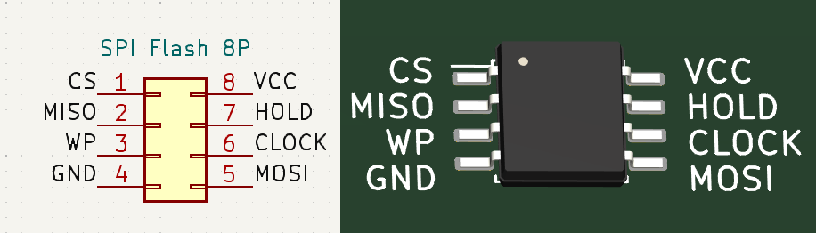
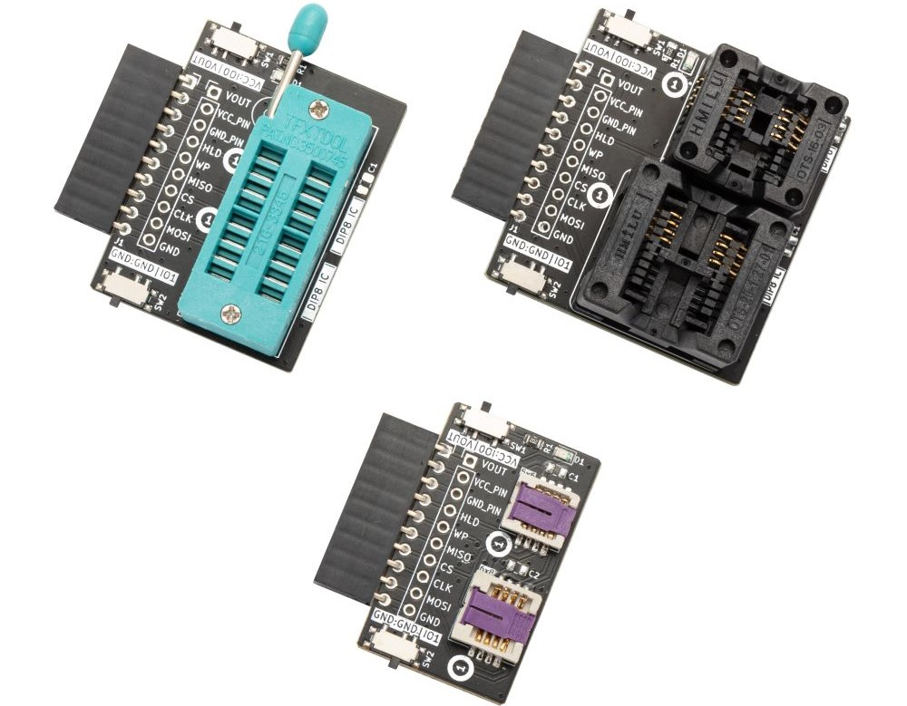

import BrowserWindow from '@site/src/components/BrowserWindow';

# SPI flash chips



Eight pin SPI flash chips are a cheap and easy way to add storage to your project. They're available in sizes from 1MB to 128MB, and can be used to store data, firmware, or even a filesystem. They're commonly found on PC motherboards for storing BIOS, FPGAs for storing bitstreams, and even the Bus Pirate for storing the firmware.

import FooterCart from '/_common/_footer/_footer-cart.md'

<FooterCart/>

## Connections

|Bus Pirate|SPI Flash|Description|
|-|-|-|
|CS/IO5|CS|Chip select|
|MISO/IO4|DO|MISO Controller Data In|
|MOSI/IO7|DI|MOSI Controller Data Out|
|CLK/IO6|CLK|SPI Clock|
|WP/IO3|WP|Write Protect|
|HOLD/IO2|HOLD|Hold|
|Vout|VCC|3.3volt power supply|
|GND|GND|Ground|

Connect the Bus Pirate to the SPI flash chip as shown in the table above. Don't forget the the write protect (WP) and hold pins, or the chip may not behave normally.  

### SPI Flash Adapters 



:::tip
SPI [flash adapters for SOP8, WSON8, and DIP8 chips](/overview/spi-flash-adapters) are available for Bus Pirate 5. Connect SPI flash chips to the Bus Pirate quickly and easily.
:::

## Setup

While some flash chips have an impressive top speed of 104MHz, it's unreliable at high speeds because of the length of the Bus Pirate cable and other factors. We're going to be very conservative and operate at:
- 3V3, 100kHz.
- Max current: 50ma.

<BrowserWindow>
<span className="bp-prompt">HiZ></span> m<br/>
<br/>
<span className="bp-info">Mode selection</span><br/>
 1. <span className="bp-info">HiZ</span><br/>
 2. <span className="bp-info">1-WIRE</span><br/>
 3. <span className="bp-info">UART</span><br/>
 4. <span className="bp-info">I2C</span><br/>
 5. <span className="bp-info">SPI</span><br/>
 6. <span className="bp-info">LED</span><br/>
 x. <span className="bp-info">Exit</span><br/>
<span className="bp-prompt">Mode ></span> 5<br/>
<br/>
<span className="bp-info">SPI speed</span><br/>
 1 to 62500KHz<br/>
 x. <span className="bp-info">Exit</span><br/>
<span className="bp-prompt">KHz (</span>100KHz*<span className="bp-prompt">) ></span> <br/>
<span className="bp-info">Data bits</span><br/>
 4 to 8 bits<br/>
 x. <span className="bp-info">Exit</span><br/>
<span className="bp-prompt">Bits (</span>8*<span className="bp-prompt">) ></span> <br/>
<span className="bp-info">Clock polarity</span><br/>
 1. <span className="bp-info">Idle LOW*</span><br/>
 2. <span className="bp-info">Idle HIGH</span><br/>
 x. <span className="bp-info">Exit</span><br/>
<span className="bp-prompt">Polarity (</span>1<span className="bp-prompt">) ></span> <br/>
<span className="bp-info">Clock phase</span><br/>
 1. <span className="bp-info">LEADING edge*</span><br/>
 2. <span className="bp-info">TRAILING edge</span><br/>
 x. <span className="bp-info">Exit</span><br/>
<span className="bp-prompt">Phase (</span>1<span className="bp-prompt">) ></span> <br/>
<span className="bp-info">Chip select</span><br/>
 1. <span className="bp-info">Active HIGH (CS)</span><br/>
 2. <span className="bp-info">Active LOW (/CS)*</span><br/>
 x. <span className="bp-info">Exit</span><br/>
<span className="bp-prompt">CS (</span>2<span className="bp-prompt">) ></span> <br/>
<span className="bp-info">Actual speed:</span> 122KHz<br/>
<span className="bp-info">Mode:</span> SPI<br/>
<span className="bp-prompt">SPI></span> W<br/>
<span className="bp-info">Power supply<br/>
Volts (0.80V-5.00V)</span><br/>
<span className="bp-prompt">x to exit (3.30) ></span> <br/>
<span className="bp-float">3.30</span>V<span className="bp-info"> requested, closest value: <span className="bp-float">3.30</span></span>V<br/>
Set current limit?<br/>
y<br/>
<br/>
<span className="bp-info">Maximum current (0mA-500mA)</span><br/>
<span className="bp-prompt">x to exit (100.00) ></span> 50<br/>
<span className="bp-float">50.0</span>mA<span className="bp-info"> requested, closest value: <span className="bp-float">50.0</span></span>mA<br/>
<br/>
<span className="bp-info">Power supply:</span>Enabled<br/>
<span className="bp-info"><br/>
Vreg output: <span className="bp-float">3.3</span></span>V<span className="bp-info">, Vref/Vout pin: <span className="bp-float">3.3</span></span>V<span className="bp-info">, Current sense: <span className="bp-float">5.8</span></span>mA<span className="bp-info"><br/>
</span><br/>
<span className="bp-prompt">SPI></span> 
</BrowserWindow>

- Use the ```m``` mode command and select **SPI**
- Configure SPI for **100kHz** and **8bits** of data, hit enter to accept the defaults
- Enable the onboard power supply with the ```W``` command, and configure it for **3.3volts** output. 
- Select a current limit of at least **50mA**.

<BrowserWindow>
<span className="bp-prompt">SPI></span> P<br/>
<span className="bp-info">Pull-up resistors:</span> Enabled (10K ohms @ <span className="bp-float">3.3</span>V)<br/>
<span className="bp-prompt">SPI></span> <br/>
</BrowserWindow>

Two ways to correctly hold the WP and HOLD pins high for normal chip operation:
- ```P``` - Enable pull-up resistors to hold the pins high 
- ```A 2; A 3``` - Use Auxiliary pin control to set IO2 and IO3 high 

## Identify the chip

SPI flash chip commands are loosely standardized on some historical trends, but each manufacturer tends to add their own extensions. 

:::info
We'll try to use the most common commands, but not all chips will respond to all commands!
:::

### Reset ID

<BrowserWindow>
<span className="bp-prompt">SPI></span> [0xb9] D:10 [0xab 0x00:3 r]<br/>
<br/>
CS Enabled<br/>
<span className="bp-info">TX:</span> 0x<span className="bp-float">B9</span> <br/>
<span className="bp-info">Delay:</span> 10ms<br/>
<span className="bp-info">TX:</span> 0x<span className="bp-float">AB</span> 0x<span className="bp-float">00</span> 0x<span className="bp-float">00</span> 0x<span className="bp-float">00</span> <br/>
<span className="bp-info">RX:</span> 0x<span className="bp-float">EF</span> <br/>
CS Disabled<br/>
<span className="bp-prompt">SPI></span>
</BrowserWindow>

The 'Reset ID' command ```0xAB``` is used to read the device ID of the flash chip immediately after reset. The command is followed by a single byte response.

- ```[0xb9]``` - Reset the SPI flash chip
- ```D:10``` - Delay 10ms
- ```[0xab 0x00:3 r]``` - Send the 'Reset ID' command ```0xAB``` followed by three byte dummy bytes ```0x00:3```. ```r``` to read a one byte response.

The response ```0x13``` is the device ID of the flash chip. There's no standard, and about the only way to find it is through datasheets. This is primarily a way for a device to determine which flash chip is present among several known variants.

### Read Electronic Manufacturer ID

<BrowserWindow>
<span className="bp-prompt">SPI></span> [0x90 0x00:3 r:2]<br/>
<br/>
CS Enabled<br/>
<span className="bp-info">TX:</span> 0x<span className="bp-float">90</span> 0x<span className="bp-float">00</span> 0x<span className="bp-float">00</span> 0x<span className="bp-float">00</span> <br/>
<span className="bp-info">RX:</span> 0x<span className="bp-float">13</span> 0x<span className="bp-float">EF</span> <br/>
CS Disabled<br/>
<span className="bp-prompt">SPI></span>
</BrowserWindow>

The 'Read Electronic Manufacturer ID' command ```0x90``` is used to read the device ID and manufacturer ID of the flash chip. The command is followed by a two byte response.

- ```[0x90 0x00:3 r:2]``` - Send the 'Read Electronic Manufacturer ID' command ```0x90``` followed by three byte dummy bytes ```0x00:3```. ```r:2``` to read a two byte response.

The response ```0x13``` is the device ID of the flash chip, same as the Reset ID command.

```0xEF``` is the manufacturer ID: Winbond. The manufacturer ID is a unique value assigned to each manufacturer - except they ran out of IDs and started duplicating ages ago so [it's not super useful](https://www.basicinputoutput.com/2023/11/jedec-manufacturer-ids-are-mess.html). [JEDEC maintains a list of IDs](https://www.jedec.org/document_search?search_api_views_fulltext=JEP106) (free but agreement required) that can help narrow it down somewhat.

### Read JEDEC ID

<BrowserWindow>
<span className="bp-prompt">SPI></span> [0x9F r:3]<br/>
<br/>
CS Enabled<br/>
<span className="bp-info">TX:</span> 0x<span className="bp-float">9F</span> <br/>
<span className="bp-info">RX:</span> 0x<span className="bp-float">EF</span> 0x<span className="bp-float">40</span> 0x<span className="bp-float">14</span> <br/>
CS Disabled<br/>
<span className="bp-prompt">SPI></span>
</BrowserWindow>

The 'Read JEDEC ID' command ```0x9F``` is used to read the manufacturer ID, memory type ID, and capacity ID of the flash chip. The command is followed by a three byte response.

- ```[0x9F r:3]``` - Send the 'Read JEDEC ID' command ```0x9F```. ```r:3``` to read a three byte response.

The manufacturer ID is 0xEF, the memory type ID is 0x40, and the capacity ID is 0x14. Manufactures use different systems to encode memory type and capacity ID for each chip. There is no universal standard for these values, and they can vary between manufacturers and even between different chips from the same manufacturer.

### Read SFDP tables 

<BrowserWindow>
<span className="bp-prompt">SPI></span> [0x5A 0x00:4 r:8]<br/>
<br/>
CS Enabled<br/>
<span className="bp-info">TX:</span> 0x<span className="bp-float">5A</span> 0x<span className="bp-float">00</span> 0x<span className="bp-float">00</span> 0x<span className="bp-float">00</span> <br/>
<span className="bp-info">RX:</span> 0x<span className="bp-float">50</span> 0x<span className="bp-float">44</span> 0x<span className="bp-float">46</span> 0x<span className="bp-float">53</span> 0x<span className="bp-float">05</span> 0x<span className="bp-float">01</span> 0x<span className="bp-float">00</span> 0x<span className="bp-float">FF</span> <br/>
</BrowserWindow>

We've tried three ID commands that don't give us a ton of useful information. The Serial Flash Discoverable Parameters (SFDP) tables are a newer standard that provides a lot more information about the flash chip.

- ```[0x5A 0x00:4 r:8]``` - Send the 'Read SFDP' command ```0x5A``` followed by four address bytes ```0x00:4```. ```r:8``` to read 8 bytes from address 0x00.

The read SFDP table command includes a 4 byte address where the chip will start reading inside the tables. If SFDP tables are present, the first 4 bytes will contain the signature 'SFDP'.

 |Byte|Value|Description|
    |---|---|---|
    |0|0x50|'P'|
    |1|0x44|'D'|
    |2|0x46|'F'|
    |3|0x53|'S'|
    |4|0x05|Minor revision number|
    |5|0x01|Major revision number|
    |6|0x00|Number of parameter headers (+1)|
    |7|0xFF|End of parameter headers|

The first four bytes here are the SFDP signature: 0x50 0x44 0x46 0x53. This is the ASCII representation of 'PDFS'. Values are stored in big-endian format, so reverse that to get `SFDP`.

:::tip
Use the Bus Pirate ```=``` command to convert numerical values to ASCII: ```= 0x50```
:::

The next byte is the minor revision number (0x05), followed by the major revision number (0x01). This is a JEDEC v1.5 SFDP table. The number of parameter headers byte (0x00) plus 1 = 1 available Headers. The table ends with 0xFF.

If we continue retrieving SFDP tables we can find useful information like the chip capacity, acceptable voltage range, and even commands for controlling the chip. Retrieving and decoding the full SFDP table is beyond the scope of this intro guide, but you can [see the full process step by step](https://forum.buspirate.com/t/spi-flash-goodness/200?u=ian) when we developed the ```flash``` read/write/erase command.

## Write 256 bytes

We will write 256 ASCII characters 'i' (0x69) at the memory address 0x00. Following this, we will read the content to verify that the bytes have been correctly written.

### Enable writes

<BrowserWindow>
<span className="bp-prompt">SPI></span> [0x06]<br/>
<br/>
CS Enabled<br/>
<span className="bp-info">TX:</span> 0x<span className="bp-float">06</span> <br/>
CS Disabled<br/>
<span className="bp-prompt">SPI></span> 
</BrowserWindow>

The 'Write Enable' command ```0x06``` must be sent before write and erase commands will be accepted. This prevents accidental erasures or overwrites of your valuable data. This command must be sent before any write, erase or configuration command.

- ```[``` - Start of SPI transaction. Lowers the CS pin to ground.
- ```0x06``` - Write Enable instruction.
- ```]``` - End of SPI transaction. Raises the CS pin to 3.3volts.

### Verify write enable
<BrowserWindow>
<span className="bp-prompt">SPI></span> [0x05 r:1]<br/>
<br/>
CS Enabled<br/>
<span className="bp-info">TX:</span> 0x<span className="bp-float">05</span> <br/>
<span className="bp-info">RX:</span> 0x<span className="bp-float">02</span> <br/>
CS Disabled<br/>
<span className="bp-prompt">SPI></span> 
</BrowserWindow>

|S7|S6|S5|S4|S3|S2|S1|S0|
|---|---|---|---|---|---|---|---|
|SRP0|SEC|TB|BP2|BP1|BP0|WEL|BUSY|

Read Status Register ```0x05``` is used to verify the 'Write Enable' instruction ```0x06``` was correctly received. 

- ```[``` - Start of SPI transaction. Lowers the CS pin to ground.
- ```0x05``` - Read Status Register instruction.
- ```r:1``` - Read 1 byte.
- ```]``` - End of SPI transaction. Raises the CS pin to 3.3volts.

Response ```0x02``` indicates that the write enable bit (S1) is set to 1 (0x02=0b00000010).  

### Erase sector
<BrowserWindow>
<span className="bp-prompt">SPI></span> [0x06]<br/>
<br/>
CS Enabled<br/>
<span className="bp-info">TX:</span> 0x<span className="bp-float">06</span> <br/>
CS Disabled<br/>
<span className="bp-prompt">SPI></span> [0x20 0x00 0x00 0x00]<br/>
<br/>
CS Enabled<br/>
<span className="bp-info">TX:</span> 0x<span className="bp-float">20</span> 0x<span className="bp-float">00</span> 0x<span className="bp-float">00</span> 0x<span className="bp-float">00</span> <br/>
CS Disabled<br/>
<span className="bp-prompt">SPI></span> 
</BrowserWindow>

Flash works by flipping 1s in the memory to 0. Writing a location twice will simply flip more bits from 1 to 0, but will not flip 0 to 1. The erase sector command ```0x20``` is used to flip all bits in a 4000 byte sector from 0 to 1, after which we can write new data. 

The erase sector command is followed by a three byte address of the location to begin erasing 4000 bytes. It's not possible to begin erasing just anywhere. The 4000 byte sectors are 'aligned' in bocks. The first sector begins at 0, the next at 4000, the next at 8000 and so on. We'll erase the first sector from 0 to 3999.

A write enable command must be sent before the erase sector command will be accepted. 

- ```[``` - Start of SPI transaction. Lowers the CS pin to ground.
- ```0x06``` - Write Enable instruction.
- ```]``` - End of SPI transaction. Raises the CS pin to 3.3volts.
- ```[``` - Start of SPI transaction. Lowers the CS pin to ground.
- ```0x20``` - Erase Sector instruction.
- ```0x00 0x00 0x00``` - Address 0x00.
- ```]``` - End of SPI transaction. Raises the CS pin to 3.3volts.

:::tip
Flash needs to be erased before it can be rewritten. Flash is erased in sectors, blocks or the entire chip. 
:::

### Verify erase sector

<BrowserWindow>
<span className="bp-prompt">SPI></span> [0x03 0x00 0x00 0x00 r:256]<br/>
<br/>
CS Enabled<br/>
<span className="bp-info">TX:</span> 0x<span className="bp-float">03</span> 0x<span className="bp-float">00</span> 0x<span className="bp-float">00</span> 0x<span className="bp-float">00</span> <br/>
<span className="bp-info">RX:</span> 0x<span className="bp-float">FF</span> 0x<span className="bp-float">FF</span> 0x<span className="bp-float">FF</span> 0x<span className="bp-float">FF</span> 0x<span className="bp-float">FF</span> 0x<span className="bp-float">FF</span> 0x<span className="bp-float">FF</span> 0x<span className="bp-float">FF</span> <br/>
    0x<span className="bp-float">FF</span> 0x<span className="bp-float">FF</span> 0x<span className="bp-float">FF</span> 0x<span className="bp-float">FF</span> 0x<span className="bp-float">FF</span> 0x<span className="bp-float">FF</span> 0x<span className="bp-float">FF</span> 0x<span className="bp-float">FF</span> <br/>
    0x<span className="bp-float">FF</span> 0x<span className="bp-float">FF</span> 0x<span className="bp-float">FF</span> 0x<span className="bp-float">FF</span> 0x<span className="bp-float">FF</span> 0x<span className="bp-float">FF</span> 0x<span className="bp-float">FF</span> 0x<span className="bp-float">FF</span> <br/>
    0x<span className="bp-float">FF</span> 0x<span className="bp-float">FF</span> 0x<span className="bp-float">FF</span> 0x<span className="bp-float">FF</span> 0x<span className="bp-float">FF</span> 0x<span className="bp-float">FF</span> 0x<span className="bp-float">FF</span> 0x<span className="bp-float">FF</span> <br/>
    0x<span className="bp-float">FF</span> 0x<span className="bp-float">FF</span> 0x<span className="bp-float">FF</span> 0x<span className="bp-float">FF</span> 0x<span className="bp-float">FF</span> 0x<span className="bp-float">FF</span> 0x<span className="bp-float">FF</span> 0x<span className="bp-float">FF</span> <br/>
    0x<span className="bp-float">FF</span> 0x<span className="bp-float">FF</span> 0x<span className="bp-float">FF</span> 0x<span className="bp-float">FF</span> 0x<span className="bp-float">FF</span> 0x<span className="bp-float">FF</span> 0x<span className="bp-float">FF</span> 0x<span className="bp-float">FF</span> <br/>
    0x<span className="bp-float">FF</span> 0x<span className="bp-float">FF</span> 0x<span className="bp-float">FF</span> 0x<span className="bp-float">FF</span> 0x<span className="bp-float">FF</span> 0x<span className="bp-float">FF</span> 0x<span className="bp-float">FF</span> 0x<span className="bp-float">FF</span> <br/>
    0x<span className="bp-float">FF</span> 0x<span className="bp-float">FF</span> 0x<span className="bp-float">FF</span> 0x<span className="bp-float">FF</span> 0x<span className="bp-float">FF</span> 0x<span className="bp-float">FF</span> 0x<span className="bp-float">FF</span> 0x<span className="bp-float">FF</span> <br/>
    0x<span className="bp-float">FF</span> 0x<span className="bp-float">FF</span> 0x<span className="bp-float">FF</span> 0x<span className="bp-float">FF</span> 0x<span className="bp-float">FF</span> 0x<span className="bp-float">FF</span> 0x<span className="bp-float">FF</span> 0x<span className="bp-float">FF</span> <br/>
    0x<span className="bp-float">FF</span> 0x<span className="bp-float">FF</span> 0x<span className="bp-float">FF</span> 0x<span className="bp-float">FF</span> 0x<span className="bp-float">FF</span> 0x<span className="bp-float">FF</span> 0x<span className="bp-float">FF</span> 0x<span className="bp-float">FF</span> <br/>
    0x<span className="bp-float">FF</span> 0x<span className="bp-float">FF</span> 0x<span className="bp-float">FF</span> 0x<span className="bp-float">FF</span> 0x<span className="bp-float">FF</span> 0x<span className="bp-float">FF</span> 0x<span className="bp-float">FF</span> 0x<span className="bp-float">FF</span> <br/>
    0x<span className="bp-float">FF</span> 0x<span className="bp-float">FF</span> 0x<span className="bp-float">FF</span> 0x<span className="bp-float">FF</span> 0x<span className="bp-float">FF</span> 0x<span className="bp-float">FF</span> 0x<span className="bp-float">FF</span> 0x<span className="bp-float">FF</span> <br/>
    0x<span className="bp-float">FF</span> 0x<span className="bp-float">FF</span> 0x<span className="bp-float">FF</span> 0x<span className="bp-float">FF</span> 0x<span className="bp-float">FF</span> 0x<span className="bp-float">FF</span> 0x<span className="bp-float">FF</span> 0x<span className="bp-float">FF</span> <br/>
    0x<span className="bp-float">FF</span> 0x<span className="bp-float">FF</span> 0x<span className="bp-float">FF</span> 0x<span className="bp-float">FF</span> 0x<span className="bp-float">FF</span> 0x<span className="bp-float">FF</span> 0x<span className="bp-float">FF</span> 0x<span className="bp-float">FF</span> <br/>
    0x<span className="bp-float">FF</span> 0x<span className="bp-float">FF</span> 0x<span className="bp-float">FF</span> 0x<span className="bp-float">FF</span> 0x<span className="bp-float">FF</span> 0x<span className="bp-float">FF</span> 0x<span className="bp-float">FF</span> 0x<span className="bp-float">FF</span> <br/>
    0x<span className="bp-float">FF</span> 0x<span className="bp-float">FF</span> 0x<span className="bp-float">FF</span> 0x<span className="bp-float">FF</span> 0x<span className="bp-float">FF</span> 0x<span className="bp-float">FF</span> 0x<span className="bp-float">FF</span> 0x<span className="bp-float">FF</span> <br/>
    0x<span className="bp-float">FF</span> 0x<span className="bp-float">FF</span> 0x<span className="bp-float">FF</span> 0x<span className="bp-float">FF</span> 0x<span className="bp-float">FF</span> 0x<span className="bp-float">FF</span> 0x<span className="bp-float">FF</span> 0x<span className="bp-float">FF</span> <br/>
    0x<span className="bp-float">FF</span> 0x<span className="bp-float">FF</span> 0x<span className="bp-float">FF</span> 0x<span className="bp-float">FF</span> 0x<span className="bp-float">FF</span> 0x<span className="bp-float">FF</span> 0x<span className="bp-float">FF</span> 0x<span className="bp-float">FF</span> <br/>
    0x<span className="bp-float">FF</span> 0x<span className="bp-float">FF</span> 0x<span className="bp-float">FF</span> 0x<span className="bp-float">FF</span> 0x<span className="bp-float">FF</span> 0x<span className="bp-float">FF</span> 0x<span className="bp-float">FF</span> 0x<span className="bp-float">FF</span> <br/>
    0x<span className="bp-float">FF</span> 0x<span className="bp-float">FF</span> 0x<span className="bp-float">FF</span> 0x<span className="bp-float">FF</span> 0x<span className="bp-float">FF</span> 0x<span className="bp-float">FF</span> 0x<span className="bp-float">FF</span> 0x<span className="bp-float">FF</span> <br/>
    0x<span className="bp-float">FF</span> 0x<span className="bp-float">FF</span> 0x<span className="bp-float">FF</span> 0x<span className="bp-float">FF</span> 0x<span className="bp-float">FF</span> 0x<span className="bp-float">FF</span> 0x<span className="bp-float">FF</span> 0x<span className="bp-float">FF</span> <br/>
    0x<span className="bp-float">FF</span> 0x<span className="bp-float">FF</span> 0x<span className="bp-float">FF</span> 0x<span className="bp-float">FF</span> 0x<span className="bp-float">FF</span> 0x<span className="bp-float">FF</span> 0x<span className="bp-float">FF</span> 0x<span className="bp-float">FF</span> <br/>
    0x<span className="bp-float">FF</span> 0x<span className="bp-float">FF</span> 0x<span className="bp-float">FF</span> 0x<span className="bp-float">FF</span> 0x<span className="bp-float">FF</span> 0x<span className="bp-float">FF</span> 0x<span className="bp-float">FF</span> 0x<span className="bp-float">FF</span> <br/>
    0x<span className="bp-float">FF</span> 0x<span className="bp-float">FF</span> 0x<span className="bp-float">FF</span> 0x<span className="bp-float">FF</span> 0x<span className="bp-float">FF</span> 0x<span className="bp-float">FF</span> 0x<span className="bp-float">FF</span> 0x<span className="bp-float">FF</span> <br/>
    0x<span className="bp-float">FF</span> 0x<span className="bp-float">FF</span> 0x<span className="bp-float">FF</span> 0x<span className="bp-float">FF</span> 0x<span className="bp-float">FF</span> 0x<span className="bp-float">FF</span> 0x<span className="bp-float">FF</span> 0x<span className="bp-float">FF</span> <br/>
    0x<span className="bp-float">FF</span> 0x<span className="bp-float">FF</span> 0x<span className="bp-float">FF</span> 0x<span className="bp-float">FF</span> 0x<span className="bp-float">FF</span> 0x<span className="bp-float">FF</span> 0x<span className="bp-float">FF</span> 0x<span className="bp-float">FF</span> <br/>
    0x<span className="bp-float">FF</span> 0x<span className="bp-float">FF</span> 0x<span className="bp-float">FF</span> 0x<span className="bp-float">FF</span> 0x<span className="bp-float">FF</span> 0x<span className="bp-float">FF</span> 0x<span className="bp-float">FF</span> 0x<span className="bp-float">FF</span> <br/>
    0x<span className="bp-float">FF</span> 0x<span className="bp-float">FF</span> 0x<span className="bp-float">FF</span> 0x<span className="bp-float">FF</span> 0x<span className="bp-float">FF</span> 0x<span className="bp-float">FF</span> 0x<span className="bp-float">FF</span> 0x<span className="bp-float">FF</span> <br/>
    0x<span className="bp-float">FF</span> 0x<span className="bp-float">FF</span> 0x<span className="bp-float">FF</span> 0x<span className="bp-float">FF</span> 0x<span className="bp-float">FF</span> 0x<span className="bp-float">FF</span> 0x<span className="bp-float">FF</span> 0x<span className="bp-float">FF</span> <br/>
    0x<span className="bp-float">FF</span> 0x<span className="bp-float">FF</span> 0x<span className="bp-float">FF</span> 0x<span className="bp-float">FF</span> 0x<span className="bp-float">FF</span> 0x<span className="bp-float">FF</span> 0x<span className="bp-float">FF</span> 0x<span className="bp-float">FF</span> <br/>
    0x<span className="bp-float">FF</span> 0x<span className="bp-float">FF</span> 0x<span className="bp-float">FF</span> 0x<span className="bp-float">FF</span> 0x<span className="bp-float">FF</span> 0x<span className="bp-float">FF</span> 0x<span className="bp-float">FF</span> 0x<span className="bp-float">FF</span> <br/>
    0x<span className="bp-float">FF</span> 0x<span className="bp-float">FF</span> 0x<span className="bp-float">FF</span> 0x<span className="bp-float">FF</span> 0x<span className="bp-float">FF</span> 0x<span className="bp-float">FF</span> 0x<span className="bp-float">FF</span> 0x<span className="bp-float">FF</span> <br/>
    <br/>
CS Disabled<br/>
<span className="bp-prompt">SPI></span> 
</BrowserWindow>

We'll use the read data command ```0x03``` to verify that the sector has been erased to all 1s (0xff). The command is followed by a three byte address of the location to begin reading 256 bytes. We'll read the first 256 bytes from address 0x00.

- ```[``` - Start of SPI transaction. Lowers the CS pin to ground.
- ```0x03``` - Read Data instruction.
- ```0x00 0x00 0x00``` - Address 0x00.
- ```r:256``` - Read 256 bytes.
- ```]``` - End of SPI transaction. Raises the CS pin to 3.3volts.

### Enable writes and verify

<BrowserWindow>
<span className="bp-prompt">SPI></span> [0x06]<br/>
<br/>
CS Enabled<br/>
<span className="bp-info">TX:</span> 0x<span className="bp-float">06</span> <br/>
CS Disabled<br/>
<span className="bp-prompt">SPI></span> [0x05 r:1]<br/>
<br/>
CS Enabled<br/>
<span className="bp-info">TX:</span> 0x<span className="bp-float">05</span> <br/>
<span className="bp-info">RX:</span> 0x<span className="bp-float">02</span> <br/>
<span className="bp-prompt">SPI></span><br/>
CS Disabled<br/>
</BrowserWindow>

Use the write enable command ```0x06``` to enable writes. Verify the write enable bit is set to 1 (0x02=0b00000010) using the read status register command ```0x05```.

### Write data

<BrowserWindow>
<span className="bp-prompt">SPI></span> [0x02 0x00 0x00 0x00 0x69:256]<br/>
<br/>
CS Enabled<br/>
<span className="bp-info">TX:</span> 0x<span className="bp-float">02</span> 0x<span className="bp-float">00</span> 0x<span className="bp-float">00</span> 0x<span className="bp-float">00</span> 0x<span className="bp-float">69</span> 0x<span className="bp-float">69</span> 0x<span className="bp-float">69</span> 0x<span className="bp-float">69</span> <br/>
    0x<span className="bp-float">69</span> 0x<span className="bp-float">69</span> 0x<span className="bp-float">69</span> 0x<span className="bp-float">69</span> 0x<span className="bp-float">69</span> 0x<span className="bp-float">69</span> 0x<span className="bp-float">69</span> 0x<span className="bp-float">69</span> <br/>
    0x<span className="bp-float">69</span> 0x<span className="bp-float">69</span> 0x<span className="bp-float">69</span> 0x<span className="bp-float">69</span> 0x<span className="bp-float">69</span> 0x<span className="bp-float">69</span> 0x<span className="bp-float">69</span> 0x<span className="bp-float">69</span> <br/>
    0x<span className="bp-float">69</span> 0x<span className="bp-float">69</span> 0x<span className="bp-float">69</span> 0x<span className="bp-float">69</span> 0x<span className="bp-float">69</span> 0x<span className="bp-float">69</span> 0x<span className="bp-float">69</span> 0x<span className="bp-float">69</span> <br/>
    0x<span className="bp-float">69</span> 0x<span className="bp-float">69</span> 0x<span className="bp-float">69</span> 0x<span className="bp-float">69</span> 0x<span className="bp-float">69</span> 0x<span className="bp-float">69</span> 0x<span className="bp-float">69</span> 0x<span className="bp-float">69</span> <br/>
    0x<span className="bp-float">69</span> 0x<span className="bp-float">69</span> 0x<span className="bp-float">69</span> 0x<span className="bp-float">69</span> 0x<span className="bp-float">69</span> 0x<span className="bp-float">69</span> 0x<span className="bp-float">69</span> 0x<span className="bp-float">69</span> <br/>
    0x<span className="bp-float">69</span> 0x<span className="bp-float">69</span> 0x<span className="bp-float">69</span> 0x<span className="bp-float">69</span> 0x<span className="bp-float">69</span> 0x<span className="bp-float">69</span> 0x<span className="bp-float">69</span> 0x<span className="bp-float">69</span> <br/>
    0x<span className="bp-float">69</span> 0x<span className="bp-float">69</span> 0x<span className="bp-float">69</span> 0x<span className="bp-float">69</span> 0x<span className="bp-float">69</span> 0x<span className="bp-float">69</span> 0x<span className="bp-float">69</span> 0x<span className="bp-float">69</span> <br/>
    0x<span className="bp-float">69</span> 0x<span className="bp-float">69</span> 0x<span className="bp-float">69</span> 0x<span className="bp-float">69</span> 0x<span className="bp-float">69</span> 0x<span className="bp-float">69</span> 0x<span className="bp-float">69</span> 0x<span className="bp-float">69</span> <br/>
    0x<span className="bp-float">69</span> 0x<span className="bp-float">69</span> 0x<span className="bp-float">69</span> 0x<span className="bp-float">69</span> 0x<span className="bp-float">69</span> 0x<span className="bp-float">69</span> 0x<span className="bp-float">69</span> 0x<span className="bp-float">69</span> <br/>
    0x<span className="bp-float">69</span> 0x<span className="bp-float">69</span> 0x<span className="bp-float">69</span> 0x<span className="bp-float">69</span> 0x<span className="bp-float">69</span> 0x<span className="bp-float">69</span> 0x<span className="bp-float">69</span> 0x<span className="bp-float">69</span> <br/>
    0x<span className="bp-float">69</span> 0x<span className="bp-float">69</span> 0x<span className="bp-float">69</span> 0x<span className="bp-float">69</span> 0x<span className="bp-float">69</span> 0x<span className="bp-float">69</span> 0x<span className="bp-float">69</span> 0x<span className="bp-float">69</span> <br/>
    0x<span className="bp-float">69</span> 0x<span className="bp-float">69</span> 0x<span className="bp-float">69</span> 0x<span className="bp-float">69</span> 0x<span className="bp-float">69</span> 0x<span className="bp-float">69</span> 0x<span className="bp-float">69</span> 0x<span className="bp-float">69</span> <br/>
    0x<span className="bp-float">69</span> 0x<span className="bp-float">69</span> 0x<span className="bp-float">69</span> 0x<span className="bp-float">69</span> 0x<span className="bp-float">69</span> 0x<span className="bp-float">69</span> 0x<span className="bp-float">69</span> 0x<span className="bp-float">69</span> <br/>
    0x<span className="bp-float">69</span> 0x<span className="bp-float">69</span> 0x<span className="bp-float">69</span> 0x<span className="bp-float">69</span> 0x<span className="bp-float">69</span> 0x<span className="bp-float">69</span> 0x<span className="bp-float">69</span> 0x<span className="bp-float">69</span> <br/>
    0x<span className="bp-float">69</span> 0x<span className="bp-float">69</span> 0x<span className="bp-float">69</span> 0x<span className="bp-float">69</span> 0x<span className="bp-float">69</span> 0x<span className="bp-float">69</span> 0x<span className="bp-float">69</span> 0x<span className="bp-float">69</span> <br/>
    0x<span className="bp-float">69</span> 0x<span className="bp-float">69</span> 0x<span className="bp-float">69</span> 0x<span className="bp-float">69</span> 0x<span className="bp-float">69</span> 0x<span className="bp-float">69</span> 0x<span className="bp-float">69</span> 0x<span className="bp-float">69</span> <br/>
    0x<span className="bp-float">69</span> 0x<span className="bp-float">69</span> 0x<span className="bp-float">69</span> 0x<span className="bp-float">69</span> 0x<span className="bp-float">69</span> 0x<span className="bp-float">69</span> 0x<span className="bp-float">69</span> 0x<span className="bp-float">69</span> <br/>
    0x<span className="bp-float">69</span> 0x<span className="bp-float">69</span> 0x<span className="bp-float">69</span> 0x<span className="bp-float">69</span> 0x<span className="bp-float">69</span> 0x<span className="bp-float">69</span> 0x<span className="bp-float">69</span> 0x<span className="bp-float">69</span> <br/>
    0x<span className="bp-float">69</span> 0x<span className="bp-float">69</span> 0x<span className="bp-float">69</span> 0x<span className="bp-float">69</span> 0x<span className="bp-float">69</span> 0x<span className="bp-float">69</span> 0x<span className="bp-float">69</span> 0x<span className="bp-float">69</span> <br/>
    0x<span className="bp-float">69</span> 0x<span className="bp-float">69</span> 0x<span className="bp-float">69</span> 0x<span className="bp-float">69</span> 0x<span className="bp-float">69</span> 0x<span className="bp-float">69</span> 0x<span className="bp-float">69</span> 0x<span className="bp-float">69</span> <br/>
    0x<span className="bp-float">69</span> 0x<span className="bp-float">69</span> 0x<span className="bp-float">69</span> 0x<span className="bp-float">69</span> 0x<span className="bp-float">69</span> 0x<span className="bp-float">69</span> 0x<span className="bp-float">69</span> 0x<span className="bp-float">69</span> <br/>
    0x<span className="bp-float">69</span> 0x<span className="bp-float">69</span> 0x<span className="bp-float">69</span> 0x<span className="bp-float">69</span> 0x<span className="bp-float">69</span> 0x<span className="bp-float">69</span> 0x<span className="bp-float">69</span> 0x<span className="bp-float">69</span> <br/>
    0x<span className="bp-float">69</span> 0x<span className="bp-float">69</span> 0x<span className="bp-float">69</span> 0x<span className="bp-float">69</span> 0x<span className="bp-float">69</span> 0x<span className="bp-float">69</span> 0x<span className="bp-float">69</span> 0x<span className="bp-float">69</span> <br/>
    0x<span className="bp-float">69</span> 0x<span className="bp-float">69</span> 0x<span className="bp-float">69</span> 0x<span className="bp-float">69</span> 0x<span className="bp-float">69</span> 0x<span className="bp-float">69</span> 0x<span className="bp-float">69</span> 0x<span className="bp-float">69</span> <br/>
    0x<span className="bp-float">69</span> 0x<span className="bp-float">69</span> 0x<span className="bp-float">69</span> 0x<span className="bp-float">69</span> 0x<span className="bp-float">69</span> 0x<span className="bp-float">69</span> 0x<span className="bp-float">69</span> 0x<span className="bp-float">69</span> <br/>
    0x<span className="bp-float">69</span> 0x<span className="bp-float">69</span> 0x<span className="bp-float">69</span> 0x<span className="bp-float">69</span> 0x<span className="bp-float">69</span> 0x<span className="bp-float">69</span> 0x<span className="bp-float">69</span> 0x<span className="bp-float">69</span> <br/>
    0x<span className="bp-float">69</span> 0x<span className="bp-float">69</span> 0x<span className="bp-float">69</span> 0x<span className="bp-float">69</span> 0x<span className="bp-float">69</span> 0x<span className="bp-float">69</span> 0x<span className="bp-float">69</span> 0x<span className="bp-float">69</span> <br/>
    0x<span className="bp-float">69</span> 0x<span className="bp-float">69</span> 0x<span className="bp-float">69</span> 0x<span className="bp-float">69</span> 0x<span className="bp-float">69</span> 0x<span className="bp-float">69</span> 0x<span className="bp-float">69</span> 0x<span className="bp-float">69</span> <br/>
    0x<span className="bp-float">69</span> 0x<span className="bp-float">69</span> 0x<span className="bp-float">69</span> 0x<span className="bp-float">69</span> 0x<span className="bp-float">69</span> 0x<span className="bp-float">69</span> 0x<span className="bp-float">69</span> 0x<span className="bp-float">69</span> <br/>
    0x<span className="bp-float">69</span> 0x<span className="bp-float">69</span> 0x<span className="bp-float">69</span> 0x<span className="bp-float">69</span> 0x<span className="bp-float">69</span> 0x<span className="bp-float">69</span> 0x<span className="bp-float">69</span> 0x<span className="bp-float">69</span> <br/>
    0x<span className="bp-float">69</span> 0x<span className="bp-float">69</span> 0x<span className="bp-float">69</span> 0x<span className="bp-float">69</span> 0x<span className="bp-float">69</span> 0x<span className="bp-float">69</span> 0x<span className="bp-float">69</span> 0x<span className="bp-float">69</span> <br/>
    0x<span className="bp-float">69</span> 0x<span className="bp-float">69</span> 0x<span className="bp-float">69</span> 0x<span className="bp-float">69</span> <br/>
CS Disabled<br/>
<span className="bp-prompt">SPI></span> 
</BrowserWindow>

Use the page program command ```0x02``` to write 256 bytes of data to address 0x00. The command is followed by a three byte address of the location to begin writing 256 bytes ```0x00 0x00 0x00```. The data to be written ```i``` (0x69) follows the address. 

- ```[``` - Start of SPI transaction. Lowers the CS pin to ground.
- ```0x02``` - Page Program instruction.    
- ```0x00 0x00 0x00``` - Address to begin writing: 0x00.
- ```0x69:256``` - Write 256 bytes of data. The data to be written is ```i``` (0x69).
- ```]``` - End of SPI transaction. Raises the CS pin to 3.3volts.

:::warning
The write enable command ```0x06``` must be send before writing data to the chip. Write up to 256 bytes at a time. If more than 256 bytes are sent, the internal buffer will circle back to the beginning of the page and overwrite previously sent data.
:::

## Read data

<BrowserWindow>
<span className="bp-prompt">SPI></span> [0x03 0x00 0x00 0x00 r:256]<br/>
<br/>
CS Enabled<br/>
<span className="bp-info">TX:</span> 0x<span className="bp-float">03</span> 0x<span className="bp-float">00</span> 0x<span className="bp-float">00</span> 0x<span className="bp-float">00</span> <br/>
<span className="bp-info">RX:</span> 0x<span className="bp-float">69</span> 0x<span className="bp-float">69</span> 0x<span className="bp-float">69</span> 0x<span className="bp-float">69</span> 0x<span className="bp-float">69</span> 0x<span className="bp-float">69</span> 0x<span className="bp-float">69</span> 0x<span className="bp-float">69</span> <br/>
    0x<span className="bp-float">69</span> 0x<span className="bp-float">69</span> 0x<span className="bp-float">69</span> 0x<span className="bp-float">69</span> 0x<span className="bp-float">69</span> 0x<span className="bp-float">69</span> 0x<span className="bp-float">69</span> 0x<span className="bp-float">69</span> <br/>
    0x<span className="bp-float">69</span> 0x<span className="bp-float">69</span> 0x<span className="bp-float">69</span> 0x<span className="bp-float">69</span> 0x<span className="bp-float">69</span> 0x<span className="bp-float">69</span> 0x<span className="bp-float">69</span> 0x<span className="bp-float">69</span> <br/>
    0x<span className="bp-float">69</span> 0x<span className="bp-float">69</span> 0x<span className="bp-float">69</span> 0x<span className="bp-float">69</span> 0x<span className="bp-float">69</span> 0x<span className="bp-float">69</span> 0x<span className="bp-float">69</span> 0x<span className="bp-float">69</span> <br/>
    0x<span className="bp-float">69</span> 0x<span className="bp-float">69</span> 0x<span className="bp-float">69</span> 0x<span className="bp-float">69</span> 0x<span className="bp-float">69</span> 0x<span className="bp-float">69</span> 0x<span className="bp-float">69</span> 0x<span className="bp-float">69</span> <br/>
    0x<span className="bp-float">69</span> 0x<span className="bp-float">69</span> 0x<span className="bp-float">69</span> 0x<span className="bp-float">69</span> 0x<span className="bp-float">69</span> 0x<span className="bp-float">69</span> 0x<span className="bp-float">69</span> 0x<span className="bp-float">69</span> <br/>
    0x<span className="bp-float">69</span> 0x<span className="bp-float">69</span> 0x<span className="bp-float">69</span> 0x<span className="bp-float">69</span> 0x<span className="bp-float">69</span> 0x<span className="bp-float">69</span> 0x<span className="bp-float">69</span> 0x<span className="bp-float">69</span> <br/>
    0x<span className="bp-float">69</span> 0x<span className="bp-float">69</span> 0x<span className="bp-float">69</span> 0x<span className="bp-float">69</span> 0x<span className="bp-float">69</span> 0x<span className="bp-float">69</span> 0x<span className="bp-float">69</span> 0x<span className="bp-float">69</span> <br/>
    0x<span className="bp-float">69</span> 0x<span className="bp-float">69</span> 0x<span className="bp-float">69</span> 0x<span className="bp-float">69</span> 0x<span className="bp-float">69</span> 0x<span className="bp-float">69</span> 0x<span className="bp-float">69</span> 0x<span className="bp-float">69</span> <br/>
    0x<span className="bp-float">69</span> 0x<span className="bp-float">69</span> 0x<span className="bp-float">69</span> 0x<span className="bp-float">69</span> 0x<span className="bp-float">69</span> 0x<span className="bp-float">69</span> 0x<span className="bp-float">69</span> 0x<span className="bp-float">69</span> <br/>
    0x<span className="bp-float">69</span> 0x<span className="bp-float">69</span> 0x<span className="bp-float">69</span> 0x<span className="bp-float">69</span> 0x<span className="bp-float">69</span> 0x<span className="bp-float">69</span> 0x<span className="bp-float">69</span> 0x<span className="bp-float">69</span> <br/>
    0x<span className="bp-float">69</span> 0x<span className="bp-float">69</span> 0x<span className="bp-float">69</span> 0x<span className="bp-float">69</span> 0x<span className="bp-float">69</span> 0x<span className="bp-float">69</span> 0x<span className="bp-float">69</span> 0x<span className="bp-float">69</span> <br/>
    0x<span className="bp-float">69</span> 0x<span className="bp-float">69</span> 0x<span className="bp-float">69</span> 0x<span className="bp-float">69</span> 0x<span className="bp-float">69</span> 0x<span className="bp-float">69</span> 0x<span className="bp-float">69</span> 0x<span className="bp-float">69</span> <br/>
    0x<span className="bp-float">69</span> 0x<span className="bp-float">69</span> 0x<span className="bp-float">69</span> 0x<span className="bp-float">69</span> 0x<span className="bp-float">69</span> 0x<span className="bp-float">69</span> 0x<span className="bp-float">69</span> 0x<span className="bp-float">69</span> <br/>
    0x<span className="bp-float">69</span> 0x<span className="bp-float">69</span> 0x<span className="bp-float">69</span> 0x<span className="bp-float">69</span> 0x<span className="bp-float">69</span> 0x<span className="bp-float">69</span> 0x<span className="bp-float">69</span> 0x<span className="bp-float">69</span> <br/>
    0x<span className="bp-float">69</span> 0x<span className="bp-float">69</span> 0x<span className="bp-float">69</span> 0x<span className="bp-float">69</span> 0x<span className="bp-float">69</span> 0x<span className="bp-float">69</span> 0x<span className="bp-float">69</span> 0x<span className="bp-float">69</span> <br/>
    0x<span className="bp-float">69</span> 0x<span className="bp-float">69</span> 0x<span className="bp-float">69</span> 0x<span className="bp-float">69</span> 0x<span className="bp-float">69</span> 0x<span className="bp-float">69</span> 0x<span className="bp-float">69</span> 0x<span className="bp-float">69</span> <br/>
    0x<span className="bp-float">69</span> 0x<span className="bp-float">69</span> 0x<span className="bp-float">69</span> 0x<span className="bp-float">69</span> 0x<span className="bp-float">69</span> 0x<span className="bp-float">69</span> 0x<span className="bp-float">69</span> 0x<span className="bp-float">69</span> <br/>
    0x<span className="bp-float">69</span> 0x<span className="bp-float">69</span> 0x<span className="bp-float">69</span> 0x<span className="bp-float">69</span> 0x<span className="bp-float">69</span> 0x<span className="bp-float">69</span> 0x<span className="bp-float">69</span> 0x<span className="bp-float">69</span> <br/>
    0x<span className="bp-float">69</span> 0x<span className="bp-float">69</span> 0x<span className="bp-float">69</span> 0x<span className="bp-float">69</span> 0x<span className="bp-float">69</span> 0x<span className="bp-float">69</span> 0x<span className="bp-float">69</span> 0x<span className="bp-float">69</span> <br/>
    0x<span className="bp-float">69</span> 0x<span className="bp-float">69</span> 0x<span className="bp-float">69</span> 0x<span className="bp-float">69</span> 0x<span className="bp-float">69</span> 0x<span className="bp-float">69</span> 0x<span className="bp-float">69</span> 0x<span className="bp-float">69</span> <br/>
    0x<span className="bp-float">69</span> 0x<span className="bp-float">69</span> 0x<span className="bp-float">69</span> 0x<span className="bp-float">69</span> 0x<span className="bp-float">69</span> 0x<span className="bp-float">69</span> 0x<span className="bp-float">69</span> 0x<span className="bp-float">69</span> <br/>
    0x<span className="bp-float">69</span> 0x<span className="bp-float">69</span> 0x<span className="bp-float">69</span> 0x<span className="bp-float">69</span> 0x<span className="bp-float">69</span> 0x<span className="bp-float">69</span> 0x<span className="bp-float">69</span> 0x<span className="bp-float">69</span> <br/>
    0x<span className="bp-float">69</span> 0x<span className="bp-float">69</span> 0x<span className="bp-float">69</span> 0x<span className="bp-float">69</span> 0x<span className="bp-float">69</span> 0x<span className="bp-float">69</span> 0x<span className="bp-float">69</span> 0x<span className="bp-float">69</span> <br/>
    0x<span className="bp-float">69</span> 0x<span className="bp-float">69</span> 0x<span className="bp-float">69</span> 0x<span className="bp-float">69</span> 0x<span className="bp-float">69</span> 0x<span className="bp-float">69</span> 0x<span className="bp-float">69</span> 0x<span className="bp-float">69</span> <br/>
    0x<span className="bp-float">69</span> 0x<span className="bp-float">69</span> 0x<span className="bp-float">69</span> 0x<span className="bp-float">69</span> 0x<span className="bp-float">69</span> 0x<span className="bp-float">69</span> 0x<span className="bp-float">69</span> 0x<span className="bp-float">69</span> <br/>
    0x<span className="bp-float">69</span> 0x<span className="bp-float">69</span> 0x<span className="bp-float">69</span> 0x<span className="bp-float">69</span> 0x<span className="bp-float">69</span> 0x<span className="bp-float">69</span> 0x<span className="bp-float">69</span> 0x<span className="bp-float">69</span> <br/>
    0x<span className="bp-float">69</span> 0x<span className="bp-float">69</span> 0x<span className="bp-float">69</span> 0x<span className="bp-float">69</span> 0x<span className="bp-float">69</span> 0x<span className="bp-float">69</span> 0x<span className="bp-float">69</span> 0x<span className="bp-float">69</span> <br/>
    0x<span className="bp-float">69</span> 0x<span className="bp-float">69</span> 0x<span className="bp-float">69</span> 0x<span className="bp-float">69</span> 0x<span className="bp-float">69</span> 0x<span className="bp-float">69</span> 0x<span className="bp-float">69</span> 0x<span className="bp-float">69</span> <br/>
    0x<span className="bp-float">69</span> 0x<span className="bp-float">69</span> 0x<span className="bp-float">69</span> 0x<span className="bp-float">69</span> 0x<span className="bp-float">69</span> 0x<span className="bp-float">69</span> 0x<span className="bp-float">69</span> 0x<span className="bp-float">69</span> <br/>
    0x<span className="bp-float">69</span> 0x<span className="bp-float">69</span> 0x<span className="bp-float">69</span> 0x<span className="bp-float">69</span> 0x<span className="bp-float">69</span> 0x<span className="bp-float">69</span> 0x<span className="bp-float">69</span> 0x<span className="bp-float">69</span> <br/>
    0x<span className="bp-float">69</span> 0x<span className="bp-float">69</span> 0x<span className="bp-float">69</span> 0x<span className="bp-float">69</span> 0x<span className="bp-float">69</span> 0x<span className="bp-float">69</span> 0x<span className="bp-float">69</span> 0x<span className="bp-float">69</span> <br/>
    <br/>
CS Disabled<br/>
<span className="bp-prompt">SPI></span> 
</BrowserWindow>

To confirm the data was written, we use the 'Read Data' instruction ```0x03``` once again. 

- ```[``` - Start of SPI transaction. Lowers the CS pin to ground.
- ```0x03``` - Read Data instruction.
- ```0x00 0x00 0x00``` - Address to begin reading: 0x00.
- ```r:256``` - Read 256 bytes of data.
- ```]``` - End of SPI transaction. Raises the CS pin to 3.3volts.

:::info
If the writing/reading process fails, check all connections. /HOLD & /WP pins must be connected to 3.3 volts.
:::

## flash command

The [flash command](command-reference/spi-protocol#flash) can read, write, and erase common SPI flash memory chips directly in the Bus Pirate terminal. The [Serial Flash Universal Driver](https://github.com/armink/SFUD) at the heart of the flash command attempts to identify the flash chip by reading the SFDP tables. If a chip doesn't have SFDP tables, the driver has a database of common chips on which to fall back.

<BrowserWindow>
<span className="bp-prompt">SPI></span> flash init<br/>
Probing:<br/>
		Device ID	Manuf ID	Type ID		Capacity ID<br/>
RESID (0xAB)	0x13<br/>
REMSID (0x90)	0x13		0xef<br/>
RDID (0x9F)			0xef		0x40		0x14<br/>
<br/>
Initializing SPI flash...<br/>
Flash device manufacturer ID 0xEF, type ID 0x40, capacity ID 0x14<br/>
SFDP V1.5, 0 parameter headers<br/>
		Type		Ver.	Length	Address<br/>
Table 0		JEDEC (0x00)	1.5	64B	0x000080<br/>
JEDEC basic flash parameter table info:<br/>
MSB-LSB  3    2    1    0<br/>
[0001] 0xFF 0xF1 0x20 0xE5<br/>
...<br/>
[0009] 0x00 0x00 0xD8 0x10<br/>
4 KB Erase is supported throughout the device (instruction 0x20)<br/>
Write granularity is 64 bytes or larger<br/>
Flash status register is non-volatile<br/>
3-Byte only addressing<br/>
Capacity is 1048576 Bytes<br/>
Flash device supports 4KB block erase (instruction 0x20)<br/>
Flash device supports 32KB block erase (instruction 0x52)<br/>
Flash device supports 64KB block erase (instruction 0xD8)<br/>
Found a Winbond  flash chip (1048576 bytes)<br/>
Flash device reset success<br/>
</BrowserWindow>

```flash```, ```flash init```, and ```flash probe``` provide various levels of details about a flash chip. The flash command tries three common methods to identify a flash chip (RESID, REMSID, RDID), then attempts to read the SFDP tables.  

## Get Bus Pirate 5
import FooterGet from '../../_common/_footer/_footer-get.md'

<FooterGet/>

### Community
import FooterCommunity from '../../_common/_footer/_footer-community.md'

<FooterCommunity/>
