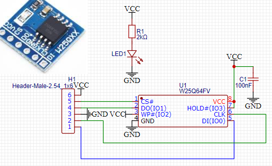

import BrowserWindow from '@site/src/components/BrowserWindow';

# W25Q64 SPI FLASH board



A cheap W25Q64 SPI FLASH board:

- Cost: ~2$
- Size: 8MB
- VCC: 2.7 - 3.6V
- It includes pull-ups: /HOLD & /WP
- 32768 programmable pages of 256-bytes each. Up to 256 bytes can be programmed at a time.
- Pages can be erased in groups of 16 (4KB sector erase), groups of 128 (32KB block erase), groups of 256 (64KB block erase) or the entire chip (chip erase). 
- Considering it might be a Chinese clone purchased from Aliexpress or a similar site, here's the maximum speed I recommend: ~10MHz (Standard SPI)

## Connections

|Bus Pirate|W25Q64 board|Description|
|-|-|-|
|CS|CS|Chip select|
|DO|DO|MISO Controller Data In|
|DI|DI|MOSI Controller Data Out|
|SCLK|CLK|SPI Clock|
|Vout/Vref|VCC|3.3volt power supply|
|GND|GND|Ground|

## Setup

Considering datasheet max speed, you've purchased a low-quality clone from AliExpress or any other source and the length of the Bus pirate cable, we're going to be very conservative and operate at:
- 3V3, 100kHz.
- Max current: 50ma.

:::tip
If you're using the chip alone (socket adapter, breadboard...) you must connect /HOLD & /WP to VCC.
:::

<BrowserWindow>
<span className="bp-prompt">HiZ></span> m<br/>
<br/>
<span className="bp-info">Mode selection</span><br/>
 1. <span className="bp-info">HiZ</span><br/>
 2. <span className="bp-info">1-WIRE</span><br/>
 3. <span className="bp-info">UART</span><br/>
 4. <span className="bp-info">I2C</span><br/>
 5. <span className="bp-info">SPI</span><br/>
 6. <span className="bp-info">LED</span><br/>
 x. <span className="bp-info">Exit</span><br/>
<span className="bp-prompt">Mode ></span> 5<br/>
<br/>
<span className="bp-info">SPI speed</span><br/>
 1 to 62500KHz<br/>
 x. <span className="bp-info">Exit</span><br/>
<span className="bp-prompt">KHz (</span>100KHz*<span className="bp-prompt">) ></span> <br/>
<span className="bp-info">Data bits</span><br/>
 4 to 8 bits<br/>
 x. <span className="bp-info">Exit</span><br/>
<span className="bp-prompt">Bits (</span>8*<span className="bp-prompt">) ></span> <br/>
<span className="bp-info">Clock polarity</span><br/>
 1. <span className="bp-info">Idle LOW*</span><br/>
 2. <span className="bp-info">Idle HIGH</span><br/>
 x. <span className="bp-info">Exit</span><br/>
<span className="bp-prompt">Polarity (</span>1<span className="bp-prompt">) ></span> <br/>
<span className="bp-info">Clock phase</span><br/>
 1. <span className="bp-info">LEADING edge*</span><br/>
 2. <span className="bp-info">TRAILING edge</span><br/>
 x. <span className="bp-info">Exit</span><br/>
<span className="bp-prompt">Phase (</span>1<span className="bp-prompt">) ></span> <br/>
<span className="bp-info">Chip select</span><br/>
 1. <span className="bp-info">Active HIGH (CS)</span><br/>
 2. <span className="bp-info">Active LOW (/CS)*</span><br/>
 x. <span className="bp-info">Exit</span><br/>
<span className="bp-prompt">CS (</span>2<span className="bp-prompt">) ></span> <br/>
<span className="bp-info">Actual speed:</span> 122KHz<br/>
<span className="bp-info">Mode:</span> SPI<br/>
<span className="bp-prompt">SPI></span> W<br/>
<span className="bp-info">Power supply<br/>
Volts (0.80V-5.00V)</span><br/>
<span className="bp-prompt">x to exit (3.30) ></span> <br/>
<span className="bp-float">3.30</span>V<span className="bp-info"> requested, closest value: <span className="bp-float">3.30</span></span>V<br/>
Set current limit?<br/>
y<br/>
<br/>
<span className="bp-info">Maximum current (0mA-500mA)</span><br/>
<span className="bp-prompt">x to exit (100.00) ></span> 50<br/>
<span className="bp-float">50.0</span>mA<span className="bp-info"> requested, closest value: <span className="bp-float">50.0</span></span>mA<br/>
<br/>
<span className="bp-info">Power supply:</span>Enabled<br/>
<span className="bp-info"><br/>
Vreg output: <span className="bp-float">3.3</span></span>V<span className="bp-info">, Vref/Vout pin: <span className="bp-float">3.3</span></span>V<span className="bp-info">, Current sense: <span className="bp-float">5.8</span></span>mA<span className="bp-info"><br/>
</span><br/>
<span className="bp-prompt">SPI></span> 
</BrowserWindow>

- Use the ```m``` mode command and select **SPI**
- Configure SPI for **100kHz** and **8bits** of data
- Enable the onboard power supply with the ```W``` command, and configure it for **3v3volts** output. 
- Select a current limit of at least **50mA**.

## Write & read 256 bytes

We will write 256 ASCII characters 'i' (0x69) at the memory address 0x00. Following this, we will read the content to verify that the bytes have been correctly written.

<BrowserWindow>
<span className="bp-prompt">SPI></span> [0x06]<br/>
<br/>
CS Enabled<br/>
<span className="bp-info">TX:</span> 0x<span className="bp-float">06</span> <br/>
CS Disabled<br/>
<span className="bp-prompt">SPI></span> 
</BrowserWindow>

Write Enable (06h)
- The 'Write Enable' command activates the Write Enable Latch (WEL) by setting its corresponding bit in the Status Register to '1'. This WEL bit is a prerequisite for executing several critical operations. It must be set before initiating any of the following instructions: Page Program, Quad Page Program, Sector Erase, Block Erase, Chip Erase, Write Status Register, and Erase/Program Security Registers. This step ensures that the memory device is ready to accept and correctly process these write or erase commands.

<BrowserWindow>
<span className="bp-prompt">SPI></span> [0x05 r:1]<br/>
<br/>
CS Enabled<br/>
<span className="bp-info">TX:</span> 0x<span className="bp-float">05</span> <br/>
<span className="bp-info">RX:</span> 0x<span className="bp-float">02</span> <br/>
CS Disabled<br/>
<span className="bp-prompt">SPI></span> 
</BrowserWindow>

Read Status Register (05h) instruction is essential for verifying the effectiveness of the 'Write Enable' instruction [0x06]. A response code of '02' indicates that the Write Enable Latch (WEL) is set to '1'. The WEL is a read-only bit within the status register (S1), which is activated following the execution of a Write Enable Instruction. It's important to note that the WEL status bit reverts to '0' when the device transitions into a write-disabled state. This state is automatically initiated upon power-up or subsequent to the execution of any of these instructions: Write Disable, Page Program, Quad Page Program, Sector Erase, Block Erase, Chip Erase, Write Status Register, Erase Security Register, and Program Security Register.

<BrowserWindow>
<span className="bp-prompt">SPI></span> [0x20 0x00 0x00 0x00]<br/>
<br/>
CS Enabled<br/>
<span className="bp-info">TX:</span> 0x<span className="bp-float">20</span> 0x<span className="bp-float">00</span> 0x<span className="bp-float">00</span> 0x<span className="bp-float">00</span> <br/>
CS Disabled<br/>
<span className="bp-prompt">SPI></span> 
</BrowserWindow>

Sector Erase (20h): instruction resets all memory within a specified 4K-byte sector to its erased state, where each bit is set to '1' (FFh). To enable this operation, a 'Write Enable' instruction must be executed first, ensuring that the 'Write Enable Latch' (WEL) bit in the Status Register is set to '1'. This is a prerequisite for the memory device to accept the Sector Erase Instruction. The command '20h' is used, followed by a 24-bit sector address, to specify the target sector for the erase operation.

:::tip
Each cell can store one bit of information: "0" or "1". In the erased state, all cells in a sector are set to the "1" state. It's important to note that writing to flash memory is not the same as writing to RAM. In flash memory, bits can only be changed from "1" to "0". To change a bit from "0" to "1", you must first erase the entire sector. This is done by setting all bits in the sector to "1". The need to erase before writing: Since bits can only be changed from "1" to "0" during writing, if a sector already contains data (bits in "0"), you cannot simply overwrite it with new data. You must first erase the sector to reset all bits to "1", and then you can write the new data, changing the necessary bits from "1" to "0".
:::

<BrowserWindow>
<span className="bp-prompt">SPI></span> [0x03 0x00 0x00 0x00 r:256]<br/>
<br/>
CS Enabled<br/>
<span className="bp-info">TX:</span> 0x<span className="bp-float">03</span> 0x<span className="bp-float">00</span> 0x<span className="bp-float">00</span> 0x<span className="bp-float">00</span> <br/>
<span className="bp-info">RX:</span> 0x<span className="bp-float">FF</span> 0x<span className="bp-float">FF</span> 0x<span className="bp-float">FF</span> 0x<span className="bp-float">FF</span> 0x<span className="bp-float">FF</span> 0x<span className="bp-float">FF</span> 0x<span className="bp-float">FF</span> 0x<span className="bp-float">FF</span> <br/>
    0x<span className="bp-float">FF</span> 0x<span className="bp-float">FF</span> 0x<span className="bp-float">FF</span> 0x<span className="bp-float">FF</span> 0x<span className="bp-float">FF</span> 0x<span className="bp-float">FF</span> 0x<span className="bp-float">FF</span> 0x<span className="bp-float">FF</span> <br/>
    0x<span className="bp-float">FF</span> 0x<span className="bp-float">FF</span> 0x<span className="bp-float">FF</span> 0x<span className="bp-float">FF</span> 0x<span className="bp-float">FF</span> 0x<span className="bp-float">FF</span> 0x<span className="bp-float">FF</span> 0x<span className="bp-float">FF</span> <br/>
    0x<span className="bp-float">FF</span> 0x<span className="bp-float">FF</span> 0x<span className="bp-float">FF</span> 0x<span className="bp-float">FF</span> 0x<span className="bp-float">FF</span> 0x<span className="bp-float">FF</span> 0x<span className="bp-float">FF</span> 0x<span className="bp-float">FF</span> <br/>
    0x<span className="bp-float">FF</span> 0x<span className="bp-float">FF</span> 0x<span className="bp-float">FF</span> 0x<span className="bp-float">FF</span> 0x<span className="bp-float">FF</span> 0x<span className="bp-float">FF</span> 0x<span className="bp-float">FF</span> 0x<span className="bp-float">FF</span> <br/>
    0x<span className="bp-float">FF</span> 0x<span className="bp-float">FF</span> 0x<span className="bp-float">FF</span> 0x<span className="bp-float">FF</span> 0x<span className="bp-float">FF</span> 0x<span className="bp-float">FF</span> 0x<span className="bp-float">FF</span> 0x<span className="bp-float">FF</span> <br/>
    0x<span className="bp-float">FF</span> 0x<span className="bp-float">FF</span> 0x<span className="bp-float">FF</span> 0x<span className="bp-float">FF</span> 0x<span className="bp-float">FF</span> 0x<span className="bp-float">FF</span> 0x<span className="bp-float">FF</span> 0x<span className="bp-float">FF</span> <br/>
    0x<span className="bp-float">FF</span> 0x<span className="bp-float">FF</span> 0x<span className="bp-float">FF</span> 0x<span className="bp-float">FF</span> 0x<span className="bp-float">FF</span> 0x<span className="bp-float">FF</span> 0x<span className="bp-float">FF</span> 0x<span className="bp-float">FF</span> <br/>
    0x<span className="bp-float">FF</span> 0x<span className="bp-float">FF</span> 0x<span className="bp-float">FF</span> 0x<span className="bp-float">FF</span> 0x<span className="bp-float">FF</span> 0x<span className="bp-float">FF</span> 0x<span className="bp-float">FF</span> 0x<span className="bp-float">FF</span> <br/>
    0x<span className="bp-float">FF</span> 0x<span className="bp-float">FF</span> 0x<span className="bp-float">FF</span> 0x<span className="bp-float">FF</span> 0x<span className="bp-float">FF</span> 0x<span className="bp-float">FF</span> 0x<span className="bp-float">FF</span> 0x<span className="bp-float">FF</span> <br/>
    0x<span className="bp-float">FF</span> 0x<span className="bp-float">FF</span> 0x<span className="bp-float">FF</span> 0x<span className="bp-float">FF</span> 0x<span className="bp-float">FF</span> 0x<span className="bp-float">FF</span> 0x<span className="bp-float">FF</span> 0x<span className="bp-float">FF</span> <br/>
    0x<span className="bp-float">FF</span> 0x<span className="bp-float">FF</span> 0x<span className="bp-float">FF</span> 0x<span className="bp-float">FF</span> 0x<span className="bp-float">FF</span> 0x<span className="bp-float">FF</span> 0x<span className="bp-float">FF</span> 0x<span className="bp-float">FF</span> <br/>
    0x<span className="bp-float">FF</span> 0x<span className="bp-float">FF</span> 0x<span className="bp-float">FF</span> 0x<span className="bp-float">FF</span> 0x<span className="bp-float">FF</span> 0x<span className="bp-float">FF</span> 0x<span className="bp-float">FF</span> 0x<span className="bp-float">FF</span> <br/>
    0x<span className="bp-float">FF</span> 0x<span className="bp-float">FF</span> 0x<span className="bp-float">FF</span> 0x<span className="bp-float">FF</span> 0x<span className="bp-float">FF</span> 0x<span className="bp-float">FF</span> 0x<span className="bp-float">FF</span> 0x<span className="bp-float">FF</span> <br/>
    0x<span className="bp-float">FF</span> 0x<span className="bp-float">FF</span> 0x<span className="bp-float">FF</span> 0x<span className="bp-float">FF</span> 0x<span className="bp-float">FF</span> 0x<span className="bp-float">FF</span> 0x<span className="bp-float">FF</span> 0x<span className="bp-float">FF</span> <br/>
    0x<span className="bp-float">FF</span> 0x<span className="bp-float">FF</span> 0x<span className="bp-float">FF</span> 0x<span className="bp-float">FF</span> 0x<span className="bp-float">FF</span> 0x<span className="bp-float">FF</span> 0x<span className="bp-float">FF</span> 0x<span className="bp-float">FF</span> <br/>
    0x<span className="bp-float">FF</span> 0x<span className="bp-float">FF</span> 0x<span className="bp-float">FF</span> 0x<span className="bp-float">FF</span> 0x<span className="bp-float">FF</span> 0x<span className="bp-float">FF</span> 0x<span className="bp-float">FF</span> 0x<span className="bp-float">FF</span> <br/>
    0x<span className="bp-float">FF</span> 0x<span className="bp-float">FF</span> 0x<span className="bp-float">FF</span> 0x<span className="bp-float">FF</span> 0x<span className="bp-float">FF</span> 0x<span className="bp-float">FF</span> 0x<span className="bp-float">FF</span> 0x<span className="bp-float">FF</span> <br/>
    0x<span className="bp-float">FF</span> 0x<span className="bp-float">FF</span> 0x<span className="bp-float">FF</span> 0x<span className="bp-float">FF</span> 0x<span className="bp-float">FF</span> 0x<span className="bp-float">FF</span> 0x<span className="bp-float">FF</span> 0x<span className="bp-float">FF</span> <br/>
    0x<span className="bp-float">FF</span> 0x<span className="bp-float">FF</span> 0x<span className="bp-float">FF</span> 0x<span className="bp-float">FF</span> 0x<span className="bp-float">FF</span> 0x<span className="bp-float">FF</span> 0x<span className="bp-float">FF</span> 0x<span className="bp-float">FF</span> <br/>
    0x<span className="bp-float">FF</span> 0x<span className="bp-float">FF</span> 0x<span className="bp-float">FF</span> 0x<span className="bp-float">FF</span> 0x<span className="bp-float">FF</span> 0x<span className="bp-float">FF</span> 0x<span className="bp-float">FF</span> 0x<span className="bp-float">FF</span> <br/>
    0x<span className="bp-float">FF</span> 0x<span className="bp-float">FF</span> 0x<span className="bp-float">FF</span> 0x<span className="bp-float">FF</span> 0x<span className="bp-float">FF</span> 0x<span className="bp-float">FF</span> 0x<span className="bp-float">FF</span> 0x<span className="bp-float">FF</span> <br/>
    0x<span className="bp-float">FF</span> 0x<span className="bp-float">FF</span> 0x<span className="bp-float">FF</span> 0x<span className="bp-float">FF</span> 0x<span className="bp-float">FF</span> 0x<span className="bp-float">FF</span> 0x<span className="bp-float">FF</span> 0x<span className="bp-float">FF</span> <br/>
    0x<span className="bp-float">FF</span> 0x<span className="bp-float">FF</span> 0x<span className="bp-float">FF</span> 0x<span className="bp-float">FF</span> 0x<span className="bp-float">FF</span> 0x<span className="bp-float">FF</span> 0x<span className="bp-float">FF</span> 0x<span className="bp-float">FF</span> <br/>
    0x<span className="bp-float">FF</span> 0x<span className="bp-float">FF</span> 0x<span className="bp-float">FF</span> 0x<span className="bp-float">FF</span> 0x<span className="bp-float">FF</span> 0x<span className="bp-float">FF</span> 0x<span className="bp-float">FF</span> 0x<span className="bp-float">FF</span> <br/>
    0x<span className="bp-float">FF</span> 0x<span className="bp-float">FF</span> 0x<span className="bp-float">FF</span> 0x<span className="bp-float">FF</span> 0x<span className="bp-float">FF</span> 0x<span className="bp-float">FF</span> 0x<span className="bp-float">FF</span> 0x<span className="bp-float">FF</span> <br/>
    0x<span className="bp-float">FF</span> 0x<span className="bp-float">FF</span> 0x<span className="bp-float">FF</span> 0x<span className="bp-float">FF</span> 0x<span className="bp-float">FF</span> 0x<span className="bp-float">FF</span> 0x<span className="bp-float">FF</span> 0x<span className="bp-float">FF</span> <br/>
    0x<span className="bp-float">FF</span> 0x<span className="bp-float">FF</span> 0x<span className="bp-float">FF</span> 0x<span className="bp-float">FF</span> 0x<span className="bp-float">FF</span> 0x<span className="bp-float">FF</span> 0x<span className="bp-float">FF</span> 0x<span className="bp-float">FF</span> <br/>
    0x<span className="bp-float">FF</span> 0x<span className="bp-float">FF</span> 0x<span className="bp-float">FF</span> 0x<span className="bp-float">FF</span> 0x<span className="bp-float">FF</span> 0x<span className="bp-float">FF</span> 0x<span className="bp-float">FF</span> 0x<span className="bp-float">FF</span> <br/>
    0x<span className="bp-float">FF</span> 0x<span className="bp-float">FF</span> 0x<span className="bp-float">FF</span> 0x<span className="bp-float">FF</span> 0x<span className="bp-float">FF</span> 0x<span className="bp-float">FF</span> 0x<span className="bp-float">FF</span> 0x<span className="bp-float">FF</span> <br/>
    0x<span className="bp-float">FF</span> 0x<span className="bp-float">FF</span> 0x<span className="bp-float">FF</span> 0x<span className="bp-float">FF</span> 0x<span className="bp-float">FF</span> 0x<span className="bp-float">FF</span> 0x<span className="bp-float">FF</span> 0x<span className="bp-float">FF</span> <br/>
    0x<span className="bp-float">FF</span> 0x<span className="bp-float">FF</span> 0x<span className="bp-float">FF</span> 0x<span className="bp-float">FF</span> 0x<span className="bp-float">FF</span> 0x<span className="bp-float">FF</span> 0x<span className="bp-float">FF</span> 0x<span className="bp-float">FF</span> <br/>
    <br/>
CS Disabled<br/>
<span className="bp-prompt">SPI></span> 
</BrowserWindow>

Read Data (03h):  reading of one or more data bytes from the memory. '03h' followed by specifying a 24-bit address. Once the address is received, the data byte from the specified memory location is shifted out through the MISO line. Notably, the address automatically increments to the next higher address after each data byte is shifted out. This feature facilitates a continuous data stream, allowing the entire memory to be accessed using a single instruction, provided that the clock continues to run.

<BrowserWindow>
<span className="bp-prompt">SPI></span> [0x06]<br/>
<br/>
CS Enabled<br/>
<span className="bp-info">TX:</span> 0x<span className="bp-float">06</span> <br/>
CS Disabled<br/>
<span className="bp-prompt">SPI></span> [0x05 r:1]<br/>
<br/>
CS Enabled<br/>
<span className="bp-info">TX:</span> 0x<span className="bp-float">05</span> <br/>
<span className="bp-info">RX:</span> 0x<span className="bp-float">02</span> <br/>
CS Disabled<br/>
<span className="bp-prompt">SPI></span> [0x02 0x00 0x00 0x00 0x69:256]<br/>
<br/>
CS Enabled<br/>
<span className="bp-info">TX:</span> 0x<span className="bp-float">02</span> 0x<span className="bp-float">00</span> 0x<span className="bp-float">00</span> 0x<span className="bp-float">00</span> 0x<span className="bp-float">69</span> 0x<span className="bp-float">69</span> 0x<span className="bp-float">69</span> 0x<span className="bp-float">69</span> <br/>
    0x<span className="bp-float">69</span> 0x<span className="bp-float">69</span> 0x<span className="bp-float">69</span> 0x<span className="bp-float">69</span> 0x<span className="bp-float">69</span> 0x<span className="bp-float">69</span> 0x<span className="bp-float">69</span> 0x<span className="bp-float">69</span> <br/>
    0x<span className="bp-float">69</span> 0x<span className="bp-float">69</span> 0x<span className="bp-float">69</span> 0x<span className="bp-float">69</span> 0x<span className="bp-float">69</span> 0x<span className="bp-float">69</span> 0x<span className="bp-float">69</span> 0x<span className="bp-float">69</span> <br/>
    0x<span className="bp-float">69</span> 0x<span className="bp-float">69</span> 0x<span className="bp-float">69</span> 0x<span className="bp-float">69</span> 0x<span className="bp-float">69</span> 0x<span className="bp-float">69</span> 0x<span className="bp-float">69</span> 0x<span className="bp-float">69</span> <br/>
    0x<span className="bp-float">69</span> 0x<span className="bp-float">69</span> 0x<span className="bp-float">69</span> 0x<span className="bp-float">69</span> 0x<span className="bp-float">69</span> 0x<span className="bp-float">69</span> 0x<span className="bp-float">69</span> 0x<span className="bp-float">69</span> <br/>
    0x<span className="bp-float">69</span> 0x<span className="bp-float">69</span> 0x<span className="bp-float">69</span> 0x<span className="bp-float">69</span> 0x<span className="bp-float">69</span> 0x<span className="bp-float">69</span> 0x<span className="bp-float">69</span> 0x<span className="bp-float">69</span> <br/>
    0x<span className="bp-float">69</span> 0x<span className="bp-float">69</span> 0x<span className="bp-float">69</span> 0x<span className="bp-float">69</span> 0x<span className="bp-float">69</span> 0x<span className="bp-float">69</span> 0x<span className="bp-float">69</span> 0x<span className="bp-float">69</span> <br/>
    0x<span className="bp-float">69</span> 0x<span className="bp-float">69</span> 0x<span className="bp-float">69</span> 0x<span className="bp-float">69</span> 0x<span className="bp-float">69</span> 0x<span className="bp-float">69</span> 0x<span className="bp-float">69</span> 0x<span className="bp-float">69</span> <br/>
    0x<span className="bp-float">69</span> 0x<span className="bp-float">69</span> 0x<span className="bp-float">69</span> 0x<span className="bp-float">69</span> 0x<span className="bp-float">69</span> 0x<span className="bp-float">69</span> 0x<span className="bp-float">69</span> 0x<span className="bp-float">69</span> <br/>
    0x<span className="bp-float">69</span> 0x<span className="bp-float">69</span> 0x<span className="bp-float">69</span> 0x<span className="bp-float">69</span> 0x<span className="bp-float">69</span> 0x<span className="bp-float">69</span> 0x<span className="bp-float">69</span> 0x<span className="bp-float">69</span> <br/>
    0x<span className="bp-float">69</span> 0x<span className="bp-float">69</span> 0x<span className="bp-float">69</span> 0x<span className="bp-float">69</span> 0x<span className="bp-float">69</span> 0x<span className="bp-float">69</span> 0x<span className="bp-float">69</span> 0x<span className="bp-float">69</span> <br/>
    0x<span className="bp-float">69</span> 0x<span className="bp-float">69</span> 0x<span className="bp-float">69</span> 0x<span className="bp-float">69</span> 0x<span className="bp-float">69</span> 0x<span className="bp-float">69</span> 0x<span className="bp-float">69</span> 0x<span className="bp-float">69</span> <br/>
    0x<span className="bp-float">69</span> 0x<span className="bp-float">69</span> 0x<span className="bp-float">69</span> 0x<span className="bp-float">69</span> 0x<span className="bp-float">69</span> 0x<span className="bp-float">69</span> 0x<span className="bp-float">69</span> 0x<span className="bp-float">69</span> <br/>
    0x<span className="bp-float">69</span> 0x<span className="bp-float">69</span> 0x<span className="bp-float">69</span> 0x<span className="bp-float">69</span> 0x<span className="bp-float">69</span> 0x<span className="bp-float">69</span> 0x<span className="bp-float">69</span> 0x<span className="bp-float">69</span> <br/>
    0x<span className="bp-float">69</span> 0x<span className="bp-float">69</span> 0x<span className="bp-float">69</span> 0x<span className="bp-float">69</span> 0x<span className="bp-float">69</span> 0x<span className="bp-float">69</span> 0x<span className="bp-float">69</span> 0x<span className="bp-float">69</span> <br/>
    0x<span className="bp-float">69</span> 0x<span className="bp-float">69</span> 0x<span className="bp-float">69</span> 0x<span className="bp-float">69</span> 0x<span className="bp-float">69</span> 0x<span className="bp-float">69</span> 0x<span className="bp-float">69</span> 0x<span className="bp-float">69</span> <br/>
    0x<span className="bp-float">69</span> 0x<span className="bp-float">69</span> 0x<span className="bp-float">69</span> 0x<span className="bp-float">69</span> 0x<span className="bp-float">69</span> 0x<span className="bp-float">69</span> 0x<span className="bp-float">69</span> 0x<span className="bp-float">69</span> <br/>
    0x<span className="bp-float">69</span> 0x<span className="bp-float">69</span> 0x<span className="bp-float">69</span> 0x<span className="bp-float">69</span> 0x<span className="bp-float">69</span> 0x<span className="bp-float">69</span> 0x<span className="bp-float">69</span> 0x<span className="bp-float">69</span> <br/>
    0x<span className="bp-float">69</span> 0x<span className="bp-float">69</span> 0x<span className="bp-float">69</span> 0x<span className="bp-float">69</span> 0x<span className="bp-float">69</span> 0x<span className="bp-float">69</span> 0x<span className="bp-float">69</span> 0x<span className="bp-float">69</span> <br/>
    0x<span className="bp-float">69</span> 0x<span className="bp-float">69</span> 0x<span className="bp-float">69</span> 0x<span className="bp-float">69</span> 0x<span className="bp-float">69</span> 0x<span className="bp-float">69</span> 0x<span className="bp-float">69</span> 0x<span className="bp-float">69</span> <br/>
    0x<span className="bp-float">69</span> 0x<span className="bp-float">69</span> 0x<span className="bp-float">69</span> 0x<span className="bp-float">69</span> 0x<span className="bp-float">69</span> 0x<span className="bp-float">69</span> 0x<span className="bp-float">69</span> 0x<span className="bp-float">69</span> <br/>
    0x<span className="bp-float">69</span> 0x<span className="bp-float">69</span> 0x<span className="bp-float">69</span> 0x<span className="bp-float">69</span> 0x<span className="bp-float">69</span> 0x<span className="bp-float">69</span> 0x<span className="bp-float">69</span> 0x<span className="bp-float">69</span> <br/>
    0x<span className="bp-float">69</span> 0x<span className="bp-float">69</span> 0x<span className="bp-float">69</span> 0x<span className="bp-float">69</span> 0x<span className="bp-float">69</span> 0x<span className="bp-float">69</span> 0x<span className="bp-float">69</span> 0x<span className="bp-float">69</span> <br/>
    0x<span className="bp-float">69</span> 0x<span className="bp-float">69</span> 0x<span className="bp-float">69</span> 0x<span className="bp-float">69</span> 0x<span className="bp-float">69</span> 0x<span className="bp-float">69</span> 0x<span className="bp-float">69</span> 0x<span className="bp-float">69</span> <br/>
    0x<span className="bp-float">69</span> 0x<span className="bp-float">69</span> 0x<span className="bp-float">69</span> 0x<span className="bp-float">69</span> 0x<span className="bp-float">69</span> 0x<span className="bp-float">69</span> 0x<span className="bp-float">69</span> 0x<span className="bp-float">69</span> <br/>
    0x<span className="bp-float">69</span> 0x<span className="bp-float">69</span> 0x<span className="bp-float">69</span> 0x<span className="bp-float">69</span> 0x<span className="bp-float">69</span> 0x<span className="bp-float">69</span> 0x<span className="bp-float">69</span> 0x<span className="bp-float">69</span> <br/>
    0x<span className="bp-float">69</span> 0x<span className="bp-float">69</span> 0x<span className="bp-float">69</span> 0x<span className="bp-float">69</span> 0x<span className="bp-float">69</span> 0x<span className="bp-float">69</span> 0x<span className="bp-float">69</span> 0x<span className="bp-float">69</span> <br/>
    0x<span className="bp-float">69</span> 0x<span className="bp-float">69</span> 0x<span className="bp-float">69</span> 0x<span className="bp-float">69</span> 0x<span className="bp-float">69</span> 0x<span className="bp-float">69</span> 0x<span className="bp-float">69</span> 0x<span className="bp-float">69</span> <br/>
    0x<span className="bp-float">69</span> 0x<span className="bp-float">69</span> 0x<span className="bp-float">69</span> 0x<span className="bp-float">69</span> 0x<span className="bp-float">69</span> 0x<span className="bp-float">69</span> 0x<span className="bp-float">69</span> 0x<span className="bp-float">69</span> <br/>
    0x<span className="bp-float">69</span> 0x<span className="bp-float">69</span> 0x<span className="bp-float">69</span> 0x<span className="bp-float">69</span> 0x<span className="bp-float">69</span> 0x<span className="bp-float">69</span> 0x<span className="bp-float">69</span> 0x<span className="bp-float">69</span> <br/>
    0x<span className="bp-float">69</span> 0x<span className="bp-float">69</span> 0x<span className="bp-float">69</span> 0x<span className="bp-float">69</span> 0x<span className="bp-float">69</span> 0x<span className="bp-float">69</span> 0x<span className="bp-float">69</span> 0x<span className="bp-float">69</span> <br/>
    0x<span className="bp-float">69</span> 0x<span className="bp-float">69</span> 0x<span className="bp-float">69</span> 0x<span className="bp-float">69</span> 0x<span className="bp-float">69</span> 0x<span className="bp-float">69</span> 0x<span className="bp-float">69</span> 0x<span className="bp-float">69</span> <br/>
    0x<span className="bp-float">69</span> 0x<span className="bp-float">69</span> 0x<span className="bp-float">69</span> 0x<span className="bp-float">69</span> <br/>
CS Disabled<br/>
<span className="bp-prompt">SPI></span> 
</BrowserWindow>

Initially, we re-activate the writing capability using the [0x06] instruction and confirm the success of the previous command with [0x05 r:1].

Page Program (02h): permits the programming of data ranging from one byte to 256 bytes (equivalent to one page) at memory locations that have been previously erased (indicated as FFh). To enable this operation, a 'Write Enable' instruction is necessary to set the Status Register bit WEL to '1', thereby preparing the device to accept the Page Program Instruction. This process starts with the command '02h', followed by a 24-bit address and at least one data byte. For programming an entire 256-byte page, the last byte of the address (the 8 least significant address bits) should be set to 0. If this last address byte is not zero and the number of clock cycles exceeds the remaining page length, the address will wrap back to the start of the page. It's also possible to program less than 256 bytes (a partial page) without affecting other bytes within the same page. However, one crucial condition for partial page programming is that the number of clock cycles does not exceed the page's remaining length. Exceeding 256 bytes in the input causes the addressing to circle back to the page's beginning, potentially overwriting previously sent data.

<BrowserWindow>
<span className="bp-prompt">SPI></span> [0x03 0x00 0x00 0x00 r:256]<br/>
<br/>
CS Enabled<br/>
<span className="bp-info">TX:</span> 0x<span className="bp-float">03</span> 0x<span className="bp-float">00</span> 0x<span className="bp-float">00</span> 0x<span className="bp-float">00</span> <br/>
<span className="bp-info">RX:</span> 0x<span className="bp-float">69</span> 0x<span className="bp-float">69</span> 0x<span className="bp-float">69</span> 0x<span className="bp-float">69</span> 0x<span className="bp-float">69</span> 0x<span className="bp-float">69</span> 0x<span className="bp-float">69</span> 0x<span className="bp-float">69</span> <br/>
    0x<span className="bp-float">69</span> 0x<span className="bp-float">69</span> 0x<span className="bp-float">69</span> 0x<span className="bp-float">69</span> 0x<span className="bp-float">69</span> 0x<span className="bp-float">69</span> 0x<span className="bp-float">69</span> 0x<span className="bp-float">69</span> <br/>
    0x<span className="bp-float">69</span> 0x<span className="bp-float">69</span> 0x<span className="bp-float">69</span> 0x<span className="bp-float">69</span> 0x<span className="bp-float">69</span> 0x<span className="bp-float">69</span> 0x<span className="bp-float">69</span> 0x<span className="bp-float">69</span> <br/>
    0x<span className="bp-float">69</span> 0x<span className="bp-float">69</span> 0x<span className="bp-float">69</span> 0x<span className="bp-float">69</span> 0x<span className="bp-float">69</span> 0x<span className="bp-float">69</span> 0x<span className="bp-float">69</span> 0x<span className="bp-float">69</span> <br/>
    0x<span className="bp-float">69</span> 0x<span className="bp-float">69</span> 0x<span className="bp-float">69</span> 0x<span className="bp-float">69</span> 0x<span className="bp-float">69</span> 0x<span className="bp-float">69</span> 0x<span className="bp-float">69</span> 0x<span className="bp-float">69</span> <br/>
    0x<span className="bp-float">69</span> 0x<span className="bp-float">69</span> 0x<span className="bp-float">69</span> 0x<span className="bp-float">69</span> 0x<span className="bp-float">69</span> 0x<span className="bp-float">69</span> 0x<span className="bp-float">69</span> 0x<span className="bp-float">69</span> <br/>
    0x<span className="bp-float">69</span> 0x<span className="bp-float">69</span> 0x<span className="bp-float">69</span> 0x<span className="bp-float">69</span> 0x<span className="bp-float">69</span> 0x<span className="bp-float">69</span> 0x<span className="bp-float">69</span> 0x<span className="bp-float">69</span> <br/>
    0x<span className="bp-float">69</span> 0x<span className="bp-float">69</span> 0x<span className="bp-float">69</span> 0x<span className="bp-float">69</span> 0x<span className="bp-float">69</span> 0x<span className="bp-float">69</span> 0x<span className="bp-float">69</span> 0x<span className="bp-float">69</span> <br/>
    0x<span className="bp-float">69</span> 0x<span className="bp-float">69</span> 0x<span className="bp-float">69</span> 0x<span className="bp-float">69</span> 0x<span className="bp-float">69</span> 0x<span className="bp-float">69</span> 0x<span className="bp-float">69</span> 0x<span className="bp-float">69</span> <br/>
    0x<span className="bp-float">69</span> 0x<span className="bp-float">69</span> 0x<span className="bp-float">69</span> 0x<span className="bp-float">69</span> 0x<span className="bp-float">69</span> 0x<span className="bp-float">69</span> 0x<span className="bp-float">69</span> 0x<span className="bp-float">69</span> <br/>
    0x<span className="bp-float">69</span> 0x<span className="bp-float">69</span> 0x<span className="bp-float">69</span> 0x<span className="bp-float">69</span> 0x<span className="bp-float">69</span> 0x<span className="bp-float">69</span> 0x<span className="bp-float">69</span> 0x<span className="bp-float">69</span> <br/>
    0x<span className="bp-float">69</span> 0x<span className="bp-float">69</span> 0x<span className="bp-float">69</span> 0x<span className="bp-float">69</span> 0x<span className="bp-float">69</span> 0x<span className="bp-float">69</span> 0x<span className="bp-float">69</span> 0x<span className="bp-float">69</span> <br/>
    0x<span className="bp-float">69</span> 0x<span className="bp-float">69</span> 0x<span className="bp-float">69</span> 0x<span className="bp-float">69</span> 0x<span className="bp-float">69</span> 0x<span className="bp-float">69</span> 0x<span className="bp-float">69</span> 0x<span className="bp-float">69</span> <br/>
    0x<span className="bp-float">69</span> 0x<span className="bp-float">69</span> 0x<span className="bp-float">69</span> 0x<span className="bp-float">69</span> 0x<span className="bp-float">69</span> 0x<span className="bp-float">69</span> 0x<span className="bp-float">69</span> 0x<span className="bp-float">69</span> <br/>
    0x<span className="bp-float">69</span> 0x<span className="bp-float">69</span> 0x<span className="bp-float">69</span> 0x<span className="bp-float">69</span> 0x<span className="bp-float">69</span> 0x<span className="bp-float">69</span> 0x<span className="bp-float">69</span> 0x<span className="bp-float">69</span> <br/>
    0x<span className="bp-float">69</span> 0x<span className="bp-float">69</span> 0x<span className="bp-float">69</span> 0x<span className="bp-float">69</span> 0x<span className="bp-float">69</span> 0x<span className="bp-float">69</span> 0x<span className="bp-float">69</span> 0x<span className="bp-float">69</span> <br/>
    0x<span className="bp-float">69</span> 0x<span className="bp-float">69</span> 0x<span className="bp-float">69</span> 0x<span className="bp-float">69</span> 0x<span className="bp-float">69</span> 0x<span className="bp-float">69</span> 0x<span className="bp-float">69</span> 0x<span className="bp-float">69</span> <br/>
    0x<span className="bp-float">69</span> 0x<span className="bp-float">69</span> 0x<span className="bp-float">69</span> 0x<span className="bp-float">69</span> 0x<span className="bp-float">69</span> 0x<span className="bp-float">69</span> 0x<span className="bp-float">69</span> 0x<span className="bp-float">69</span> <br/>
    0x<span className="bp-float">69</span> 0x<span className="bp-float">69</span> 0x<span className="bp-float">69</span> 0x<span className="bp-float">69</span> 0x<span className="bp-float">69</span> 0x<span className="bp-float">69</span> 0x<span className="bp-float">69</span> 0x<span className="bp-float">69</span> <br/>
    0x<span className="bp-float">69</span> 0x<span className="bp-float">69</span> 0x<span className="bp-float">69</span> 0x<span className="bp-float">69</span> 0x<span className="bp-float">69</span> 0x<span className="bp-float">69</span> 0x<span className="bp-float">69</span> 0x<span className="bp-float">69</span> <br/>
    0x<span className="bp-float">69</span> 0x<span className="bp-float">69</span> 0x<span className="bp-float">69</span> 0x<span className="bp-float">69</span> 0x<span className="bp-float">69</span> 0x<span className="bp-float">69</span> 0x<span className="bp-float">69</span> 0x<span className="bp-float">69</span> <br/>
    0x<span className="bp-float">69</span> 0x<span className="bp-float">69</span> 0x<span className="bp-float">69</span> 0x<span className="bp-float">69</span> 0x<span className="bp-float">69</span> 0x<span className="bp-float">69</span> 0x<span className="bp-float">69</span> 0x<span className="bp-float">69</span> <br/>
    0x<span className="bp-float">69</span> 0x<span className="bp-float">69</span> 0x<span className="bp-float">69</span> 0x<span className="bp-float">69</span> 0x<span className="bp-float">69</span> 0x<span className="bp-float">69</span> 0x<span className="bp-float">69</span> 0x<span className="bp-float">69</span> <br/>
    0x<span className="bp-float">69</span> 0x<span className="bp-float">69</span> 0x<span className="bp-float">69</span> 0x<span className="bp-float">69</span> 0x<span className="bp-float">69</span> 0x<span className="bp-float">69</span> 0x<span className="bp-float">69</span> 0x<span className="bp-float">69</span> <br/>
    0x<span className="bp-float">69</span> 0x<span className="bp-float">69</span> 0x<span className="bp-float">69</span> 0x<span className="bp-float">69</span> 0x<span className="bp-float">69</span> 0x<span className="bp-float">69</span> 0x<span className="bp-float">69</span> 0x<span className="bp-float">69</span> <br/>
    0x<span className="bp-float">69</span> 0x<span className="bp-float">69</span> 0x<span className="bp-float">69</span> 0x<span className="bp-float">69</span> 0x<span className="bp-float">69</span> 0x<span className="bp-float">69</span> 0x<span className="bp-float">69</span> 0x<span className="bp-float">69</span> <br/>
    0x<span className="bp-float">69</span> 0x<span className="bp-float">69</span> 0x<span className="bp-float">69</span> 0x<span className="bp-float">69</span> 0x<span className="bp-float">69</span> 0x<span className="bp-float">69</span> 0x<span className="bp-float">69</span> 0x<span className="bp-float">69</span> <br/>
    0x<span className="bp-float">69</span> 0x<span className="bp-float">69</span> 0x<span className="bp-float">69</span> 0x<span className="bp-float">69</span> 0x<span className="bp-float">69</span> 0x<span className="bp-float">69</span> 0x<span className="bp-float">69</span> 0x<span className="bp-float">69</span> <br/>
    0x<span className="bp-float">69</span> 0x<span className="bp-float">69</span> 0x<span className="bp-float">69</span> 0x<span className="bp-float">69</span> 0x<span className="bp-float">69</span> 0x<span className="bp-float">69</span> 0x<span className="bp-float">69</span> 0x<span className="bp-float">69</span> <br/>
    0x<span className="bp-float">69</span> 0x<span className="bp-float">69</span> 0x<span className="bp-float">69</span> 0x<span className="bp-float">69</span> 0x<span className="bp-float">69</span> 0x<span className="bp-float">69</span> 0x<span className="bp-float">69</span> 0x<span className="bp-float">69</span> <br/>
    0x<span className="bp-float">69</span> 0x<span className="bp-float">69</span> 0x<span className="bp-float">69</span> 0x<span className="bp-float">69</span> 0x<span className="bp-float">69</span> 0x<span className="bp-float">69</span> 0x<span className="bp-float">69</span> 0x<span className="bp-float">69</span> <br/>
    0x<span className="bp-float">69</span> 0x<span className="bp-float">69</span> 0x<span className="bp-float">69</span> 0x<span className="bp-float">69</span> 0x<span className="bp-float">69</span> 0x<span className="bp-float">69</span> 0x<span className="bp-float">69</span> 0x<span className="bp-float">69</span> <br/>
    <br/>
CS Disabled<br/>
<span className="bp-prompt">SPI></span> 
</BrowserWindow>

To confirm the success of our write operations, we employ the 'Read Data' instruction (03h) once more. This step is crucial for verifying that the data we have written to the memory has been correctly and successfully stored.

:::tip
If the writing/reading process fails, check all connections. /HOLD & /WP must be connected to VCC.
:::
