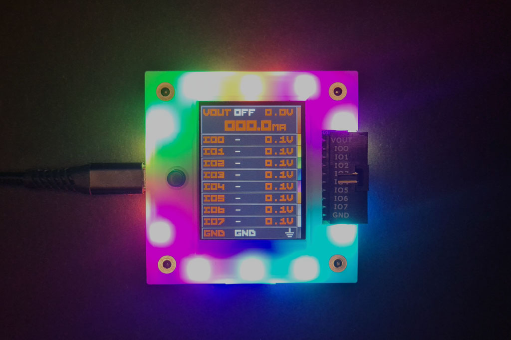

# Bus Pirate 5 Firmware Docs

  

Bus Pirate 5 is the latest edition of the original universal serial interface trusted by hackers since 2008. 

Can't get a chip to work? Is it the circuit, code, bad part or a burned out pin? The Bus Pirate sends commands over common serial protocols so you can get to know a chip before prototyping. Updated with tons of new features and tools, talking to chips and probing interfaces is more fun than ever!

## RP2040
- Based on Raspberry Pi Foundation RP2040
- 128Mbit flash storage for lots of features
- Firmware developed with the Pico C language SDK

## 8 Buffered IO pins
- 1.2-5volt operating range, 3 state
- Voltage measurement on every pin
- Toggleable 10K pull-up resistors
- 10 pin x 2.54mm main header
- 9 pin x 1.0mm auxiliary header

## Programmable Power Supply Unit
- Current Sense
- Programmable 1-5.0volt output
- Programmable 0-500mA current limit
- Resettable digital fuse
- Protection circuit

## 1Gbit NAND flash storage
- Save global and mode settings
- Appears as a USB disk drive
- Future use for logs, dumps and stand-alone programming

## LCD
- 320 x 240 pixel IPS all direction display
- Pin labels
- Live voltage measurements
- Live current consumption

## 18 RGB LEDs
- Introduction demo
- Party mode

## Just one button
- Escape from modes
- User input for production programming, remote hacking, whatever

## VT100 terminal interface
- Color interface
- Live update toolbar/monitor

## USB bootloader
- Updating is as simple as dragging a file onto the disk

## USB C connector
- ...but limited to the USB speeds supported by the RP2040

## Other Documentation
Bus Pirate 5 documentation is broken into [hardware](https://hardware.buspirate.com/introduction) and [firmware](https://firmware.buspirate.com/introduction) sections so it can be versioned easily with each update. Here's some other fun stuff you might enjoy.
- [Component selection and sourcing](https://hardware.buspirate.com/components/introduction)
- [Case/enclosure](https://hardware.buspirate.com/enclosure/fdm-shell)
- [Cables](https://firmware.buspirate.com/overview/cables)
- [Milled breadboard pins](https://firmware.buspirate.com/overview/milled-breadboard-pins)
- [Hardware users guide](https://firmware.buspirate.com/overview/hardware)
- [Firmware tutorials](https://firmware.buspirate.com/tutorial-basics/quick-setup)
- [Command reference](https://firmware.buspirate.com/command-reference/all-commands)
- [Firmware development](https://hardware.buspirate.com/development/code) and [translation](https://hardware.buspirate.com/development/translation)
- [Manufacturing resources](https://hardware.buspirate.com/category/manufacturing)

## Join the fun
### Get Bus Pirate 5
- [Bus Pirate 5 assembled PCB preview release](https://dirtypcbs.com/store/designer/details/ian/6621/bus-pirate-5-preview-version-pcb-only)
- [Bus Pirate Premium Probe Cable](https://dirtypcbs.com/store/designer/details/ian/6619/bus-pirate-5-probe-cable-kit)
- [Bus Pirate Premium Auxiliary Cables](https://dirtypcbs.com/store/designer/details/ian/6620/auxilary-cable-kit)
- Bus Pirate 5 and enclosure (coming soon!)

### Files
- [Bus Pirate 5 hardware repository](https://github.com/DangerousPrototypes/BusPirate5-hardware)
- [Bus Pirate 5 firmware repository](https://github.com/DangerousPrototypes/BusPirate5-firmware)

### Community
- [Forum](https://forum.buspirate.com)
- [Blog](https://buspirate.com/) and mailing list
- [Mastodon](https://mastodon.social/@buspirate)
- [BlueSky](https://bsky.app/profile/buspirate.bsky.social)
- [Twitter](https://twitter.com/dangerousproto)

## FCC compliance statement
This device complies with part 15 of the FCC Rules. Operation is subject to the following two conditions: (1) this device may not cause harmful interference, and (2) this device must accept any interference received, including interference that may cause undesired operation.

## CE compliance
The Bus Pirate has been lab tested to comply with European CE requirements.
