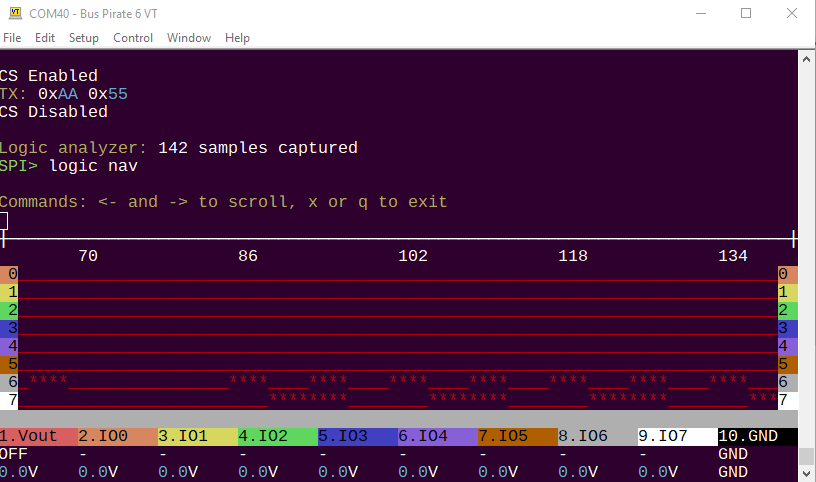
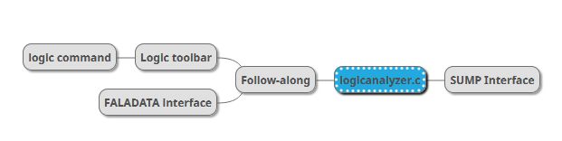

import DiscourseComments from '@site/src/components/DiscourseComments';
import BrowserWindow from '@site/src/components/BrowserWindow';

# ```logic``` Command


import OldSiteWarning from '/old-site-warning.md'

<OldSiteWarning/>




The ```logic``` command configures the logic analyzer core, and can display logic capture graphs directly in the terminal. It supports the "follow along" logic analyzer mode that triggers each time you send data to a bus. It eliminates the need setup triggers and arm a second tool for debugging. 

The Bus Pirate can be [used as a logic analyzer in multiple ways](/logic-analyzer/logicanalyzer). This page documents the ```logic``` command in the terminal.

:::warning
All Bus Pirate hardware supports the follow along logic analyzer, however only Bus Pirate 6 has a second buffer for the follow along mode. In earlier hardware **all output pins are measured behind the IO buffer**. This means the logic capture may not match the actual output of the IO buffer. **This is not a problem when the Bus Pirate is used as a logic analyzer only and all pins are inputs**.
:::

## Capabilities

- 62.5MSPS (or more if overclocked)
- 131K samples
- 8 channels
- Trigger: single pin, high or low
- Follow along logic analyzer mode
- Base pin can be set to an internal pin for debugging the Bus Pirate itself

## Latest Features and Help

<BrowserWindow>
<span className="bp-prompt">SPI></span> logic -? h<br/>
usage:<br/>
<span className="bp-info">logic analyzer usage</span><br/>
<span className="bp-info">logic	[start|stop|hide|show|nav]</span><br/>
<span className="bp-info">	[-i] [-g] [-o oversample] [-f frequency] [-d debug]</span><br/>
<span className="bp-info">start logic analyzer: logic start</span><br/>
<span className="bp-info">stop logic analyzer: logic stop</span><br/>
<span className="bp-info">hide logic analyzer: logic hide</span><br/>
<span className="bp-info">show logic analyzer: logic show</span><br/>
<span className="bp-info">navigate logic analyzer: logic nav</span><br/>
<span className="bp-info">configure logic analyzer: logic -i -o 8 -f 1000000 -d 0</span><br/>
<span className="bp-info">undocumented: set base pin (0=bufdir, 8=bufio, 20=follow along) -b: logic -b 20</span><br/>
<br/>
<span className="bp-info">logic analyzer control</span><br/>
<span className="bp-prompt">start</span>	<span className="bp-info">start logic analyzer</span><br/>
<span className="bp-prompt">stop</span>	<span className="bp-info">stop logic analyzer</span><br/>
<span className="bp-prompt">hide</span>	<span className="bp-info">hide logic graph</span><br/>
<span className="bp-prompt">show</span>	<span className="bp-info">show logic graph</span><br/>
<span className="bp-prompt">nav</span>	<span className="bp-info">navigate logic graph with arrow keys, x to exit</span><br/>
<span className="bp-prompt">-i</span>	<span className="bp-info">show configuration info</span><br/>
<span className="bp-prompt">-o</span>	<span className="bp-info">set oversample rate, multiplies the sample frequency</span><br/>
<span className="bp-prompt">-f</span>	<span className="bp-info">set sample frequency in Hz</span><br/>
<span className="bp-prompt">-0</span>	<span className="bp-info">set character used for low in graph (ex:_)</span><br/>
<span className="bp-prompt">-1</span>	<span className="bp-info">set character used for high in graph (ex:*)</span><br/>
<span className="bp-prompt">-d</span>	<span className="bp-info">set debug level: 0-2</span><br/>
<span className="bp-prompt">-h</span>	<span className="bp-info">Get additional help</span><br/>
<br/>
<span className="bp-prompt">SPI></span> <br/>
</BrowserWindow>

```logic -h``` will display the help menu with the latest options for the ```logic``` command.

## Start Logic Analyzer


```logic start``` configures the logic analyzer core for follow along mode and draws a blank logic graph. Use ```logic stop``` to stop the logic analyzer and release any resources used.

:::info
The ```logic``` command and the [follow along binmode interface](/logic-analyzer/pulseview-fala) can be run at the same time. However, the capture buffer is shared with [SUMP logic analyzer mode](/logic-analyzer/pulseview-sump). SUMP and follow along logic analyzer modes cannot be used at the same time and will result in a memory error warning.
:::

### Show/Hide Logic Graph


If the graph isn't needed, use ```logic hide``` to release it from the toolbar. Use ```logic show``` to draw the graph again showing the current capture buffer.

## Auto Capture Speed
<BrowserWindow>
<span className="bp-info">Actual speed:</span> 10kHz<br/>
<span className="bp-info">Logic analyzer speed:</span> 80000Hz (8x oversampling)<br/>
<span className="bp-info">Use the 'logic' command to change capture settings</span><br/>
<br/>
<span className="bp-info">Mode:</span> SPI<br/>
<span className="bp-prompt">SPI></span> <br/>
</BrowserWindow>

When changing protocol modes with the ```m``` command, FALA will automatically set the capture speed to oversample the bus speed by a factor of 8. 

### Change Capture Speed
<BrowserWindow>
<span className="bp-prompt">SPI></span> logic -o 16<br/>
Oversample rate set to: 16<br/>
<br/>
Logic Analyzer settings<br/>
 Oversample rate: 16<br/>
 Sample frequency: 10000Hz<br/>
<br/>
Note: oversample rate is not 1<br/>
Actual sample frequency: 160000Hz (16 * 10000Hz)<br/>
<br/>
<span className="bp-prompt">SPI></span> <br/>
</BrowserWindow>

The base capture speed or the oversample rate can can be changed with the ```logic``` command. Changing the oversample rate with the ```-o``` flag is probably easiest as the Bus Pirate will calculate the new sample frequency for you.

## Capture Samples

<BrowserWindow>
<span className="bp-prompt">SPI></span> [ 0xaa 0x55]<br/>
<br/>
CS Enabled<br/>
<span className="bp-info">TX:</span> 0x<span className="bp-float">AA</span> 0x<span className="bp-float">55</span> <br/>
CS Disabled<br/>
<br/>
<span className="bp-info">Logic analyzer:</span> 144 samples captured<br/>
<span className="bp-prompt">SPI></span> <br/>
</BrowserWindow>

Every time you send data to the bus, the logic analyzer will capture samples and the logic graph will update (if visible).

:::info
Currently the ```logic``` command only supports automatic capture in follow along mode. It does not currently support pin triggers, but it will eventually. Use ```logic -h``` to see the most recent features. 
:::

## Navigation


If there are too many samples to display at once, use ```logic nav``` to navigate the graph. The arrow keys will move the graph left and right, and ```x``` will exit the navigation mode.

## Logic Analyzer System



:::info
The ```logic``` command and the [follow along binmode interface](/logic-analyzer/pulseview-fala) can be run at the same time. However, the capture buffer is shared with [SUMP logic analyzer mode](/logic-analyzer/pulseview-sump). SUMP and follow along logic analyzer modes cannot be used at the same time and will result in a memory error warning.
:::

