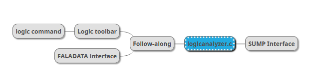
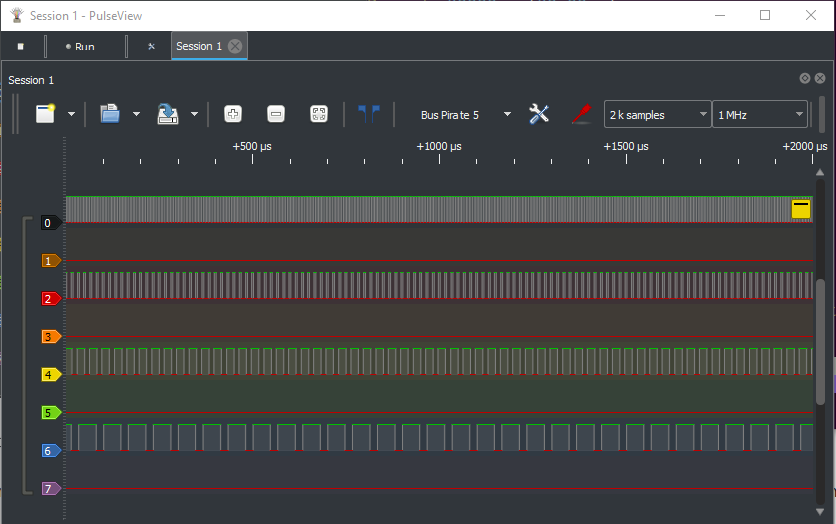
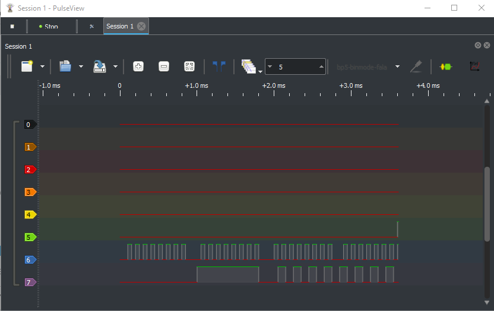
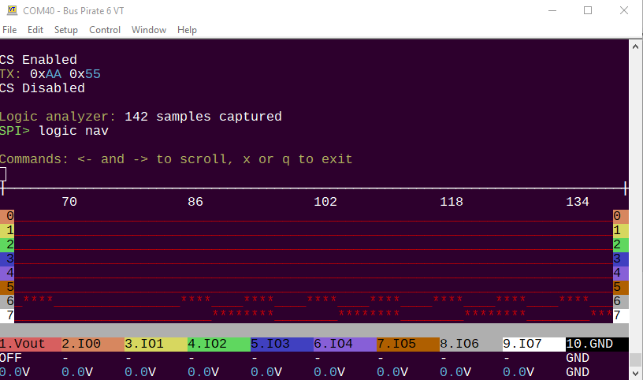

import DiscourseComments from '@site/src/components/DiscourseComments';
import BrowserWindow from '@site/src/components/BrowserWindow';

# Available Logic Analyzers



The Bus Pirate can be used as a logic analyzer in multiple ways:
- [PulseView and the SUMP interface](/logic-analyzer/pulseview-sump)
- [PulseView With the "follow along logic analyzer" interface](/logic-analyzer/pulseview-fala)
- [Directly in the terminal with the ```logic``` command](/logic-analyzer/logic-command)

## Capabilities

- 62.5MSPS (or more if overclocked)
- 131K samples
- 8 channels
- Trigger: single pin, high or low
- Follow along logic analyzer mode
- Base pin can be set to an internal pin for debugging the Bus Pirate itself

### Follow Along Logic Analyzer

Follow along means the logic analyzer triggers each time you send data to a bus. It eliminates the need setup triggers and arm a second tool for debugging. 

:::warning
All Bus Pirate hardware supports follow along logic analyzer, however only Bus Pirate 6 has a second buffer to capture pins directly. In earlier hardware **all output pins are measured behind the IO buffer**. This means the logic capture may not match the actual output of the IO buffer. **This is not a problem when the Bus Pirate is used as a logic analyzer only and all pins are inputs**.
:::

## Sigrok/PulseView (SUMP compatible)



Sigrok/PulseView is a popular and mature open source logic analyzer GUI that runs on Windows, Linux, and Mac. 
- [Learn how to use Sigrok/PulseView with the Bus Pirate](/logic-analyzer/pulseview-sump)

## Follow Along Interface



A binary mode on the second UART that announces each follow along logic capture and dumps samples to host software.
- [Sigrok/PulseView with the follow along interface](/logic-analyzer/pulseview-fala)

## ```logic``` Command



The ```logic``` command configures the logic analyzer core, and can display logic capture graphs directly in the terminal.
- [Learn more about the ```logic``` command](/logic-analyzer/logic-command)
