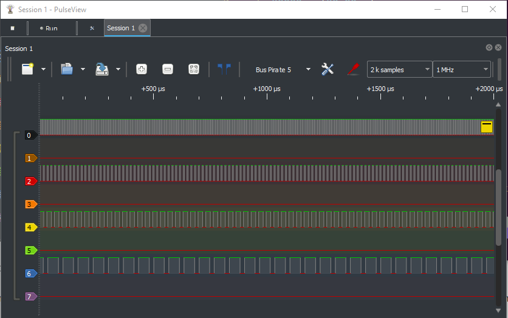
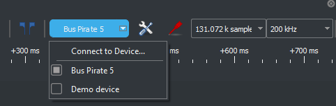
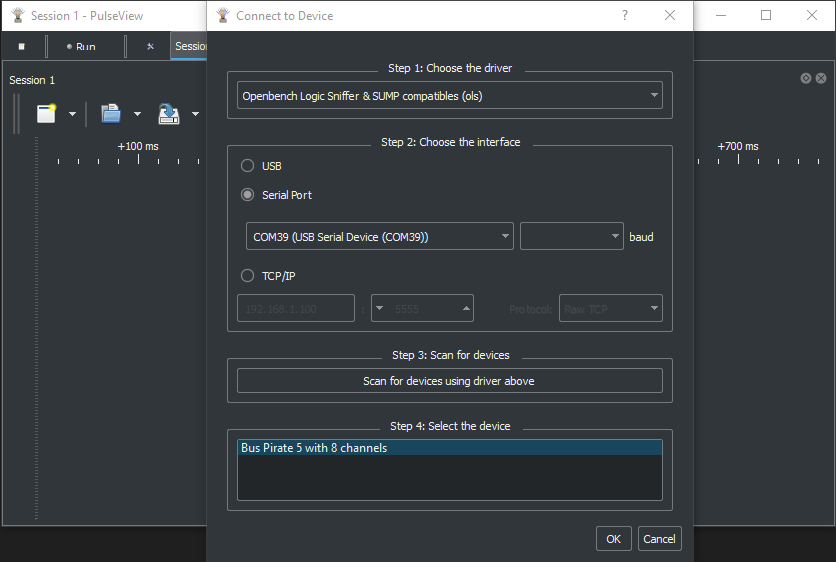
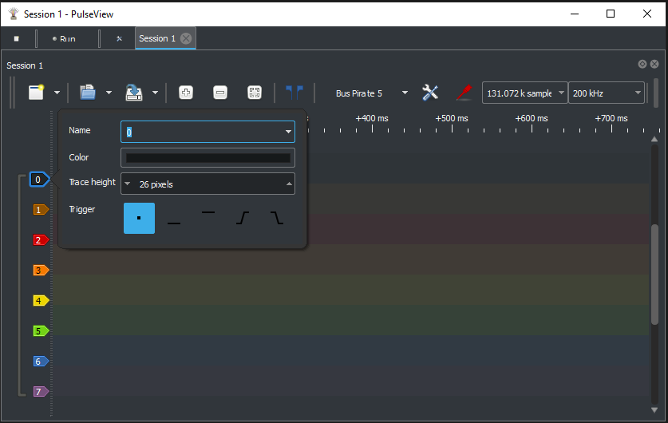
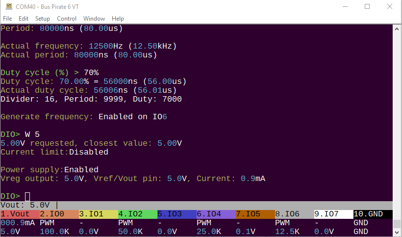

import DiscourseComments from '@site/src/components/DiscourseComments';
import BrowserWindow from '@site/src/components/BrowserWindow';

# PulseView with SUMP interface



[Sigrok/PulseView](https://sigrok.org/wiki/Main_Page) is a popular open source logic analyzer GUI that runs on Windows, Linux, and Mac. The Bus Pirate supports Sigrok/PulseView through a SUMP protocol interface.

- [Sigrok/PulseView download](https://sigrok.org/wiki/Downloads) (Linux, Mac)
- [Special patched version for Windows](https://github.com/DangerousPrototypes/BusPirate5-firmware/releases/tag/custom-patch-PulseView-0.5.0-git-d00efc6-installer)

The Bus Pirate can be [used as a logic analyzer in multiple ways](/logic-analyzer/logicanalyzer). This page documents the SUMP compatible interface.

- [Jawi OLS Client](https://github.com/jawi/ols) (Needs to be re-packaged for modern operating systems)

Other software also supports the SUMP protocol, but many haven't been updated in years and don't operate on modern operating systems.

## Capabilities

- 62.5MSPS (or more if overclocked)
- 131K samples
- 8 channels
- Trigger: single pin, high or low
- Base pin can be set to an internal pin for debugging the Bus Pirate itself

## Bus Pirate Setup
Configure the Bus Pirate for SUMP logic analyzer mode.

### Change to HiZ mode

<BrowserWindow>
<span className="bp-prompt">SPI></span> m 1<br/>
<span className="bp-info">Mode:</span> HiZ<br/>
<span className="bp-prompt">HiZ></span> <br/>
</BrowserWindow>

For general purpose logic analyzer use, change to HiZ mode with the ```m 1``` command. This will make all the pins inputs and disable pull-up resistors.

:::warning
There is no restriction on using the logic analyzer while the Bus Pirate is not in HiZ mode. However, prior to Bus Pirate hardware 6, all pins are measured behind the IO buffer. This means the logic capture may not match the actual output of the IO buffer **on pins configured as outputs**. This is not a problem when the Bus Pirate is used as a logic analyzer in HiZ mode and all pins are inputs.
:::

### Enable SUMP Interface

<BrowserWindow>
<span className="bp-prompt">HiZ></span> binmode<br/>
<br/>
<span className="bp-info">Select binary mode</span><br/>
 1. SUMP logic analyzer<br/>
 2. Binmode test framework<br/>
 3. Arduino CH32V003 SWIO<br/>
 4. Follow along logic analyzer<br/>
 x. <span className="bp-info">Exit</span><br/>
<span className="bp-prompt"> ></span> 1<br/>
<span className="bp-info">Binmode selected:</span> SUMP logic analyzer<br/>
<br/>
<span className="bp-prompt">HiZ></span> <br/>
</BrowserWindow>

Enable the SUMP binary interface with the ```binmode``` command. A SUMP-compatible logic analyzer interface will now respond to the Bus Pirate's second serial port.

## Sigrok/PulseView

- [Sigrok/PulseView download](https://sigrok.org/wiki/Downloads) (Linux, Mac)
- [Special patched version for Windows](https://github.com/DangerousPrototypes/BusPirate5-firmware/releases/tag/custom-patch-PulseView-0.5.0-git-d00efc6-installer)

Download and install Sigrok/PulseView for your operating system. There is currently a bug in the USB drivers used in the official Sigrok/PulseView Windows release. Use the patched version for Windows until a fix is accepted to the official project.

### Setup



Open PulseView. From the device drop down select ```Connect to Device```.



- Choose ```Openbench Logic Sniffer & SUMP compatables (ols)``` as the device driver
- Choose ```Serial Port``` as the interface and select the Bus Pirate secondary (binmode) serial port from the list
- Click ```Scan for devices using driver above```

The Bus Pirate device should be detected. Click ```OK``` to connect.

### Power Supply in SUMP mode

The IO buffers need a power supply, or we won't be able to see any signals. A 3.3volt power supply is automatically enabled when the SUMP serial port is opened in the following circumstances:
- If the Bus Pirate terminal **is not open**
- If the Bus Pirate terminal **is open** and in HiZ mode
The power supply is disabled when the SUMP serial port is closed.

### Configure



Select the sampling speed and number of samples to capture using the two drop down menus.

To configure a trigger, click the channel label and choose none, high, or low. The trigger type will be displayed on the graph.

### Capture


With or without a trigger, click the ```run``` button to start the capture. When complete, the captured data will be displayed in the graph.

### Capture During Use



The terminal can be used while the SUMP logic analyzer is running. You can set triggers and capture while sending or receiving data from the Bus Pirate terminal.    

To test capture during use:

- ```m 8``` - Select any mode, we'll use DIO mode because all the pins are free 
- ```G``` - Use the ```G``` command to start pulse-width modulation output on more or more pins
- ```W 5``` - Make sure the buffers are powered

:::warning
All Bus Pirates support logic capture while the hardware is in use, however only Bus Pirate 6 has a second buffer to capture pins directly. In earlier hardware **all output pins are captured behind the IO buffer**. This means the logic capture may not match the actual output of the IO buffer. **This is not a problem when the Bus Pirate is used as a logic analyzer only and all pins are inputs**.
:::

## Logic Analyzer System


:::info
The ```logic``` command and the [follow along binmode interface](/logic-analyzer/pulseview-fala) can be run at the same time. However, the capture buffer is shared with [SUMP logic analyzer mode](/logic-analyzer/pulseview-sump). SUMP and follow along logic analyzer modes cannot be used at the same time and will result in a memory error warning.
:::

## SUMP protocol

- [SUMP protocol documentation](/binmode-reference/protocol-sump)