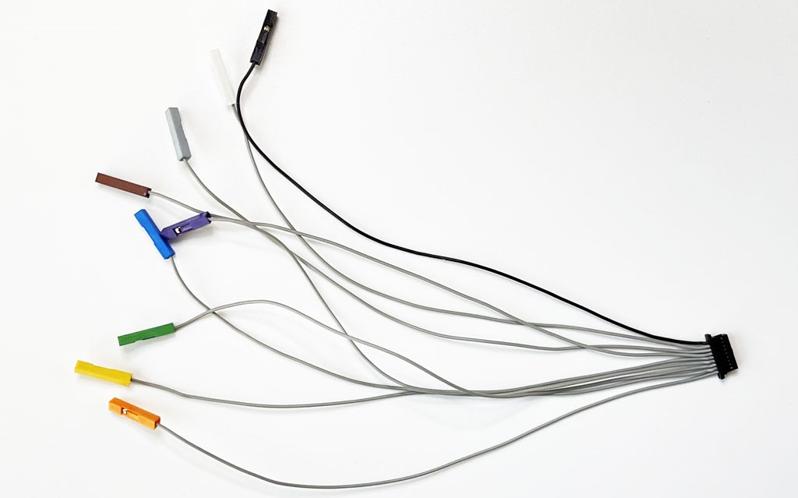

# Auxiliary Cable Kit

A collection of auxiliary cables made from premium soft and flexible silicone coated wire.

- 1 [Auxiliary Connector Cable](https://hardware.buspirate.com/cables/#auxiliary-cable)
- 4 ["Y" Splitter Cables](https://hardware.buspirate.com/cables/#y-splitter-cable) (2 grey, 1 black, 1 red)
- 10 [Jumper Cables](https://hardware.buspirate.com/cables/#jumper-cable) (8 grey, 1 black, 1 red)

The star of the collection is a 9 pin 'SH' style cable that fits the auxiliary connection below main Bus Pirate connector. This cable is handy for connecting external equipment like a logic analyzer - without cramming multiple probe hooks onto a single tiny chip lead. 

This silicone coated wire feels so nice we made a bundle of color coded jumper cables and Y style splitter cables too.

- [Available at DirtyPCBs](href="https://dirtypcbs.com/store/designer/details/ian/6620/auxilary-cable-kit")

### Auxiliary Connector Cable

A 9 pin cable connects the Bus Pirate auxiliary connector to external tools like logic analyzers, oscilloscopes etc. 

- 9pin 1.0mm 'SH' female connector to 9 x 1pin 2.54mm 'DuPont' female connectors
- 30AWG super soft and flexible premium silicone coated wire. The inner strands are very fine tinned copper. The silicone coating has a very nice feel, and is tolerant of high heat and chemicals.

|Pin|Color|Label|Description|
|-|-|-|-|
|1-8|Grey|IO0 - IO7|Buffered IO pins with voltage measurement and optional 10K pull-up resistors|
|9|Black|GND|Ground pin|

Resources:

- [Auxiliary cable hardware documentation](https://hardware.buspirate.com/cables/#auxiliary-cable)

:::note
The first version of the auxiliary cable has all back crimp housings. The second version has color coded crimp housings. Version one is in the current auxiliary cable kit, version 2 is available separately until we receive matching Y and splitter cables to make a kit.
:::

### Y Splitter Cable

A high quality splitter cable to make multiple connections to a single pin. Connect power and ground to multiple devices, or share a 1-Wire, I2C or SPI bus between several chips.

- 1 x black, 1 x red and 2 x grey to color code your work
- 1 x 1pin 2.54mm 'DuPont' female connector to 2 x 1pin 2.54mm 'DuPont' female connectors
- 22AWG super soft and flexible premium silicone coated wire. The inner strands are very fine tinned copper. 22AWG has 60 strands 0.08mm thick, compared to 8-12 strands in common wires. The silicone coating has a very nice feel, and is tolerant of high heat and chemicals.

Resources:

- [Y splitter hardware documentation](https://hardware.buspirate.com/cables/#y-splitter-cable)

### Jumper Cable

A high quality jumper wire to quickly connect your latest breakout board.

- 1 x black, 1 x red and 8 x grey to color code your work
- 1pin 2.54mm 'DuPont' female connector to 1pin 2.54mm 'DuPont' female connector
- 22AWG super soft and flexible premium silicone coated wire. The inner strands are very fine tinned copper. 22AWG has 60 strands 0.08mm thick, compared to 8-12 strands in common wires. The silicone coating has a very nice feel, and is tolerant of high heat and chemicals.

Resources:
- [Jumper cable hardware documentation](https://hardware.buspirate.com/cables/#jumper-cable)

## Premium silicone coated wire

All of the Bus Pirate cables are made with super soft and flexible premium silicone coated wire. The inner strands are very fine tinned copper. 22AWG has 60 strands 0.08mm thick (bottom), compared to 8-12 strands in common wire (top). The silicone coating has a very nice feel, and is tolerant of high heat and chemicals.

## Join the fun
### Get Bus Pirate 5
import FooterGet from '../../_common/_footer/_footer-get.md'

<FooterGet/>

### Community
import FooterCommunity from '../../_common/_footer/_footer-community.md'

<FooterCommunity/>

### Documentation
import FooterDocs from '../../_common/_footer/_footer-docs.md' 

<FooterDocs/>
