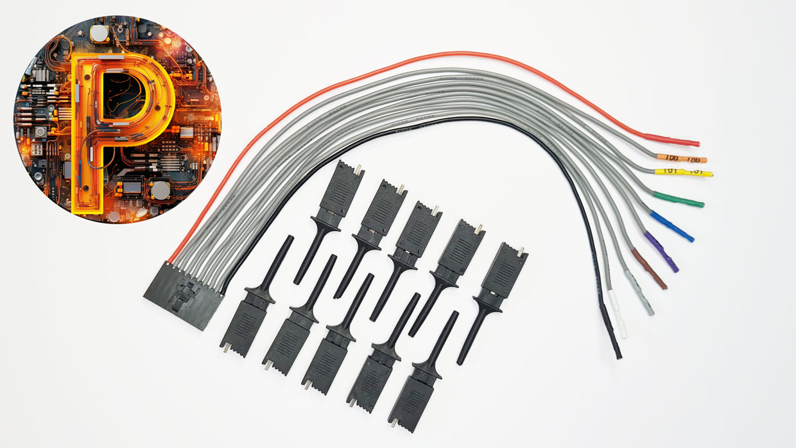
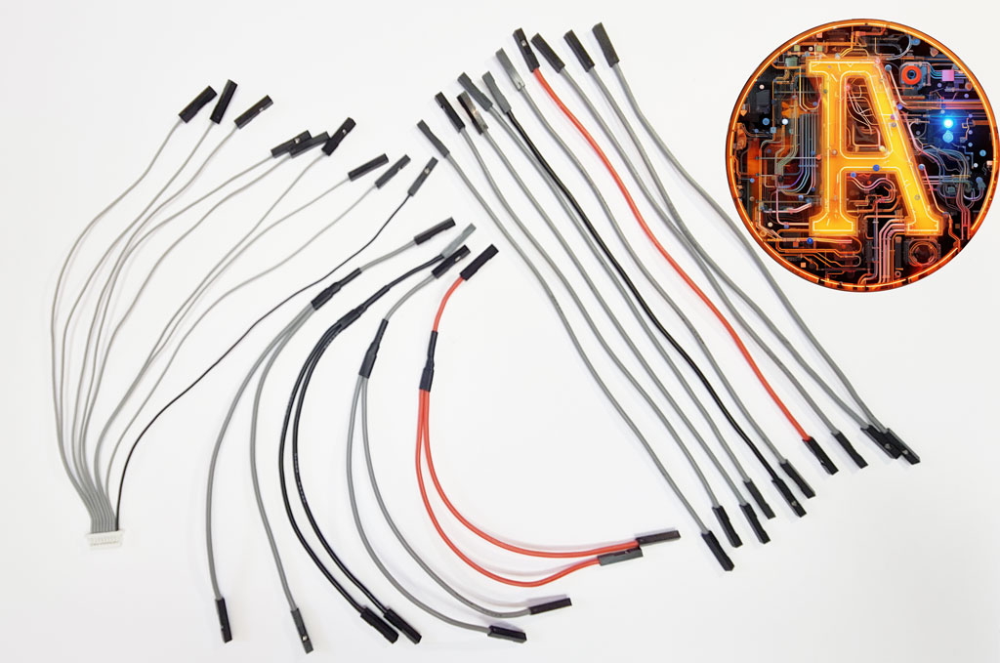
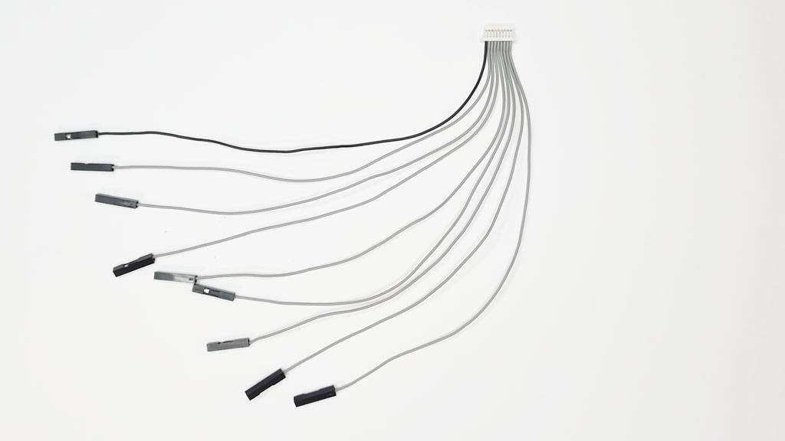
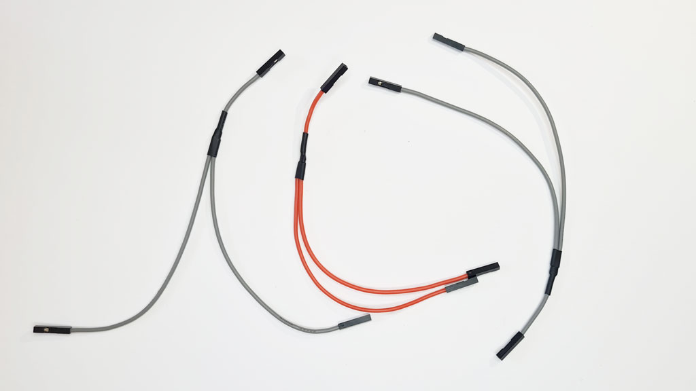
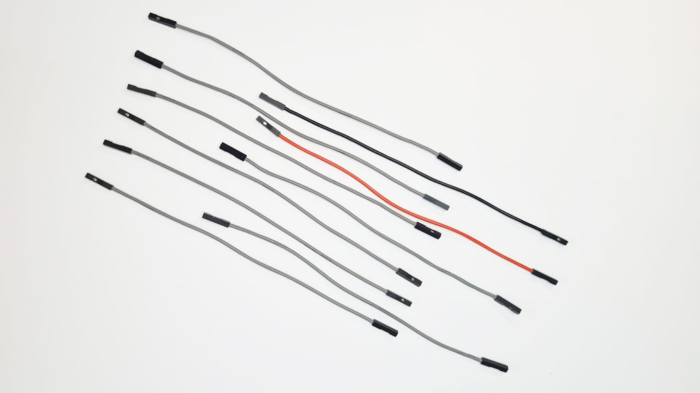

# Cables

## Probe Cable Set

- 1 Premium Probe Cable
- 10 Shenzhen starter probe hooks

A keyed and locking probe cable made of premium soft and flexible silicone coated wire connects to the Bus Pirate 10 pin main header. The ends are 2.54mm Dupont connectors that fit many different types of probe hooks as well as our custom milled breadboard adapter pins. Each lead is wrapped with labeled and color coded shrink tube. 10 black [Shenzhen starter hooks](overview/probehooks#the-shenzhen-hook) are included. See the [probe hook guide](overview/probehooks) for an overview of common affordable hooks.

-[Available at DirtyPCBs](https://dirtypcbs.com/store/designer/details/ian/6619/bus-pirate-5-probe-cable-kit)

### Premium Probe Cable

- Keyed, locking 10pin 2.54mm female connector to 10 x 1pin 2.54mm DuPont crimps
- 2.54mm 'DuPont' female crimps, without a housing. Many test probes will now accept a 2.54mm Dupont crimp housing, but some don't. Each lead is wrapped with labeled and color coded shrink tube.
- Shrink tube varies wildly in color quality. A lot of colors just don't pop: dull lifeless pastels or just too dark. We ended up sourcing from two manufacturers to get a reasonably nice set of colors. 
- 22AWG super soft and flexible premium silicone coated wire. The inner strands are very fine tinned copper. 22AWG has 60 strands 0.08mm thick, compared to 8-12 strands in common wires. The silicone coating has a very nice feel, and is tolerant of high heat and chemicals.

|Pin|Color|Label|Description|
|-|-|-|-|
|1|Red|VOUT/VREF|Supplies 1-5volts up to 400mA with resetable fuse (VOUT) **OR** connects an external voltage source to the Bus Pirate IO interface|
|2-9|Various|IO0 - IO7|Buffered IO pins with voltage measurement and optional 10K pull-up resistors|
|10|Black|GND| Ground pin|

<!-- ### Milled Breadboard Pins

Custom milled pins connect the Bus Pirate DuPont-style 2.54mm female connectors to a breadboard or pin header. We designed these little pins after searching for better way to connect to prototype boards and breakout headers, things that just don’t cooperate with probe hooks intended to grab onto IC legs.-->

### Starter Hooks

- 10 Shenzhen hooks - cheap and black. Oh so fashionable! 
- See the probe hook guide for an overview of other common affordable hooks that fit the probe cable.

## Auxiliary Cable Set

- 1 Auxiliary Connector Cable
- 4 "Y" Splitter Cables (2 grey, 1 black, 1 red)
- 10 Jumper Cables (8 grey, 1 black, 1 red)

A collection of auxiliary cables made from premium soft and flexible silicone coated wire. The star of the collection is a 9 pin 'SH' style cable that fits the auxiliary connection below main Bus Pirate connector. This cable is handy for connecting external equipment like a logic analyzer - without cramming multiple probe hooks onto a single tiny chip lead. This silicone coated wire feels so nice we made a bundle of color coded jumper cables and Y style splitter cables too.

- [Available at DirtyPCBs](https://dirtypcbs.com/store/designer/details/ian/6620/auxilary-cable-kit)

### Auxiliary Connector Cable

- 9pin 1.0mm 'SH' female connector to 9 x 1pin 2.54mm 'DuPont' female connectors
- 30AWG super soft and flexible premium silicone coated wire. The inner strands are very fine tinned copper. The silicone coating has a very nice feel, and is tolerant of high heat and chemicals.

|Pin|Color|Label|Description|
|-|-|-|-|
|1-8|Grey|IO0 - IO7|Buffered IO pins with voltage measurement and optional 10K pull-up resistors|
|9|Black|GND|Ground pin|

### Y Splitter Cable

- 1 x black, 1 x red and 2 x grey to color code your work
- 1 x 1pin 2.54mm 'DuPont' female connector to 2 x 1pin 2.54mm 'DuPont' female connectors
- 22AWG super soft and flexible premium silicone coated wire. The inner strands are very fine tinned copper. 22AWG has 60 strands 0.08mm thick, compared to 8-12 strands in common wires. The silicone coating has a very nice feel, and is tolerant of high heat and chemicals.

### Jumper Cable

- 1 x black, 1 x red and 8 x grey to color code your work
- 1pin 2.54mm 'DuPont' female connector to 1pin 2.54mm 'DuPont' female connector
- 22AWG super soft and flexible premium silicone coated wire. The inner strands are very fine tinned copper. 22AWG has 60 strands 0.08mm thick, compared to 8-12 strands in common wires. The silicone coating has a very nice feel, and is tolerant of high heat and chemicals.

## Premium silicone coated wire

All of the Bus Pirate cables are made with super soft and flexible premium silicone coated wire. The inner strands are very fine tinned copper. 22AWG has 60 strands 0.08mm thick (bottom), compared to 8-12 strands in common wire (top). The silicone coating has a very nice feel, and is tolerant of high heat and chemicals.

## Join the fun
### Get Bus Pirate 5
- [Bus Pirate 5 assembled PCB preview release](https://dirtypcbs.com/store/designer/details/ian/6621/bus-pirate-5-preview-version-pcb-only)
- [Bus Pirate Premium Probe Cable](https://dirtypcbs.com/store/designer/details/ian/6619/bus-pirate-5-probe-cable-kit)
- [Bus Pirate Premium Auxiliary Cables](https://dirtypcbs.com/store/designer/details/ian/6620/auxilary-cable-kit)
- Bus Pirate 5 and enclosure (coming soon!)
