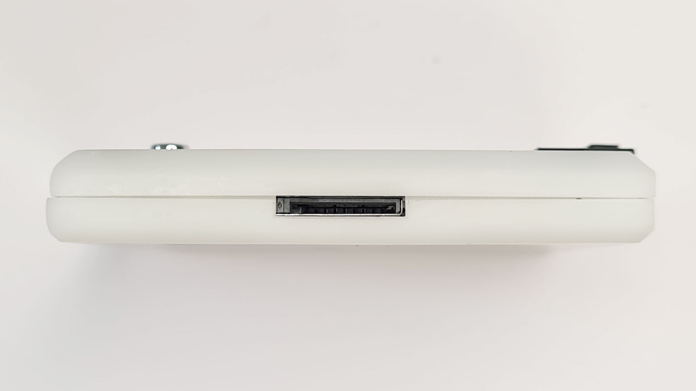

# Bus Pirate 5


Bus Pirate 5 is the universal serial interface tool designed by hackers, for hackers. It's crammed full of hardware and firmware features that make probing chips pleasant and easy.

- LCD - A beautiful 240x320 pixel color IPS (all angle viewing) LCD acts as a pin label, while also showing the voltage on each pin and the current consumption of the programmable power supply unit. 
- 16 RGB LEDs - It's customary to have an indicator LED, so to check that box we added 16 SK6812 RGB LEDs.
- Just one button - 16 party LEDs but just one button!

:::info
This is a general overview of Bus Pirate 5. See the [hardware manual](https://hardware.buspirate.com/) for technical details.
:::


## Main connector


- 2.54mm 10 pin connector - A keyed locking connector that works just as well with common jumper wires and 2.54mm 'DuPont' style connectors.


|Pin|Label|Description|
|-|-|-|
|1|VOUT/VREF|Pin supplies 1-5volts up to 400mA with current limit and resetable fuse (VOUT) **OR** connects an external voltage source to the Bus Pirate IO interface|
|2-9|IO0 - IO7|Buffered IO pins with voltage measurement and optional 10K pull-up resistors|
|10|GND| Ground pin|

## Auxiliary connector


- 1mm 9 pin connector - Intended as a tap point for a logic analyzer. No more trying to balance two or three probes on a single pin, just tap the bus activity from this secondary header.

|Pin|Label|Description|
|-|-|-|
|1-8|IO0 - IO7|Buffered IO pins with voltage measurement and optional 10K pull-up resistors|
|9|GND| Ground pin|

## microSD Card Socket



- microSD card socket - When plugged into a PC USB port, the SD card appears as a readable and writable disk drive. 


- SD card storage is used to save global and mode configuration preferences in simple JSON files. 

## USB C connector


- Modern USB C connector. Only RP2040 supported USB modes are available.

## Bootloader button


- Normally you just hit the ```$``` key in the Bus Pirate terminal to enter bootloader mode for firmware upgrades. You can also use the button on the bottom to activate the bootloader manually.

## JTAG debug header


- A three pin debugging port is exposed on the bottom of the board. See the development section for more info on developing for the Bus Pirate.

|Pin|Label|Description|
|-|-|-|
|1|GND|Ground connection (furthest from the edge of the PCB/case)|
|2|SWDIO|JTAG Data IO|
|3|SWCLK|JTAG Clock (closest to the edge of the PCB/case)|

## VT100 


- VT100 terminal emulation supports color and a live statusbar view of the voltage and functions on each pin.


## Join the fun
### Get Bus Pirate 5
- [Bus Pirate 5 assembled PCB preview release](https://dirtypcbs.com/store/designer/details/ian/6621/bus-pirate-5-preview-version-pcb-only)
- [Bus Pirate Premium Probe Cable](https://dirtypcbs.com/store/designer/details/ian/6619/bus-pirate-5-probe-cable-kit)
- [Bus Pirate Premium Auxiliary Cables](https://dirtypcbs.com/store/designer/details/ian/6620/auxilary-cable-kit)
- Bus Pirate 5 and enclosure (coming soon!)

### Files
- [Bus Pirate 5 hardware repository](https://github.com/DangerousPrototypes/BusPirate5-hardware)
- [Bus Pirate 5 firmware repository](https://github.com/DangerousPrototypes/BusPirate5-firmware)

### Community
- [Forum](https://forum.buspirate.com)
- [Blog](https://buspirate.com/) and mailing list
- [Mastodon](https://mastodon.social/@buspirate)
- [BlueSky](https://bsky.app/profile/buspirate.bsky.social)
- [Twitter](https://twitter.com/dangerousproto)

## Other Documentation
Bus Pirate 5 documentation is broken into [hardware](https://hardware.buspirate.com/introduction) and [firmware](https://firmware.buspirate.com/introduction) sections so it can be versioned easily with each update. Here's some other fun stuff you might enjoy.
- [Component selection and sourcing](https://hardware.buspirate.com/components/introduction)
- [Case/enclosure](https://hardware.buspirate.com/enclosure/fdm-shell)
- [Cables](https://firmware.buspirate.com/overview/cables)
- [Milled breadboard pins](https://firmware.buspirate.com/overview/milled-breadboard-pins)
- [Hardware users guide](https://firmware.buspirate.com/overview/hardware)
- [Firmware tutorials](https://firmware.buspirate.com/tutorial-basics/quick-setup)
- [Command reference](https://firmware.buspirate.com/command-reference/all-commands)
- [Firmware development](https://hardware.buspirate.com/development/code) and [translation](https://hardware.buspirate.com/development/translation)
- [Manufacturing resources](https://hardware.buspirate.com/category/manufacturing)

