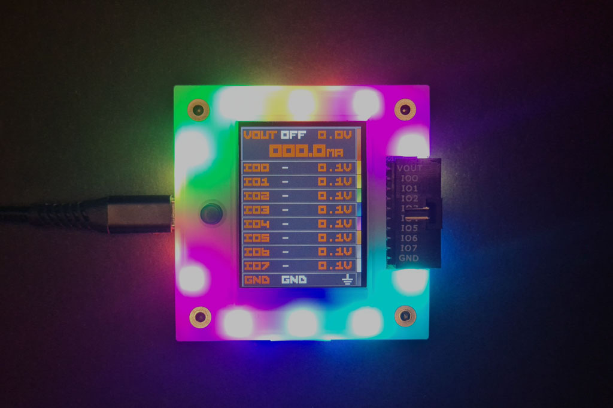
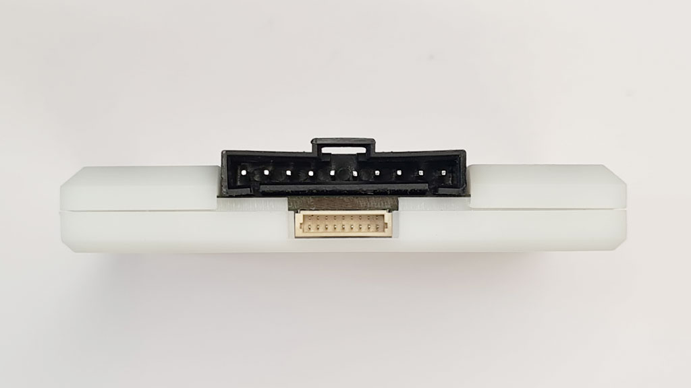
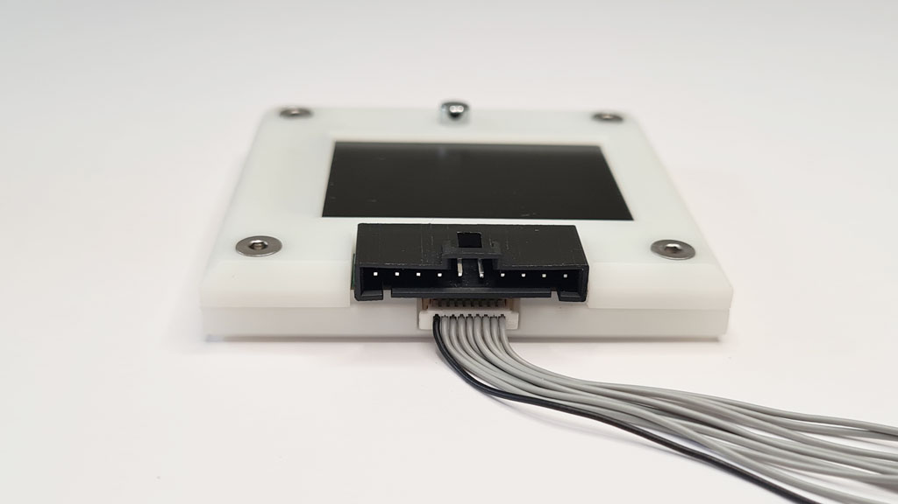
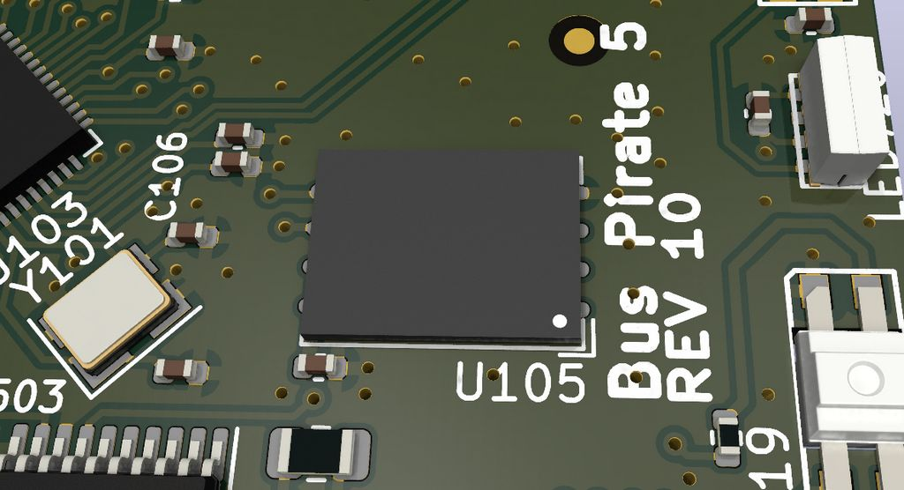
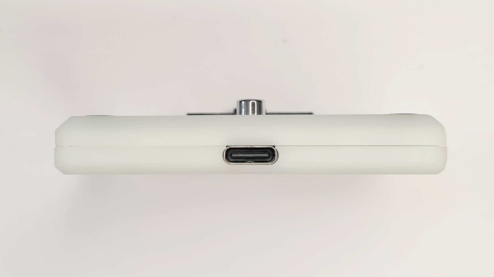
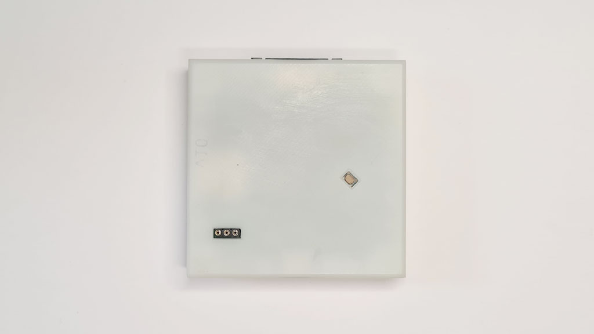
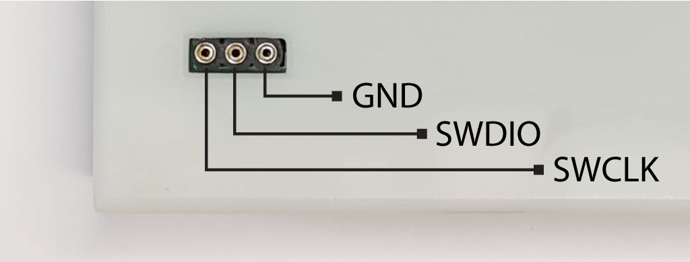

# Bus Pirate 5 Firmware Guide



Bus Pirate 5 is the latest edition of the original universal serial interface trusted by hackers since 2008.

Can't get a chip to work? Is it the circuit, code, bad part or a burned out pin? The Bus Pirate sends commands over common serial protocols (1-Wire, I2C, SPI, UART, MIDI, serial LEDs, etc!) so you can get to know a chip before prototyping. Updated with tons of new features and tools, talking to chips and probing interfaces is more fun than ever!

## VT100 terminal interface


VT100 terminal emulation supports color and a live statusbar view of the voltage and functions on each pin. Type simple commands into the terminal, the Bus Pirate translates them into popular serial protocols and displays the response. Learn how a chip works without touching a line of code.

## Specifications

- Raspberry Pi RP2040 with 128Mbit program flash
- 8 powerful IO pins - Support multiple protocols from 1.2-5volts. Analog voltage measurement and optional 10K pull-ups on all pins
- 1-5volt output power supply - 0-500mA current limit, current sense, resettable fuse and protection circuit
- 1Gbit NAND flash - Store settings and files. Appears as a USB drive.
- LCD - A beautiful 240x320 pixel color IPS (all angle viewing) LCD acts as a pin label, while also showing the voltage on each pin and the current consumption of the programmable power supply unit
- 18 RGB LEDs - It's customary to have an indicator LED, so to check that box we added 16 SK6812 RGB LEDs.
- Just one button - 18 party LEDs but just one button!
- 1-Wire, I2C, SPI, UART, MIDI, serial LEDs supported, more to come!

Bus Pirate 5 is the universal serial interface tool designed by hackers, for hackers. It's crammed full of hardware and firmware features to make probing chips pleasant and easy.

### Get Bus Pirate 5
import FooterGet from '../../_common/_footer/_footer-get.md' 

<FooterGet/>  

:::info
This is the user guide for Bus Pirate 5. See the [hardware documentation](https://hardware.buspirate.com/) for all the technical details.
:::

## LCD

A beautiful 240x320 pixel color IPS (all angle viewing) LCD acts as a pin label, while also showing the voltage on each pin and the current consumption of the programmable power supply unit

## 18 RGB LEDs

It's customary to have an indicator LED, so to check that box we added 18 programmable SK6812 RGB LEDs.

## Main connector


2.54mm 10 pin connector - A keyed locking connector that works just as well with common jumper wires and 2.54mm 'DuPont' style connectors.

|Pin|Label|Description|
|-|-|-|
|1|VOUT/VREF|Pin supplies 1-5volts up to 400mA with current limit and resetable fuse (VOUT) **OR** connects an external voltage source to the Bus Pirate IO interface|
|2-9|IO0 - IO7|Buffered IO pins 1.2-5volt output with voltage measurement and optional 10K pull-up resistors|
|10|GND| Ground pin|

## Auxiliary connector



1mm 9 pin connector - Intended as a tap point for a logic analyzer. No more trying to balance two or three probes on a single pin, just tap the bus activity from this secondary header.

|Pin|Label|Description|
|-|-|-|
|1-8|IO0 - IO7|Buffered IO pins with voltage measurement and optional 10K pull-up resistors|
|9|GND| Ground pin|

## 1Gbit NAND flash



1Gbit (~100MB usable) NAND flash - Appears as a readable and writable disk drive when plugged into a USB port. 


Flash storage is used to save global and mode configuration preferences in simple JSON files. 

## Just one button

18 party LEDs but just one button! This is due to the low pin count of the RP2040. The button is used to escape modes, production programming and user defined functions.

## USB C connector


Modern USB C connector. Only RP2040 supported USB modes are available.

## USB bootloader



Updating is as simple as dragging a file onto the disk. 

Normally the ```$``` key in the Bus Pirate terminal enters bootloader mode for firmware upgrades. You can also use the button on the bottom to activate the bootloader manually. 

## JTAG debug header


A three pin debugging port is exposed on the bottom of the board. See the development section for more info on developing for the Bus Pirate.

|Pin|Label|Description|
|-|-|-|
|1|GND|Ground connection (furthest from the edge of the PCB/case)|
|2|SWDIO|JTAG Data IO|
|3|SWCLK|JTAG Clock (closest to the edge of the PCB/case)|

## Join the fun

### Get Bus Pirate 5

<FooterGet/>

### Files
import FooterFiles from '../../_common/_footer/_footer-files.md'

<FooterFiles/>

### Community
import FooterCommunity from '../../_common/_footer/_footer-community.md'

<FooterCommunity/>

### Documentation
import FooterDocs from '../../_common/_footer/_footer-docs.md' 

<FooterDocs/>

## FCC compliance statement
This device complies with part 15 of the FCC Rules. Operation is subject to the following two conditions: (1) this device may not cause harmful interference, and (2) this device must accept any interference received, including interference that may cause undesired operation.

## CE compliance
The Bus Pirate has been lab tested to comply with European CE requirements.


