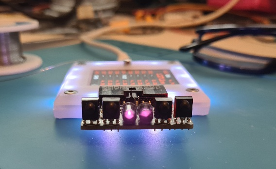
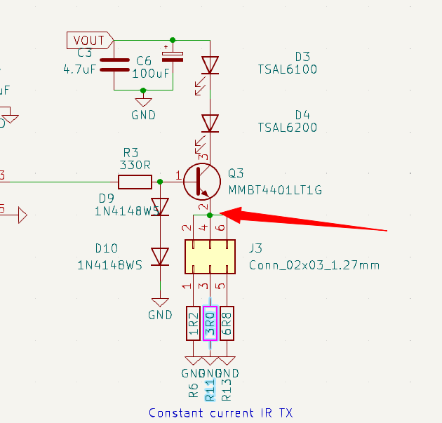
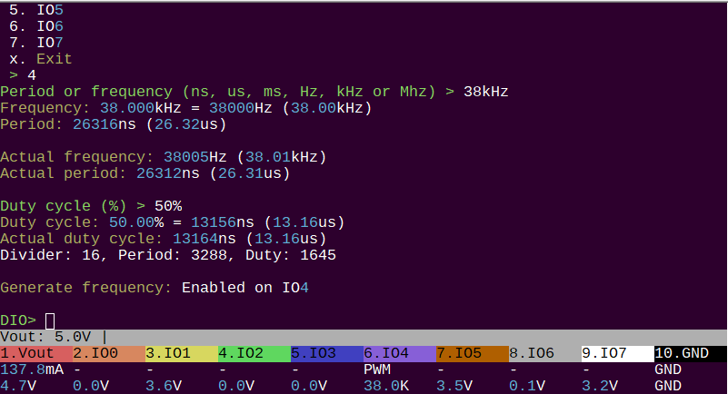
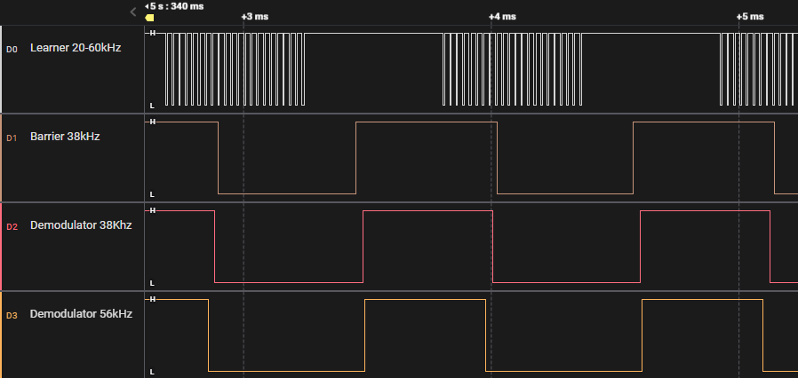
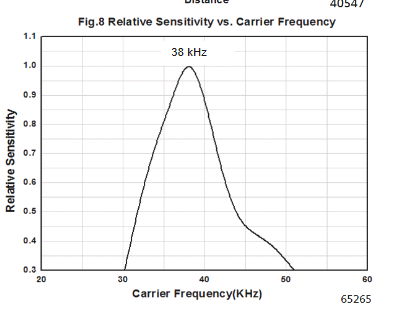
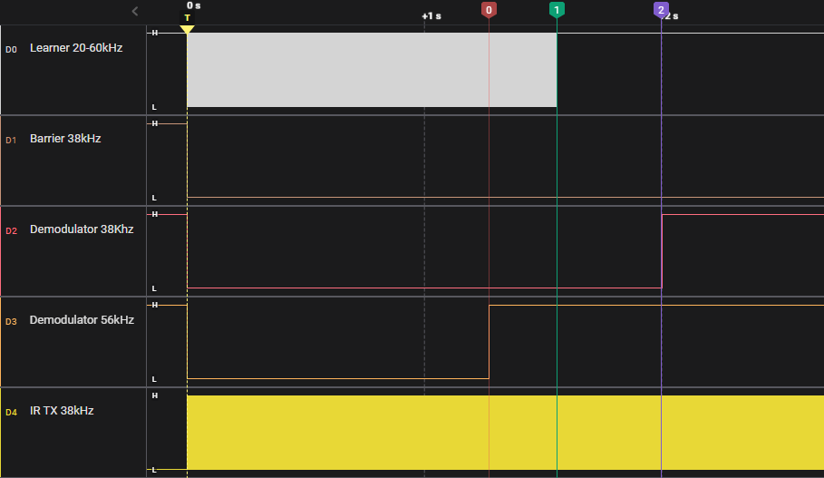
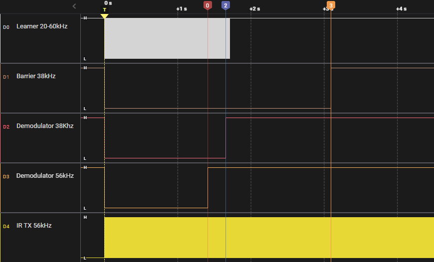
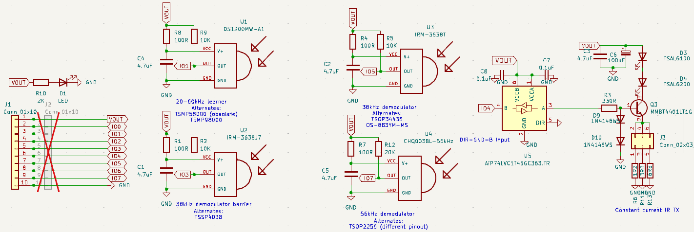

# Infrared RX/TX Toy

 

Use a remote control with your computer, view infrared signals on a logic analyzer, or capture and replay remote control buttons. Infrared Toy v3 brings new life to an [old favorite](http://dangerousprototypes.com/docs/USB_IR_Toy_v2) with much more powerful transmitter LEDs, and a full array of receivers to cover most common, and uncommon, infrared protocols.

:::warning
Infrared Toy v3 is "in development". If hardware is available it has passed basic functionality tests, but there isn't full documentation or support just yet. At this stage, it's best suited for developers who are comfortable with hardware and firmware development. Or for those who want to follow along.
:::

import FooterCart from '/_common/_footer/_footer-cart.md'

<FooterCart/>

## Transmitters
|LED|Angle|Output|Current|Brand|Part|
|-|-|-|-|-|-|
|Narrow angle|+/-10 degrees|940nm infrared|100mA-1.5A*| Vishay|TSAL6100|
|Medium angle|+/-17 degrees|940nm infrared|100mA-1.5A*| Vishay|TSAL6200|

\* 200mA at 50% duty cycle with pulse time < 100uS

The infrared transmitter has a constant current driver and two genuine Vishay LEDs. 

- TSAL6100 is a narrow beam LED, for long distance focused transmission. 
- TSAL6200 has a moderately wider beam that will cover a larger area, but at a shorter distance. 
- A +/-25 degree TSAL6400 wide beam version is also available, but the experts at [AnalysIR](https://www.analysir.com/) recommended 6100 and 6200 as the best pairing.

Output currents of ~100mA, ~200mA and ~300mA are selected by the jumper at the center of the PCB. The LEDs are rated for 100mA constant current output. Higher currents are possible, but must be a pulse modulated signal (PWM) with less than 50% duty cycle or the LEDs may be damaged. 

:::warning
The LEDs are rated for 100mA constant current output. Higher currents are possible, but must be a pulse modulated signal (PWM) with less than 50% duty cycle or the LEDs may be damaged. Be cautious not to power the LED continuously at 200/300mA.
:::

### Infrared LED output

The LEDs are switched by a [constant current driver](http://dangerousprototypes.com/docs/USB_IR_Toy_v2#Infrared_transmitter), the current remains fixed even with variations in supply voltage and LED forward voltage. 

The current through the LEDs is equal to the current through the selected resistor (R6, R11, R13). Using Ohm’s law we should be able verify the transmit current by measuring at the high side of the resistors (red arrow).

#### Setup

To start, let's generate a 38kHz signal with a 50% duty cycle. This is the most common IR transmission modulation frequency.

- **W 5** - enable a 5 volt power supply
- **G** - setup PWM ouput, choose IO4 for the IR Toy infrared LED transmit pin
- Set **38kHz** output at **50%** duty cycle

#### Base voltage

First, let's check the voltage at the base of the transistor (Q3 pin 1). Two diodes (D9, D10) offset the base voltage by 1.2-1.4 volts. 1.33 volts, so far so good.

#### 100mA transmit current

Now, with the jumper in the 100mA position, we measure the voltage at the high side of R13 (6.8 Ohms). 0.65 volts/6.8 Ohms = 0.0955A = 95.5mA. This is close enough to the 100mA target. A safe level to run these LEDs continuously.

:::tip
100mA is the maximum continuous current for these LEDs. Higher currents are possible, but must be a pulse modulated signal (PWM) with less than 50% duty cycle or the LEDs may be damaged. 
:::

#### 200mA transmit current

With the jumper in the 200mA position, the voltage at the 3 Ohm resistor measures 0.62volts. 0.62 volts/ 3 Ohms = 0.206A = 206mA. This is close enough to the 200mA target.

:::warning
Only use the 200mA setting at 50% duty cycle or less. Continuous operation at 200mA will damage the LEDs.
:::

#### 300mA transmit current

Finally, with the jumper in the 300mA position, the voltage at the 1.2 Ohm resistor measures 0.47 volts. 0.47 volts/ 1.2 Ohms = 0.391A = 391mA. This is a bit high, but the idea is to get as close to maximum as possible. 

:::warning
Only use the 300mA setting at 50% duty cycle or less **and** short bursts of less than 100uS. Continuous operation at 300mA will damage the LEDs.
:::

## Receivers
| Sensor                        | Frequency|Brand     | Part            | C     | R    | Pull-up |
|-------------------------------|-----------|-----------------|-------|------|---------|-|
| Learner                       | 20-60kHz|Os-opto   | OS1200MW-A1     | 4.7uF | 100R | 10K     |
| Barrier                       | 38kHz|Everlight | IRM-3638J7      | 4.7uF | 100R | 10K     |
| 38kHz demodulator |36-40kHz | Everlight | IRM-3638T       | 4.7uF | 100R | 10K     |
| 56kHz demodulator|56kHz  | CHQ       | CHQ0038L-56kHz  | 4.7uF | 100R | 20K  |

IR Toy v3 has four infrared receivers that cover most common **and** uncommon infrared protocols/frequencies.

Here's what it looks like when we hit the sensors with an IR remote control from close range. 

### 20-60kHz Learner 

Passes through true, modulated signals in the range 20kHz to 60kHz. Lower and higher frequencies should be filtered out, creating less false readings. This is called a "learner" because it is used in universal remote controls to copy/learn other remote signals.

### 38kHz Barrier 

Demodulates an IR signal to high and low. When IR light modulated in the range of 36-40kHz hits the sensor, it outputs low. The learner is passing the modulated signal (lots of up and down). The barrier, and other demodulators, convert those bursts to high and low. Barrier sensors are used to detect a break in a beam of light for door sensors, soap dispensers, automatic faucets and in automated production line equipment.  

This sensor is centered at 38kHz, but is 90% effective in the common 36-40kHz range.

### 38kHz demodulator

Unlike the barrier type demodulator, this sensor attempts to filter out unwanted signals that don't resemble a remote control protocol. It has a minimum and maximum burst timeout, as well as automatic gain control. Various models are available with filter settings that match specific remote control protocols to maximize reception range in TVs and other IR remote controlled appliances. This sensor is centered at 38kHz, but is 90% effective in the common 36-40kHz range.

### 56kHz demodulator

Similar to the 38kHz demodualtor, but centered in the very uncommonly used 56kHz range. Most vendors don't want to sell us these parts because they're obsolete. We eventually found a factory that could make a small custom batch. It's not strictly needed, but we want the board to cover all the bases. Also, it just looks cool to have 4 sensors and 2 LEDs.

### Infrared sensor input

Let's take a look at the timeout and signal shaping embedded in each sensor. First, setup a 38kHz signal with a 50% duty cycle on the IR transmitter.

- **W 5** - enable a 5 volt power supply
- **G** - setup PWM ouput, choose IO4 for the IR Toy infrared LED transmit pin
- Set **38kHz** output at **50%** duty cycle

The bottom trace shows the Infrared Transmit LED PWM at 38kHz. The IR LEDs are transmitting a 38kHz modulated signal.

- **20-60kHz Leaner** - passes the modulated 38kHz signal through, matching the highs and lows of the transmitted signal. This version times out after about 1.5 seconds, but other versions will pass the signal indefinitely.
- **38kHz Barrier** - stays low for as long as the 38kHz modulated signal is applied.
- **38kHz demodulator** - after about 2 seconds it times out and, probably, internally adjusts the gain in an attempt to filter out the ongoing "noise".
- **56kHz demodulator** - Wait, shouldn't this sensor filter out the 38kHz modulated signal? Yes and no. If the signal source is a significant distance away, the 56kHz would be significantly less sensitive than the 38kHz sensors. On the test bench though, the 38kHz signal bounces off near objects and is powerful enough to activate the 56kHz sensor too. This sensor also times out a little more than a second.

Let's change to that odd-ball 56kHz signal.
- **g** to disable the 38kHz signal
- **G** - setup PWM ouput, choose IO4 for the IR Toy infrared LED transmit pin
- Set **56kHz** output at **50%** duty cycle

Both 38kHz centered sensors respond to the 56kHz signal when it is powerful and nearby, but notice at 3 seconds (marker 3) the barrier sensor also goes high. 

This is because I moved the IR board to point at a distant wall instead of nearby objects. When the signal has to travel a few meters, the 38kHz barrier sensor is no longer sensitive enough to detect it.

## Schematic

IR Toy v3 [schematic and PCB](https://github.com/DangerousPrototypes/BusPirate5-hardware) are available in the Bus Pirate 5 hardware repository.

## BOM

| Item | Quantity | Reference(s) | Value | Footprint |
|------|----------|--------------|-------|-----------|
| 1 | 5 | C1, C2, C3, C4, C5 | 4.7uF | Capacitor_SMD:C_0805_2012Metric |
| 2 | 1 | C6 | 100uF | Capacitor_Tantalum_SMD:CP_EIA-3528-21_Kemet-B_Pad1.50x2.35mm_HandSolder |
| 3 | 2 | C7, C8 | 0.1uF | Capacitor_SMD:C_0805_2012Metric |
| 4 | 1 | D1 | LED | LED_SMD:LED_0805_2012Metric |
| 5 | 1 | D3 | TSAL6100 | LED_THT:LED_D5.0mm_Horizontal_O1.27mm_Z3.0mm_IRGrey |
| 6 | 1 | D4 | TSAL6200 | LED_THT:LED_D5.0mm_Horizontal_O1.27mm_Z3.0mm_IRGrey |
| 7 | 2 | D9, D10 | 1N4148WS | Diode_SMD:D_SOD-323F |
| 8 | 1 | J1 | Conn_01x10 | Connector_PinSocket_2.54mm:PinSocket_1x10_P2.54mm_Horizontal |
| 9 | 1 | J3 | Conn_02x03_1.27mm | Connector_PinHeader_1.27mm:PinHeader_2x03_P1.27mm_Vertical |
| 10 | 1 | Q3 | MMBT4401LT1G | Package_TO_SOT_SMD:SOT-23 |
| 11 | 4 | R1, R4, R7, R8 | 100R | Resistor_SMD:R_0805_2012Metric |
| 12 | 3 | R2, R5, R9 | 10K | Resistor_SMD:R_0805_2012Metric |
| 13 | 1 | R3 | 330R | Resistor_SMD:R_0805_2012Metric |
| 14 | 1 | R6 | 1R2 | Resistor_SMD:R_1206_3216Metric |
| 15 | 1 | R10 | 2K | Resistor_SMD:R_0805_2012Metric |
| 16 | 1 | R11 | 3R0 | Resistor_SMD:R_1206_3216Metric |
| 17 | 1 | R12 | 20K | Resistor_SMD:R_0805_2012Metric |
| 18 | 1 | R13 | 6R8 | Resistor_SMD:R_1206_3216Metric |
| 19 | 1 | U1 | OS1200MW-A1 | Library:TSOP18XX |
| 20 | 1 | U2 | IRM-3638J7 | Library:TSOP18XX |
| 21 | 1 | U3 | IRM-3638T | Library:TSOP18XX |
| 22 | 1 | U4 | CHQ0038L-56kHz | Library:TSOP18XX |
| 23 | 1 | U5 | AiP74LVC1T45GC363.TR | Package_TO_SOT_SMD:SOT-363_SC-70-6 |

## Resources

- Infrared Toy v3 [schematic and PCB](https://github.com/DangerousPrototypes/BusPirate5-hardware/tree/main/)
- [Infrared mode documentation](/command-reference)
- [Development thread](https://forum.buspirate.com/t/infrared-io-explorer/372/40?u=ian)

## Get Bus Pirate
import FooterGet from '../../_common/_footer/_footer-get.md'

<FooterGet/>

### Community
import FooterCommunity from '../../_common/_footer/_footer-community.md'

<FooterCommunity/>

### Documentation
import FooterDocs from '../../_common/_footer/_footer-docs.md' 

<FooterDocs/>

