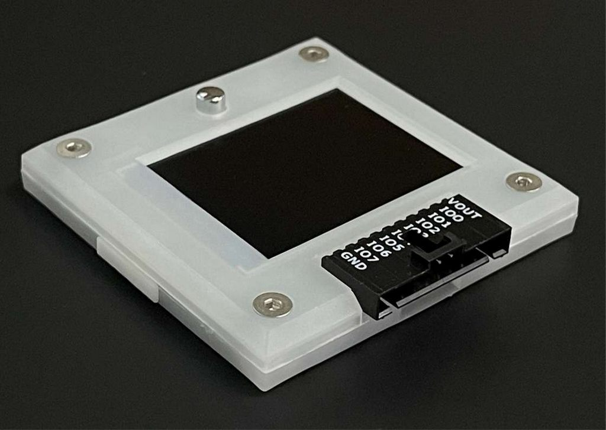

# IO Pin Descriptions



## Main connector pinout
|Pin|Name      | Description|
|----|----------|------------|
|1| **Voltage Out/Voltage Reference** (VOUT/VREF)|1-5volt 400mA onboard power supply output **-or-** external reference voltage to power the buffers.|
|2-9|**Input/Output** (IO0-IO7)|8 IO pins with 1.65-5volt buffers, analog voltage measurement, frequency generation, frequency measurement*, toggleable 10K pull-up resistor |
|10|**Ground** (GND)|Ground, connect to ground of test circuit.|

- See *Bus Pirate RP2040 pin map* below for RP2040 PWM module limitations.

## Bus Pirate signal descriptions

| Pin | Description (Bus Pirate is the controller)|
|------------------------------|------------|
| **Controller Data Out** (CDO/SDO/SDA/TX) | Primary data pin, it's used for bi-directional data transfer in protocols like I2C and 1-Wire, and as data-out from the Bus Pirate in uni-directional protocols like SPI and asynchronous serial (UART). | 
| **Serial Clock** (SCLK/SCL)| Always a clock-out signal from the Bus Pirate.|
| **Controller Data In** (CDI/RX) | Used with protocols that have a dedicated data-input, such as SPI and UART.|
| **Chip select** (CS)           | An output used to activate the serial interface in SPI-like protocols. *```[``` and ```]``` control a dedicated CS pin, but you can use ```a.X``` and ```A.X``` to take manual control of any available pin*.|
| **Auxiliary** (AUX) | Used as an output or input from the Bus Pirate terminal interface with the A, a, and @ commands. It's useful for protocols that require an additional signal, such as a reset.   |
| **Voltage Out/Voltage Reference** (VOUT/VREF)|1-5volt, 400mA onboard power supply output **-or-** external reference voltage to power the buffers.|
|**Ground** (GND)|Ground, connect to ground of test circuit.|

## Bus Pirate RP2040 pin map

|IO Pin|RP2040 Pin|PWM slice| Measure Voltage| Measure Freq.|Freq. Generator|UART|I2C|SPI|LEDs|
|-|-|-|-|-|-|-|-|-|-|
|IO0|GPIO8|4A|Yes|No|Yes, freq tied to IO1 | |SDA| |SDO|
|IO1|GPIO9|4B|Yes|Yes|Yes, freq tied to IO0| |SCL| |SCL|
|IO2|GPIO10|5A|Yes|No|Yes, freq tied to IO3| | | | |
|IO3|GPIO11|5B|Yes|Yes|Yes, freq tied to IO2| | | | |
|IO4|GPIO12|6A|Yes|No|Yes, freq tied to IO5|TX| |SCLK| |
|IO5|GPIO13|6B|Yes|Yes|Yes, freq tied to IO4|RX| |CDO| |
|IO6|GPIO14|7A|Yes|No|Yes, freq tied to IO7 | | |CDI| |
|IO7|GPIO15|7B|Yes|Yes|Yes, freq tied to IO6| | |CS| |

- RP2040 PWM units consist of a "slice" that drives two adjacent pairs of pins. The duty cycle is independent, but the frequency is shared.
- Only the 'B' part of the slice can measure frequency. The 'A' part cannot be used as a PWM when 'B' is used for frequency measurement.
- Some of these limitations can be addressed with the RP2040 PIO units