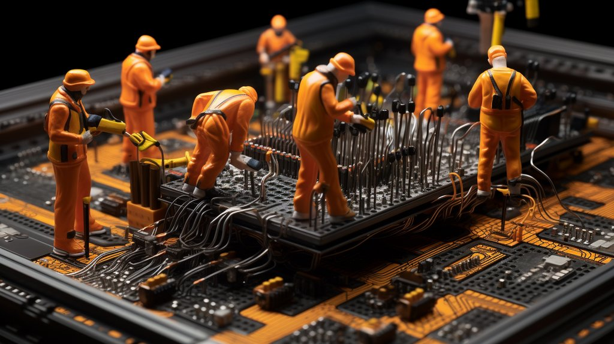

# Milled pins

There had to be a better way to connect a probe cable to a breadboard or pin header. Something better than probe hooks precariously clipped to the end of jumper wires...

Custom milled pins connect probe cable DuPont-style 2.54mm female crimps to a breadboard or pin header. We designed these little pins after searching for better way to connect to prototype boards and breakout headers, things that just don’t cooperate with probe hooks intended to grab onto IC legs. Made from nickle plated milled copper by a pogo pin manufacturer.

## Diagram

