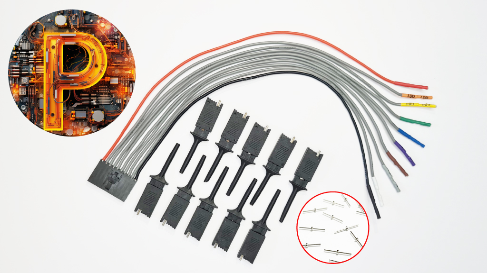
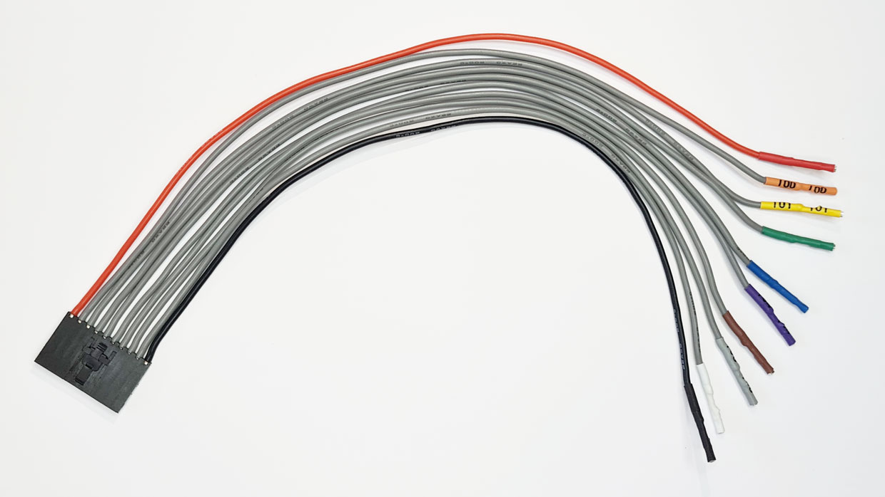
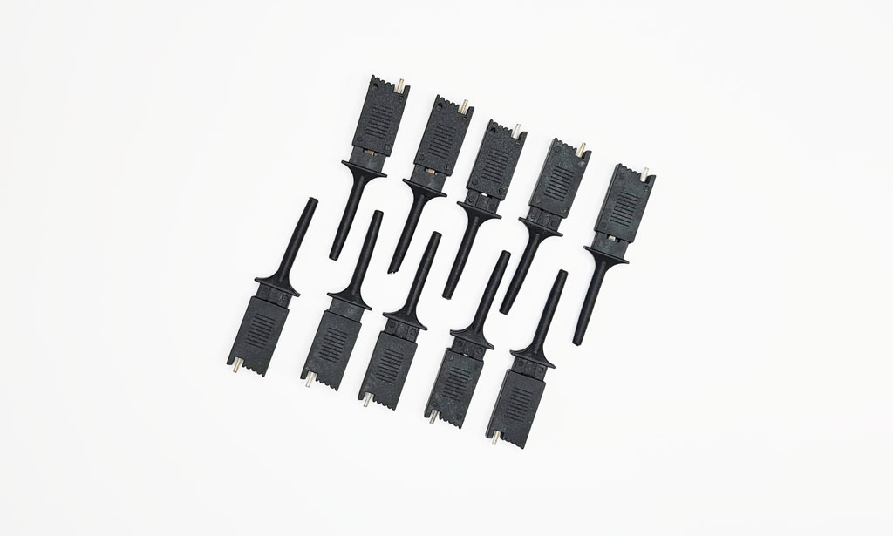
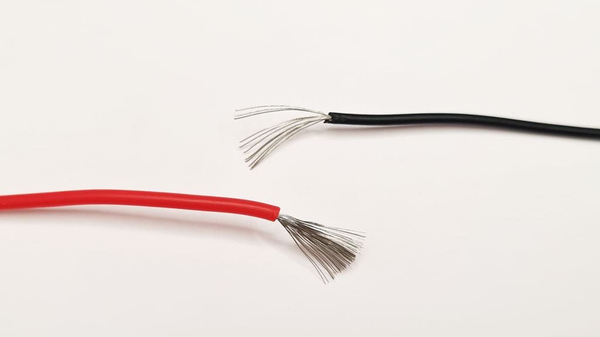

# Probe Cable Set

 

- 1 [Premium Probe Cable](https://hardware.buspirate.com/cables/#probe-cable)
- 10 [Shenzhen starter probe hooks](/overview/probehooks#the-shenzhen-hook)
- 10 [Custom milled breadboard pins](https://hardware.buspirate.com/cables/milled-pins)

A keyed and locking probe cable made of premium soft and flexible silicone coated wire connects to the Bus Pirate 10 pin main header. The ends are 2.54mm Dupont connectors that fit many different types of probe hooks as well as our custom milled breadboard adapter pins. Each lead is wrapped with labeled and color coded shrink tube. 10 black [Shenzhen starter hooks](/overview/probehooks#the-shenzhen-hook) and [10 custom milled breadboard pins](https://hardware.buspirate.com/cables/milled-pins) are included. See the [probe hook guide](/overview/probehooks) for an overview of common affordable hooks.

import FooterCart from '/_common/_footer/_footer-cart.md'

<FooterCart/>

## Premium Probe Cable

A high quality probe cable to connect the Bus Pirate to test hooks, milled breadboard pins and pin header.

- Keyed, locking 10pin 2.54mm female connector to 10 x 1pin 2.54mm DuPont crimps
- 2.54mm 'DuPont' female crimps, without a housing. Many test probes will now accept a 2.54mm Dupont crimp housing, but some don't. Each lead is wrapped with labeled and color coded shrink tube.
- Shrink tube varies wildly in color quality. A lot of colors just don't pop: dull lifeless pastels or just too dark. We ended up sourcing from two manufacturers to get a reasonably nice set of colors. 
- 22AWG super soft and flexible premium silicone coated wire. The inner strands are very fine tinned copper. 22AWG has 60 strands 0.08mm thick, compared to 8-12 strands in common wires. The silicone coating has a very nice feel, and is tolerant of high heat and chemicals.

|Pin|Color|Label|Description|
|-|-|-|-|
|1|Red|VOUT/VREF|Supplies 1-5volts up to 400mA with resetable fuse (VOUT) **OR** connects an external voltage source to the Bus Pirate IO interface|
|2-9|Various|IO0 - IO7|Buffered IO pins with voltage measurement and optional 10K pull-up resistors|
|10|Black|GND| Ground pin|

Resources

- [Probe cable hardware documentation](https://hardware.buspirate.com/cables/#probe-cable)
- [The probe hook guide](/overview/probehooks) lists affordable hooks that fit the probe cable

## Starter Hooks

10 [Shenzhen Hook test probes](/overview/probehooks#the-shenzhen-hook) to tap surface mount chip leads. Cheap and black. Oh so fashionable! 

This inexpensive hook has been everywhere for as long as the Bus Pirate has been around. For what you pay, which is almost nothing, these are really acceptable hooks. Some people use them (gently) for years, but the metal grabbers are delicate and eventually deform to the point where they no longer hold securely.

Resources:

- [The Shenzhen Hook specs](/overview/probehooks#the-shenzhen-hook) in the [probe hook guide](/overview/probehooks)

## Milled Breadboard Pins

There had to be a better way to connect a probe cable to a breadboard or pin header. Something better than probe hooks precariously clipped to the end of jumper wires...

[Custom milled pins](https://hardware.buspirate.com/cables/milled-pins) connect the Bus Pirate DuPont-style 2.54mm female connectors to a breadboard or pin header. We designed these little pins after searching for better way to connect to prototype boards and breakout headers, things that just don’t cooperate with probe hooks intended to grab onto IC legs.

Resources:

- [Milled breadboard pins hardware documentation](https://hardware.buspirate.com/cables/milled-pins)

## Premium silicone coated wire

All [Bus Pirate cables](https://hardware.buspirate.com/cables/) are made with super soft and flexible premium silicone coated wire. The inner strands are very fine tinned copper. 22AWG has 60 strands 0.08mm thick (bottom), compared to 8-12 strands in common wire (top). The silicone coating has a very nice feel, tolerates  high heat and chemicals.

## Get Bus Pirate 5
import FooterGet from '../../_common/_footer/_footer-get.md'

<FooterGet/>

### Community
import FooterCommunity from '../../_common/_footer/_footer-community.md'

<FooterCommunity/>

### Documentation
import FooterDocs from '../../_common/_footer/_footer-docs.md' 

<FooterDocs/>
