# Probes and Hooks

There’s a bunch of ingenious ways to tap signals in an electronic circuit. Probe hooks have small wire claws that grab onto a chip leg, and a spring that retracts to hold it into place. The right hook depends on what you’ll be connecting, and how much space you have available.

:::tip
Treat probe hooks as consumables. They will wear out and need to be replaced from time to time, like the print plate of a 3D printer. 
:::

## The Shenzhen Hook

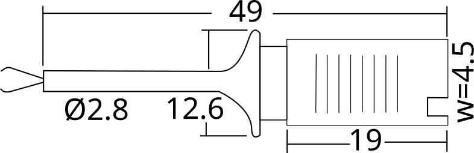

|**Manufacturer**|**Part Num**|**Rating**|**Weight**|**Material**|**Hook Details**|**Colors**|
|-|-|-|-|-|-|-|
|Various|CSG902, XDL-DBXX|-VDC/1A|1.25g|ABS or PA|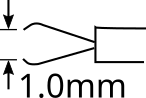|Black, White, Red, Yellow, Green, Blue|

This inexpensive hook has been everywhere for as long as the Bus Pirate has been around. It’s not really clear who the original or primary manufacturer was. Our current theory is that the housing and crimps are produced separately, and third party cable manufacturers assemble them with the proper tooling. 

For what you pay, which is almost nothing, these are really acceptable hooks. Some people use them (gently) for years, but the metal grabbers are delicate and eventually deform to the point where they no longer hold securely. While this happens will all hooks, it happens a lot faster with these.

Three connection types exist in the market. We’re most interested in the type with a tooled crimp offset to one side of the housing that connects to a 2.54mm DuPont-style connector. The other two styles, solderable and a pre-soldered center pin, won’t connect securely to a DuPont-style connector and have a slightly different, less useful hook shape.

## Box Hooks

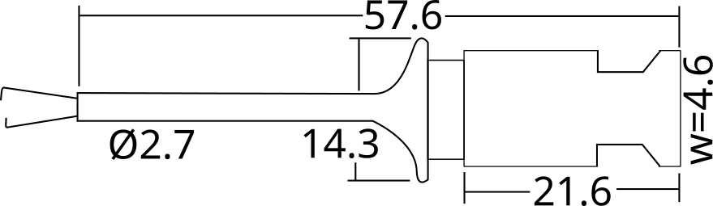

|**Manufacturer**|**Part Num**|**Rating**|**Weight**|**Material**|**Hook Details**|**Colors**|
|-|-|-|-|-|-|-|
|ETA|ETA3122|60VDC/1A|1.13g|PA|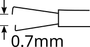|Black, Red|
|Cleqee, Various|P5013|30VDC/5A|-|PA|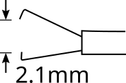|Black, White, Red, Yellow, Green, Blue|

This style of probe hook probably has the best cost to hassle ratio and works in lots of different situations. It’s a great starter probe that will withstand a small amount of abuse while still remaining useful. If you don’t know what probe to get, this is probably the one.

The EZ-Hook brand EZXKM was popularized by the Saleae Logic when it was first introduced, though the internet suggests Saleae changed to a different brand at some point. The original EZ-Hook XKM hook is available at Mouser and Digikey for $3-$4 each, significantly cheaper than we can source them in China so you won’t find them in our store.

Several similar probes have come onto the market in recent years. The ETA 3122 is billed as a high quality hook on par with the XKM, and carries a premium price. P5013 is a similar hook from Cleqee/Zoxelect/etc that seems to be the lowest cost available. We have yet to evaluate the P5013, but the ETA3112 is a decent quality hook. Both hooks are similar in shape and size, but the ETA 3122 has a 0.64mm maximum grabber gap, while the P5013 has a 2.1mm maximum gap.

## Airplane Hooks

### Surface Mount
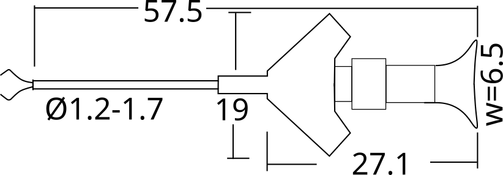

|**Manufacturer**|**Part Num**|**Rating**|**Weight**|**Material**|**Hook Details**|**Colors**|
|-|-|-|-|-|-|-|
|ETA|ETA3125|40VDC/1A|1.3g|PA|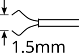|Black, Red, Grey|
|Cleqee|P5003|-|1.3g|PA|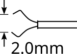|Black, White, Red, Yellow, Green, Blue|

This probe, called an “airplane test hook” in Mandarin, is styled after the fancy probes found on high end test equipment. At a fraction of the cost, the quality isn’t close to an original Tektronix probe, but they will fit *** slight tighter spaces, slightly smaller pins*** than the XKM-style hooks. 

Once again Cleqee and ETA appear to be the most stable and consistent suppliers. The ETA 3125 is billed as high quality and may be worth the price if you specifically need this type of probe. The Cleqee is a low cost probe without as much refinement. If you specifically need this kind of probe the ETA is the best option. If ETA is too expensive, and it is for us, consider using a good quality box-style hook from above instead of downgrading to the Cleqee P5003.

:::caution
Unless you’re already familiar with this style, or specifically need a hook with these specs, the box-style probe is probably a better and cheaper option. 
:::

### Through-Hole

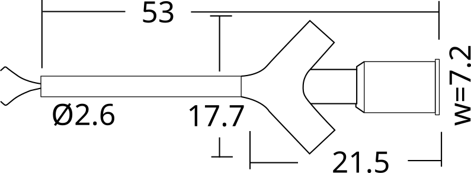

|**Manufacturer**|**Part Num**|**Rating**|**Weight**|**Material**|**Hook Details**|**Colors**|
|-|-|-|-|-|-|-|
|ETA|ETA3123|30VDC/2A|1.3g|PA|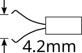|Black, Red|
|You Ji Xiong, Various|CSG905|60VDC/2A|-|-|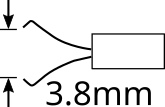|Black, Grey, White, Red, Yellow, Green, Blue|

This is a wide-body version of the airplane hook. This is an older style hook intended for through-hole parts and pin header. The most common part number used among manufacturers of similar hooks is CSG905.

ETA markets a high quality version, but there are a multitude of similar probes at the low end of the market. The closest we’ve come to a confirmed secondary manufacturer is You Ji Xiong, which has a model without a part number that is slightly cheaper than the ETA 3123.

## SDK08 Hooks

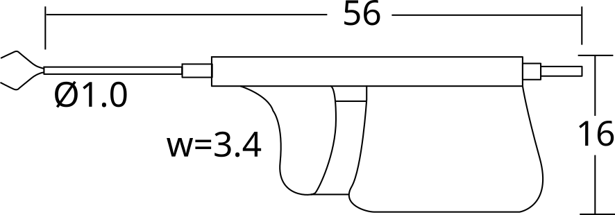

|**Manufacturer**|**Part Num**|**Rating**|**Weight**|**Material**|**Hook Details**|**Colors**|
|-|-|-|-|-|-|-|
|-|SDK08|40VDC/2A|1.1g|ABS|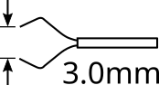|Black, Red, Yellow, Green, Blue|

A patented design intended to stack closely in tight spaces. This could be a useful hook if you need to connect consecutive pins on a surface mount chip.  The price is pretty good for a surface mount friendly hook and they do stack nicely in tight space, but the finger “trigger” can be a bit fussy to use in practice on a tightly packed PCB.

We know that the design patent is owned by an individual and several outlets claim to offer it “factory direct”. Our best guess is that these were made through a contract manufacturer and are offered through a few official retail channels. There is also a previous version of this probe without the plastic trigger/body component, but they are extremely uncomfortable to use.

## Round Body Hooks

### Small

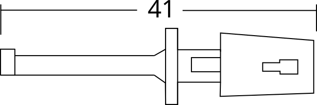

|**Manufacturer**|**Part Num**|**Rating**|**Weight**|**Material**|**Hook Details**|**Colors**|
|-|-|-|-|-|-|-|
|Various|CSG903|-VDC/1A|0.9g|ABS|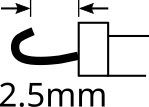|Red, Black, Green, Blue, Yellow|

Inexpensive round hooks work great with pin headers and through-hole parts, but require a soldered connection. The original Bus Pirate v3 cable from Seeed Studio used 8 of these connectors. They’re cheap and sturdy, but only useful for big pins with lots of space or moderate-current power connections.

There are multiple sources for these parts, many use the CSG903 part number. It may be produced under a similar arrangement as the Shenzhen hook. The only confirmed manufacturer with any kind of “datasheet” is Cleqee.

### Medium

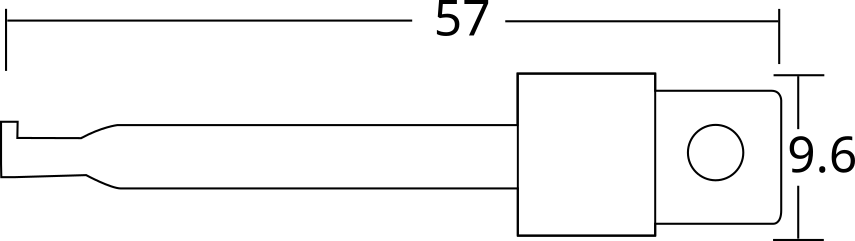

|**Manufacturer**|**Part Num**|**Rating**|**Weight**|**Material**|**Hook Details**|**Colors**|
|-|-|-|-|-|-|-|
|Cleqee|P5001|60VDC/3A|-|PVC|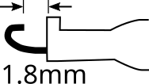|Red, Black, Green, Blue, Yellow|
|Various|CSG904|-VDC/1A|1.9g|ABS||Red, Black, Green, Blue, Yellow|

A larger, higher current version of the CSG903, also with a soldered connection. These are all over the market and have been around for ages. Useful for pin header and moderate current applications, but not particularly fun to use for tapping into signals.

### Large

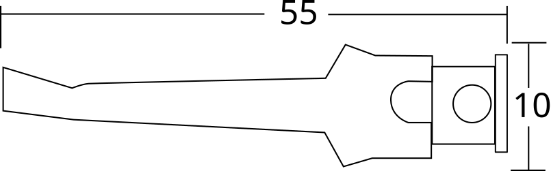

|**Manufacturer**|**Part Num**|**Rating**|**Weight**|**Material**|**Hook Details**|**Colors**|
|-|-|-|-|-|-|-|
|Cleqee|P5002|60VDC/10A|1.8g|ABS|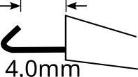|Red, Black, Green, Blue, Yellow|
|Various|CSG901|60VDC/10A|1.8g|ABS||Red, Black, Green, Blue, Yellow|

An even larger round hook, primarily useful for higher current applications. We'd avoid using this for digital signals as all the additional metal will impact the switching waveform.

:::warning
Drawing, rating, and dimensions taken from datasheets and hand measurements. We sometimes used averages from various similar parts found in the market. These are not guaranteed values. 

While some hooks may be rated for high voltages and current, the Bus Pirate is not. Do not use the Bus Pirate with >5 volts DC or high current sources. Never expose the Bus Pirate to AC voltages.
:::

## Join the fun
### Get Bus Pirate 5
import FooterGet from '../../_common/_footer/_footer-get.md'

<FooterGet/>

### Community
import FooterCommunity from '../../_common/_footer/_footer-community.md'

<FooterCommunity/>

### Documentation
import FooterDocs from '../../_common/_footer/_footer-docs.md' 

<FooterDocs/>