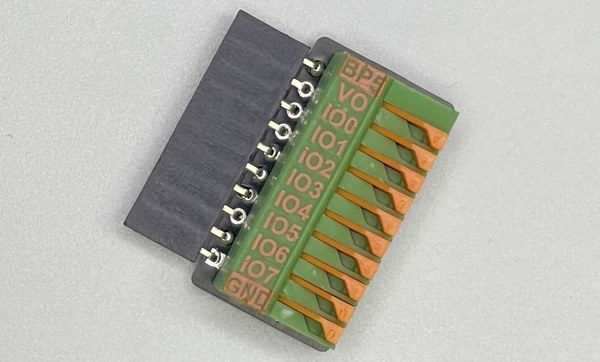

# KF141 Quick Connect Adapter

   

Sometimes you just need to connect some wires and dig into a project. Quick connector boards get you working right away.

KF141 is a popular quick connector block with sturdy spring retention clamps. Press the lever, insert a stripped wire, then release the lever to clamp it firmly in place. Pin names are silkscreened in bright orange so you get the right connection the first time.

## KF141-R right angle connector

KF141-R is a right angle connector. Wires clamps are oriented to the front of the connector block. Pin names are silkscreened in bright orange to save time and hassle.

- [Schematic and PCB](https://github.com/DangerousPrototypes/BusPirate5-hardware/tree/main/kf141r-adapter)
- [Development in the forum](https://forum.buspirate.com/t/kf141-quick-connector-adapter/90?u=ian)
- Buy

## KF141-V vertical connector

KF141-V is a vertical connector. Wires clamps are oriented to the top of the connector block. Pin names are silkscreened in bright orange to save time and hassle.

- [Schematic and PCB](https://github.com/DangerousPrototypes/BusPirate5-hardware/tree/main/kf141v-adapter)
- [Development in the forum](https://forum.buspirate.com/t/kf141-quick-connector-adapter/90?u=ian)
- Buy

## Join the fun
### Get Bus Pirate 5
import FooterGet from '../../_footer/_footer-get.md'

<FooterGet/>

### Community
import FooterCommunity from '../../_footer/_footer-community.md'

<FooterCommunity/>

### Documentation
import FooterDocs from '../../_footer/_footer-docs.md' 

<FooterDocs/>

