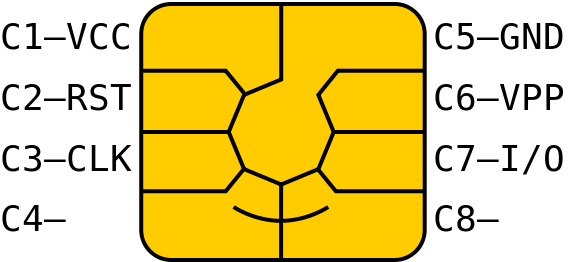
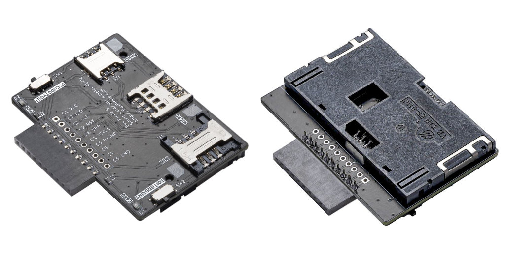

# IC Card and SIM adapter

[im use example?]

The IC card and SIM adapter for Bus Pirate 5 has sockets for mini, micro and nano SIM cards. Everything is connected and ready to go - get started right away.

Common IC cards usually follow the [ISO 7816-3 standard](https://en.wikipedia.org/wiki/ISO/IEC_7816) and have the same pinout and contact shape. [Image source](https://commons.wikimedia.org/wiki/File:SmartCardPinout.svg).

import FooterCart from '/_common/_footer/_footer-cart.md'

<FooterCart/>

## mini, micro, and nano SIM cards

The top of the adapter has sockets for mini, micro, and nano SIM cards. Most mobile phone SIM cards use a half-duplex serial UART interface, such as the Bus Pirate HDPLXUART mode. 

| Socket | Description |
|--------|-------------|
| U1 | 6 pin mini SIM card socket |
| U2 | 8 pin micro SIM card socket |
| U3 | 6 pin nano SIM card socket |

We looked at a lot of sockets and decided these were the best bet. Complex sockets with springs, hinges and slides are prone to break. These simple sockets should hold up better with repeated use.

## Smart IC cards

A KF-011C socket on the reverse accepts most ISO 7816-3 smart cards:
- [SLE4442 IC cards](/devices/sle4442) with passcode protection, supported by [2-Wire protocol mode](/command-reference/2wire-protocol)
- 24C02/24C04/24C08/24C16 EEPROM cards, supported by [I2C protocol mode](/command-reference/i2c-protocol)
- Bank cards, ID cards, and other smart cards, supported by HDPLXUART mode

A card detect switch is connected to an LED on the top of the board. _CARD LED_ will light when a card is inserted.

## Power and Ground Selection

| Switch | Normal | IO pin | Description |
|--------|-----|-----|-------------|
| VCC   | VOUT | IO0 | Connect VCC pin of the socket to VOUT or IO0|
| GND   | GND | IO1 | Connect GND pin of the socket to GND or IO1|

SW1 and SW2 along the side of the adapter select the power (VCC) and ground (GND) connection to the card socket. For normal use select VCC:VOUT and GND:GND. Found a non-standard pinout? Flip the switches to connect the VCC and GND pins of the socket to Bus Pirate pins IO0 and IO1.

## Pin Connections

|Bus Pirate|IC Card/SIM|Adapter|Description|
|-|-|-|-|
|Vout|C1|VCC|Bus Pirate power supply to socket VCC|
|IO0|C7|I/O| I/O data pin|
|IO1|C3|CLK| Clock pin|
|IO2|C2| RST| Reset pin|
|IO3|C6| VPP| Programming voltage pin|
|IO4|C1|IOVCC|IO4 connection to socket VCC |
|IO5|C5|IOGND|IO5 connection to socket GND|
|IO6|C8|N/A|C8 unused pad. _micro SIM and IC card only_|
|IO7|C4|N/A|C4 unused pad. _micro SIM and IC card only_|
|GND|C5|GND|Bus Pirate ground to socket ground|

## Resources

- IC Card and SIM adapter [schematic and PCB](https://github.com/DangerousPrototypes/BusPirate5-hardware/tree/main/)
- [How to interface SLE4442 IC cards](/devices/sle4442)
- [How to interface 24C02 EEPROM cards] _coming soon_ 
- [How to interface SIM and bank cards] _coming soon_
- [HDPLXUART mode documentation] _coming soon_
- [2-Wire mode documentation](/command-reference/2wire-protocol)
- [I2C mode documentation](/command-reference/i2c-protocol)
- [sle4442 command documentation](/command-reference/2wire-protocol#sle4442) 

## Get Bus Pirate 5
import FooterGet from '../../_common/_footer/_footer-get.md'

<FooterGet/>

### Community
import FooterCommunity from '../../_common/_footer/_footer-community.md'

<FooterCommunity/>

### Documentation
import FooterDocs from '../../_common/_footer/_footer-docs.md' 

<FooterDocs/>

