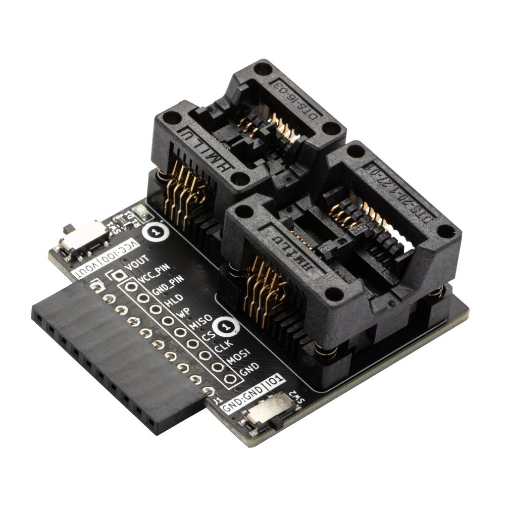
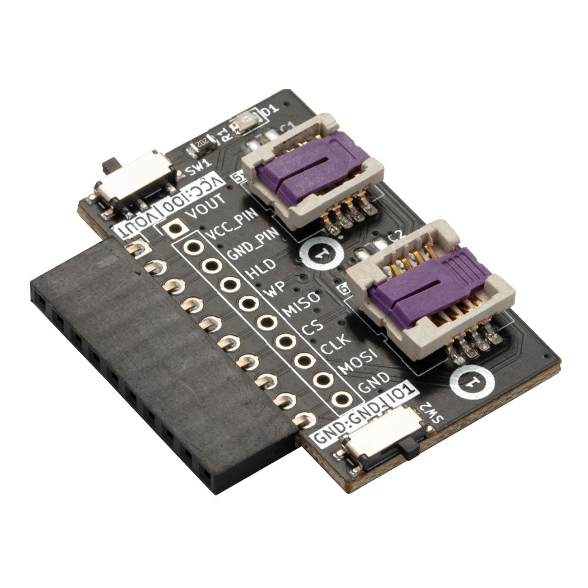
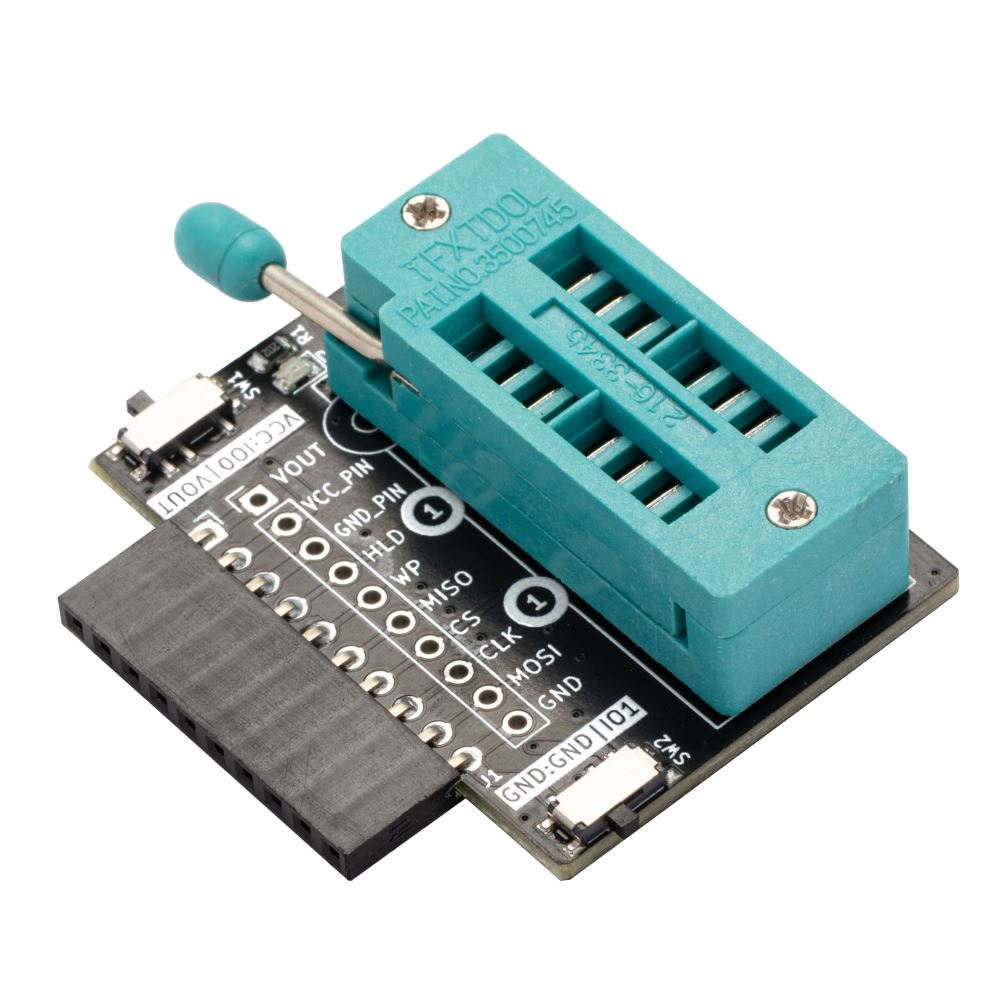

# SPI Flash Adapters

   

Bus Pirate 5 has a "flash" command to read and write 8 pin SPI flash chips. Soldering chips on breakouts for testing got a bit wasteful, so we whipped up some simple socket adapters that fit the Bus Pirate header.

The sockets on each board are connected with the "most common" SPI flash footprint. Found a chip with a different pinout? Power and ground have a switch that selects between the Bus Pirate VOUT/GND and IO0/IO1 pins for full flexibility.

import FooterCart from '/_common/_footer/_footer-cart.md'

<FooterCart/>

## SOP8 SPI Flash Adapter

SOP8 150mil and 208mil are the most common and inexpensive flash packages at the moment. After [looking at a number of sockets](https://forum.buspirate.com/t/spi-flash-adapter-socket-reviews/400?u=ian) we decided these bad boys, favorites of the mobile phone repair market, were the way to go. Easy to insert and remove a chip, but a bit bulky with delicate pins. The cost is in the pins, 16 pins cost double that of an 8 pins socket.

Inserting a chip:
- Press down gently on the top of the socket. The spring fingers will retract.
- Place or drop the chip into the socket with the chip pin 1 marker (dot, stripe, etc) aligned with the socket pin 1 marker.
- Release the socket, the spring fingers will grip the chip.

Removing a chip:
- Press down gently on the top of the socket. The spring fingers will retract.
- Gently lift the chip out of the socket with tweezers **or** turn the socket over and let the chip fall into your hand.
- Release the socket, the spring fingers will close.

## WSON8 SPI Flash Adapter

Lead-less WSON 5x6/6x8 flash chips are becoming more common, but are a bit more expensive than SOP8 chips. The sockets are **significantly** more expensive than other sizes. We're doing small batches, so our cost is pretty high. If you need something more affordable, look for a WSON8 to DIP8 adapter on your favorite China stuff shopping site and use it with the DIP8 adapter below.

Inserting a chip:
- Push the retaining clip forward to unlock, then lift up to open the socket.
- Place the chip in the socket with the chip pin 1 marker (dot, stripe, etc) aligned with the socket pin 1 marker.
- Swing the retaining clip down, then push it back to lock the socket.

Removing a chip:
- Push the retaining clip forward to unlock, then lift up to open the socket.
- Gently lift the chip out of the socket with tweezers, **or** turn the socket over and let the chip fall into your hand.
- Swing the retaining clip down, then push it back to lock the socket.

## DIP8 SPI Flash Adapter

New through hole DIP flash chips are getting rare, but they’re everywhere in vintage computers. These 16P aquamarine ZIF sockets are the universal programming solution. Pull up the little lever, drop in a chip, and push the level down to lock the chip in place. 

Inserting a chip:
- Pull up the lever to open the socket.
- Place the chip in the socket with the chip pin 1 marker (dot, stripe, etc) aligned with the socket pin 1 marker.
- Push the lever down to lock the chip in place.

Removing a chip:
- Pull up the lever to open the socket.
- Gently lift the chip out of the socket.
- Push the lever down to lock the socket.

## Resources

- SOP8 SPI Flash Adapter [schematic and PCB](https://github.com/DangerousPrototypes/BusPirate5-hardware/tree/main/flash-sop-rev3)
- WSON8 SPI Flash Adapter [schematic and PCB](https://github.com/DangerousPrototypes/BusPirate5-hardware/tree/main/flash-wson-rev3)
- DIP8 SPI Flash Adapter [schematic and PCB](https://github.com/DangerousPrototypes/BusPirate5-hardware/tree/main/flash-dip-rev3)
- [flash command documentation](command-reference/spi-protocol#flash)
- [How to interface common SPI flash chips](devices/spi-flash-chips)

## Get Bus Pirate 5
import FooterGet from '../../_common/_footer/_footer-get.md'

<FooterGet/>

### Community
import FooterCommunity from '../../_common/_footer/_footer-community.md'

<FooterCommunity/>

### Documentation
import FooterDocs from '../../_common/_footer/_footer-docs.md' 

<FooterDocs/>

