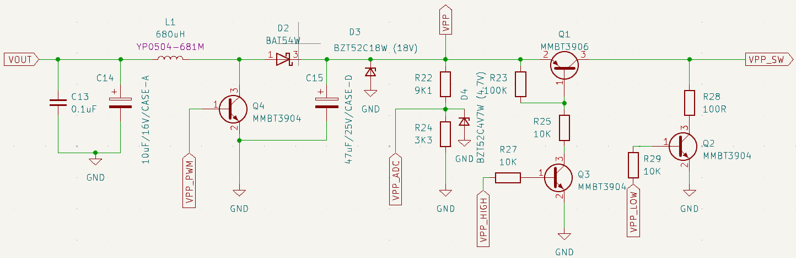

# Programming Voltage SMPS

This little plank is an adjustable Switch Mode Power Supply that generates a 5-16volt programming voltage (VPP) for microcontroller and EEPROMs. This includes PIC 12F/16F/18F (13volts), ATmega (12volts), and various other chips. Includes FETs to switch the voltage on and off, and short to ground.
- 5-16volt output
- VPP control (high/ground)
- Feedback output clamped to ~4.7volts (protect Bus Pirate)
- VPP output clamped to ~18volts (protect humans)

:::warning
Programming Voltage SMPS is "in development". If hardware is available it has passed basic functionality tests, but there isn't full documentation or support just yet. At this stage, it's best suited for developers who are comfortable with hardware and firmware development. Or for those who want to follow along.
:::

import FooterCart from '/_common/_footer/_footer-cart.md'

<FooterCart/>

## Overview

The circuit is a copy of the Microchip PICkit 2 programmer, with a few modifications. 

### Switch Mode Power Supply (SMPS)

Inductor L1 charges from the Bus Pirate power supply. A pulse width modulated signal switches FET (Q4) to discharge the inductor into the output capacitor C15 through Schottky diode D2. This is the voltage boost.

A voltage divider (R22, R24) brings the output into a safe range for the Bus Pirate to measure. If the voltage gets too high, the PWM is disabled. If the voltage drops too low, the PWM is enabled. This is the SMPS feedback loop.

### Voltage Clamps

So far we have the bog standard SMPS from a PICkit2 programmer. Since this board will be used for development, we added a few guardrails to protect the Bus Pirate, the target chip and humans. 

4.7volt Zener diode D4 clamps the output of the resistor divider somewhere between 4.4 and 5volts, which is safe for the Bus Pirate. A 5.1volt diode might seem ideal, but cheap Zeners have a wide tolerance - 4.8-5.4volts for a 5.1volt Zener. The 4.7volt Zener is a safer choice.

VPP output is clamped at 16volts by Zener diode D3. D3 is an 18volt Zener, but with slop it could be anywhere from 16.8 and 19.1volts. If the voltage gets too high, the Zener conducts to ground. There’s no protection resistor so in the worst case scenario the Zener burns out “open” and shorts the SMPS to ground. The board will be ruined, but it will prevent runaway output.

:::caution
The Zener diodes are a safety feature, not a guarantee. It’s possible to damage the Bus Pirate or target chip if the SMPS is misused. When developing new code, especially, enable a current limit in the Bus Pirate power supply configuration.
:::  

### VPP Control

Two FETs (Q1, Q3) form a high side switch that controls VPP to the target chip. Another FET (Q2) shorts VPP output to ground, usually used to reset the target chip. The Bus Pirate controls these FETs through IO1 and IO0.

## Pinout

The Programming Voltage SMPS has two headers, one for the Bus Pirate and one for the target chip. 

### VPP Header (target)

| Pin | Name     | Voltage|Function|
|-----|----------|---------|------|
| 1   | VPP      | 5-16volts|Raw output from the SMPS for debugging  |
| 2   | VPP_TGT   | GND-16volts|Switched output for target VPP |
| 3 |VOUT_TGT|1-5volts| Bus Pirate power supply output for target power|
| 4 |GND|GND|Ground|
| 5 |IO4|1-5volts|Bus Pirate IO4 for programming target (various)|
| 6 |IO5|1-5volts|Bus Pirate IO5 for programming target (various)|
| 7 |IO6|1-5volts|Bus Pirate IO6 for programming target (various)|
| 8 |IO7|1-5volts|Bus Pirate IO7 for programming target (various)|

The VPP header pinout is roughly similar to the PIC ICSP header used in older Bus Pirates: VPP_TGT, V+_TGT, GND, PGD, PGC.

### Control Header (Bus Pirate)

| Pin | Name     | Function|
|-----|----------|------|
| 1   | VOUT     |Bus Pirate power output|
| 2   | VPP_LOW  |VPP pin control, short to ground|
| 3   | VPP_HIGH |VPP pin control, enable SMPS output to pin|
| 4   | VPP_PWM  |PWM signal that controls the SMPS|
| 5   | VPP_ADC  |Feedback voltage from the SMPS|
| 6   | IO4      |Bus Pirate IO4|
| 7   | IO5      |Bus Pirate IO5|
| 8   | IO6      |Bus Pirate IO6|
| 9   | IO7      |Bus Pirate IO7|
| 10  | GND      |Ground|

IO0 t o IO3 control the SMPS and switch VPP output to the target chip. IO4 to IO7 are available for programming the target chip: SPI, 2 wire protocols, etc.

## Schematic

Programming Voltage SMPS [schematic and PCB](https://github.com/DangerousPrototypes/BusPirate5-hardware) are available in the Bus Pirate 5 hardware repository.

## BOM
| Item | Quantity | Reference(s) | Value | Footprint |
|------|----------|--------------|-------|-----------|
| 1 | 1 | C13 | 0.1uF | Capacitor_SMD:C_0805_2012Metric_Pad1.18x1.45mm_HandSolder |
| 2 | 1 | C14 | 10uF/16V/CASE-A | Capacitor_Tantalum_SMD:CP_EIA-3216-18_Kemet-A |
| 3 | 1 | C15 | 47uF/25V/CASE-D | Capacitor_Tantalum_SMD:CP_EIA-7343-31_Kemet-D |
| 4 | 1 | D1 | LED | LED_SMD:LED_0805_2012Metric |
| 5 | 1 | D2 | BAT54W | Package_TO_SOT_SMD:SOT-23 |
| 6 | 1 | D3 | BZT52C18W (18V) | Diode_SMD:D_SOD-123 |
| 7 | 1 | D4 | BZT52C4V7W (4.7V) | Diode_SMD:D_SOD-123 |
| 8 | 1 | J1 | Conn_01x10 | Connector_PinSocket_2.54mm:PinSocket_1x10_P2.54mm_Horizontal |
| 9 | 1 | J4 | Conn_01x08 | Connector_PinHeader_2.54mm:PinHeader_1x08_P2.54mm_Horizontal |
| 10 | 1 | L1 | 680uH | Library:L_YP0504 |
| 11 | 1 | Q1 | MMBT3906 | Package_TO_SOT_SMD:SOT-23 |
| 12 | 3 | Q2, Q3, Q4 | MMBT3904 | Package_TO_SOT_SMD:SOT-23 |
| 13 | 1 | R1 | 2K | Resistor_SMD:R_0805_2012Metric |
| 14 | 1 | R22 | 9K1 | Resistor_SMD:R_0805_2012Metric |
| 15 | 1 | R23 | 100K | Resistor_SMD:R_0805_2012Metric |
| 16 | 1 | R24 | 3K3 | Resistor_SMD:R_0805_2012Metric |
| 17 | 3 | R25, R27, R29 | 10K | Resistor_SMD:R_0805_2012Metric |
| 18 | 1 | R28 | 100R | Resistor_SMD:R_0805_2012Metric |

## Resources

- Programming Voltage SMPS [schematic and PCB](https://github.com/DangerousPrototypes/BusPirate5-hardware/tree/main/)
- [Development thread](https://forum.buspirate.com/t/pic-avr-eeprom-programming-voltage-smps/430/15)

## Get Bus Pirate
import FooterGet from '../../_common/_footer/_footer-get.md'

<FooterGet/>

### Community
import FooterCommunity from '../../_common/_footer/_footer-community.md'

<FooterCommunity/>

### Documentation
import FooterDocs from '../../_common/_footer/_footer-docs.md' 

<FooterDocs/>

