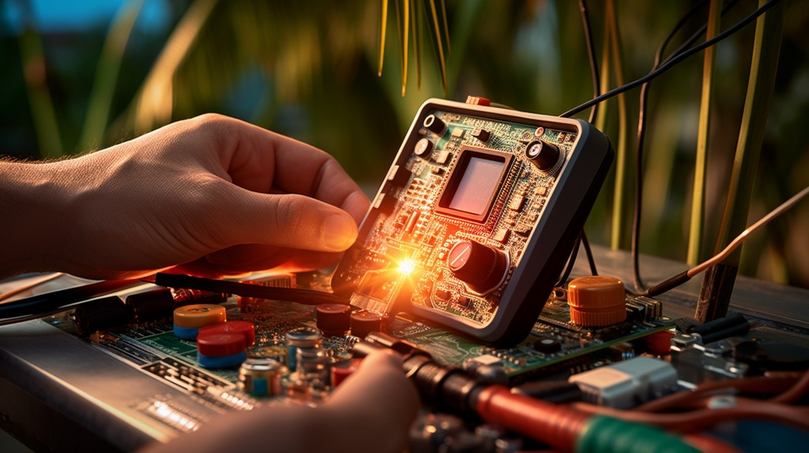

import DiscourseComments from '@site/src/components/DiscourseComments';
import BrowserWindow from '@site/src/components/BrowserWindow';

# Configuration Menu



## Options

<BrowserWindow>
<span className="bp-prompt">I2C></span> c<br/>
<span className="bp-info"><br/>
<span className="bp-info">Configuration options</span></span><br/>
 1. <span className="bp-info">Language</span><br/>
 2. <span className="bp-info">ANSI color mode</span><br/>
 3. <span className="bp-info">ANSI toolbar mode</span><br/>
 4. <span className="bp-info">LCD screensaver</span><br/>
 5. <span className="bp-info">LED effect</span><br/>
 6. <span className="bp-info">LED color</span><br/>
 7. <span className="bp-info">LED brightness</span><br/>
 x. <span className="bp-info">Exit</span><br/>
<span className="bp-prompt"> ></span> <br/>
</BrowserWindow>

Type ```c``` followed by ```enter``` to show the Bus Pirate configuration menu. These options control things like the language, live monitor toolbar and LED party mode.

## Configuration

<BrowserWindow>
<span className="bp-prompt"> ></span> 1<br/>
<br/>
<span className="bp-info">Language</span><br/>
 1. <span className="bp-info">English</span><br/>
 2. <span className="bp-info">Chinese (simplified)</span><br/>
 x. <span className="bp-info">Exit</span><br/>
<span className="bp-prompt"> ></span> 1<br/>
Language <span className="bp-info">set to</span> English<br/>
</BrowserWindow>

Type a menu option number followed by ```enter```. Choose a configuration setting by typing the number followed by ```enter```.

## Exit and Save
<BrowserWindow>
<span className="bp-info">LED effect</span><br/>
 1. <span className="bp-info">Disable</span><br/>
 2. <span className="bp-info">Solid</span><br/>
 3. <span className="bp-info">Angle wipe</span><br/>
 4. <span className="bp-info">Center wipe</span><br/>
 5. <span className="bp-info">Clockwise wipe</span><br/>
 6. <span className="bp-info">Top side wipe</span><br/>
 7. <span className="bp-info">Scanner</span><br/>
 x. <span className="bp-info">Exit</span><br/>
<span className="bp-prompt"> ></span> x<br/>
<br/>
<span className="bp-info">Configuration file:</span> Saved<br/>
<br/>
<span className="bp-prompt">HiZ></span> <br/>
</BrowserWindow>

Press ```x``` followed by ```enter``` at any prompt to exit the configuration menu. Settings will be saved and loaded automatically if an SD card is inserted in the Bus Pirate.

<DiscourseComments/>
