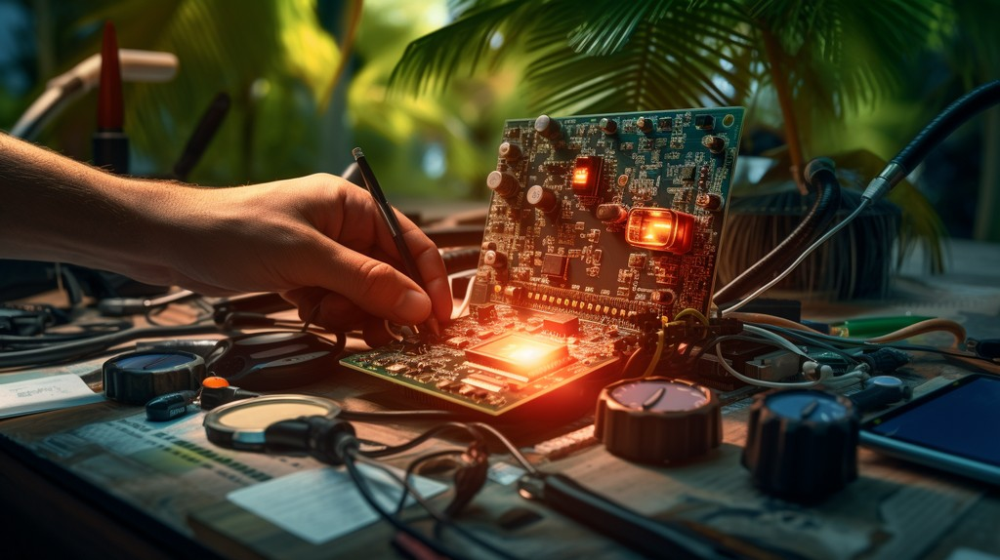
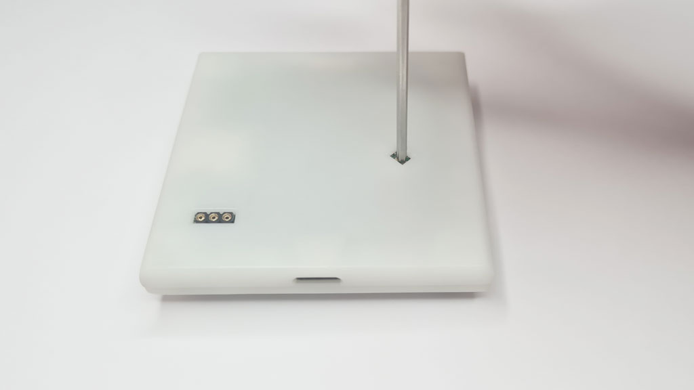
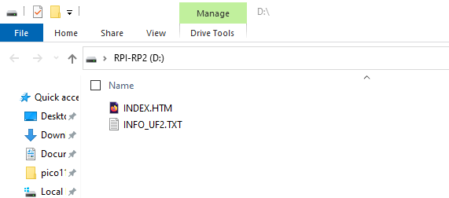

import DiscourseComments from '@site/src/components/DiscourseComments';
import BrowserWindow from '@site/src/components/BrowserWindow';

# Bus Pirate firmware updates



:::tip
It's early days of a new Bus Pirate design, don't skip this step. We're adding features and squashing bugs daily. Things will be much easier with the latest and greatest firmware installed in your Bus Pirate. Don't worry, it's so very easy!
:::

## Download the latest firmware

There's two types of firmware releases: the bleeding edge and olde trusty.

### Bleeding edge

:::tip
The latest bleeding edge firmware is auto-compiled and posted in the forum. [Get the latest and greatest](https://forum.buspirate.com/t/bus-pirate-5-auto-build-main-branch/20/999999).
:::

This is your best bet at the moment. Pirate-Bot compiles the latest code and uploads it to the forum every time there's a push to the git repository. Don't wait for lazy devs to prepare a release package.

- [Download a bleeding edge release in the forum](https://forum.buspirate.com/t/bus-pirate-5-auto-build-main-branch/20/999999)

### Olde trusty

Stable "long term" releases will be posted occasionally at GitHub. These can be considered well tested and reliable.

- [Download a stable release at GitHub](https://github.com/DangerousPrototypes/BusPirate5-firmware)

:::info
Keen observers will notice there's no stable release yet. Development is so active at the moment we haven't reached the point of making a stable release package. You really want the latest and greatest though, don't you?
:::

## Extract your firmware

Open the firmware .zip file and find the right version for your Bus Pirate:
- ```bus_pirate5_rev10.uf2``` - If your Bus Pirate came in a case, use this firmware for revision 10 hardware. **Most people should use this one**
- ```bus_pirate5_rev8.uf2``` - If you have an engineering sample, developers board or a preview board (all without a case) use this firmware for revision 8 hardware.

:::tip
If your Bus Pirate is in a case, it's revision 10 hardware. If you're not sure, use the revision 10 firmware.

If the Bus Pirate blinks a menacing red, you've used the wrong firmware. Don't worry, [manually activate the bootloader](tutorial-basics/firmware-update#manually) and just try the other one.
:::


## Activate the bootloader

The RP2040 chip in the Bus Pirate has a hardware bootloader that appears as a USB drive. Upgrade with confidence because the bootloader is fixed in hardware, it can't be corrupted or overwritten. There's two ways to put the Bus Pirate in bootloader mode.

### From the terminal

<BrowserWindow>
<span className="bp-prompt">HiZ></span> $<br/>
</BrowserWindow>

In the Bus Pirate terminal type ```$``` and then press ```enter```. The Bus Pirate will jump to bootloader mode and a USB disk drive named ```RPI-RP2``` will connect to your computer. 

:::tip
If the firmware update is interrupted and you find yourself locked out of the Bus Pirate terminal don't panic. Follow the instructions in the next step to enter bootloader mode without the terminal.
:::

### Manually



Something went wrong and you can't access the Bus Pirate? Just not in the mood to fire up a terminal? No problem, we've got you covered.

- Unplug the Bus Pirate USB cable.
- Use the 2mm hex wrench that accompanied your Bus Pirate to press the button on the bottom of the PCB/enclosure. Lost your hex wrench? A paper clip, toothpick or multimeter probe will all work just as well.
- Plug in the USB cable **while still pressing and holding the button**.
- Now you can release the button.

The Bus Pirate will connect to your computer in bootloader mode and a USB disk drive named ```RPI-RP2``` will appear.

## Drag and drop the firmware



Drag the firmware file ending with **.uf2** into the USB disk drive. The update should only take a few seconds.

The Bus Pirate will reset and connect to your computer when the firmware update completes.

## Done!

Congratulations, you now have the latest and greatest firmware! Happy hacking!

<DiscourseComments/>