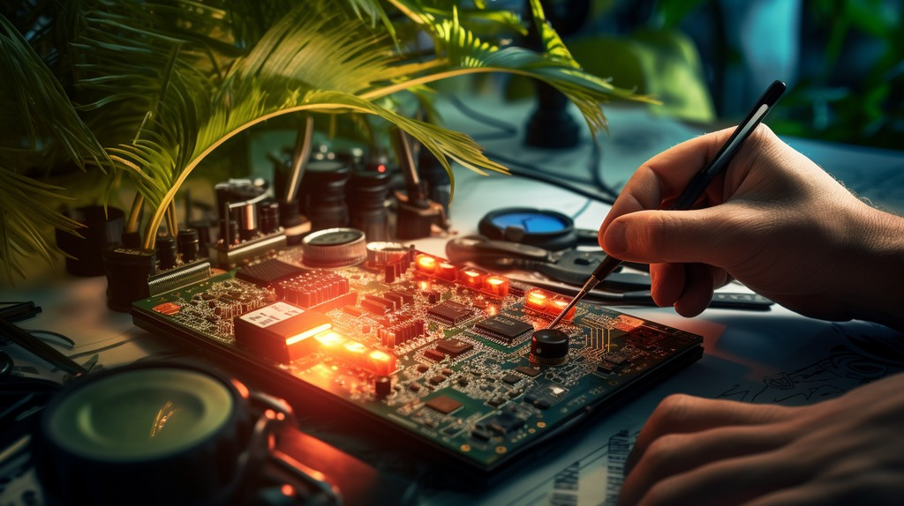
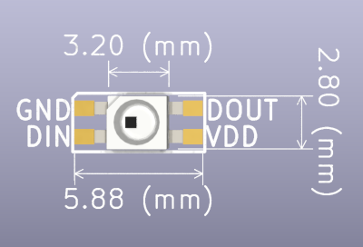
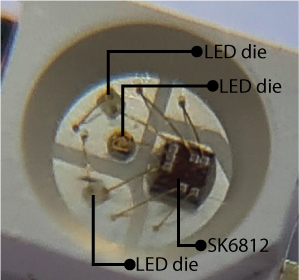
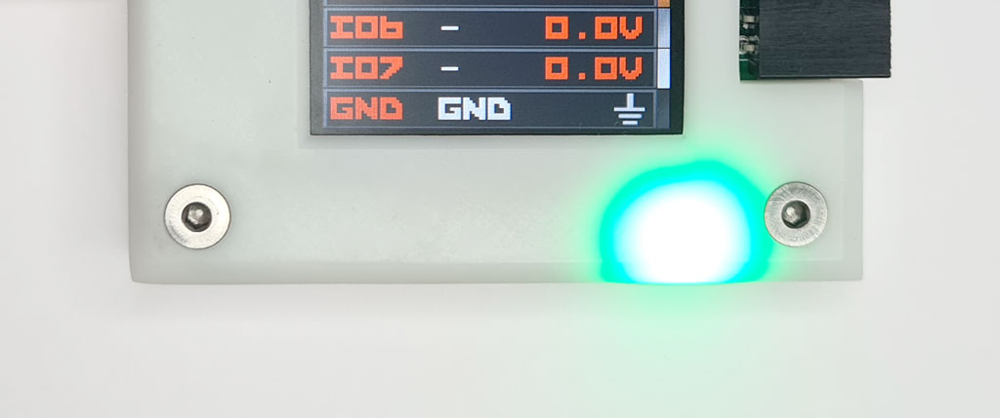
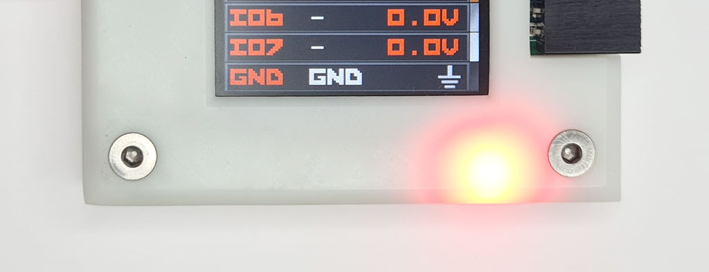
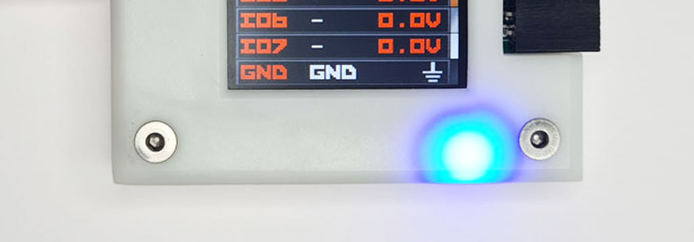
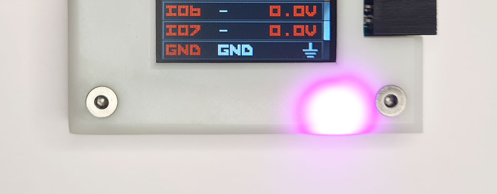
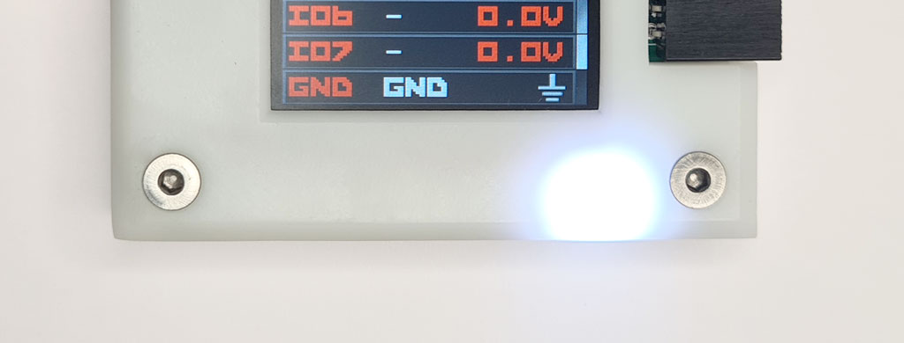
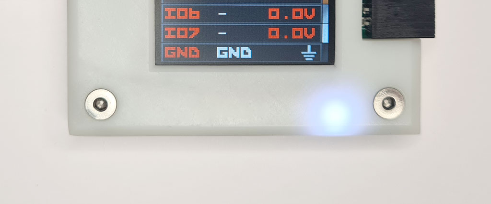

import DiscourseComments from '@site/src/components/DiscourseComments';
import BrowserWindow from '@site/src/components/BrowserWindow';

# Blink Some LEDs



## SK6812 RGB LEDs

  

|Pin|Description|
|-|-|
|VDD| 5 volt power supply|
|DIN| Data Input|
|DOUT| Data Output to next LED|
|GND| Ground|

SK6812 RGB LEDs are commonly found in long strips of color changing lights. 3 LED dies (red, blue, green) and an SK6812 controller chip are bonded to a bit of metal called a leadframe. The leadframe is put inside a casing and covered in epoxy. Then the whole thing is baked, like a cake.

The colors are set with a single wire, time-based protocol. Multiple LEDs can be chained together, with the DOUT of one LED connecting to the DIN of the next.

16 of these RGB LEDs are on the Bus Pirate 5 PCB, all wired up and ready to go. We're just going to control one of them because all 16 LEDs at full power would be too much current for some USB ports.

:::info
Each LED die in the SK6812 (red, blue, green) uses 20mA at full power. 60mA is required to light all three dies at maximum brightness.
:::

## Choose LED Mode

<BrowserWindow>
<span className="bp-prompt">HiZ></span>m<br/>
<span className="bp-info"><br/>
<span className="bp-info">Mode selection</span></span><br/>
 1. <span className="bp-info">HiZ</span><br/>
 2. <span className="bp-info">UART</span><br/>
 3. <span className="bp-info">I2C</span><br/>
 4. <span className="bp-info">SPI</span><br/>
 5. <span className="bp-info">LED</span><br/>
 6. <span className="bp-info">DUMMY1</span><br/>
 x. <span className="bp-info">Exit</span><br/>
<span className="bp-prompt">Mode ></span> 5<br/>
<br/>
</BrowserWindow>

First, enter the Bus Pirate LED control mode.

- Type ```m``` then press ```enter``` for the mode menu.
- Type ```5``` then press ```enter``` to choose the LED mode.

## Configuration

<BrowserWindow>
<span className="bp-info">LED type</span><br/>
 1. <span className="bp-info">WS2812/SK6812/'NeoPixel' (single wire interface)*</span><br/>
 2. <span className="bp-info">APA102/SK9822 (clock and data interface)</span><br/>
 3. <span className="bp-info">Onboard LEDs (16 SK6812s)</span><br/>
 x. <span className="bp-info">Exit</span><br/>
<span className="bp-prompt">Type (</span>1<span className="bp-prompt">) ></span> 3<br/>
<br/>
<span className="bp-info">Mode:</span> LED<br/>
<br/>
<span className="bp-prompt">LED-()></span><br/>
</BrowserWindow>

Now configure the LED mode to use the onboard SK6812 LEDs. Many prompts have a default option in ```( )```, in this case 1. For this tutorial we want option 3, the onboard LEDs. 

- Type ```3``` then press ```enter```.

## Light it up

### Data Structure

|Byte #|bit 7|bit 6|bit 5|bit 4|bit 3|bit 2|bit 1|bit 0|
|-|-|-|-|-|-|-|-|-|
|1|G7|G6|G5|G4|G3|G2|G1|G0|
|2|R7|R6|R5|R4|R3|R2|R1|R0|
|3|B7|B6|B5|B4|B3|B2|B1|B0|

Each LED is controlled by 24 bits of color information: 8 bits of green, 8 bits of red and 8 bits of blue. That means each LED has 256 brightness levels from 0 to 255.

:::info
Usually we talk about RGB (red, green, blue) LEDs, but note that the data order for the SK6812 is GRB (green, red, blue).
:::

### Green

<BrowserWindow>
<span className="bp-prompt">LED-()></span> [0b111111110000000000000000.24<br/>
<span className="bp-info">RESET</span><br/>
<span className="bp-info"><span className="bp-info">TX:</span></span> 0b<span className="bp-float">1111</span>1111<span className="bp-float">0000</span>0000<span className="bp-float">0000</span>0000.24<br/>
<span className="bp-prompt">LED-()></span> <br/>
</BrowserWindow>

Let's start by lighting the green die in the LED. The Bus Pirate understands binary, hexadecimal and decimal formatted numbers. We'll use binary entry first so it's clear exactly how the bits control the LED.
- The data structure table above shows the format for controlling each color in the LED. The first eight bits control green, the next 8 control red and the final 8 control blue.
- Enter the WS2812 bus reset command ```[```. This command has two purposes. First, it tells the Bus Pirate to process this line as bus syntax. Second, it generates a 50us RESET delay so the LEDs are ready for new data.
- Type ```0b``` for binary entry followed by eight 1s to set the green die to full brightness: ```0b11111111```. 
- Add ```00000000``` for red and ```00000000``` for blue to turn those dies off.
- Finally, add ```.24``` to tell the Bus Pirate we want to send 24 bits in one transfer.
- The final command is kind of unwieldy: ```0b111111110000000000000000.24```
- Press ```enter``` to send the command to the LED. The green die should light at full brightness.



Now the pattern for working with the SK6812 starts to become clear. We can enter ```0b000000001111111100000000.24``` to light the red die, or ```0b000000000000000011111111.24``` to light the blue die.

<BrowserWindow>
<span className="bp-prompt">LED-()></span> = 0b11111111<br/>
<span className="bp-info"> </span>=0x<span className="bp-float">FF</span> =255 =0b<span className="bp-float">1111</span>1111<br/>
<span className="bp-prompt">LED-()></span> = 0b00000000<br/>
<span className="bp-info"> </span>=0x<span className="bp-float">00</span> =0 =0b<span className="bp-float">0000</span>0000<br/>
<span className="bp-prompt">LED-()></span> <br/>
</BrowserWindow>

Binary entry is handy because you see exactly what each bit is doing, but that's a lot of 1s and 0s to type every time. Let's have a look at hexadecimal numbers - much shorter and less prone to mistyping.
- The ```=``` command converts between number formats.
- Type ```= 0b11111111``` followed by ```enter```.
- The Bus Pirate displays the value in hexadecimal (0xff), decimal (255) and binary (0b11111111).
- Do the same for our red and blue bits: ```= 0b00000000``` followed by ```enter```.
- The Bus Pirate displays the value in hexadecimal (0x00), decimal (0) and binary (0b00000000).

<BrowserWindow>
<span className="bp-prompt">LED-()></span> [0xff0000.24<br/>
<span className="bp-info">RESET</span><br/>
<span className="bp-info"><span className="bp-info">TX:</span></span> 0x<span className="bp-float">FF</span>00<span className="bp-float">00</span>.24<br/>
<span className="bp-prompt">LED-()></span> <br/>
</BrowserWindow>

Now let's put it all together and send the same command in hexadecimal.
- Begin with ```[``` to tell the Bus Pirate to expect bus syntax and send a WS2812 RESET command.
- Type ```0x``` to tell the Bus Pirate we're writing a hexadecimal number.
- Type the value ```ff0000.24``` followed by ```enter```.
- The Bus Pirate sends the command. 
- Output display mode is set to auto by default, so the Bus Pirate shows the number in the same format it was entered. You can use the ```o``` command to change the output display mode.
- The LED stays green because we sent the same command in a different number format.

### Red

<BrowserWindow>
<span className="bp-prompt">LED-()></span> [0x00ff00.24<br/>
<span className="bp-info">RESET</span><br/>
<span className="bp-info"><span className="bp-info">TX:</span></span> 0x<span className="bp-float">00</span>FF<span className="bp-float">00</span>.24<br/>
<span className="bp-prompt">LED-()></span> <br/>
</BrowserWindow>

Red is controlled by the second eight bits of data. 
- Type ```[0x00ff00.24``` followed by ```enter``` to light the red die.



### Blue

<BrowserWindow>
<span className="bp-prompt">LED-()></span> [0x0000ff.24<br/>
<span className="bp-info">RESET</span><br/>
<span className="bp-info"><span className="bp-info">TX:</span></span> 0x<span className="bp-float">00</span>00<span className="bp-float">FF</span>.24<br/>
<span className="bp-prompt">LED-()></span> <br/>
</BrowserWindow>

Blue is controlled by the last eight bits of data. 
- Type ```[0x0000ff.24``` followed by ```enter``` to light the blue die.



### Purple

<BrowserWindow>
<span className="bp-prompt">LED-()></span> [0x00ffff.24<br/>
<span className="bp-info">RESET</span><br/>
<span className="bp-info"><span className="bp-info">TX:</span></span> 0x<span className="bp-float">00</span>FF<span className="bp-float">FF</span>.24<br/>
<span className="bp-prompt">LED-()></span> <br/>
</BrowserWindow>

At this point you may wonder if you can mix colors. Why, yes, you can! Let's try red plus blue.
- Type ```[0x00ffff.24``` followed by ```enter```.
- The red and blue die light to full brightness.
- The color changes to purple.



### White

<BrowserWindow>
<span className="bp-prompt">LED-()></span> [0xffffff.24<br/>
<span className="bp-info">RESET</span><br/>
<span className="bp-info"><span className="bp-info">TX:</span></span> 0x<span className="bp-float">FF</span>FF<span className="bp-float">FF</span>.24<br/>
<span className="bp-prompt">LED-()></span> <br/>
</BrowserWindow>

Through the magic of [additive color](https://en.wikipedia.org/wiki/Additive_color) we can make a whole rainbow of tones and shades. We can also make something approximating white light using all three dies.
- Type ```[0xffffff.24``` followed by ```enter```.
- All three LED dies light to full brightness.
- The color is a sort of white at the cool (blue) end of the spectrum.



### Brightness

<BrowserWindow>
<span className="bp-prompt">LED-()></span> = 128<br/>
<span className="bp-info"> </span>=0x<span className="bp-float">80</span> =128 =0b<span className="bp-float">1000</span>0000<br/>
<span className="bp-prompt">LED-()></span><br/>
</BrowserWindow>

Up to this point we've used all the LED dies at full brightness (0xff/255/0b11111111), but we can also control the power level by sending smaller values. Let's reduce the power by half.
- Half of 255 is approximately 128.
- Type ```= 128``` followed by ```enter``` to convert 128 to an easier-to-use hexadecimal number.
- 0x80 hexadecimal is the same as 128 in decimal notation.

<BrowserWindow>
<span className="bp-prompt">LED-()></span> [0x808080.24<br/>
<span className="bp-info">RESET</span><br/>
<span className="bp-info"><span className="bp-info">TX:</span></span> 0x<span className="bp-float">80</span>80<span className="bp-float">80</span>.24<br/>
<span className="bp-prompt">LED-()></span> <br/>
</BrowserWindow>

Finally, send a command to set all three dies at half power.

- Type ```[0x808080.24``` followed by ```enter```.
- All three LED dies are lit at half power and the brightness is reduced.
- The SK6812 controller chip in the LED uses pulse-width modulation to blink the dies on 50% of the time and off 50% of the time. 



Even though the LED dies are only lit 50% of the time it doesn't appear half as bright. This is because human perception of brightness is non-liner. To make it really dim try sending a smaller value like 0x10: ```0x101010.24``` followed by ```enter```.

## Community
import FooterCommunity from '../../_common/_footer/_footer-community.md'

<FooterCommunity/>

<DiscourseComments/>