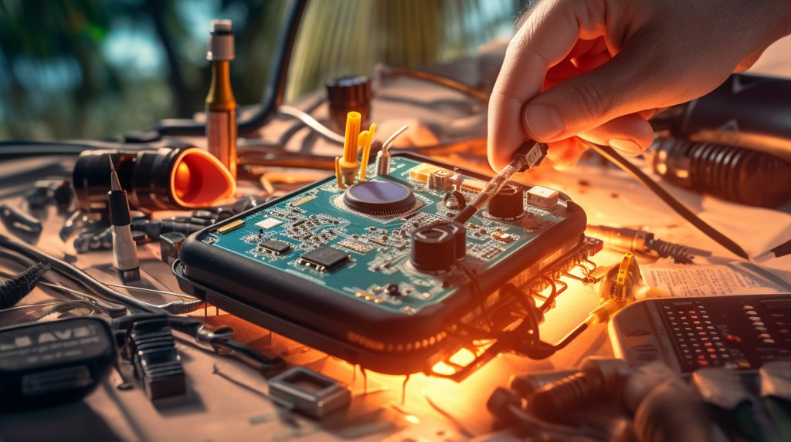
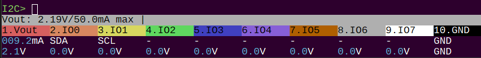

import DiscourseComments from '@site/src/components/DiscourseComments';
import BrowserWindow from '@site/src/components/BrowserWindow';

# Programmable Power Supply Unit



<BrowserWindow>
<span className="bp-prompt">I2C></span> W<br/>
<span className="bp-info"><span className="bp-info">Power supply<br/>
Volts (0.80V-5.00V)</span></span><br/>
<span className="bp-prompt">x to exit (3.30) ></span> 2.1<br/>
<span className="bp-float">2.10</span>V<span className="bp-info"> requested, closest value: <span className="bp-float">2.10</span></span>V<br/>
Set current limit?<br/>
y<br/>
<br/>
<span className="bp-info">Maximum current (0mA-500mA)</span><br/>
<span className="bp-prompt">x to exit (100.00) ></span> 50<br/>
<span className="bp-float">50.0</span>mA<span className="bp-info"> requested, closest value: <span className="bp-float">50.0</span></span>mA<br/>
<br/>
<span className="bp-info">Power supply:</span>Enabled<br/>
<span className="bp-info"><br/>
Vreg output: <span className="bp-float">2.1</span></span>V<span className="bp-info">, Vref/Vout pin: <span className="bp-float">2.1</span></span>V<span className="bp-info">, Current sense: <span className="bp-float">7.3</span></span>mA<span className="bp-info"><br/>
</span><br/>
<span className="bp-prompt">I2C></span> <br/>
</BrowserWindow>

Bus Pirate 5 has a single 'Programmable Power Supply Unit' (PPSU) with several handy features:
- 1-5volts adjustable output
- 0-500mA current sense 
- 0-500mA current limit with digital fuse
- One-way valve to protect the PPSU when an external voltage is applied to the VREF/VOUT pin

Type uppercase ```W``` followed by ```enter``` to enable the power supply. 

- Enter the desired output voltage in volts, for example ```2.1``` followed by ```enter```.
- Press ```y``` and ```enter``` to enable the current limit system.
- Enter the desired current limit in milliamps, for example ```50``` followed by ```enter```.

The Bus Pirate will calculate the closest possible values and enable the PPSU.

<BrowserWindow>



</BrowserWindow>

Check the voltage and current in the live view toolbar if active, or show the power supply voltage report using the ```v``` command followed by ```enter```.

:::info
400mA is the rated maximum of the PPSU, but we added some headroom in the current limit to account for current spikes.
:::

<BrowserWindow>
<span className="bp-error">Error:<span className="bp-info"> Current over limit, power supply disabled</span></span><br/>
<br/>
<span className="bp-prompt">I2C></span> <br/>
</BrowserWindow>

When the programmed current limit is exceeded the PPSU hardware fuse disables the power supply. The terminal colors invert repeatedly, an alarm bell will sound, an error message is shown and command execution is halted. Use the ```W``` command to restart the PPSU again.

<BrowserWindow>
<span className="bp-prompt">I2C></span>w<br/>
<span className="bp-info"><span className="bp-info">Power supply: </span></span>Disabled<br/>
<span className="bp-prompt">I2C></span> <br/>
</BrowserWindow>

Lowercase ```w``` disables the PPSU.

<DiscourseComments/>