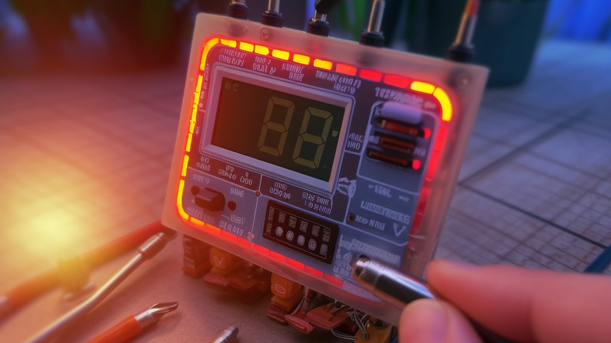
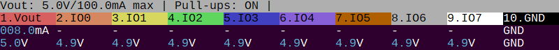
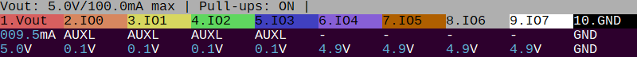
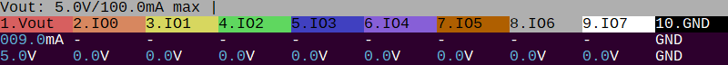

import DiscourseComments from '@site/src/components/DiscourseComments';
import BrowserWindow from '@site/src/components/BrowserWindow';

# Onboard Pull-up Resistors



# Pull-up resistors

Protocols such as I2C and 1-Wire use open collector outputs for two way communication on a single data wire. In this type of protocol there is no 1/high level without a pull-up resistor. The pull-up resistor connects to a voltage that "pulls" the wire high. Devices use their output to ground the wire and pull it low.

The Bus Pirate has 10KΩ onboard pull-up resistors that can be toggled with the ```p``` and ```P``` commands.

## Enter LED mode

This tutorial uses LED mode configured for the onboard LEDs (see 'Blink Some LEDs'). In this mode all the Bus Pirate IO pins are free for experimenting.

:::info
See the 'Blink Some LEDs' tutorial to enter and configure LED mode.
:::

## Voltage Source

The pull-up resistors are powered by the voltage on the VOUT/VREF pin. This can come from two sources:

- The onboard programmable power supply unit
- Externally through the VOUT/VREF pin on the Bus Pirate main connector

For this tutorial let's use the onboard power supply.

### Programmable Power Supply Unit

<BrowserWindow>
<span className="bp-prompt">LED-()></span> W<br/>
<span className="bp-info"><span className="bp-info">Power supply<br/>
Volts (0.80V-5.00V)</span></span><br/>
<span className="bp-prompt">x to exit (3.30) ></span> 5<br/>
<span className="bp-float">5.00</span>V<span className="bp-info"> requested, closest value: <span className="bp-float">5.00</span></span>V<br/>
Set current limit?<br/>
y <br/>
<br/>
<span className="bp-info">Maximum current (0mA-500mA)</span><br/>
<span className="bp-prompt">x to exit (100.00) ></span> <br/>
<span className="bp-float">100.0</span>mA<span className="bp-info"> requested, closest value: <span className="bp-float">100.0</span></span>mA<br/>
<br/>
<span className="bp-info">Power supply:</span>Enabled<br/>
<span className="bp-info"><br/>
Vreg output: <span className="bp-float">5.0</span></span>V<span className="bp-info">, Vref/Vout pin: <span className="bp-float">5.0</span></span>V<span className="bp-info">, Current sense: <span className="bp-float">8.4</span></span>mA<span className="bp-info"><br/>
</span><br/>
<span className="bp-prompt">LED-()></span> <br/>
</BrowserWindow>

 - Use the ```W``` command to enable the programmable power supply. 
 - The voltage is fed to the pull-ups and is available on the VOUT/VREF pin of the Bus Pirate main connector.


Check the live view statusbar at the bottom of the terminal. 
- The top line indicates the power supply is set at 5volts with a 100mA current limit. 
- The third line shows that 7.8mA is being consumed on VOUT. Since nothing is connected this represents the base current of the PPSU, op-amp offset error and noise in the RP2040 analog to digital converter.
- The last line shows that VOUT currently measures 5volts, and other pins measure 0 volts.

### External Power Supply

Hacking a device with its own power supply? You can use that instead. 

- Connect the device power to the Bus Pirate VOUT/VREF pin
- Connect the device ground to the Bus Pirate ground pin.

:::warning
The Bus Pirate is rated for 5volts DC maximum. Exceeding this limit will damage the Bus Pirate and your computer.
:::

## Pull-ups and Auxiliary Control


### Enable Pull-up Resistors

<BrowserWindow>
<span className="bp-prompt">LED-()></span> P<br/>
<span className="bp-info"><span className="bp-info">Pull-up resistors:</span></span> Enabled (10K ohms @ <span className="bp-float">5.0</span>V)<br/>
<br/>
<span className="bp-prompt">LED-()></span> <br/>
<br/>
<br/>
</BrowserWindow>

- Enter any protocol mode (```m```). Pull-up resistors are disabled in HiZ safe mode.
- Type uppercase ```P``` followed by ```enter``` to activate the pull-up resistors.



In the live view statusbar all pins should be high, close to 5.0volts.
- The top line now shows that the pull-up resistors are enabled.
- The bottom line shows that IO0 to IO7 all measure 4.9volts.

:::info
4.9volts isn't exactly 5, but that's not a problem.
:::

### Pull Pins Low

<BrowserWindow>
<span className="bp-prompt">LED-()></span> >a.0 a.1 a.2 a.3<br/>
<span className="bp-info">IO<span className="bp-float">0<span className="bp-info"> set to</span></span></span> OUTPUT: <span className="bp-float">0</span><br/>
<br/>
<span className="bp-info">IO<span className="bp-float">1<span className="bp-info"> set to</span></span></span> OUTPUT: <span className="bp-float">0</span><br/>
<br/>
<span className="bp-info">IO<span className="bp-float">2<span className="bp-info"> set to</span></span></span> OUTPUT: <span className="bp-float">0</span><br/>
<br/>
<span className="bp-info">IO<span className="bp-float">3<span className="bp-info"> set to</span></span></span> OUTPUT: <span className="bp-float">0</span><br/>
<br/>
<span className="bp-prompt">LED-()></span> <br/>
</BrowserWindow>

Sometimes it's helpful to manually operate a pin. ```a```/```A```/```@``` are syntax commands that toggle Bus Pirate pins low, high and input.
- Type ```>``` to tell the Bus Pirate to process the commands as syntax and send it to the bus.
- Type ```a.0 a.1 a.2 a.3``` followed by ```enter```.
- The ```a.X``` syntax grounds the corresponding Bus Pirate output, in this case pins 0,1,2 and 3.



Verify that the pins are low in the live view statusbar if active, or use the ```v``` command to view a voltage report.
- The third line shows that IO0 to IO3 are auxiliary-low (AUXL).
- The last line shows that IO0 to IO3 now measure close to ground (0.1volt).

### Release Pins High

<BrowserWindow>
<span className="bp-prompt">LED-()></span> >@.0 @.1 @.2 @.3<br/>
<span className="bp-info">IO<span className="bp-float">0<span className="bp-info"> set to</span></span></span> INPUT: <span className="bp-float">1</span><br/>
<br/>
<span className="bp-info">IO<span className="bp-float">1<span className="bp-info"> set to</span></span></span> INPUT: <span className="bp-float">1</span><br/>
<br/>
<span className="bp-info">IO<span className="bp-float">2<span className="bp-info"> set to</span></span></span> INPUT: <span className="bp-float">1</span><br/>
<br/>
<span className="bp-info">IO<span className="bp-float">3<span className="bp-info"> set to</span></span></span> INPUT: <span className="bp-float">1</span><br/>
<br/>
<span className="bp-prompt">LED-()></span> <br/>
</BrowserWindow>

The ```@.X``` syntax makes the corresponding Bus Pirate pins inputs, allowing the pull-up resistors to hold the pin high.  
- Type ```@.0 @.1 @.2 @.3``` followed by ```enter```.
- ```@.X``` also reads the state of the input pin. In this case the Bus Pirate reads '1' because the pull-up resistors are holding the pin high.


Verify that all the pins are around 5volts in the live monitor statusbar, or by using the voltage report command ```v```.
- All pins should be pulled high again.

### Disable Pull-ups
<BrowserWindow>
<span className="bp-prompt">LED-()></span> p<br/>
<span className="bp-info">Pull-up resistors:</span> Disabled<br/>
<span className="bp-prompt">LED-()></span>
</BrowserWindow>

- Type lowercase ```p``` then hit ```enter``` to disable the pull-up resistors.



Verify that all the pins show 0volts in the live monitor statusbar or voltage report.
- All pins should now be at 0volts because the pull-up are disabled.

## Community
import FooterCommunity from '../../_footer/_footer-community.md'

<FooterCommunity/>

<DiscourseComments/>