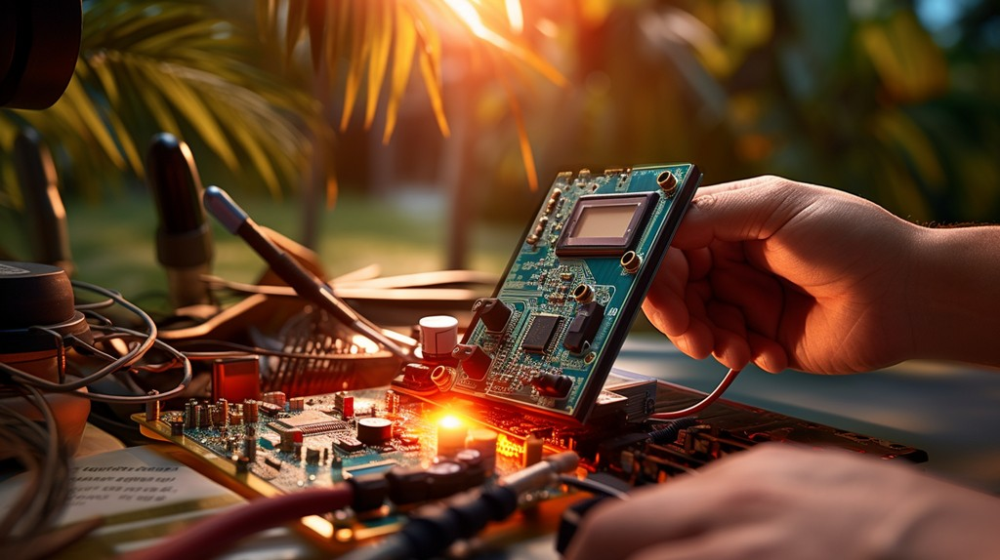
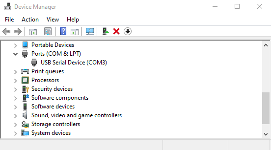
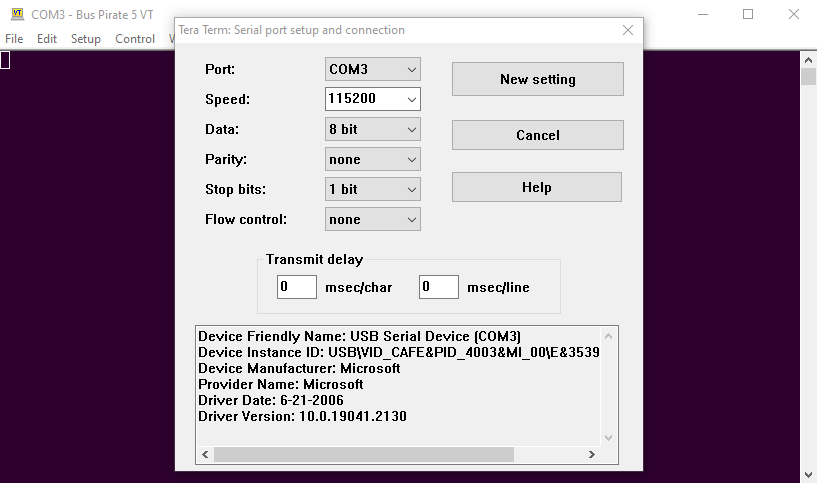
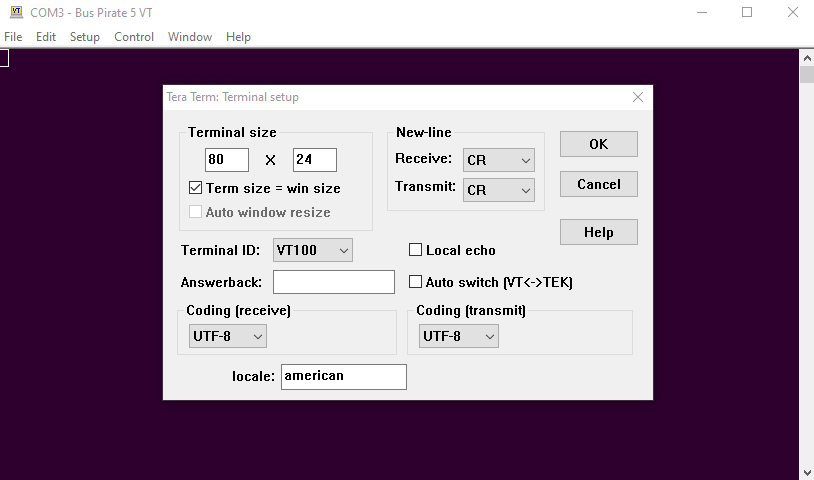
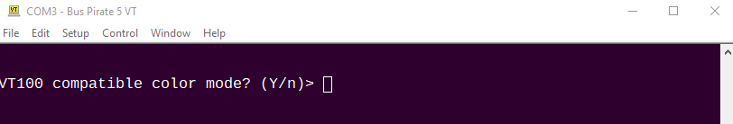
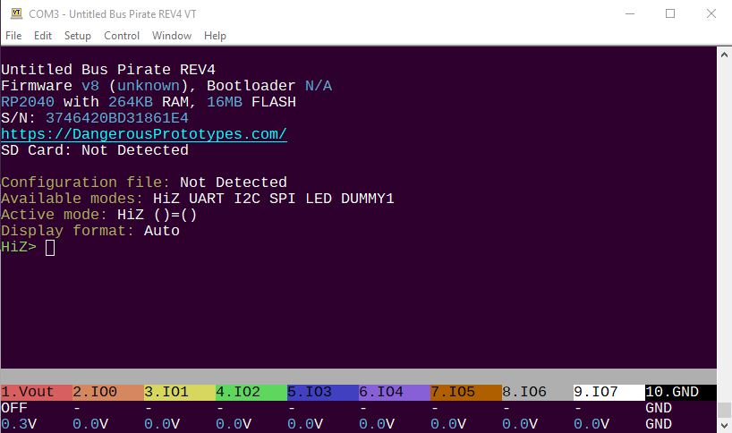

import DiscourseComments from '@site/src/components/DiscourseComments';
import BrowserWindow from '@site/src/components/BrowserWindow';
import Tabs from '@theme/Tabs';
import TabItem from '@theme/TabItem';


# Quick Setup



## Connect Bus Pirate 5

Connect the Bus Pirate to your computer with a USB C cable.

Bus Pirate 5 currently appears as three USB devices:
- USB CDC class device 0: an emulated serial port for accessing the user terminal
- USB CDC class device 1: an emulated serial port for accessing the binary scripting interface
- USB Mass Storage Device: a disk drive interface for accessing onboard storage

These are common device classes and recent operating systems will not request or require a driver. We're living in the future, woohoo!

## Find the serial port

:::tip
Your terminal emulation software will probably detect and list all the available serial ports connected to your computer. If there's more than one serial port, you can connect to each and press ```enter``` until you find the Bus Pirate terminal. You can probably skip this step, but if you need to find the port manually follow the instructions below.
:::

<Tabs groupId="operating-systems" queryString="current-os">
  <TabItem value="win" label="Windows">



- Press the Windows key or open the start menu
- Type ```Device Manager```
- Click on the Device Manager to open it
- In the Device Manager look for ```Ports (COM & LPT)```, expand it
- In the example Bus Pirate 5 is connected as COM3


  </TabItem>
  <TabItem value="linux" label="Linux">Help document the Bus Pirate, post your instructions in the forum and we'll add them to the docs.</TabItem>
  <TabItem value="mac" label="macOS">
The easiest way to find the serial ports is probably with a terminal (see the next section).
From a terminal, run:

```
ls -lh /dev/*usb*
```

You should see four "tty.usbmodem" devices.
```
  crw-rw-rw-  1 root  wheel  0x9000007 May  9 18:59 /dev/cu.usbmodem1234567890121
  crw-rw-rw-  1 root  wheel  0x9000009 May  9 18:59 /dev/cu.usbmodem1234567890123
  crw-rw-rw-  1 root  wheel  0x9000006 May  9 18:59 /dev/tty.usbmodem1234567890121
  crw-rw-rw-  1 root  wheel  0x9000008 May  9 18:59 /dev/tty.usbmodem1234567890123
```

The ones that start with `cu` and the ones that start with `tty` are identical. The `tty` version
grants you exclusive access, while the `cu` ones allow multiple processes to access the serial port at once.

In this example, you want to use `/dev/cu.usbmodem1234567890121`. The other `/dev/cu`, which ends in `3`, is
for the binary interface.


Another way to find information about the Bus Pirate on a Mac is: 
 - Click on Apple Menu->About This Mac
 - Click the "More Info..." button
 - Scroll Down and click "More Information"
 - Click USB on the sidebar_label


  
The serial number shown will match the name of the device in `/dev/`.

  </TabItem>
  <TabItem value="android" label="Android">Help document the Bus Pirate, post your instructions in the forum and we'll add them to the docs.</TabItem>
</Tabs>

## Fire up a terminal emulator

A terminal emulator is software that connects to the Bus Pirate serial interface and displays the command line. Bus Pirate 5 supports VT100 for a colorful interface with a live view statusbar. A fallback monochrome ASCII mode is also available. Most terminal emulators support VT100, it's been around since the 1970s.

<Tabs groupId="operating-systems" queryString="current-os">
  <TabItem value="win" label="Windows">



- We're huge fans of [Tera Term](https://ttssh2.osdn.jp/index.html.en) on Windows. Download and install the latest version.
- Open Tera Term and select ```Setup``` then ```Serial port```.
- Choose the Bus Pirate port, and configure it for 115200 (speed), 8 bit (data), None (parity), and 1 bit (stop bits). Click ```New setting``` or ```New Open``` to open the port.



- Now select ```Setup``` then ```Terminal```.
- Configure as shown above. Terminal size 80x24, New-line both set to CR, Terminal ID set to VT100. Click ```OK```.
- To save the settings for next time, choose ```Setup``` then ```Save Settings```.

:::tip
Seeing duplicate characters when you type? Check that ```local echo``` is unchecked in this menu.
:::



- Press ```Enter``` in the terminal. 
- The Bus Pirate will prompt you to choose VT100 color mode or the fallback ASCII monochrome mode. 
- We recommend you type ```y``` followed by the ```enter``` key.



You should see something like this. Congratulations, you're talking to the Bus Pirate!


  </TabItem>
  <TabItem value="linux" label="Linux">Help document the Bus Pirate, post your instructions in the forum and we'll add them to the docs.</TabItem>
  <TabItem value="mac" label="macOS">
  

Macs come with a terminal emulator called [Terminal](https://en.wikipedia.org/wiki/Terminal_(macOS)).

Many Mac users prefer to install [iTerm2](https://iterm2.com/) and use it instead of Terminal.

Unlike on Windows, a terminal emulator on a Mac doesn't typically give you an option to connect to a serial port. Instead it gives you a shell,
and you can run a command from the shell to connect to the serial port.

The default shell on Macs is zsh. If your prompt ends with a `%` sign, you're using zsh. If it ends with a `$`, you're likely using `bash`, which was the default on older Macs.


There are two commands that come preinstalled that you can use to connect to the serial port:
  - `cu`
  - [GNU Screen](https://www.gnu.org/software/screen/)

 A third popular option is to use [Homebrew](https://brew.sh/) to install Minicom.


 ### cu

 Cu writes lock files to `/var/spool/uucp`, so you'll need to make that directory writable.
 ```
 % sudo chmod o+w /var/spool/uucp
 ```

 Connect to the serial port:
```
% cu -l /dev/cu.usbmodem1234567890121
```

`cu` uses the `~` key as an escape character, such like `ssh`.
To exit `cu`, type `~.`. The `~` is only recongized at the start of a line, so you'll likely need to hit `Enter` first.

### GNU Screen

For some reason, at least by default on Macs, Bus Pirate's colors don't render correctly in Screen.

Connect to the serial port like this:
```
screen /dev/tty.usbmodem1234567890121
```

Screen uses Control-A as its meta key. Use `^a ^\` to exit. `^a ?` for help.

Connecting to serial ports isn't its primary purpose.. Screen is a terminal multiplier. You can "detach" with `^a d`, and it keeps running. `screen -r` reconnects. `^a c` opens another terminal inside of screen. There are commands to switch between these "windows", to split them, even to let multiple users control the same terminal at once.

It has many more features beyond the scope of this documentation.

### Minicom

Unlike the others, minicom does not come preintalled. If you have Homebrew installed, you can install it with `brew install minicom`.

You can connect with minicom with `minicom -D /dev/tty.usbmodem1234567890121`.

The "meta" key for minicom seems to default to Escape. To exit, press `Enter` `Esc` `q`.


  </TabItem>
  <TabItem value="android" label="Android">Help document the Bus Pirate, post your instructions in the forum and we'll add them to the docs.</TabItem>
</Tabs>

:::caution
If you see lots of extra garbage characters in the terminal that is probably the VT100 code that updates the live view statusbar. Verify that your terminal supports VT100 mode and that VT100 mode is enabled.
::: 

<DiscourseComments/>

