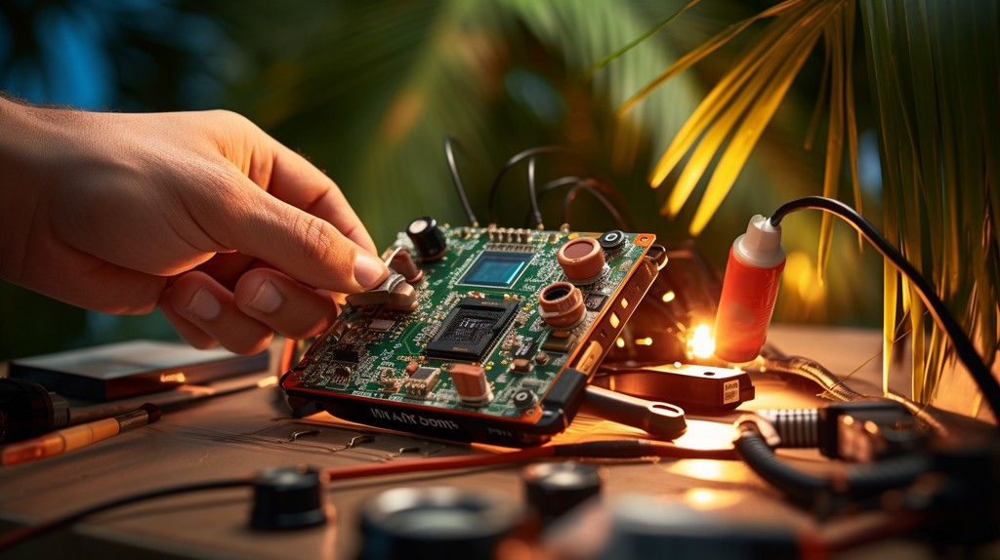

import DiscourseComments from '@site/src/components/DiscourseComments';
import BrowserWindow from '@site/src/components/BrowserWindow';

# Bus Pirate Self-test Guide



Every Bus Pirate is lovingly tested by our crack team before it ships, but problems can always occur in transit or over time. The Bus Pirate firmware has a self-test that will help determine if your Bus Pirate is in good working order. 


The detailed self-test is primarily useful in three situations:
- For prototype testing. We may have done a poor job solder paste stenciling or the Neoden 4 did its flick and chase thing. 
- Manufacturing testing. We need to make sure no failed components are on the board before we ship.
- Disaster assessment. Something went wrong while hacking and now a pin doesn't work.

## Setup the self-test

- Disconnect any devices from the Bus Pirate. An external device will interfere with the test and could be damaged by the voltage used on the pins.
- Insert a flash card. If **a formatted and mountable flash card is not inserted the flash card test will fail**. That doesn't mean it's broken, it just means the test couldn't be completed.

:::warning
Disconnect any devices before performing the self-test.
:::
:::caution
The test will work without a flash card, but the flash card section of the self-test will fail.
:::

## Start the self-test

<BrowserWindow>
<span className="bp-prompt">SPI></span> m<br/>
<span className="bp-info"><br/>
<span className="bp-info">Mode selection</span></span><br/>
 1. <span className="bp-info">HiZ</span><br/>
 2. <span className="bp-info">UART</span><br/>
 3. <span className="bp-info">I2C</span><br/>
 4. <span className="bp-info">SPI</span><br/>
 5. <span className="bp-info">LED</span><br/>
 6. <span className="bp-info">DUMMY1</span><br/>
 x. <span className="bp-info">Exit</span><br/>
<span className="bp-prompt">Mode ></span> 1<br/>
<span className="bp-info">Mode:</span> HiZ<br/>
<span className="bp-prompt">HiZ></span> ~<br/>
<span className="bp-info">SELF TEST STARTING<br/></span>
</BrowserWindow>

:::caution
Ensure the Bus Pirate is in HiZ mode before starting the self-test.
:::

- Ensure the Bus Pirate is in HiZ mode. Type ```m``` and press ```enter```. Select option ```1``` to enter HiZ mode.
- Begin the self-test. Type ```~``` followed by ```enter``` in the terminal. Self-test is available in HiZ mode only.
- Press the Bus Pirate button when prompted.

## Self-test steps

Let's break down the self-test step by step.

### System tests

<BrowserWindow>
<br/>
<span className="bp-prompt">HiZ></span> ~<br/>
<span className="bp-info">SELF TEST STARTING<br/>
DISABLE IRQ: OK<br/>
ADC SUBSYSTEM: VUSB  5.03V OK<br/>
FLASH CARD: OK<br/>
PSU ENABLE: OK<br/></span>
</BrowserWindow>

- **DISABLE IRQ** - The Bus Pirate disables all interrupts during the test.
- **ADC SUBSYSTEM** - A test of the analog voltage measurement system and the IO expanders. Can the Bus Pirate change between analog inputs, and does the USB voltage measurement make sense? VUSB should be somewhere between 4.75 and 5.25 volts. Components include the RP2040 connections, 595 IO expander chips, 245 level translator, 4067 analog mux, an op-amp and various passive component connections.
- **FLASH CARD** - Try to mount a flash card. **If no flash card is inserted this test will fail**. Tests the RP2040 connections and flash card socket.
- **PSU ENABLE** - Test the programmable power supply unit. Output is set to 3.3volts with a 50mA current limit, after a delay the voltage is measured. Tests op-amps, comparator, transistors, FETs and several other components in the PPSU.

:::caution
The test will work without a flash card, but the flash card section of the self-test will fail.
:::

### BIO float
<BrowserWindow>
<span className="bp-info">
BIO FLOAT TEST (SHOULD BE 0/&lt;0.2V)<br/>
BIO0 FLOAT: 0/0.03V OK<br/>
BIO1 FLOAT: 0/0.03V OK<br/>
BIO2 FLOAT: 0/0.03V OK<br/>
BIO3 FLOAT: 0/0.03V OK<br/>
BIO4 FLOAT: 0/0.03V OK<br/>
BIO5 FLOAT: 0/0.03V OK<br/>
BIO6 FLOAT: 0/0.03V OK<br/>
BIO7 FLOAT: 0/0.04V OK<br/></span>
</BrowserWindow>

- **BIOx FLOAT** - The buffered IO pins are set as floating inputs. 
- The 1M ohm pull-down resistors should hold the pins close to ground (logic value 0, <0.2volts). 
- Tests the RP2040, IO buffers, pull-down resistors, and the analog connection to the IO pins. 
- If two adjacent pins are stuck, for example by a solder bridge, the self-test will attempt to determine which pins are effected.

### BIO high
<BrowserWindow>
<span className="bp-info">
BIO HIGH TEST (SHOULD BE >3.0V)<br/>
BIO0 HIGH: 3.29V OK<br/>
BIO1 HIGH: 3.29V OK<br/>
BIO2 HIGH: 3.29V OK<br/>
BIO3 HIGH: 3.29V OK<br/>
BIO4 HIGH: 3.29V OK<br/>
BIO5 HIGH: 3.29V OK<br/>
BIO6 HIGH: 3.29V OK<br/>
BIO7 HIGH: 3.29V OK<br/></span>
</BrowserWindow>

- **BIOx HIGH** - The buffered IO pins are set as high outputs. 
- The voltage should be close to the PPSU output (logic value 1, >3.0volts). 
- Tests the RP2040, IO buffers and the analog connection to the IO pins. 
- If two adjacent pins are stuck, for example by a solder bridge, the self-test will attempt to determine which pins are effected.

### BIO low
<BrowserWindow>
<span className="bp-info">
BIO LOW TEST (SHOULD BE &lt;0.2V)<br/>
BIO0 LOW: 0.03V OK<br/>
BIO1 LOW: 0.03V OK<br/>
BIO2 LOW: 0.03V OK<br/>
BIO3 LOW: 0.03V OK<br/>
BIO4 LOW: 0.03V OK<br/>
BIO5 LOW: 0.03V OK<br/>
BIO6 LOW: 0.03V OK<br/>
BIO7 LOW: 0.03V OK<br/></span>
</BrowserWindow>

- **BIOx LOW** - The buffered IO pins are set as low outputs. 
- The voltage should be close to ground (logic value 0, <0.2volts). 
- Tests the RP2040, IO buffers and the analog connection to the IO pins.
- If two adjacent pins are stuck, for example by a solder bridge, the self-test will attempt to determine which pins are effected.

### BIO pull-up high
<BrowserWindow>
<span className="bp-info">
BIO PULL-UP HIGH TEST (SHOULD BE >3.0V)<br/>
BIO0 PU-HIGH: 1/3.22V OK<br/>
BIO1 PU-HIGH: 1/3.22V OK<br/>
BIO2 PU-HIGH: 1/3.23V OK<br/>
BIO3 PU-HIGH: 1/3.26V OK<br/>
BIO4 PU-HIGH: 1/3.26V OK<br/>
BIO5 PU-HIGH: 1/3.22V OK<br/>
BIO6 PU-HIGH: 1/3.25V OK<br/>
BIO7 PU-HIGH: 1/3.25V OK<br/></span>
</BrowserWindow>

- **BIOx PU-HIGH** - The pull-up resistors are enabled and the buffered IO pins are set as inputs. 
- The voltage should be close to the PPSU output (logic value 1, >3.0volts). 
- Tests the RP2040, pull-up resistors, 4066, IO buffers and the analog connection to the IO pins.
- If two adjacent pins are stuck, for example by a solder bridge, the self-test will attempt to determine which pins are effected.

### BIO pull-up low
<BrowserWindow>
<span className="bp-info">
BIO PULL-UP LOW TEST (SHOULD BE &lt;0.5V)<br/>
BIO0 PU-LOW: 0.13V OK<br/>
BIO1 PU-LOW: 0.14V OK<br/>
BIO2 PU-LOW: 0.14V OK<br/>
BIO3 PU-LOW: 0.14V OK<br/>
BIO4 PU-LOW: 0.14V OK<br/>
BIO5 PU-LOW: 0.13V OK<br/>
BIO6 PU-LOW: 0.14V OK<br/>
BIO7 PU-LOW: 0.14V OK<br/></span>
</BrowserWindow>

- **BIOx PU-LOW** - The pull-up resistors are enabled and the buffered IO pins are set to output/ground. 
- The voltage should be close to ground (logic value 0, <0.5volts). 
- Tests the RP2040, pull-up resistors, 4066, IO buffers and the analog connection to the IO pins.
- If two adjacent pins are stuck, for example by a solder bridge, the self-test will attempt to determine which pins are effected.

### Current override
<BrowserWindow>
<span className="bp-info">
CURRENT OVERRIDE: OK<br/></span>
</BrowserWindow>

- **CURRENT OVERRIDE** - Tests the pin for overriding the current limit digital fuse. Current limit override is enabled. A very low current limit is set with the pull-ups enabled and the BIO pins grounded. The Bus Pirate checks that the power supply is still on, despite the blown fuse.
- Tests the PPSU, comparator, transistors, fets, etc.


### Current limit
<BrowserWindow>
<span className="bp-info">
CURRENT LIMIT TEST: OK<br/></span>
</BrowserWindow>

- **CURRENT LIMIT TEST** - A very low current limit is set with the pull-ups enabled and the BIO pins grounded. The Bus Pirate waits up to 2 seconds for the digital fuse to blow.
- Tests the PPSU, comparator, transistors, fets, etc.

### Just one button
<BrowserWindow>
<span className="bp-info">
PUSH BUTTON TO COMPLETE: OK<br/>
</span><br/>
</BrowserWindow>

- **PUSH BUTTON TO COMPLETE** - Press the Bus Pirate button to complete the test. The Bus Pirate will pause and wait indefinitely. 
- Tests RP2040, switch.

## Results

### Success

<BrowserWindow>
<span className="bp-info">
<br/>
PASS :)<br/>
</span><br/>
<span className="bp-prompt">HiZ></span> <br/>
</BrowserWindow>

Hopefully you see a happy Bus Pirate with no errors. Your hardware seems to be in working order. 

If you're still having a problem, could it be a firmware bug? Please let us know in the forum.

### Errors

<BrowserWindow>
<span className="bp-info">
FLASH CARD: NOT DETECTED. ERROR!<br/>
...<br/>
ERRORS: 1<br/>
FAIL! :(</span>
</BrowserWindow>

:::caution
The test will work without a flash card, but the flash card section of the self-test will fail.
:::

At this point we haven't see any failures in professionally manufactured boards during prototype runs, but we'll update the docs after the first big batch is tested. 

If your self-test reports errors, we are eager to know. Please post the full self-test results in the forum and we'll have a look.

<DiscourseComments/>